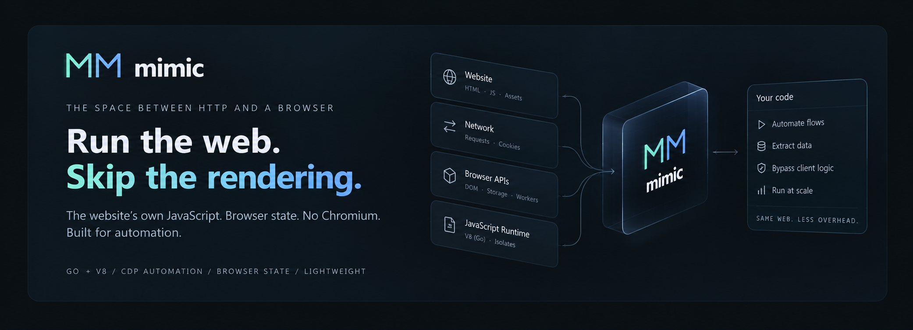
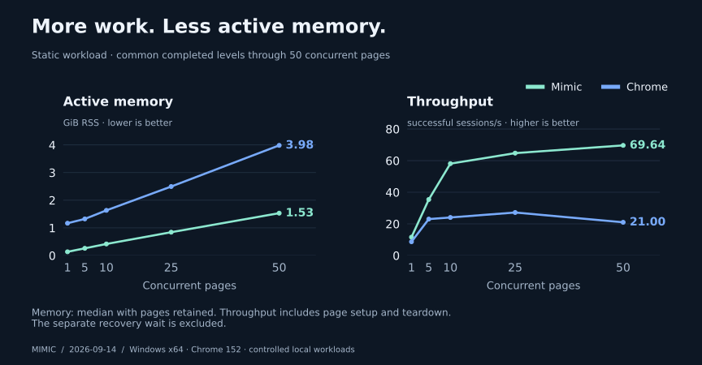

<p align="center">
  
</p>

<p align="center">
  <strong>Browser logic, without the rendering pipeline.</strong><br>
  Execute website JavaScript and work with Chrome-visible browser state in a lightweight Go runtime.
</p>

<p align="center">
  <a href="QUICKSTART.md"></a>
  <a href="QUICKSTART.md"></a>
  <a href="FAQ.md"></a>
  <a href="FAQ.md"></a>
  <a href="FAQ.md"></a>
</p>

<p align="center">
  <a href="QUICKSTART.md">Quick start</a> ·
  <a href="#measured-not-assumed">Benchmarks</a> ·
  <a href="FAQ.md">CDP support</a> ·
  <a href="#let-the-website-do-the-work">Product vision</a> ·
  <a href="FAQ.md">FAQ</a>
</p>

## Let the website do the work

**The website's JavaScript. Browser state. A lighter runtime.**

Mimic is a browser execution runtime built around V8, with its own browser
environment and no rendering engine. Run website logic, work with the DOM,
and automate through familiar CDP tools without embedding Chromium.

**Our ambition: direct HTTP lightness with browser compatibility.**

**Actively developed · Private beta.** DM **`moreveal`** on Discord to get involved.

## Working browser behavior

These development checkpoints exercise execution and observable browser behavior:

| Capability | Verified checkpoint |
| :--- | :--- |
| **React ✓** | 200 cards, effects, fetch, and state transitions. |
| **WebAssembly ✓** | Module instantiation and 100,000 integer-add calls. |
| **Workers ✓** | Messaging and worker fetch in supported workflows. |
| **DOM mutations ✓** | 3,000 elements with validated final structure and text. |
| **Networking ✓** | Fetch and XHR in deterministic local fixtures. |
| **Puppeteer / CDP ✓** | Connection, navigation, page interaction, and browser sessions. |
| **100 concurrent pages ✓** | Completed static and React benchmark series. |

These are scoped, verified workflows; compatibility continues to expand.

## Measured, not assumed

Fresh-build results from **September 13, 2026**, against **Chrome 152.0.7977.82** in headless mode, on Windows 11 x64 (Intel i7-14700KF, 31.83 GiB RAM).

<p align="center">
  <a href="BENCHMARKS.md"></a>
</p>

<p align="center">
  <a href="BENCHMARKS.md"></a>
</p>

**92% lower ready RSS. 43% less active RAM and 2.76× throughput at 100 static pages.**
Measured on these fixtures and this machine; startup RSS is not per-page memory.

Mimic is actively evolving toward direct HTTP lightness with browser compatibility.
These are selected strengths from an early checkpoint; see Known limitations and
the complete benchmark report for the current tradeoffs.

[Full results, concurrency, CPU, memory, and methodology →](BENCHMARKS.md)

## Real-world compatibility checkpoints

Complex compatibility checkpoints have also included client-side challenge flows,
browser diagnostics, and production storefront content. They help test how the
runtime handles demanding combinations of browser behavior.

| Development checkpoint | Observed result |
| :--- | :--- |
| **Cloudflare challenge laboratory** · September 12 | Mimic moved from the challenge response to the explicit success page on ScrapingCourse. The transition also succeeded in a subsequent paired check. |
| **BrowserScan** · September 12 | The tested session received the explicit **Normal** verdict. |
| **Amazon storefront** · September 11 | Storefront navigation and campaign cards were captured with available assets; the exported snapshot was checked offline in Chrome. |

These are specific recorded site/session outcomes, not a measured pass rate across
anti-bot systems or proof of why a service admitted a session. Amazon's checkpoint
covers storefront content, not login or checkout. Compatibility continues to evolve;
site policies and server decisions still apply.

## Configure once. Then automate.

Designed to simplify automation: set the environment up front, start Mimic, and
connect your CDP client. No Chromium installation is required.

After receiving a beta build, save this as `profile.json`:

```json
{
  "schemaVersion": 1,
  "baseProfile": "chrome-152-windows-x64-headful-controlled-v1",
  "hardware": { "logicalProcessors": 8, "deviceMemoryGB": 8 },
  "locale": {
    "languages": ["en-US", "en"],
    "timezone": "America/New_York",
    "intlLocale": "en-US"
  },
  "preferences": { "colorScheme": "dark" }
}
```

```powershell
.\mimic.exe --profile profile.json --chrome 152 --browser-mode headful --listen 127.0.0.1:9222
```

`headful` selects an environment profile; Mimic still renders no pixels. Profiles
configure supported language, timezone, hardware, and preference observations.
Use separate profiles per context and native proxies when your workflow needs them.

**[Complete quick start: Puppeteer, native proxies, and multiple profiles →](QUICKSTART.md)**

## Private beta

**DM `moreveal` on Discord for Private Beta.** [What to include →](BETA.md)

Tell us what you want to automate, your current tooling, and where a full browser
is costing you time or resources. We'll assess whether the current runtime fits
your workflow and discuss access.

This repository is the public product overview. Source code, runtime downloads,
and internal research are private; access is arranged through the beta.

## Known limitations

Warm execution currently trails Chrome in the measured fixtures. CPU concurrency
at 100 pages also hit an initialization failure. Both are optimization and reliability
targets as Mimic develops; the full report retains all results and recorded failures.

Mimic is in active development. The current validated platform is **Windows x64**,
and the behavioral reference is **Chrome 152**. Linux support and additional Chrome
targets are planned directions, without a committed release date.

It implements a subset of browser APIs and CDP. It does not render screenshots,
PDFs, Canvas/WebGL output, or video, and does not provide full CSS layout or complete
Chrome compatibility. Supported automation workflows do not imply that every
Playwright or Puppeteer feature works. See the [FAQ](FAQ.md) for the practical boundaries.
