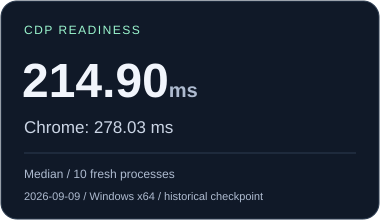
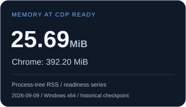
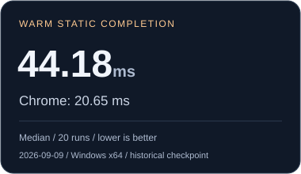

<p align="center">
  
</p>

<p align="center">
  <strong>Browser logic, without the rendering pipeline.</strong><br>
  Execute website JavaScript and work with Chrome-visible browser state in a lightweight Go runtime.
</p>

<p align="center">
  <a href="go.mod"></a>
  <a href="docs/getting-started.md"></a>
  <a href="docs/architecture.md"></a>
  <a href="docs/cdp-compatibility.md"></a>
  <a href="docs/compatibility.md"></a>
</p>

<p align="center">
  <a href="#quick-start">Quick start</a> ·
  <a href="#measured-not-assumed">Benchmarks</a> ·
  <a href="docs/cdp-compatibility.md">CDP support</a> ·
  <a href="docs/product-vision.md">Product vision</a> ·
  <a href="docs/architecture.md">Architecture</a>
</p>

## Let the website do the work

Raw HTTP is lean, but complex websites push you into reconstructing private APIs,
tokens, authentication flows, and client-side state. Full browsers execute that
logic for you—and bring a rendering engine along with it.

**Mimic fills the space between them.** It runs the website’s own JavaScript and
browser logic without embedding Chromium or producing pixels. The goal is
browser-level automation with runtime costs closer to direct HTTP.

That is the product direction. Today, Mimic implements a subset of Chrome behavior
and CDP; compatibility and performance depend on the workload.

| Start with HTTP | Reach for Mimic | Use a full browser |
| :--- | :--- | :--- |
| The response already contains what you need. | You need JavaScript execution, browser state, or a hydrated DOM within the supported surface. | You need screenshots, full layout, media playback, or complete browser behavior. |

## Built for execution

| Website logic | Observable browser state | Automation & capture |
| :--- | :--- | :--- |
| V8 executes JavaScript alongside the resource loader and browser scheduler. | DOM, navigation, and CDP share canonical state, with separate document, frame, and Worker realms. | Connect over the supported CDP surface, evaluate JavaScript, navigate, and export static DOM snapshots. |

Each Page owns its event loop. Independent Pages can execute concurrently, while
callbacks and microtasks remain ordered within each Page. See
[architecture](docs/architecture.md) and [compatibility boundaries](docs/compatibility.md).

## Measured, not assumed

Selected results from the **September 9, 2026 historical checkpoint**, comparing
Mimic V8 with Chrome 152 in `headless=new` mode on Windows 11 x64
(Intel i7-14700KF, 31.83 GiB RAM). These describe the recorded build, not current HEAD.

<table>
  <tr>
    <td width="33%"><a href="benchmark/runs/07-catalog-milestone/report.md"></a></td>
    <td width="33%"><a href="benchmark/runs/07-catalog-milestone/report.md"></a></td>
    <td width="33%"><a href="benchmark/runs/07-catalog-milestone/report.md"></a></td>
  </tr>
</table>

The checkpoint shows lower startup memory and earlier CDP readiness, alongside
slower static workload completion. Memory at readiness is **not per-Page memory**;
completion includes navigation and execution, and excludes Page creation and
teardown. All six local correctness workloads passed for both systems. These
fixtures do not establish general website compatibility or a universal speedup.

[Full checkpoint, methodology & raw data](benchmark/runs/07-catalog-milestone/report.md)
· [Subsequent measurements & remaining bottlenecks](docs/performance/report.md)
· [Reproduce the benchmark](benchmark/README.md)

## Quick start

**Current supported build:** Windows amd64, Go 1.26.4+, CGO, and a compatible
C compiler (tested with `gcc`). Other platforms are a development direction;
see [platforms and browser targets](#platforms-and-browser-targets).

### 1. Build and start

```powershell
git clone https://github.com/moreveal/mimic.git
cd mimic
go build -o .build/mimic.exe ./cmd/mimic
./.build/mimic.exe -listen 127.0.0.1:9222 -chrome 152
```

Keep the local `third_party` dependencies in the checkout. The first build needs
module dependencies available; Go can download the pinned toolchain automatically.
V8 is the default. No separate Chromium installation, GPU, or `.env` file is
required to run Mimic. Stop the server with Ctrl+C.

### 2. Connect over CDP

In another PowerShell window, discover the available targets:

```powershell
Invoke-RestMethod http://127.0.0.1:9222/json/list
```

Connect a WebSocket client to a returned `webSocketDebuggerUrl` and send:

```json
{"id":1,"method":"Runtime.evaluate","params":{"expression":"1 + 2"}}
```

`Page.navigate` starts navigation; wait for lifecycle events or an application
readiness marker before consuming the result. Check the
[CDP matrix](docs/cdp-compatibility.md) for supported commands and behavior.

### 3. Capture a page

With the server running, use a second PowerShell window in the same checkout:

```powershell
python -m venv .venv
./.venv/Scripts/python.exe -m pip install pyppeteer==2.0.0
./.venv/Scripts/python.exe tools/mimic_snapshot.py "https://example.com/" snapshots/example --settle-ms 2500
```

The tool exports a static DOM snapshot and available assets, with progress and
diagnostics. Use a new output directory for each capture. Readiness is a heuristic;
exports exclude scripts, embedded frames, and canvas pixels. See the
[complete setup and capture guide](docs/getting-started.md) for wait controls,
partial captures, engine fallbacks, and troubleshooting details.

## Platforms and browser targets

Mimic’s direction is a portable execution runtime that can follow new Chrome
versions. The current OS and reference version are checkpoints in that work.

| Area | Available today | Direction |
| :--- | :--- | :--- |
| Platforms | Windows amd64 build and validation. | Linux at minimum, with OS-specific code isolated so more of Go’s portability carries through. Native engine and CGO dependencies still need platform support and validation. |
| Browser behavior | Frozen Chrome **152.0.7977.82** as the measured reference. | Additional Chrome versions through the version-neutral compatibility registry, backed by version-specific observations and tests. |

The `-chrome 152` flag selects the current compatibility target. It does not
install or launch Chrome. See the [target manifest](chrome/152/target.json) and
[oracle policy](docs/oracle-policy.md) for the exact behavioral reference.

## Current boundaries

Mimic models what scripts can observe; it does not render pages. Full CSS layout,
Canvas/WebGL pixels, media playback, and complete Web API/CDP compatibility remain
outside the current implementation. Generated API names are not proof of working
semantics. Follow the [compatibility notes](docs/compatibility.md) when evaluating
a workload.

CDP has no authentication and is intended for trusted local clients. Mimic is not
a security sandbox for hostile code. Navigation has no deadline by default;
configure `-navigation-timeout 30s` when your workflow needs one.

## Go deeper

| Guide | What you’ll find |
| :--- | :--- |
| [Setup & automation](docs/getting-started.md) | Build requirements, engine choices, snapshots, and verification commands. |
| [Product vision](docs/product-vision.md) | Why Mimic exists and where it is going. |
| [Architecture](docs/architecture.md) | State ownership, Page isolation, scheduling, and the graphics observation boundary. |
| [CDP compatibility](docs/cdp-compatibility.md) | The supported automation contract. |
| [Behavioral oracle](docs/oracle-policy.md) | How frozen headful Chrome defines correctness. |
| [Performance work](docs/performance/report.md) | Measured improvements, tradeoffs, and unresolved costs. |

Contributing? Start with [AGENTS.md](AGENTS.md) and the
[verification guide](docs/getting-started.md#verification). Compatibility changes
should be backed by focused regression tests and Chrome observations.
