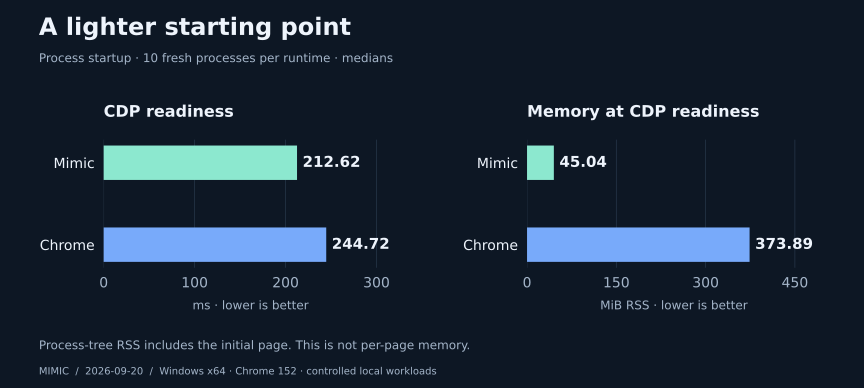
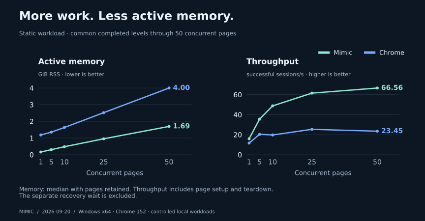

<p align="center">
  
</p>

<p align="center">
  <strong>Browser logic without Chromium's rendering pipeline.</strong><br>
  Run website JavaScript and automate Chrome-visible browser state through CDP.
</p>

<p align="center">
  <a href="https://github.com/moreveal/mimic/releases/latest"></a>
  <a href="go.mod"></a>
  <a href="docs/getting-started.md"></a>
  <a href="docs/cdp-compatibility.md"></a>
</p>

<p align="center">
  <a href="#quick-start">Quick start</a> ·
  <a href="#benchmarks">Benchmarks</a> ·
  <a href="https://github.com/moreveal/mimic/releases/latest">Download</a> ·
  <a href="docs/getting-started.md">Documentation</a> ·
  <a href="docs/cdp-compatibility.md">CDP support</a>
</p>

## What is Mimic?

Mimic is a lightweight browser execution runtime for automation workloads. It
loads resources, executes JavaScript in V8, maintains DOM/style/layout state and
exposes it through the Chrome DevTools Protocol—without embedding Chromium,
opening a window or rendering pixels.

- Use familiar Playwright, Puppeteer and CDP clients.
- Run independent Pages concurrently with one event loop per Page.
- Observe canonical DOM, navigation, CSSOM and geometry state.
- Use native HTTP, HTTPS and SOCKS5 proxy profiles.
- Ship one standalone executable; users do not need Chrome, Go or Rust.

Mimic targets observable Chrome 152 behavior. It is a public beta: compatibility
is workload-dependent, and unsupported browser surfaces remain explicit.

## Quick start

Download a binary from [the latest release](https://github.com/moreveal/mimic/releases/latest),
then start the CDP endpoint:

```powershell
./mimic.exe -listen 127.0.0.1:9222
```

```sh
./mimic -listen 127.0.0.1:9222
```

Or run a clean source checkout on Windows or Linux amd64:

```sh
git clone https://github.com/moreveal/mimic.git
cd mimic
go run ./tools/runmimic -listen 127.0.0.1:9222
```

The source build requires Go 1.26.4+, Rust/Cargo, CGO and a C compiler. The
released executable has no Go/Rust/Cargo dependency. See
[setup and platform requirements](docs/getting-started.md) or the
[release build guide](tools/release/README.md).

### Connect with Playwright

```javascript
import { chromium } from "playwright";

const browser = await chromium.connectOverCDP("http://127.0.0.1:9222");
const context = browser.contexts()[0];
const page = context.pages()[0];

await page.goto("https://example.com/");
console.log(await page.locator("h1").innerText());

await browser.close();
```

See the [runnable examples](examples/README.md),
[supported CDP surface](docs/cdp-compatibility.md), and
[snapshot/capture guide](docs/getting-started.md).

## Benchmarks

Measured against headless Chrome 152.0.7977.82 on Windows 11 x64,
Intel i7-14700KF, 31.83 GiB RAM:

<p align="center">
  <a href="benchmark/runs/11-release-20260920/public-summary.md"></a>
</p>

<p align="center">
  <a href="benchmark/runs/11-release-20260920/public-summary.md"></a>
</p>

**88% lower ready RSS. 58% less active RAM and 2.84× throughput at 50 static
Pages.** These are fixture- and machine-specific results, not universal claims.
Mimic still trails Chrome on some mutation-heavy workloads.

[Results and methodology](benchmark/runs/11-release-20260920/public-summary.md) ·
[Full report](benchmark/runs/11-release-20260920/report.md) ·
[Reproduce](benchmark/README.md) ·
[Performance history](docs/performance/report.md)

## Current boundaries

Mimic reproduces browser observations needed by automation; it is not a visual
browser. It does not render screenshots or provide a complete Chromium/Web API
surface. Host fonts and OS services can affect observable results. CDP has no
authentication and is intended for trusted local clients.

Evaluate your workload against the
[compatibility notes](docs/compatibility.md) and
[CDP matrix](docs/cdp-compatibility.md).

## Documentation

- [Getting started and troubleshooting](docs/getting-started.md)
- [Product vision](docs/product-vision.md)
- [Architecture](docs/architecture.md)
- [CDP compatibility](docs/cdp-compatibility.md)
- [Chrome oracle policy](docs/oracle-policy.md)
- [Performance report](docs/performance/report.md)
- [Contributing](CONTRIBUTING.md)

Website: [moreveal.github.io/mimic-overview](https://moreveal.github.io/mimic-overview/)
· Feedback: DM **`moreveal`** on Discord.

## License

Mimic is source-available under the [Prosperity Public License 3.0.0](LICENSE).
Noncommercial use is free; commercial use has a 30-day trial. Third-party
components retain their own licenses. Contributions require acceptance of the
[Mimic CLA](CLA.md).
