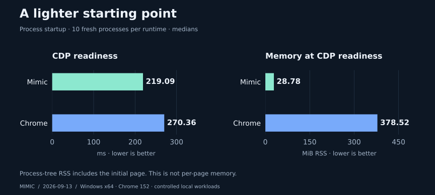
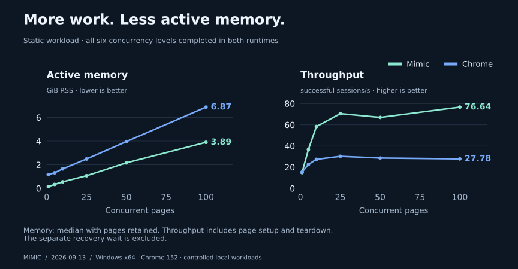

<p align="center">
  
</p>

<p align="center">
  <strong>Browser logic, without the rendering pipeline.</strong><br>
  Execute website JavaScript and work with Chrome-visible browser state in a lightweight Go runtime.
</p>

<p align="center">
  <a href="go.mod"></a>
  <a href="docs/getting-started.md"></a>
  <a href="docs/getting-started.md"></a>
  <a href="docs/architecture.md"></a>
  <a href="docs/cdp-compatibility.md"></a>
  <a href="docs/compatibility.md"></a>
</p>

<p align="center">
  <a href="#quick-start">Quick start</a> ·
  <a href="#measured-not-assumed">Benchmarks</a> ·
  <a href="docs/cdp-compatibility.md">CDP support</a> ·
  <a href="docs/product-vision.md">Product vision</a> ·
  <a href="docs/architecture.md">Architecture</a>
</p>

## Let the website do the work

**The website's JavaScript. Browser state. A lighter runtime.**

Mimic runs website logic without launching Chromium or rendering pixels.
Extract data, automate flows, and run concurrent pages through familiar CDP tools.

**Our ambition: direct HTTP lightness with browser compatibility.**
One environment profile. Native SOCKS5, HTTP, and HTTPS proxies. Less setup
between you and the workflow you want to automate.

**Public Beta · Windows & Linux.** [Download builds and run the examples →](https://github.com/moreveal/mimic-overview/releases/tag/v0.1.0-beta.1)
DM **`moreveal`** on Discord for feedback and workflow help.

## Built for execution

| Website logic | Observable browser state | Automation & capture |
| :--- | :--- | :--- |
| V8 executes JavaScript alongside the resource loader and browser scheduler. | DOM, navigation, and CDP share canonical state, with separate document, frame, and Worker realms. | Connect over the supported CDP surface, evaluate JavaScript, navigate, and export static DOM snapshots. |

Each Page owns its event loop. Independent Pages can execute concurrently, while
callbacks and microtasks remain ordered within each Page. See
[architecture](docs/architecture.md) and [compatibility boundaries](docs/compatibility.md).

## Measured, not assumed

Fresh-build results from **September 13, 2026**, against **Chrome 152.0.7977.82** in headless mode, on Windows 11 x64 (Intel i7-14700KF, 31.83 GiB RAM).

<p align="center">
  <a href="benchmark/runs/08-public-beta-20260913/public-summary.md"></a>
</p>

<p align="center">
  <a href="benchmark/runs/08-public-beta-20260913/public-summary.md"></a>
</p>

**92% lower ready RSS. 43% less active RAM and 2.76× throughput at 100 static pages.**
Measured on these fixtures and this machine; startup RSS is not per-page memory.

Mimic is actively evolving toward direct HTTP lightness with browser compatibility.
These are selected strengths from an early checkpoint; see Known limitations and
the complete benchmark report for the current tradeoffs.

[Full results, concurrency, CPU, memory, and methodology →](benchmark/runs/08-public-beta-20260913/public-summary.md)

[Full measured report and raw data](benchmark/runs/08-public-beta-20260913/report.md) · [Performance history](docs/performance/report.md) · [Reproduce](benchmark/README.md)

## Quick start

**Windows amd64 and Linux amd64**, Go 1.26.4+, CGO, and a C compiler.
The packaged Linux engine requires **glibc 2.39+** (Ubuntu 24.04 or newer);
Alpine/musl and ARM64 are not supported. V8 is bundled for both platforms.
See [complete setup](docs/getting-started.md) for requirements and native rebuilds.

### 1. Build and start

**Linux:**

```sh
git clone https://github.com/moreveal/mimic.git
cd mimic
go build -o .build/mimic ./cmd/mimic
./.build/mimic -listen 127.0.0.1:9222 -chrome 152
```

**Windows (PowerShell):**

```powershell
git clone https://github.com/moreveal/mimic.git
cd mimic
go build -o .build/mimic.exe ./cmd/mimic
./.build/mimic.exe -listen 127.0.0.1:9222 -chrome 152
```

Keep the local `third_party` dependencies in the checkout. The first build needs
module dependencies available; Go can download the pinned toolchain automatically.
V8 is the default. No separate Chromium installation, GPU, or `.env` file is
required to run Mimic. Stop the server with Ctrl+C.

For a live visual mirror of a CDP target, start with `-dev-preview` and open
`http://127.0.0.1:9222/debug/preview/`. See [preview behavior and limits](docs/dev-preview.md).

### 2. Connect over CDP

In another terminal, discover the available targets:

```sh
# Linux
curl http://127.0.0.1:9222/json/list
```

```powershell
Invoke-RestMethod http://127.0.0.1:9222/json/list
```

Connect a WebSocket client to a returned `webSocketDebuggerUrl` and send:

```json
{"id":1,"method":"Runtime.evaluate","params":{"expression":"1 + 2"}}
```

`Page.navigate` starts navigation; wait for lifecycle events or an application
readiness marker before consuming the result. Check the
[CDP matrix](docs/cdp-compatibility.md) for supported commands and behavior.

### 3. Capture a page

With the server running, use another terminal in the same checkout.

**Linux:**

```sh
python3 -m venv .venv
./.venv/bin/python -m pip install pyppeteer==2.0.0
./.venv/bin/python tools/mimic_snapshot.py "https://example.com/" snapshots/example --settle-ms 2500
```

**Windows:**

```powershell
python -m venv .venv
./.venv/Scripts/python.exe -m pip install pyppeteer==2.0.0
./.venv/Scripts/python.exe tools/mimic_snapshot.py "https://example.com/" snapshots/example --settle-ms 2500
```

The tool exports a static DOM snapshot and available assets, with progress and
diagnostics. Use a new output directory for each capture. Readiness is a heuristic;
exports exclude scripts, embedded frames, and canvas pixels. See the
[complete setup and capture guide](docs/getting-started.md) for wait controls,
partial captures, engine fallbacks, and troubleshooting details.

## Platforms and browser targets

Mimic runs on Windows and Linux. The host OS and the browser compatibility
profile are separate: Linux execution also uses the frozen Chrome 152 profile.

| Area | Available today | Direction |
| :--- | :--- | :--- |
| Platforms | Windows amd64 and Linux amd64 (glibc 2.39+), with bundled V8. | Additional architectures and libc variants require native engine builds and validation. |
| Browser behavior | Frozen Chrome **152.0.7977.82** as the measured reference. | Additional Chrome versions through the version-neutral compatibility registry, backed by version-specific observations and tests. |

Fonts and OS services depend on the host. Linux uses installed Liberation,
DejaVu or Noto fonts when reference families are absent; exact Windows text
metrics require the reference fonts. Native speech synthesis uses Windows SAPI.
See [host-dependent behavior](docs/getting-started.md#host-dependent-behavior).

The `-chrome 152` flag selects the current compatibility target. It does not
install or launch Chrome. See the [target manifest](chrome/152/target.json) and
[oracle policy](docs/oracle-policy.md) for the exact behavioral reference.

## Known limitations

Warm execution currently trails Chrome in the measured fixtures. CPU concurrency
at 100 pages also hit an initialization failure. Both are optimization and reliability
targets as Mimic develops; the full report retains all results and recorded failures.

## Current boundaries

Mimic models what scripts can observe; it does not render pages. Full CSS layout,
Canvas/WebGL pixels, media playback, and complete Web API/CDP compatibility remain
outside the current implementation. Generated API names are not proof of working
semantics. Follow the [compatibility notes](docs/compatibility.md) when evaluating
a workload.

CDP has no authentication and is intended for trusted local clients. Mimic is not
a security sandbox for hostile code. Navigation has no deadline by default;
configure `-navigation-timeout 30s` when your workflow needs one.

## Go deeper

| Guide | What you’ll find |
| :--- | :--- |
| [Setup & automation](docs/getting-started.md) | Build requirements, engine choices, snapshots, and verification commands. |
| [Product vision](docs/product-vision.md) | Why Mimic exists and where it is going. |
| [Architecture](docs/architecture.md) | State ownership, Page isolation, scheduling, and the graphics observation boundary. |
| [CDP compatibility](docs/cdp-compatibility.md) | The supported automation contract. |
| [Behavioral oracle](docs/oracle-policy.md) | How frozen headful Chrome defines correctness. |
| [Performance work](docs/performance/report.md) | Measured improvements, tradeoffs, and unresolved costs. |

Contributing? Start with [AGENTS.md](AGENTS.md) and the
[verification guide](docs/getting-started.md#verification). Compatibility changes
should be backed by focused regression tests and Chrome observations.

## License

Mimic is licensed under [PolyForm Shield 1.0.0](LICENSE.md). Commercial use is
permitted; the license restricts competing products. Third-party components
retain their own licenses. See the full license for its scope and conditions.
