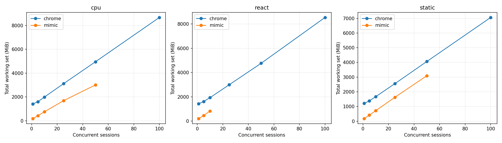
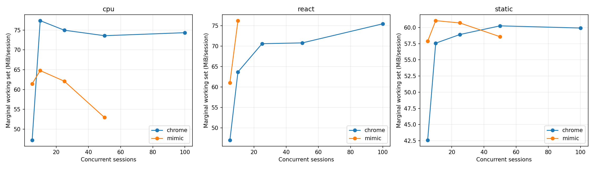
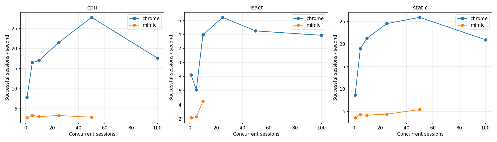
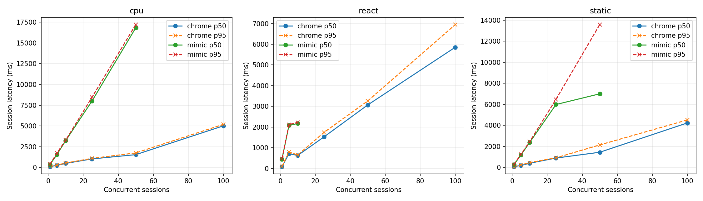
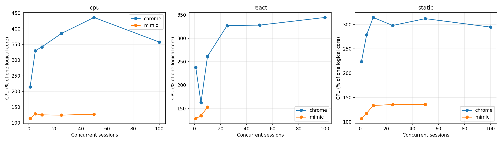

# Mimic V8 и Chrome 152: baseline Windows x64

Это измерение после исправления ошибок семантики, разрешённого пользователем. Оптимизации runtime ради производительности не выполнялись. Проверка исходной версии сохранена отдельно в `pre-fix/raw.json`.

## Окружение

| Параметр | Значение |
|---|---|
| Дата начала / конца | 2026-09-08T17:22:22.900207+04:00 / 2026-09-08T17:43:08.617084+04:00 |
| Chrome | {'protocolVersion': '1.3', 'product': 'Chrome/152.0.7977.82', 'revision': '@d04cdb24d67b081f6cf80200ffc5233f44b61109', 'userAgent': 'Mozilla/5.0 (Windows NT 10.0; Win64; x64) AppleWebKit/537.36 (KHTML, like Gecko) HeadlessChrome/152.0.0.0 Safari/537.36', 'jsVersion': '15.2.124.21'} |
| Chromium | 1669021 / d04cdb24d67b081f6cf80200ffc5233f44b61109 |
| Mimic commit | 2d6ae12650135ddfc897a48b974659b523377f0c |
| Mimic V8 | 15.2.124.1-rusty |
| OS | Windows-11-10.0.26200-SP0 |
| CPU | {"Name":"Intel(R) Core(TM) i7-14700KF","NumberOfCores":20,"NumberOfLogicalProcessors":28} |
| CPU physical / logical | 20 / 28 |
| RAM GiB | 31.83 |
| План питания | GUID схемы питания: 381b4222-f694-41f0-9685-ff5bb260df2e  (Сбалансированная) |
| Power overlay | 0 00000000-0000-0000-0000-000000000000 |
| Антивирус | {"displayName":"Windows Defender","productState":397568} |
| Chrome SHA-256 | ea36dd818a90176f1a70616f0363d9be527229389a6c073a0b1688b9e73f67e9 |
| Mimic SHA-256 | 7e31bf20d7e0ae996760ff2df847e193b6096ff64605bed1aeefa0b9b0263cba |

Рабочая станция не была эксклюзивно выделена тесту: фоновые приложения и антивирус включены. Список процессов, версии инструментов, аргументы, SHA-256 фикстур и бинарников находятся в raw.json.

## Методика и корректность

В обеих системах создаётся новая страница и уникальный loopback-origin. HTTP cache отключён, ответы no-store; cookie не используются. Контексты, транспорт и процесс в warm сохраняются, состояние страницы не используется повторно. Это изоляция для данного контролируемого корпуса, а не проверка tenant/security isolation. Cold создаёт новый процесс и профиль. Кэш файлов Windows, DLL и DNS ОС не очищается; «cold» означает новый процесс, а не холодный диск. Вариант warm HTTP cache не измерялся.

Навигация заканчивается только при точном URL, document.readyState === "complete" и наличии __benchRun. Затем одинаковый явный запуск __benchRun; завершение — done и точное совпадение детерминированного результата. Settle = 0. Paint/networkidle не ожидаются. Chrome headless=new; результаты не переносятся автоматически на headful.

Внешние часы perf_counter/QPC; polling 5 ms плюс задержка CDP/планировщика ОС. navigation_ms включает разбор HTML и загрузку скриптов, execution_ms — запуск/выполнение приложения и обнаружение маркера. Они не являются изолированным временем JIT или чистого JavaScript. js_ms страницы диагностический: в Mimic виртуальное время часто равно нулю.

Процесс запускается приостановленным, включается в Windows Job Object, затем возобновляется. process_start_ms — вызов создания процесса; CDP readiness отсчитывается от начала создания до ответа протокола. runtime_initialization_ms — остаток между ними; внутренние фазы V8 отдельно не инструментированы. Cold total включает создание страницы, выполнение, teardown и завершение процесса; удаление временного профиля и обслуживание локального сервера не включены.

CPU — user+kernel всего Job Object, включая завершившихся потомков. Working set/private bytes — сумма всех текущих участников Job Object каждые 50 ms и в контрольных точках. Кратковременные пики памяти могут быть пропущены, общие страницы DLL могут учитываться несколько раз. CPU % задан относительно одного логического ядра; 100% машины = 2800%. Пики CPU чувствительны к дискретности счётчиков Windows.

Одна проверка и по одному первоначальному warmup на серию исключены явно. Основные серии: 10 cold и 20 warm, без удаления медленных наблюдений. p95 публикуется при n≥10, p99 при n≥100; используется линейная интерполяция эмпирических квантилей, хвосты при n=10–20 особенно неустойчивы. SD и CV, min/max всех серий доступны в summary.csv. Ускорение не агрегируется в одно отношение.

| Система / workload | Correctness gate |
|---|---|
| chrome/async | VALID |
| chrome/cpu | VALID |
| chrome/dom | VALID |
| chrome/react | VALID |
| chrome/static | VALID |
| chrome/wasm | VALID |
| mimic/async | VALID |
| mimic/cpu | VALID |
| mimic/dom | VALID |
| mimic/react | VALID |
| mimic/static | VALID |
| mimic/wasm | VALID |

### CDP readiness: отдельная серия с одинаковой пробой

В финальной серии обе системы отвечают на Target.getTargets после WebSocket handshake. По 10 новых процессов, порядок систем чередуется; warmup исключён. Дата: 2026-09-08T17:42:33.432974+04:00. Основная серия использует ту же общую пробу.

| Система | n | CDP p50 ms | p95 | Min | Max | SD | Ready RSS MiB |
|---|---|---|---|---|---|---|---|
| mimic | 10 | 223.39 | 240.93 | 217.98 | 242.91 | 8.76 | 104.29 |
| chrome | 10 | 279.37 | 289.11 | 258.15 | 292.88 | 9.36 | 382.08 |

## Cold startup (медианы, ms)

| Система | Workload | n | Process create | CDP ready | Runtime init | Cold total | Shutdown |
|---|---|---|---|---|---|---|---|
| chrome | static | 10 | 9.55 | 286.74 | 275.05 | 468.34 | 98.35 |
| mimic | static | 10 | 8.31 | 224.17 | 213.57 | 470.16 | 67.26 |
| mimic | cpu | 10 | 8.31 | 227.12 | 218.84 | 507.13 | 67.19 |
| chrome | cpu | 10 | 10.02 | 299.71 | 289.73 | 549.17 | 116.33 |
| chrome | dom | 10 | 9.28 | 275.91 | 265.43 | 472.25 | 98.49 |
| mimic | dom | 10 | 8.14 | 218.52 | 209.53 | 1570.60 | 66.63 |
| mimic | async | 10 | 8.64 | 226.30 | 219.79 | 513.66 | 64.63 |
| chrome | async | 10 | 9.60 | 280.60 | 270.79 | 502.85 | 100.47 |
| chrome | react | 10 | 9.82 | 298.50 | 288.62 | 553.59 | 125.25 |
| mimic | react | 10 | 9.30 | 229.30 | 219.86 | 571.97 | 70.59 |
| mimic | wasm | 10 | 5.38 | 216.95 | 208.77 | 444.77 | 59.31 |
| chrome | wasm | 10 | 10.33 | 309.94 | 297.73 | 528.41 | 117.10 |

## Warm session startup / teardown (медианы)

| Система | Workload | n | Create ms | Teardown ms | RSS после teardown MiB |
|---|---|---|---|---|---|
| chrome | static | 20 | 37.97 | 13.86 | 1201.07 |
| mimic | static | 20 | 118.28 | 2.92 | 170.75 |
| mimic | cpu | 20 | 123.77 | 3.35 | 172.10 |
| chrome | cpu | 20 | 43.60 | 14.25 | 1413.97 |
| chrome | dom | 20 | 37.86 | 14.15 | 1359.54 |
| mimic | dom | 20 | 95.33 | 70.84 | 313.60 |
| mimic | async | 20 | 71.30 | 2.76 | 174.96 |
| chrome | async | 20 | 39.72 | 15.02 | 1196.10 |
| chrome | react | 20 | 38.97 | 14.19 | 1431.15 |
| mimic | react | 20 | 121.60 | 7.95 | 193.32 |
| mimic | wasm | 20 | 122.87 | 3.13 | 170.61 |
| chrome | wasm | 20 | 38.13 | 14.25 | 1288.50 |

## Single-session workload latency (ms)

| Система | Workload | Mode | n | Nav p50 | Execution p50 | Completion p50 | p95 | Min | Max | SD | CV |
|---|---|---|---|---|---|---|---|---|---|---|---|
| chrome | static | cold | 10 | 19.72 | 2.54 | 22.15 | — | 21.47 | 82.30 | 19.78 | 0.66 |
| mimic | static | cold | 10 | 83.63 | 2.24 | 85.93 | 98.16 | 80.86 | 99.30 | 5.91 | 0.07 |
| chrome | static | warm | 20 | 23.02 | 4.92 | 27.93 | 31.72 | 21.70 | 33.91 | 3.32 | 0.12 |
| mimic | static | warm | 20 | 124.19 | 2.82 | 127.51 | 140.11 | 76.02 | 175.14 | 25.76 | 0.22 |
| mimic | cpu | cold | 10 | 82.54 | 42.66 | 125.53 | 127.88 | 121.43 | 128.00 | 2.23 | 0.02 |
| chrome | cpu | cold | 10 | 24.79 | 32.60 | 59.04 | 410.27 | 52.99 | 679.36 | 195.90 | 1.60 |
| mimic | cpu | warm | 20 | 130.08 | 77.71 | 211.14 | 224.07 | 117.02 | 236.38 | 42.05 | 0.22 |
| chrome | cpu | warm | 20 | 23.84 | 29.05 | 52.50 | 60.35 | 47.96 | 61.15 | 3.95 | 0.07 |
| chrome | dom | cold | 10 | 23.04 | 11.37 | 34.80 | 44.43 | 30.50 | 49.21 | 5.37 | 0.15 |
| mimic | dom | cold | 10 | 79.40 | 1074.84 | 1156.23 | 1173.66 | 1118.64 | 1176.04 | 19.24 | 0.02 |
| chrome | dom | warm | 20 | 22.47 | 30.33 | 53.49 | 57.01 | 26.00 | 57.66 | 7.06 | 0.14 |
| mimic | dom | warm | 20 | 102.06 | 1560.32 | 1661.46 | 2529.17 | 1124.30 | 2580.59 | 635.72 | 0.36 |
| mimic | async | cold | 10 | 78.38 | 50.32 | 130.84 | 136.92 | 120.55 | 138.80 | 5.93 | 0.05 |
| chrome | async | cold | 10 | 22.93 | 27.14 | 49.62 | 494.88 | 45.21 | 701.98 | 208.54 | 1.56 |
| mimic | async | warm | 20 | 74.49 | 50.29 | 124.86 | 194.78 | 118.75 | 203.83 | 25.73 | 0.19 |
| chrome | async | warm | 20 | 26.11 | 30.11 | 56.01 | 66.93 | 46.50 | 69.88 | 6.79 | 0.12 |
| chrome | react | cold | 10 | 25.01 | 16.28 | 40.65 | 66.00 | 38.96 | 66.53 | 10.67 | 0.23 |
| mimic | react | cold | 10 | 90.26 | 94.55 | 184.87 | 202.69 | 180.56 | 204.81 | 8.21 | 0.04 |
| chrome | react | warm | 20 | 24.62 | 24.69 | 49.10 | 55.03 | 43.24 | 60.01 | 3.88 | 0.08 |
| mimic | react | warm | 20 | 135.05 | 166.03 | 302.94 | 335.04 | 159.54 | 343.43 | 73.86 | 0.29 |
| mimic | wasm | cold | 10 | 78.71 | 9.49 | 88.29 | 95.42 | 86.55 | 96.95 | 3.39 | 0.04 |
| chrome | wasm | cold | 10 | 27.60 | 5.72 | 32.88 | 48.71 | 25.65 | 50.63 | 8.15 | 0.22 |
| mimic | wasm | warm | 20 | 129.48 | 11.85 | 141.59 | 147.64 | 85.96 | 163.31 | 21.97 | 0.17 |
| chrome | wasm | warm | 20 | 23.79 | 5.13 | 28.68 | 41.36 | 19.56 | 44.37 | 6.85 | 0.23 |

## Single-session память / CPU (медианы)

| Система | Workload | Mode | До страницы MiB | После create MiB | Peak RSS MiB | Peak private MiB | CPU/session ms | CPU/workload ms |
|---|---|---|---|---|---|---|---|---|
| chrome | static | cold | 379.68 | 425.98 | 479.04 | 248.62 | 312.50 | 125.00 |
| mimic | static | cold | 104.08 | 138.99 | 170.81 | 210.46 | 234.38 | 125.00 |
| chrome | static | warm | 1139.43 | 1189.11 | 1201.07 | 609.89 | 179.69 | 46.88 |
| mimic | static | warm | 170.32 | 183.03 | 206.49 | 245.65 | 304.69 | 171.88 |
| mimic | cpu | cold | 104.18 | 138.62 | 174.78 | 212.90 | 265.62 | 148.44 |
| chrome | cpu | cold | 381.86 | 434.57 | 546.06 | 289.67 | 484.38 | 203.12 |
| mimic | cpu | warm | 171.44 | 181.89 | 207.78 | 244.69 | 390.62 | 226.56 |
| chrome | cpu | warm | 1334.23 | 1382.88 | 1413.97 | 794.93 | 265.62 | 140.62 |
| chrome | dom | cold | 377.06 | 431.15 | 486.59 | 257.36 | 304.69 | 140.62 |
| mimic | dom | cold | 104.11 | 139.41 | 265.39 | 304.85 | 2257.81 | 2125.00 |
| chrome | dom | warm | 1275.94 | 1323.29 | 1359.54 | 733.45 | 265.62 | 109.38 |
| mimic | dom | warm | 304.19 | 320.86 | 351.13 | 391.64 | 2875.00 | 2640.62 |
| mimic | async | cold | 104.37 | 139.64 | 174.14 | 214.18 | 242.19 | 140.62 |
| chrome | async | cold | 383.92 | 433.90 | 502.69 | 262.35 | 429.69 | 156.25 |
| mimic | async | warm | 173.54 | 190.58 | 212.73 | 250.38 | 234.38 | 148.44 |
| chrome | async | warm | 1143.98 | 1175.49 | 1196.28 | 602.58 | 250.00 | 132.81 |
| chrome | react | cold | 383.20 | 435.62 | 512.45 | 273.35 | 390.62 | 171.88 |
| mimic | react | cold | 103.91 | 140.09 | 173.87 | 213.15 | 406.25 | 304.69 |
| chrome | react | warm | 1348.78 | 1397.55 | 1431.15 | 812.86 | 281.25 | 148.44 |
| mimic | react | warm | 189.38 | 210.32 | 233.88 | 271.76 | 507.81 | 359.38 |
| mimic | wasm | cold | 104.09 | 140.28 | 174.29 | 214.71 | 187.50 | 109.38 |
| chrome | wasm | cold | 384.67 | 441.95 | 505.73 | 261.26 | 375.00 | 132.81 |
| mimic | wasm | warm | 169.69 | 185.79 | 209.40 | 247.88 | 351.56 | 179.69 |
| chrome | wasm | warm | 1221.27 | 1268.98 | 1288.50 | 640.14 | 210.94 | 78.12 |

## Concurrency / density

Каждый уровень — отдельный процесс; один исключённый warmup и max(5, ceil(20/N)) измеряемых волн. Страницы создаются параллельно; после барьера все начинают навигацию. Завершившиеся страницы удерживаются до окончания волны для одновременного RSS. Throughput = успешные сессии / время create→последний teardown, включая барьер и измерения, но без HTTP-server setup/cleanup. Latency = create→completion, включая ожидание барьера. Это batch throughput, не оптимизированный постоянный поток запросов. Удержание не добавляется в latency, но входит в throughput. CPU на сессию = CPU всей волны / число успехов; пересекающиеся интервалы CPU отдельных страниц не суммируются.

Пределы остановки: любая ошибка, <15% либо <2 GiB доступной RAM, >1024 pages input/s в течение 3 s, timeout 180 s. Это защита рабочей машины; максимум прошедшего уровня — нижняя граница поддержанной здесь ёмкости, не доказательство абсолютного максимума.

Mimic сериализует команды CDP общим mutex. Измерение включает это поведение; профилирование причин затрат не проводилось. В строках с остановкой RSS может быть снят раньше завершения всех страниц, а число волн 0 означает остановку на исключаемом warmup. Такие строки диагностические и не входят в fit/графики стабильных уровней. Между волнами дополнительно выполняются 250 ms recovery, очистка серверов и запись checkpoint вне batch throughput.

| Система | Workload | N | Волн | Успех % | RSS MiB | RSS/N MiB | Peak MiB | CPU/session ms | Сессий/s | p50 ms | p95 ms | p99 ms | Стоп |
|---|---|---|---|---|---|---|---|---|---|---|---|---|---|
| chrome | static | 1 | 20 | 100.00 | 1211.47 | 1211.47 | 1218.04 | 259.38 | 8.62 | 69.22 | 75.41 | — |  |
| mimic | static | 1 | 20 | 100.00 | 179.65 | 179.65 | 222.48 | 297.66 | 3.59 | 261.17 | 271.48 | — |  |
| chrome | static | 5 | 5 | 100.00 | 1381.86 | 276.37 | 1387.37 | 146.88 | 18.98 | 180.64 | 232.43 | — |  |
| mimic | static | 5 | 5 | 100.00 | 411.18 | 82.24 | 469.04 | 276.25 | 4.26 | 1179.21 | 1254.04 | — |  |
| chrome | static | 10 | 5 | 100.00 | 1669.77 | 166.98 | 1684.64 | 147.81 | 21.28 | 395.23 | 460.15 | — |  |
| mimic | static | 10 | 5 | 100.00 | 716.48 | 71.65 | 821.36 | 321.25 | 4.16 | 2378.25 | 2448.37 | — |  |
| chrome | static | 25 | 5 | 100.00 | 2553.44 | 102.14 | 2561.02 | 121.50 | 24.54 | 886.65 | 908.27 | 911.15 |  |
| mimic | static | 25 | 5 | 100.00 | 1627.13 | 65.09 | 1835.04 | 309.50 | 4.38 | 5977.07 | 6468.15 | 6470.90 |  |
| chrome | static | 50 | 5 | 100.00 | 4059.86 | 81.20 | 4086.16 | 120.38 | 25.93 | 1438.71 | 2135.85 | 2146.76 |  |
| mimic | static | 50 | 5 | 100.00 | 3091.67 | 61.83 | 3587.69 | 251.50 | 5.41 | 6994.63 | 13580.21 | 13589.13 |  |
| chrome | static | 100 | 5 | 100.00 | 7055.85 | 70.56 | 7079.37 | 140.72 | 20.95 | 4225.03 | 4511.32 | 4526.67 |  |
| mimic | static | 100 | 1 | 100.00 | 6102.35 | 61.02 | 6818.56 | 365.62 | 3.57 | 27773.21 | 27805.39 | 27818.13 | memory pressure (<15% or 2 GiB available) |
| chrome | cpu | 1 | 20 | 100.00 | 1413.63 | 1413.63 | 1419.42 | 271.88 | 7.88 | 90.09 | 104.36 | — |  |
| mimic | cpu | 1 | 20 | 100.00 | 184.10 | 184.10 | 218.67 | 407.03 | 2.79 | 343.83 | 374.19 | — |  |
| chrome | cpu | 5 | 5 | 100.00 | 1602.62 | 320.52 | 1622.17 | 200.00 | 16.50 | 248.11 | 282.57 | — |  |
| mimic | cpu | 5 | 5 | 100.00 | 429.87 | 85.97 | 488.72 | 379.38 | 3.39 | 1559.82 | 1733.16 | — |  |
| chrome | cpu | 10 | 5 | 100.00 | 1989.46 | 198.95 | 1997.19 | 201.56 | 16.97 | 482.15 | 530.59 | — |  |
| mimic | cpu | 10 | 5 | 100.00 | 753.80 | 75.38 | 838.85 | 408.44 | 3.07 | 3234.50 | 3297.10 | — |  |
| chrome | cpu | 25 | 5 | 100.00 | 3113.83 | 124.55 | 3130.04 | 179.38 | 21.46 | 1022.86 | 1084.25 | 1090.90 |  |
| mimic | cpu | 25 | 5 | 100.00 | 1685.36 | 67.41 | 1909.55 | 372.62 | 3.34 | 8002.16 | 8452.94 | 8476.51 |  |
| chrome | cpu | 50 | 5 | 100.00 | 4953.20 | 99.06 | 4968.21 | 157.31 | 27.72 | 1537.84 | 1745.51 | 1759.30 |  |
| mimic | cpu | 50 | 5 | 100.00 | 3009.08 | 60.18 | 3656.97 | 436.12 | 2.92 | 16828.67 | 17218.12 | 17258.29 |  |
| chrome | cpu | 100 | 5 | 100.00 | 8669.90 | 86.70 | 8680.91 | 203.09 | 17.61 | 5007.08 | 5185.10 | 5202.67 |  |
| mimic | cpu | 100 | 0 | 100.00 | 5481.19 | 54.81 | 6176.93 | 443.75 | 2.79 | 35491.45 | 35644.74 | 35682.64 | memory pressure (<15% or 2 GiB available) |
| chrome | react | 1 | 20 | 100.00 | 1425.92 | 1425.92 | 1432.35 | 288.28 | 8.24 | 88.04 | 95.52 | — |  |
| mimic | react | 1 | 20 | 100.00 | 206.86 | 206.86 | 268.58 | 596.88 | 2.15 | 444.48 | 474.33 | — |  |
| chrome | react | 5 | 5 | 100.00 | 1613.90 | 322.78 | 1624.00 | 265.00 | 6.13 | 710.40 | 794.08 | — |  |
| mimic | react | 5 | 5 | 100.00 | 451.04 | 90.21 | 530.52 | 582.50 | 2.31 | 2083.19 | 2121.04 | — |  |
| chrome | react | 10 | 5 | 100.00 | 1932.26 | 193.23 | 1935.23 | 187.50 | 13.94 | 630.95 | 653.12 | — |  |
| mimic | react | 10 | 5 | 100.00 | 832.16 | 83.22 | 954.51 | 341.25 | 4.49 | 2171.04 | 2223.43 | — |  |
| chrome | react | 25 | 5 | 100.00 | 2991.06 | 119.64 | 3020.96 | 199.00 | 16.43 | 1524.85 | 1741.36 | 1744.30 |  |
| mimic | react | 25 | 0 | 100.00 | 1367.07 | 54.68 | 1813.97 | 467.50 | 3.18 | 7731.52 | 7802.30 | — | sustained paging (>1024 pages/s for 3 seconds) |
| chrome | react | 50 | 5 | 100.00 | 4760.62 | 95.21 | 4763.50 | 226.19 | 14.50 | 3069.62 | 3262.52 | 3269.26 |  |
| chrome | react | 100 | 5 | 100.00 | 8532.82 | 85.33 | 8559.21 | 248.16 | 13.88 | 5856.58 | 6951.07 | 6972.43 |  |

## Marginal RAM/session

Измерена конечная разность между соседними протестированными N, делённая на ΔN; это не прямое измерение каждого N→N+1. Линейная модель — описательный OLS fit по медианам только успешных уровней. Пересечение — экстраполяция; реальный startup overhead включает исходную пустую страницу. Общий RSS включает процессы и кэши, оставшиеся от предыдущих волн, а число волн зависит от N. Поэтому fit смешивает стоимость активных страниц с историей процесса. Дополнительно показан прирост RSS относительно начала той же волны: он тоже может включать фоновую активность и GC.

| Система | Workload | N | (Active RSS − before wave RSS)/N MiB |
|---|---|---|---|
| chrome | static | 1 | 58.58 |
| mimic | static | 1 | 12.49 |
| chrome | static | 5 | 51.18 |
| mimic | static | 5 | 11.59 |
| chrome | static | 10 | 54.85 |
| mimic | static | 10 | 9.50 |
| chrome | static | 25 | 56.81 |
| mimic | static | 25 | 9.15 |
| chrome | static | 50 | 57.30 |
| mimic | static | 50 | 8.52 |
| chrome | static | 100 | 58.29 |
| mimic | static | 100 | 16.43 |
| chrome | cpu | 1 | 77.60 |
| mimic | cpu | 1 | 14.99 |
| chrome | cpu | 5 | 68.32 |
| mimic | cpu | 5 | 10.62 |
| chrome | cpu | 10 | 69.78 |
| mimic | cpu | 10 | 11.08 |
| chrome | cpu | 25 | 71.61 |
| mimic | cpu | 25 | 9.91 |
| chrome | cpu | 50 | 72.03 |
| mimic | cpu | 50 | 10.12 |
| chrome | cpu | 100 | 72.90 |
| mimic | cpu | 100 | 53.78 |
| chrome | react | 1 | 79.96 |
| mimic | react | 1 | 16.17 |
| chrome | react | 5 | 64.94 |
| mimic | react | 5 | 14.00 |
| chrome | react | 10 | 66.67 |
| mimic | react | 10 | 14.37 |
| chrome | react | 25 | 68.01 |
| mimic | react | 25 | 50.51 |
| chrome | react | 50 | 69.03 |
| chrome | react | 100 | 71.20 |

| Система | Workload | N low→high | ΔRSS MiB | ΔRSS/ΔN MiB |
|---|---|---|---|---|
| chrome | cpu | 1→5 | 188.99 | 47.25 |
| chrome | cpu | 5→10 | 386.84 | 77.37 |
| chrome | cpu | 10→25 | 1124.36 | 74.96 |
| chrome | cpu | 25→50 | 1839.37 | 73.57 |
| chrome | cpu | 50→100 | 3716.70 | 74.33 |
| mimic | cpu | 1→5 | 245.77 | 61.44 |
| mimic | cpu | 5→10 | 323.93 | 64.79 |
| mimic | cpu | 10→25 | 931.57 | 62.10 |
| mimic | cpu | 25→50 | 1323.71 | 52.95 |
| chrome | react | 1→5 | 187.98 | 46.99 |
| chrome | react | 5→10 | 318.36 | 63.67 |
| chrome | react | 10→25 | 1058.80 | 70.59 |
| chrome | react | 25→50 | 1769.56 | 70.78 |
| chrome | react | 50→100 | 3772.20 | 75.44 |
| mimic | react | 1→5 | 244.18 | 61.04 |
| mimic | react | 5→10 | 381.12 | 76.22 |
| chrome | static | 1→5 | 170.39 | 42.60 |
| chrome | static | 5→10 | 287.91 | 57.58 |
| chrome | static | 10→25 | 883.68 | 58.91 |
| chrome | static | 25→50 | 1506.42 | 60.26 |
| chrome | static | 50→100 | 2995.99 | 59.92 |
| mimic | static | 1→5 | 231.53 | 57.88 |
| mimic | static | 5→10 | 305.30 | 61.06 |
| mimic | static | 10→25 | 910.65 | 60.71 |
| mimic | static | 25→50 | 1464.54 | 58.58 |

| Система | Workload | Fixed fit MiB | Marginal fit MiB | R² | Max stable N |
|---|---|---|---|---|---|
| chrome | cpu | 1272.39 | 73.87 | 1.00 | 100 |
| mimic | cpu | 161.08 | 57.77 | 1.00 | 50 |
| chrome | react | 1242.15 | 72.27 | 1.00 | 100 |
| mimic | react | 124.66 | 69.75 | 1.00 | 10 |
| chrome | static | 1095.85 | 59.46 | 1.00 | 100 |
| mimic | static | 121.22 | 59.56 | 1.00 | 50 |

## Teardown / recovery

| Система | Workload | N | Ready RSS MiB | RSS после волн MiB | CPU всей серии s | CPU % |
|---|---|---|---|---|---|---|
| chrome | static | 1 | 392.47 | 1153.57 | 5.19 | 223.67 |
| mimic | static | 1 | 103.76 | 169.40 | 5.95 | 106.74 |
| chrome | static | 5 | 376.34 | 1126.62 | 3.67 | 278.82 |
| mimic | static | 5 | 104.05 | 367.61 | 6.91 | 117.68 |
| chrome | static | 10 | 381.00 | 1134.29 | 7.39 | 314.56 |
| mimic | static | 10 | 103.87 | 636.95 | 16.06 | 133.64 |
| chrome | static | 25 | 379.30 | 1142.80 | 15.19 | 298.12 |
| mimic | static | 25 | 104.13 | 1402.07 | 38.69 | 135.57 |
| chrome | static | 50 | 302.08 | 1197.36 | 30.09 | 312.17 |
| mimic | static | 50 | 104.32 | 2656.69 | 62.88 | 135.99 |
| chrome | static | 100 | 386.03 | 1245.21 | 70.36 | 294.76 |
| mimic | static | 100 | 103.27 | 5203.35 | 36.56 | 130.47 |
| chrome | cpu | 1 | 379.57 | 1336.00 | 5.44 | 214.14 |
| mimic | cpu | 1 | 104.35 | 170.52 | 8.14 | 113.38 |
| chrome | cpu | 5 | 388.91 | 1276.83 | 5.00 | 329.95 |
| mimic | cpu | 5 | 104.09 | 381.49 | 9.48 | 128.52 |
| chrome | cpu | 10 | 379.93 | 1293.50 | 10.08 | 342.11 |
| mimic | cpu | 10 | 104.20 | 652.91 | 20.42 | 125.21 |
| chrome | cpu | 25 | 390.21 | 1332.02 | 22.42 | 384.93 |
| mimic | cpu | 25 | 103.81 | 1444.58 | 46.58 | 124.43 |
| chrome | cpu | 50 | 380.37 | 1354.22 | 39.33 | 436.09 |
| mimic | cpu | 50 | 103.45 | 2559.46 | 109.03 | 127.23 |
| chrome | cpu | 100 | 366.12 | 1385.45 | 101.55 | 357.72 |
| mimic | cpu | 100 | 103.55 | 2244.48 | 44.38 | 123.63 |
| chrome | react | 1 | 393.64 | 1347.11 | 5.77 | 237.66 |
| mimic | react | 1 | 104.05 | 192.57 | 11.94 | 128.59 |
| chrome | react | 5 | 394.59 | 1290.38 | 6.62 | 162.56 |
| mimic | react | 5 | 103.73 | 394.97 | 14.56 | 134.41 |
| chrome | react | 10 | 373.13 | 1266.23 | 9.38 | 261.33 |
| mimic | react | 10 | 103.81 | 723.01 | 17.06 | 153.07 |
| chrome | react | 25 | 377.95 | 1306.67 | 24.88 | 326.95 |
| mimic | react | 25 | 103.78 | 1513.86 | 11.69 | 148.46 |
| chrome | react | 50 | 378.89 | 1314.75 | 56.55 | 328.02 |
| chrome | react | 100 | 380.14 | 1411.98 | 124.08 | 344.35 |

## Локальный сервер (измеряется независимо)

Время обработчика HTTP — от получения запроса обработчиком до завершения записи ответа; не включает очередь TCP/планировщика сервера или сетевой roundtrip. До основного workload сервер создаётся вне измеряемого интервала. Запросы и bytes каждого ресурса записаны в raw.json.

| Система | Workload | Mode | Запросов | Server p50 ms | Server p95 ms | Server max ms |
|---|---|---|---|---|---|---|
| chrome | static | cold | 18 | 0.30 | 0.49 | 0.52 |
| mimic | static | cold | 20 | 0.33 | 1.69 | 2.04 |
| chrome | static | warm | 40 | 0.31 | 0.55 | 1.23 |
| mimic | static | warm | 40 | 0.29 | 0.51 | 0.98 |
| mimic | cpu | cold | 20 | 0.32 | 0.66 | 0.78 |
| chrome | cpu | cold | 20 | 0.33 | 0.44 | 0.51 |
| mimic | cpu | warm | 40 | 0.22 | 0.43 | 0.47 |
| chrome | cpu | warm | 40 | 0.30 | 0.46 | 0.55 |
| chrome | dom | cold | 20 | 0.33 | 0.49 | 0.59 |
| mimic | dom | cold | 20 | 0.38 | 2.15 | 2.45 |
| chrome | dom | warm | 40 | 0.30 | 0.49 | 0.60 |
| mimic | dom | warm | 40 | 0.21 | 0.42 | 1.03 |
| mimic | async | cold | 50 | 0.15 | 1.03 | 1.88 |
| chrome | async | cold | 50 | 0.19 | 0.47 | 0.77 |
| mimic | async | warm | 100 | 0.10 | 0.29 | 0.38 |
| chrome | async | warm | 100 | 0.18 | 0.42 | 1.40 |
| chrome | react | cold | 50 | 0.39 | 1.08 | 1.18 |
| mimic | react | cold | 50 | 0.32 | 0.95 | 1.65 |
| chrome | react | warm | 100 | 0.35 | 0.84 | 1.63 |
| mimic | react | warm | 100 | 0.25 | 0.51 | 0.76 |
| mimic | wasm | cold | 20 | 0.14 | 0.29 | 0.34 |
| chrome | wasm | cold | 20 | 0.29 | 1.00 | 1.03 |
| mimic | wasm | warm | 40 | 0.26 | 0.58 | 1.29 |
| chrome | wasm | warm | 40 | 0.31 | 0.45 | 0.68 |

## Валидность измеряемых серий

| Система | Workload | Mode | Успех / попыток | Использование сравнения |
|---|---|---|---|---|
| chrome | static | cold | 9/10 | INVALID — error or semantic mismatch; no speed claim |
| mimic | static | cold | 10/10 | VALID |
| chrome | static | warm | 20/20 | VALID |
| mimic | static | warm | 20/20 | VALID |
| mimic | cpu | cold | 10/10 | VALID |
| chrome | cpu | cold | 10/10 | VALID |
| mimic | cpu | warm | 20/20 | VALID |
| chrome | cpu | warm | 20/20 | VALID |
| chrome | dom | cold | 10/10 | VALID |
| mimic | dom | cold | 10/10 | VALID |
| chrome | dom | warm | 20/20 | VALID |
| mimic | dom | warm | 20/20 | VALID |
| mimic | async | cold | 10/10 | VALID |
| chrome | async | cold | 10/10 | VALID |
| mimic | async | warm | 20/20 | VALID |
| chrome | async | warm | 20/20 | VALID |
| chrome | react | cold | 10/10 | VALID |
| mimic | react | cold | 10/10 | VALID |
| chrome | react | warm | 20/20 | VALID |
| mimic | react | warm | 20/20 | VALID |
| mimic | wasm | cold | 10/10 | VALID |
| chrome | wasm | cold | 10/10 | VALID |
| mimic | wasm | warm | 20/20 | VALID |
| chrome | wasm | warm | 20/20 | VALID |

## Инженерный вывод

1. По медиане warm navigation→completion Mimic быстрее: ни на одной из измеренных нагрузок. CDP readiness (общая проба, отдельные cold): mimic 223.39 ms; chrome 279.37 ms

2. Chrome быстрее по той же метрике: async (124.86 / 56.01 ms Mimic/Chrome); cpu (211.14 / 52.50 ms Mimic/Chrome); dom (1661.46 / 53.49 ms Mimic/Chrome); react (302.94 / 49.10 ms Mimic/Chrome); static (127.51 / 27.93 ms Mimic/Chrome); wasm (141.59 / 28.68 ms Mimic/Chrome).

3. Фиксированный overhead процесса (CDP ready, включая исходную страницу): mimic 104.12 MiB; chrome 380.18 MiB. Startup latency и OLS intercept приведены отдельно выше.

4. Оценки marginal RAM/session: chrome/cpu 73.87 MiB; mimic/cpu 57.77 MiB; chrome/react 72.27 MiB; mimic/react 69.75 MiB; chrome/static 59.46 MiB; mimic/static 59.56 MiB.

5. Максимальный стабильный N по нагрузке: mimic/cpu 50; chrome/cpu 100; mimic/react 10; chrome/react 100; mimic/static 50; chrome/static 100.

6. Throughput на максимальном общем стабильном уровне:

cpu, N=50: Mimic 2.92 и Chrome 27.72 успешных сессий/s; RSS 3009.08 и 4953.20 MiB; CPU/session 436.12 и 157.31 ms.

react, N=10: Mimic 4.49 и Chrome 13.94 успешных сессий/s; RSS 832.16 и 1932.26 MiB; CPU/session 341.25 и 187.50 ms.

static, N=50: Mimic 5.41 и Chrome 25.93 успешных сессий/s; RSS 3091.67 и 4059.86 MiB; CPU/session 251.50 и 120.38 ms.

7. Невалидные сравнения после исправлений: нет на correctness gate; ошибки отдельных итераций остаются в raw.json. До исправлений: DOM, async, React, WebAssembly (см. pre-fix).

8. Ограничения: одна занятая рабочая станция; headless Chrome; различные сборки V8; HTTP cache отключён; ограниченные размеры и семантические проверки корпуса; React-фикстура синтетическая, не Next.js/production-приложение. Polling и sampler входят в нагрузку системы. RSS — сумма рабочих наборов, не уникальная физическая RAM; нет финансовой модели стоимости сессии. Paging — общесистемный счётчик, не атрибуция hard faults конкретному процессу. Значения виртуальных часов Mimic не используются для сравнений.

9. Наиболее сильная защищаемая формулировка для README: «На Windows x64 локальные контролируемые нагрузки прошли проверку результатов в Mimic V8 и Chrome 152.0.7977.82; опубликованы воспроизводимый harness, исходные наблюдения и отдельные показатели latency, CPU и памяти. cpu, N=50: Mimic 2.92 и Chrome 27.72 успешных сессий/s; RSS 3009.08 и 4953.20 MiB; CPU/session 436.12 и 157.31 ms.»

10. Данные НЕ подтверждают утверждение «Mimic в X раз быстрее Chrome вообще», полную совместимость с браузером, безопасность изоляции tenants, преимущество чистого V8/JIT, выигрыш на произвольных сайтах или денежную экономию без модели эксплуатации.
