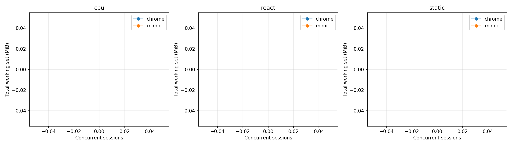
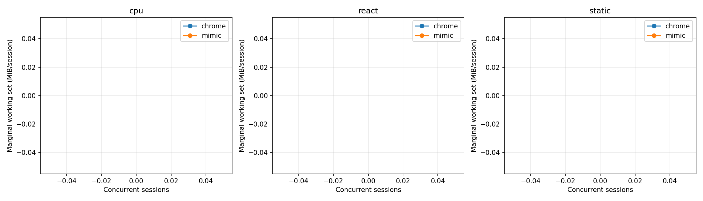
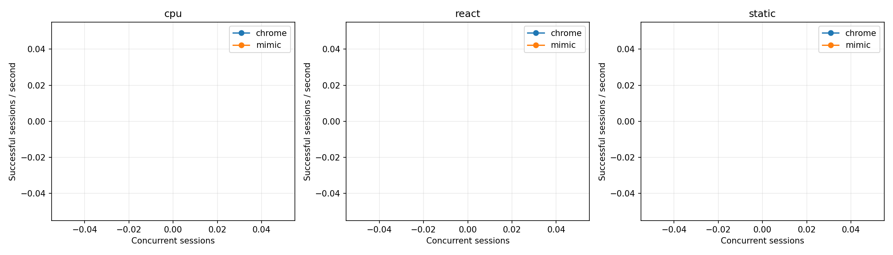
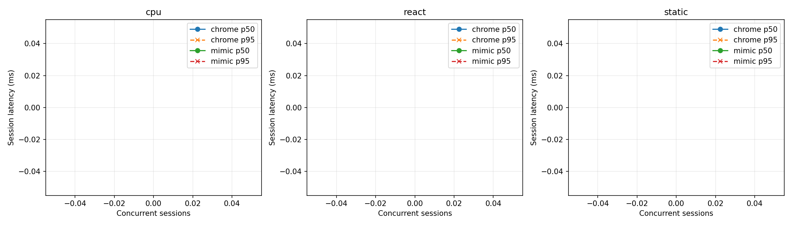

# Mimic V8 и Chrome 152: baseline Windows x64

Это измерение после исправления ошибок семантики, разрешённого пользователем. Оптимизации runtime ради производительности не выполнялись. Проверка исходной версии сохранена отдельно в `pre-fix/raw.json`.

## Окружение

| Параметр | Значение |
|---|---|
| Дата начала / конца | 2026-09-08T18:06:55.459941+04:00 / 2026-09-08T18:11:57.401520+04:00 |
| Chrome | {'protocolVersion': '1.3', 'product': 'Chrome/152.0.7977.82', 'revision': '@d04cdb24d67b081f6cf80200ffc5233f44b61109', 'userAgent': 'Mozilla/5.0 (Windows NT 10.0; Win64; x64) AppleWebKit/537.36 (KHTML, like Gecko) HeadlessChrome/152.0.0.0 Safari/537.36', 'jsVersion': '15.2.124.21'} |
| Chromium | 1669021 / d04cdb24d67b081f6cf80200ffc5233f44b61109 |
| Mimic commit | b6e24c97e44c8ba722a954f30cb7f68eabef8c51 |
| Mimic V8 | 15.2.124.1-rusty |
| OS | Windows-11-10.0.26200-SP0 |
| CPU | {"Name":"Intel(R) Core(TM) i7-14700KF","NumberOfCores":20,"NumberOfLogicalProcessors":28} |
| CPU physical / logical | 20 / 28 |
| RAM GiB | 31.83 |
| План питания | GUID схемы питания: 381b4222-f694-41f0-9685-ff5bb260df2e  (Сбалансированная) |
| Power overlay | 0 00000000-0000-0000-0000-000000000000 |
| Антивирус | {"displayName":"Windows Defender","productState":397568} |
| Chrome SHA-256 | ea36dd818a90176f1a70616f0363d9be527229389a6c073a0b1688b9e73f67e9 |
| Mimic SHA-256 | 7e31bf20d7e0ae996760ff2df847e193b6096ff64605bed1aeefa0b9b0263cba |

Рабочая станция не была эксклюзивно выделена тесту: фоновые приложения и антивирус включены. Список процессов, версии инструментов, аргументы, SHA-256 фикстур и бинарников находятся в raw.json.

## Методика и корректность

В обеих системах создаётся новая страница и уникальный loopback-origin. HTTP cache отключён, ответы no-store; cookie не используются. Контексты, транспорт и процесс в warm сохраняются, состояние страницы не используется повторно. Это изоляция для данного контролируемого корпуса, а не проверка tenant/security isolation. Cold создаёт новый процесс и профиль. Кэш файлов Windows, DLL и DNS ОС не очищается; «cold» означает новый процесс, а не холодный диск. Вариант warm HTTP cache не измерялся.

Навигация заканчивается только при точном URL, document.readyState === "complete" и наличии __benchRun. Затем одинаковый явный запуск __benchRun; завершение — done и точное совпадение детерминированного результата. Settle = 0. Paint/networkidle не ожидаются. Chrome headless=new; результаты не переносятся автоматически на headful.

Внешние часы perf_counter/QPC; polling 5 ms плюс задержка CDP/планировщика ОС. navigation_ms включает разбор HTML и загрузку скриптов, execution_ms — запуск/выполнение приложения и обнаружение маркера. Они не являются изолированным временем JIT или чистого JavaScript. js_ms страницы диагностический: в Mimic виртуальное время часто равно нулю.

Процесс запускается приостановленным, включается в Windows Job Object, затем возобновляется. process_start_ms — вызов создания процесса; CDP readiness отсчитывается от начала создания до ответа протокола. runtime_initialization_ms — остаток между ними; внутренние фазы V8 отдельно не инструментированы. Cold total включает создание страницы, выполнение, teardown и завершение процесса; удаление временного профиля и обслуживание локального сервера не включены.

CPU — user+kernel всего Job Object, включая завершившихся потомков. Working set/private bytes — сумма всех текущих участников Job Object каждые 50 ms и в контрольных точках. Кратковременные пики памяти могут быть пропущены, общие страницы DLL могут учитываться несколько раз. CPU % задан относительно одного логического ядра; 100% машины = 2800%. Пики CPU чувствительны к дискретности счётчиков Windows.

Одна проверка и по одному первоначальному warmup на серию исключены явно. Основные серии: 10 cold и 20 warm, без удаления медленных наблюдений. p95 публикуется при n≥10, p99 при n≥100; используется линейная интерполяция эмпирических квантилей, хвосты при n=10–20 особенно неустойчивы. SD и CV, min/max всех серий доступны в summary.csv. Ускорение не агрегируется в одно отношение.

| Система / workload | Correctness gate |
|---|---|
| chrome/async | VALID |
| chrome/cpu | VALID |
| chrome/dom | VALID |
| chrome/react | VALID |
| chrome/static | VALID |
| chrome/wasm | VALID |
| mimic/async | VALID |
| mimic/cpu | VALID |
| mimic/dom | VALID |
| mimic/react | VALID |
| mimic/static | VALID |
| mimic/wasm | VALID |

### CDP readiness: отдельная серия с одинаковой пробой

В финальной серии обе системы отвечают на Target.getTargets после WebSocket handshake. По 10 новых процессов, порядок систем чередуется; warmup исключён. Дата: 2026-09-08T18:11:43.906032+04:00. Основная серия использует ту же общую пробу.

| Система | n | CDP p50 ms | p95 | Min | Max | SD | Ready RSS MiB |
|---|---|---|---|---|---|---|---|
| mimic | 10 | 424.61 | 445.50 | 217.51 | 454.39 | 67.62 | 104.42 |
| chrome | 10 | 326.81 | 412.16 | 297.97 | 446.55 | 42.98 | 378.33 |

## Cold startup (медианы, ms)

| Система | Workload | n | Process create | CDP ready | Runtime init | Cold total | Shutdown |
|---|---|---|---|---|---|---|---|
| chrome | static | 10 | 6.65 | 298.80 | 292.53 | 519.50 | 114.79 |
| mimic | static | 10 | 5.65 | 214.13 | 208.27 | 440.58 | 62.05 |
| mimic | cpu | 10 | 6.29 | 221.36 | 214.34 | 505.44 | 65.94 |
| chrome | cpu | 10 | 6.95 | 302.06 | 295.06 | 542.75 | 118.52 |
| chrome | dom | 10 | 10.33 | 305.12 | 295.52 | 555.77 | 124.48 |
| mimic | dom | 10 | 9.70 | 230.96 | 221.33 | 1775.37 | 78.11 |
| mimic | async | 10 | 8.86 | 434.43 | 421.52 | 865.51 | 96.52 |
| chrome | async | 10 | 11.36 | 509.46 | 479.13 | 956.09 | 211.38 |
| chrome | react | 10 | 6.56 | 291.86 | 283.97 | 496.09 | 111.99 |
| mimic | react | 10 | 5.52 | 216.52 | 209.35 | 535.03 | 60.70 |
| mimic | wasm | 10 | 5.56 | 219.50 | 214.08 | 449.67 | 62.23 |
| chrome | wasm | 10 | 6.16 | 283.62 | 277.15 | 462.54 | 92.81 |

## Warm session startup / teardown (медианы)

| Система | Workload | n | Create ms | Teardown ms | RSS после teardown MiB |
|---|---|---|---|---|---|
| chrome | static | 20 | 37.26 | 13.71 | 1195.36 |
| mimic | static | 20 | 85.87 | 2.84 | 170.84 |
| mimic | cpu | 20 | 96.57 | 3.21 | 172.04 |
| chrome | cpu | 20 | 42.00 | 16.63 | 1419.83 |
| chrome | dom | 20 | 40.40 | 17.13 | 1364.52 |
| mimic | dom | 20 | 78.78 | 45.79 | 309.63 |
| mimic | async | 20 | 174.03 | 6.22 | 175.40 |
| chrome | async | 20 | 63.38 | 26.62 | 1251.31 |
| chrome | react | 20 | 28.91 | 10.41 | 1413.74 |
| mimic | react | 20 | 69.43 | 5.11 | 193.82 |
| mimic | wasm | 20 | 79.12 | 2.47 | 174.78 |
| chrome | wasm | 20 | 43.42 | 15.38 | 1246.79 |

## Single-session workload latency (ms)

| Система | Workload | Mode | n | Nav p50 | Execution p50 | Completion p50 | p95 | Min | Max | SD | CV |
|---|---|---|---|---|---|---|---|---|---|---|---|
| chrome | static | cold | 10 | 25.63 | 3.21 | 28.47 | 183.28 | 23.57 | 301.29 | 85.98 | 1.51 |
| mimic | static | cold | 10 | 79.63 | 1.93 | 81.54 | 84.69 | 79.74 | 86.01 | 1.82 | 0.02 |
| chrome | static | warm | 20 | 24.09 | 4.71 | 28.50 | 35.92 | 20.91 | 36.93 | 5.14 | 0.18 |
| mimic | static | warm | 20 | 88.05 | 2.97 | 90.26 | 183.27 | 75.58 | 184.81 | 39.67 | 0.35 |
| mimic | cpu | cold | 10 | 84.18 | 44.87 | 129.70 | 143.12 | 122.05 | 147.61 | 8.00 | 0.06 |
| chrome | cpu | cold | 10 | 25.59 | 33.69 | 59.05 | 202.73 | 54.22 | 310.58 | 79.46 | 0.94 |
| mimic | cpu | warm | 20 | 99.92 | 53.92 | 152.89 | 216.19 | 133.22 | 224.62 | 27.46 | 0.17 |
| chrome | cpu | warm | 20 | 28.72 | 37.90 | 65.74 | 80.08 | 53.94 | 101.64 | 10.27 | 0.15 |
| chrome | dom | cold | 10 | 29.32 | 14.28 | 43.42 | — | 37.96 | 84.87 | 15.65 | 0.31 |
| mimic | dom | cold | 10 | 86.03 | 1248.93 | 1335.05 | 1434.41 | 1186.82 | 1481.08 | 91.79 | 0.07 |
| chrome | dom | warm | 20 | 26.84 | 35.84 | 62.09 | 73.55 | 45.89 | 73.88 | 6.82 | 0.11 |
| mimic | dom | warm | 20 | 74.70 | 1271.19 | 1341.98 | 2544.31 | 1130.48 | 2657.22 | 534.58 | 0.33 |
| mimic | async | cold | 10 | 128.73 | 77.35 | 205.45 | 220.91 | 191.04 | 221.00 | 10.25 | 0.05 |
| chrome | async | cold | 10 | 48.48 | 43.50 | 95.66 | 288.07 | 76.59 | 411.86 | 100.74 | 0.77 |
| mimic | async | warm | 20 | 197.10 | 94.09 | 281.86 | 324.80 | 262.76 | 371.20 | 25.27 | 0.09 |
| chrome | async | warm | 20 | 42.20 | 40.57 | 83.05 | 106.16 | 70.39 | 210.69 | 30.06 | 0.33 |
| chrome | react | cold | 10 | 24.69 | 16.09 | 40.82 | — | 38.59 | 160.84 | 39.92 | 0.73 |
| mimic | react | cold | 10 | 84.85 | 93.62 | 178.01 | 206.58 | 170.17 | 206.60 | 14.68 | 0.08 |
| chrome | react | warm | 20 | 19.73 | 23.20 | 43.10 | 49.34 | 37.48 | 52.09 | 3.71 | 0.08 |
| mimic | react | warm | 20 | 77.98 | 89.06 | 168.72 | 183.85 | 155.98 | 218.78 | 12.70 | 0.07 |
| mimic | wasm | cold | 10 | 79.75 | 9.53 | 89.40 | 95.35 | 85.84 | 96.72 | 3.55 | 0.04 |
| chrome | wasm | cold | 10 | 24.81 | 5.35 | 30.32 | 121.74 | 24.14 | 184.10 | 48.93 | 1.06 |
| mimic | wasm | warm | 20 | 80.82 | 10.63 | 91.17 | 115.78 | 83.68 | 116.20 | 11.34 | 0.12 |
| chrome | wasm | warm | 20 | 26.11 | 6.45 | 32.99 | 46.79 | 23.16 | 49.67 | 7.39 | 0.22 |

## Single-session память / CPU (медианы)

| Система | Workload | Mode | До страницы MiB | После create MiB | Peak RSS MiB | Peak private MiB | CPU/session ms | CPU/workload ms |
|---|---|---|---|---|---|---|---|---|
| chrome | static | cold | 385.60 | 433.38 | 482.96 | 251.58 | 398.44 | 156.25 |
| mimic | static | cold | 104.09 | 138.91 | 169.71 | 209.12 | 210.94 | 125.00 |
| chrome | static | warm | 1136.95 | 1181.66 | 1195.36 | 604.31 | 210.94 | 62.50 |
| mimic | static | warm | 170.17 | 180.69 | 207.94 | 247.62 | 218.75 | 132.81 |
| mimic | cpu | cold | 104.36 | 139.14 | 173.89 | 211.98 | 281.25 | 171.88 |
| chrome | cpu | cold | 383.11 | 434.17 | 516.70 | 277.00 | 500.00 | 257.81 |
| mimic | cpu | warm | 171.54 | 192.01 | 209.73 | 247.27 | 312.50 | 210.94 |
| chrome | cpu | warm | 1341.59 | 1388.11 | 1419.83 | 777.79 | 328.12 | 187.50 |
| chrome | dom | cold | 379.41 | 432.90 | 503.90 | 262.84 | 414.06 | 171.88 |
| mimic | dom | cold | 104.18 | 138.62 | 265.13 | 305.66 | 2281.25 | 2054.69 |
| chrome | dom | warm | 1280.60 | 1327.88 | 1364.52 | 724.49 | 343.75 | 140.62 |
| mimic | dom | warm | 301.04 | 339.72 | 345.53 | 386.02 | 2695.31 | 2539.06 |
| mimic | async | cold | 104.43 | 139.95 | 178.23 | 218.60 | 414.06 | 242.19 |
| chrome | async | cold | 380.35 | 436.25 | 519.80 | 276.86 | 898.44 | 382.81 |
| mimic | async | warm | 174.19 | 186.54 | 211.35 | 248.96 | 539.06 | 320.31 |
| chrome | async | warm | 1188.18 | 1232.31 | 1251.44 | 635.80 | 453.12 | 218.75 |
| chrome | react | cold | 381.81 | 434.25 | 500.82 | 267.67 | 351.56 | 203.12 |
| mimic | react | cold | 104.09 | 139.63 | 173.35 | 214.17 | 367.19 | 234.38 |
| chrome | react | warm | 1332.69 | 1373.25 | 1413.74 | 802.03 | 218.75 | 132.81 |
| mimic | react | warm | 189.12 | 211.07 | 236.45 | 274.20 | 343.75 | 234.38 |
| mimic | wasm | cold | 103.90 | 140.79 | 174.61 | 214.48 | 210.94 | 117.19 |
| chrome | wasm | cold | 386.18 | 428.52 | 492.75 | 255.49 | 320.31 | 132.81 |
| mimic | wasm | warm | 173.25 | 180.90 | 204.84 | 241.72 | 234.38 | 125.00 |
| chrome | wasm | warm | 1178.64 | 1221.07 | 1246.79 | 616.93 | 234.38 | 78.12 |

## Concurrency / density

Каждый уровень — отдельный процесс; один исключённый warmup и max(5, ceil(20/N)) измеряемых волн. Страницы создаются параллельно; после барьера все начинают навигацию. Завершившиеся страницы удерживаются до окончания волны для одновременного RSS. Throughput = успешные сессии / время create→последний teardown, включая барьер и измерения, но без HTTP-server setup/cleanup. Latency = create→completion, включая ожидание барьера. Это batch throughput, не оптимизированный постоянный поток запросов. Удержание не добавляется в latency, но входит в throughput. CPU на сессию = CPU всей волны / число успехов; пересекающиеся интервалы CPU отдельных страниц не суммируются.

Пределы остановки: любая ошибка, <15% либо <2 GiB доступной RAM, >1024 pages input/s в течение 3 s, timeout 180 s. Это защита рабочей машины; максимум прошедшего уровня — нижняя граница поддержанной здесь ёмкости, не доказательство абсолютного максимума.

Mimic сериализует команды CDP общим mutex. Измерение включает это поведение; профилирование причин затрат не проводилось. В строках с остановкой RSS может быть снят раньше завершения всех страниц, а число волн 0 означает остановку на исключаемом warmup. Такие строки диагностические и не входят в fit/графики стабильных уровней. Между волнами дополнительно выполняются 250 ms recovery, очистка серверов и запись checkpoint вне batch throughput.

| Система | Workload | N | Волн | Успех % | RSS MiB | RSS/N MiB | Peak MiB | CPU/session ms | Сессий/s | p50 ms | p95 ms | p99 ms | Стоп |
|---|---|---|---|---|---|---|---|---|---|---|---|---|---|
| chrome | static | 1 | 0 | 0.00 | 379.36 | 379.36 | 454.16 | — | 0.00 | 47.70 | — | — | memory pressure (<15% or 2 GiB available) |
| mimic | static | 1 | 1 | 100.00 | 204.61 | 204.61 | 204.61 | 234.38 | 6.45 | 152.69 | — | — | memory pressure (<15% or 2 GiB available) |
| chrome | cpu | 1 | 0 | 100.00 | 449.85 | 449.85 | 532.32 | 671.88 | 6.45 | 138.28 | — | — | memory pressure (<15% or 2 GiB available) |
| mimic | cpu | 1 | 0 | 100.00 | 160.64 | 160.64 | 180.16 | 265.62 | 4.03 | 245.17 | — | — | memory pressure (<15% or 2 GiB available) |
| chrome | react | 1 | 0 | 0.00 | 376.88 | 376.88 | 436.02 | — | 0.00 | 31.85 | — | — | memory pressure (<15% or 2 GiB available) |
| mimic | react | 1 | 0 | 0.00 | 132.71 | 132.71 | 133.18 | — | 0.00 | 79.08 | — | — | memory pressure (<15% or 2 GiB available) |

## Marginal RAM/session

Измерена конечная разность между соседними протестированными N, делённая на ΔN; это не прямое измерение каждого N→N+1. Линейная модель — описательный OLS fit по медианам только успешных уровней. Пересечение — экстраполяция; реальный startup overhead включает исходную пустую страницу. Общий RSS включает процессы и кэши, оставшиеся от предыдущих волн, а число волн зависит от N. Поэтому fit смешивает стоимость активных страниц с историей процесса. Дополнительно показан прирост RSS относительно начала той же волны: он тоже может включать фоновую активность и GC.

| Система | Workload | N | (Active RSS − before wave RSS)/N MiB |
|---|---|---|---|
| chrome | static | 1 | -2.23 |
| mimic | static | 1 | 46.79 |
| chrome | cpu | 1 | 76.68 |
| mimic | cpu | 1 | 56.40 |
| chrome | react | 1 | 1.87 |
| mimic | react | 1 | 29.21 |

| Система | Workload | N low→high | ΔRSS MiB | ΔRSS/ΔN MiB |
|---|---|---|---|---|

| Система | Workload | Fixed fit MiB | Marginal fit MiB | R² | Max stable N |
|---|---|---|---|---|---|

## Teardown / recovery

| Система | Workload | N | Ready RSS MiB | RSS после волн MiB | CPU всей серии s | CPU % |
|---|---|---|---|---|---|---|
| chrome | static | 1 | 376.29 | 517.31 | 0.47 | 597.45 |
| mimic | static | 1 | 103.66 | 153.88 | 0.23 | 151.13 |
| chrome | cpu | 1 | 369.82 | 548.04 | 0.67 | 433.62 |
| mimic | cpu | 1 | 104.24 | 168.34 | 0.27 | 106.94 |
| chrome | react | 1 | 369.84 | 502.15 | 0.16 | 346.76 |
| mimic | react | 1 | 103.50 | 133.69 | 0.11 | 130.65 |

## Локальный сервер (измеряется независимо)

Время обработчика HTTP — от получения запроса обработчиком до завершения записи ответа; не включает очередь TCP/планировщика сервера или сетевой roundtrip. До основного workload сервер создаётся вне измеряемого интервала. Запросы и bytes каждого ресурса записаны в raw.json.

| Система | Workload | Mode | Запросов | Server p50 ms | Server p95 ms | Server max ms |
|---|---|---|---|---|---|---|
| chrome | static | cold | 20 | 0.20 | 0.47 | 0.66 |
| mimic | static | cold | 20 | 0.14 | 0.25 | 0.29 |
| chrome | static | warm | 40 | 0.23 | 0.38 | 0.42 |
| mimic | static | warm | 40 | 0.22 | 0.43 | 1.38 |
| mimic | cpu | cold | 20 | 0.21 | 0.38 | 0.38 |
| chrome | cpu | cold | 20 | 0.34 | 0.57 | 0.61 |
| mimic | cpu | warm | 40 | 0.20 | 0.38 | 0.39 |
| chrome | cpu | warm | 40 | 0.26 | 0.50 | 0.57 |
| chrome | dom | cold | 18 | 0.32 | 0.92 | 1.68 |
| mimic | dom | cold | 20 | 0.22 | 0.40 | 0.46 |
| chrome | dom | warm | 40 | 0.31 | 0.42 | 1.37 |
| mimic | dom | warm | 40 | 0.19 | 0.34 | 0.35 |
| mimic | async | cold | 50 | 0.13 | 0.32 | 1.08 |
| chrome | async | cold | 50 | 0.23 | 0.60 | 1.09 |
| mimic | async | warm | 100 | 0.20 | 0.48 | 0.60 |
| chrome | async | warm | 100 | 0.26 | 1.21 | 1.97 |
| chrome | react | cold | 45 | 0.33 | 0.88 | 1.00 |
| mimic | react | cold | 50 | 0.21 | 0.52 | 0.61 |
| chrome | react | warm | 100 | 0.28 | 0.98 | 2.11 |
| mimic | react | warm | 100 | 0.21 | 0.45 | 0.57 |
| mimic | wasm | cold | 20 | 0.18 | 0.40 | 0.48 |
| chrome | wasm | cold | 20 | 0.34 | 0.51 | 0.86 |
| mimic | wasm | warm | 40 | 0.20 | 0.40 | 0.45 |
| chrome | wasm | warm | 40 | 0.29 | 0.53 | 0.74 |

## Валидность измеряемых серий

| Система | Workload | Mode | Успех / попыток | Использование сравнения |
|---|---|---|---|---|
| chrome | static | cold | 10/10 | VALID |
| mimic | static | cold | 10/10 | VALID |
| chrome | static | warm | 20/20 | VALID |
| mimic | static | warm | 20/20 | VALID |
| mimic | cpu | cold | 10/10 | VALID |
| chrome | cpu | cold | 10/10 | VALID |
| mimic | cpu | warm | 20/20 | VALID |
| chrome | cpu | warm | 20/20 | VALID |
| chrome | dom | cold | 9/10 | INVALID — error or semantic mismatch; no speed claim |
| mimic | dom | cold | 10/10 | VALID |
| chrome | dom | warm | 20/20 | VALID |
| mimic | dom | warm | 20/20 | VALID |
| mimic | async | cold | 10/10 | VALID |
| chrome | async | cold | 10/10 | VALID |
| mimic | async | warm | 20/20 | VALID |
| chrome | async | warm | 20/20 | VALID |
| chrome | react | cold | 9/10 | INVALID — error or semantic mismatch; no speed claim |
| mimic | react | cold | 10/10 | VALID |
| chrome | react | warm | 20/20 | VALID |
| mimic | react | warm | 20/20 | VALID |
| mimic | wasm | cold | 10/10 | VALID |
| chrome | wasm | cold | 10/10 | VALID |
| mimic | wasm | warm | 20/20 | VALID |
| chrome | wasm | warm | 20/20 | VALID |

## Инженерный вывод

1. По медиане warm navigation→completion Mimic быстрее: ни на одной из измеренных нагрузок. CDP readiness (общая проба, отдельные cold): mimic 424.61 ms; chrome 326.81 ms

2. Chrome быстрее по той же метрике: async (281.86 / 83.05 ms Mimic/Chrome); cpu (152.89 / 65.74 ms Mimic/Chrome); dom (1341.98 / 62.09 ms Mimic/Chrome); react (168.72 / 43.10 ms Mimic/Chrome); static (90.26 / 28.50 ms Mimic/Chrome); wasm (91.17 / 32.99 ms Mimic/Chrome).

3. Фиксированный overhead процесса (CDP ready, включая исходную страницу): mimic 104.12 MiB; chrome 379.51 MiB. Startup latency и OLS intercept приведены отдельно выше.

4. Оценки marginal RAM/session: недостаточно успешных уровней для модели.

5. Максимальный стабильный N по нагрузке: mimic/cpu 0; chrome/cpu 0; mimic/react 0; chrome/react 0; mimic/static 0; chrome/static 0.

6. Throughput на максимальном общем стабильном уровне:

7. Невалидные сравнения после исправлений: нет на correctness gate; ошибки отдельных итераций остаются в raw.json. До исправлений: DOM, async, React, WebAssembly (см. pre-fix).

8. Ограничения: одна занятая рабочая станция; headless Chrome; различные сборки V8; HTTP cache отключён; ограниченные размеры и семантические проверки корпуса; React-фикстура синтетическая, не Next.js/production-приложение. Polling и sampler входят в нагрузку системы. RSS — сумма рабочих наборов, не уникальная физическая RAM; нет финансовой модели стоимости сессии. Paging — общесистемный счётчик, не атрибуция hard faults конкретному процессу. Значения виртуальных часов Mimic не используются для сравнений.

9. Наиболее сильная защищаемая формулировка для README: «На Windows x64 локальные контролируемые нагрузки прошли проверку результатов в Mimic V8 и Chrome 152.0.7977.82; опубликованы воспроизводимый harness, исходные наблюдения и отдельные показатели latency, CPU и памяти. »

10. Данные НЕ подтверждают утверждение «Mimic в X раз быстрее Chrome вообще», полную совместимость с браузером, безопасность изоляции tenants, преимущество чистого V8/JIT, выигрыш на произвольных сайтах или денежную экономию без модели эксплуатации.
