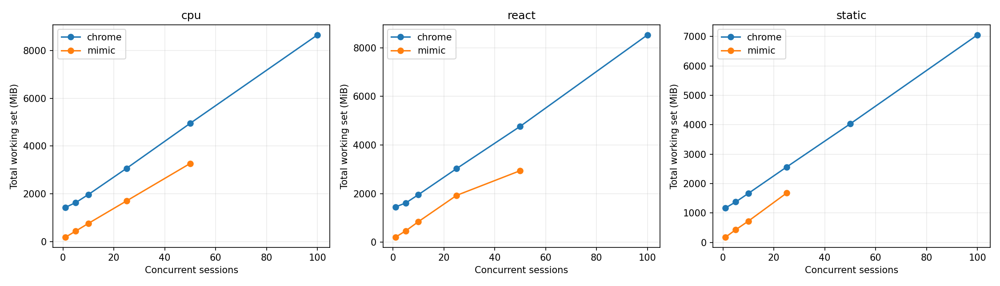
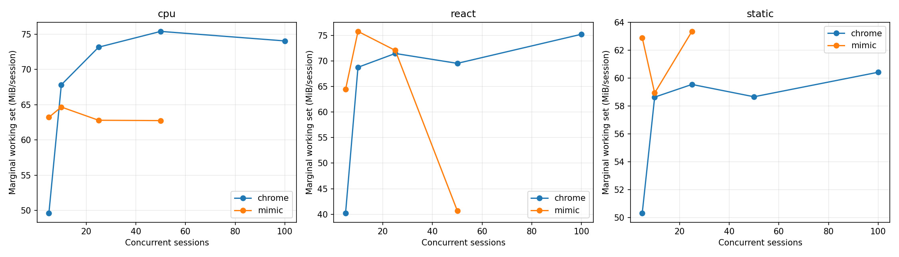
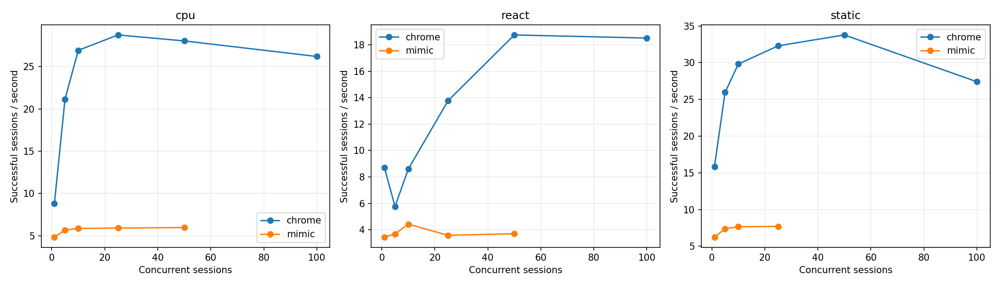
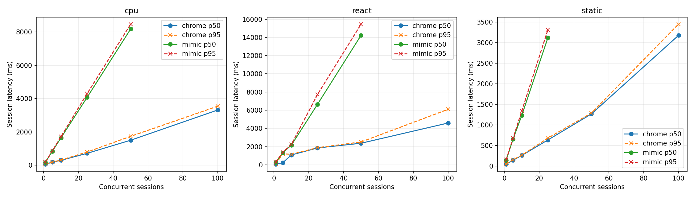
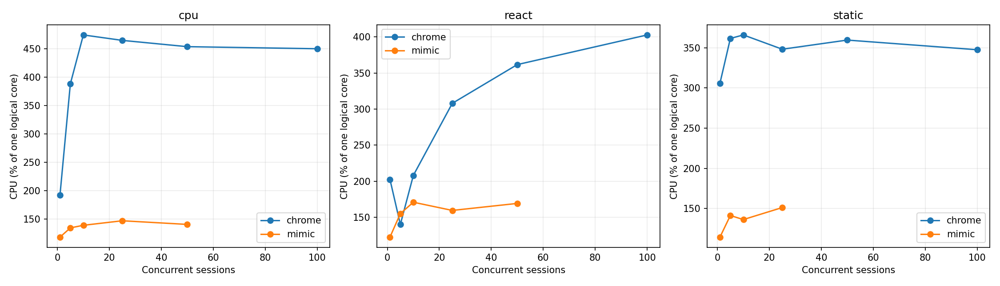

# Mimic V8 и Chrome 152: baseline Windows x64

Это измерение после исправления ошибок семантики, разрешённого пользователем. Оптимизации runtime ради производительности не выполнялись. Проверка исходной версии сохранена отдельно в `pre-fix/raw.json`.

## Окружение

| Параметр | Значение |
|---|---|
| Дата начала / конца | 2026-09-08T18:27:48.839782+04:00 / 2026-09-08T18:45:06.389971+04:00 |
| Chrome | {'protocolVersion': '1.3', 'product': 'Chrome/152.0.7977.82', 'revision': '@d04cdb24d67b081f6cf80200ffc5233f44b61109', 'userAgent': 'Mozilla/5.0 (Windows NT 10.0; Win64; x64) AppleWebKit/537.36 (KHTML, like Gecko) HeadlessChrome/152.0.0.0 Safari/537.36', 'jsVersion': '15.2.124.21'} |
| Chromium | 1669021 / d04cdb24d67b081f6cf80200ffc5233f44b61109 |
| Mimic commit | 506b0aa82d0186f42041d6033091dad2e688a0de |
| Mimic V8 | 15.2.124.1-rusty |
| OS | Windows-11-10.0.26200-SP0 |
| CPU | {"Name":"Intel(R) Core(TM) i7-14700KF","NumberOfCores":20,"NumberOfLogicalProcessors":28} |
| CPU physical / logical | 20 / 28 |
| RAM GiB | 31.83 |
| План питания | GUID схемы питания: 381b4222-f694-41f0-9685-ff5bb260df2e  (Сбалансированная) |
| Power overlay | 0 00000000-0000-0000-0000-000000000000 |
| Антивирус | {"displayName":"Windows Defender","productState":397568} |
| Chrome SHA-256 | ea36dd818a90176f1a70616f0363d9be527229389a6c073a0b1688b9e73f67e9 |
| Mimic SHA-256 | 7e31bf20d7e0ae996760ff2df847e193b6096ff64605bed1aeefa0b9b0263cba |

Рабочая станция не была эксклюзивно выделена тесту: фоновые приложения и антивирус включены. Список процессов, версии инструментов, аргументы, SHA-256 фикстур и бинарников находятся в raw.json.

## Методика и корректность

В обеих системах создаётся новая страница и уникальный loopback-origin. HTTP cache отключён, ответы no-store; cookie не используются. Контексты, транспорт и процесс в warm сохраняются, состояние страницы не используется повторно. Это изоляция для данного контролируемого корпуса, а не проверка tenant/security isolation. Cold создаёт новый процесс и профиль. Кэш файлов Windows, DLL и DNS ОС не очищается; «cold» означает новый процесс, а не холодный диск. Вариант warm HTTP cache не измерялся.

Навигация заканчивается только при точном URL, document.readyState === "complete" и наличии __benchRun. Затем одинаковый явный запуск __benchRun; завершение — done и точное совпадение детерминированного результата. Settle = 0. Paint/networkidle не ожидаются. Chrome headless=new; результаты не переносятся автоматически на headful.

Внешние часы perf_counter/QPC; polling 5 ms плюс задержка CDP/планировщика ОС. navigation_ms включает разбор HTML и загрузку скриптов, execution_ms — запуск/выполнение приложения и обнаружение маркера. Они не являются изолированным временем JIT или чистого JavaScript. js_ms страницы диагностический: в Mimic виртуальное время часто равно нулю.

Процесс запускается приостановленным, включается в Windows Job Object, затем возобновляется. process_start_ms — вызов создания процесса; CDP readiness отсчитывается от начала создания до ответа протокола. runtime_initialization_ms — остаток между ними; внутренние фазы V8 отдельно не инструментированы. Cold total включает создание страницы, выполнение, teardown и завершение процесса; удаление временного профиля и обслуживание локального сервера не включены.

CPU — user+kernel всего Job Object, включая завершившихся потомков. Working set/private bytes — сумма всех текущих участников Job Object каждые 50 ms и в контрольных точках. Кратковременные пики памяти могут быть пропущены, общие страницы DLL могут учитываться несколько раз. CPU % задан относительно одного логического ядра; 100% машины = 2800%. Пики CPU чувствительны к дискретности счётчиков Windows.

Одна проверка и по одному первоначальному warmup на серию исключены явно. Основные серии: 10 cold и 20 warm, без удаления медленных наблюдений. p95 публикуется при n≥10, p99 при n≥100; используется линейная интерполяция эмпирических квантилей, хвосты при n=10–20 особенно неустойчивы. SD и CV, min/max всех серий доступны в summary.csv. Ускорение не агрегируется в одно отношение.

| Система / workload | Correctness gate |
|---|---|
| chrome/async | VALID |
| chrome/cpu | VALID |
| chrome/dom | VALID |
| chrome/react | VALID |
| chrome/static | VALID |
| chrome/wasm | VALID |
| mimic/async | VALID |
| mimic/cpu | VALID |
| mimic/dom | VALID |
| mimic/react | VALID |
| mimic/static | VALID |
| mimic/wasm | VALID |

### CDP readiness: отдельная серия с одинаковой пробой

В финальной серии обе системы отвечают на Target.getTargets после WebSocket handshake. По 10 новых процессов, порядок систем чередуется; warmup исключён. Дата: 2026-09-08T18:44:39.400442+04:00. Основная серия использует ту же общую пробу.

| Система | n | CDP p50 ms | p95 | Min | Max | SD | Ready RSS MiB |
|---|---|---|---|---|---|---|---|
| mimic | 10 | 215.24 | 229.49 | 213.50 | 234.22 | 6.45 | 104.07 |
| chrome | 10 | 287.06 | 396.19 | 252.98 | 443.23 | 55.42 | 383.48 |

## Cold startup (медианы, ms)

| Система | Workload | n | Process create | CDP ready | Runtime init | Cold total | Shutdown |
|---|---|---|---|---|---|---|---|
| chrome | static | 10 | 8.10 | 293.52 | 285.43 | 508.91 | 104.78 |
| mimic | static | 10 | 6.64 | 232.91 | 224.09 | 469.76 | 67.14 |
| mimic | cpu | 10 | 6.26 | 218.45 | 210.27 | 519.57 | 70.26 |
| chrome | cpu | 10 | 6.80 | 288.39 | 278.75 | 494.45 | 106.50 |
| chrome | dom | 10 | 6.59 | 281.60 | 274.80 | 477.33 | 97.82 |
| mimic | dom | 10 | 5.80 | 215.72 | 209.64 | 1598.80 | 69.17 |
| mimic | async | 10 | 5.39 | 214.65 | 209.03 | 489.77 | 61.88 |
| chrome | async | 10 | 6.64 | 270.29 | 263.81 | 478.00 | 100.38 |
| chrome | react | 10 | 6.44 | 275.99 | 269.49 | 461.46 | 94.51 |
| mimic | react | 10 | 5.39 | 214.15 | 208.59 | 531.71 | 59.99 |
| mimic | wasm | 10 | 5.49 | 214.04 | 208.51 | 445.33 | 60.35 |
| chrome | wasm | 10 | 6.39 | 272.36 | 265.65 | 448.60 | 94.93 |

## Warm session startup / teardown (медианы)

| Система | Workload | n | Create ms | Teardown ms | RSS после teardown MiB |
|---|---|---|---|---|---|
| chrome | static | 20 | 31.29 | 10.92 | 1192.75 |
| mimic | static | 20 | 94.28 | 2.67 | 172.24 |
| mimic | cpu | 20 | 76.07 | 2.18 | 171.84 |
| chrome | cpu | 20 | 28.64 | 9.56 | 1427.93 |
| chrome | dom | 20 | 25.94 | 10.02 | 1374.98 |
| mimic | dom | 20 | 69.77 | 43.96 | 311.71 |
| mimic | async | 20 | 70.39 | 2.46 | 174.68 |
| chrome | async | 20 | 26.53 | 9.56 | 1249.64 |
| chrome | react | 20 | 25.50 | 9.73 | 1441.63 |
| mimic | react | 20 | 67.33 | 4.80 | 193.21 |
| mimic | wasm | 20 | 67.10 | 1.97 | 172.18 |
| chrome | wasm | 20 | 23.74 | 10.06 | 1274.89 |

## Single-session workload latency (ms)

| Система | Workload | Mode | n | Nav p50 | Execution p50 | Completion p50 | p95 | Min | Max | SD | CV |
|---|---|---|---|---|---|---|---|---|---|---|---|
| chrome | static | cold | 10 | 26.04 | 3.15 | 29.82 | — | 24.91 | 63.19 | 13.83 | 0.37 |
| mimic | static | cold | 10 | 86.34 | 2.02 | 88.59 | 96.01 | 81.11 | 97.90 | 5.43 | 0.06 |
| chrome | static | warm | 20 | 19.40 | 4.35 | 23.23 | 32.61 | 18.75 | 35.74 | 4.08 | 0.17 |
| mimic | static | warm | 20 | 99.15 | 2.61 | 101.49 | 119.86 | 82.83 | 122.79 | 13.87 | 0.14 |
| mimic | cpu | cold | 10 | 90.67 | 47.91 | 139.34 | 146.62 | 122.72 | 149.43 | 9.10 | 0.07 |
| chrome | cpu | cold | 10 | 22.05 | 31.99 | 53.60 | 64.68 | 49.88 | 70.54 | 5.96 | 0.11 |
| mimic | cpu | warm | 20 | 75.54 | 41.92 | 117.43 | 138.72 | 109.61 | 143.25 | 11.04 | 0.09 |
| chrome | cpu | warm | 20 | 17.33 | 28.95 | 46.26 | 53.50 | 43.55 | 55.34 | 3.15 | 0.07 |
| chrome | dom | cold | 10 | 20.14 | 12.43 | 32.45 | 45.70 | 27.69 | 49.31 | 6.57 | 0.19 |
| mimic | dom | cold | 10 | 79.61 | 1120.03 | 1198.57 | 1299.98 | 1160.86 | 1301.72 | 57.27 | 0.05 |
| chrome | dom | warm | 20 | 16.48 | 29.84 | 46.87 | 49.44 | 44.14 | 51.39 | 1.72 | 0.04 |
| mimic | dom | warm | 20 | 74.06 | 1123.71 | 1196.34 | 1996.96 | 1133.69 | 2157.91 | 276.20 | 0.22 |
| mimic | async | cold | 10 | 79.53 | 53.90 | 133.06 | 146.63 | 121.45 | 150.17 | 7.48 | 0.06 |
| chrome | async | cold | 10 | 22.06 | 26.66 | 48.96 | 52.84 | 44.72 | 53.27 | 2.58 | 0.05 |
| mimic | async | warm | 20 | 71.94 | 48.91 | 120.91 | 123.96 | 110.01 | 133.99 | 5.54 | 0.05 |
| chrome | async | warm | 20 | 16.42 | 27.69 | 43.52 | 47.92 | 38.60 | 49.26 | 2.60 | 0.06 |
| chrome | react | cold | 10 | 25.61 | 15.22 | 41.09 | 497.33 | 35.32 | 836.64 | 250.69 | 2.02 |
| mimic | react | cold | 10 | 85.75 | 92.49 | 180.52 | 183.62 | 168.53 | 184.29 | 4.97 | 0.03 |
| chrome | react | warm | 20 | 22.73 | 22.02 | 43.12 | 46.16 | 35.15 | 49.26 | 3.19 | 0.07 |
| mimic | react | warm | 20 | 79.04 | 92.60 | 173.36 | 178.60 | 162.39 | 182.88 | 5.28 | 0.03 |
| mimic | wasm | cold | 10 | 78.83 | 9.63 | 88.62 | 89.66 | 86.27 | 89.73 | 1.18 | 0.01 |
| chrome | wasm | cold | 10 | 20.60 | 5.04 | 26.06 | 39.47 | 22.87 | 47.89 | 7.30 | 0.26 |
| mimic | wasm | warm | 20 | 72.33 | 9.51 | 81.69 | 84.84 | 76.83 | 86.44 | 2.34 | 0.03 |
| chrome | wasm | warm | 20 | 16.83 | 4.78 | 21.93 | 23.86 | 19.23 | 26.08 | 1.45 | 0.07 |

## Single-session память / CPU (медианы)

| Система | Workload | Mode | До страницы MiB | После create MiB | Peak RSS MiB | Peak private MiB | CPU/session ms | CPU/workload ms |
|---|---|---|---|---|---|---|---|---|
| chrome | static | cold | 373.63 | 420.04 | 473.72 | 249.56 | 335.94 | 125.00 |
| mimic | static | cold | 104.27 | 138.91 | 169.99 | 210.15 | 218.75 | 117.19 |
| chrome | static | warm | 1133.58 | 1171.15 | 1192.75 | 595.59 | 156.25 | 46.88 |
| mimic | static | warm | 170.31 | 182.16 | 206.74 | 244.96 | 234.38 | 125.00 |
| mimic | cpu | cold | 104.27 | 139.88 | 174.33 | 212.68 | 320.31 | 203.12 |
| chrome | cpu | cold | 387.64 | 430.81 | 525.93 | 272.25 | 382.81 | 226.56 |
| mimic | cpu | warm | 171.54 | 183.39 | 209.01 | 246.51 | 250.00 | 140.62 |
| chrome | cpu | warm | 1349.00 | 1388.28 | 1427.93 | 785.97 | 210.94 | 125.00 |
| chrome | dom | cold | 381.22 | 428.43 | 483.44 | 252.70 | 359.38 | 156.25 |
| mimic | dom | cold | 104.29 | 139.09 | 264.60 | 305.29 | 1984.38 | 1851.56 |
| chrome | dom | warm | 1291.59 | 1328.82 | 1374.98 | 718.19 | 187.50 | 109.38 |
| mimic | dom | warm | 306.48 | 325.89 | 367.27 | 406.58 | 2421.88 | 2226.56 |
| mimic | async | cold | 104.05 | 139.69 | 175.46 | 216.04 | 242.19 | 140.62 |
| chrome | async | cold | 378.43 | 431.58 | 498.51 | 256.17 | 351.56 | 156.25 |
| mimic | async | warm | 173.50 | 185.45 | 209.07 | 247.91 | 203.12 | 109.38 |
| chrome | async | warm | 1186.73 | 1221.79 | 1249.75 | 625.17 | 171.88 | 93.75 |
| chrome | react | cold | 388.87 | 435.36 | 512.41 | 271.32 | 351.56 | 156.25 |
| mimic | react | cold | 103.79 | 140.20 | 175.95 | 216.35 | 367.19 | 265.62 |
| chrome | react | warm | 1359.10 | 1391.67 | 1441.63 | 819.22 | 195.31 | 109.38 |
| mimic | react | warm | 188.38 | 208.69 | 232.38 | 270.04 | 351.56 | 242.19 |
| mimic | wasm | cold | 104.33 | 139.83 | 173.76 | 213.71 | 187.50 | 117.19 |
| chrome | wasm | cold | 378.33 | 435.30 | 488.36 | 250.91 | 359.38 | 125.00 |
| mimic | wasm | warm | 170.74 | 182.15 | 206.68 | 244.13 | 187.50 | 109.38 |
| chrome | wasm | warm | 1213.80 | 1249.13 | 1274.89 | 620.35 | 164.06 | 70.31 |

## Concurrency / density

Каждый уровень — отдельный процесс; один исключённый warmup и max(5, ceil(20/N)) измеряемых волн. Страницы создаются параллельно; после барьера все начинают навигацию. Завершившиеся страницы удерживаются до окончания волны для одновременного RSS. Throughput = успешные сессии / время create→последний teardown, включая барьер и измерения, но без HTTP-server setup/cleanup. Latency = create→completion, включая ожидание барьера. Это batch throughput, не оптимизированный постоянный поток запросов. Удержание не добавляется в latency, но входит в throughput. CPU на сессию = CPU всей волны / число успехов; пересекающиеся интервалы CPU отдельных страниц не суммируются.

Пределы остановки: любая ошибка, <15% либо <2 GiB доступной RAM, >1024 pages input/s в течение 3 s, timeout 180 s. Это защита рабочей машины; максимум прошедшего уровня — нижняя граница поддержанной здесь ёмкости, не доказательство абсолютного максимума.

Mimic сериализует команды CDP общим mutex. Измерение включает это поведение; профилирование причин затрат не проводилось. В строках с остановкой RSS может быть снят раньше завершения всех страниц, а число волн 0 означает остановку на исключаемом warmup. Такие строки диагностические и не входят в fit/графики стабильных уровней. Между волнами дополнительно выполняются 250 ms recovery, очистка серверов и запись checkpoint вне batch throughput.

| Система | Workload | N | Волн | Успех % | RSS MiB | RSS/N MiB | Peak MiB | CPU/session ms | Сессий/s | p50 ms | p95 ms | p99 ms | Стоп |
|---|---|---|---|---|---|---|---|---|---|---|---|---|---|
| chrome | static | 1 | 20 | 100.00 | 1174.62 | 1174.62 | 1181.88 | 192.97 | 15.86 | 46.49 | 50.10 | — |  |
| mimic | static | 1 | 20 | 100.00 | 180.88 | 180.88 | 226.07 | 182.81 | 6.25 | 142.03 | 153.64 | — |  |
| chrome | static | 5 | 5 | 100.00 | 1375.91 | 275.18 | 1400.84 | 139.38 | 25.95 | 142.85 | 155.73 | — |  |
| mimic | static | 5 | 5 | 100.00 | 432.51 | 86.50 | 503.06 | 191.25 | 7.38 | 657.55 | 679.13 | — |  |
| chrome | static | 10 | 5 | 100.00 | 1669.13 | 166.91 | 1687.15 | 122.81 | 29.81 | 258.47 | 263.49 | — |  |
| mimic | static | 10 | 5 | 100.00 | 727.21 | 72.72 | 830.46 | 177.50 | 7.67 | 1233.20 | 1341.30 | — |  |
| chrome | static | 25 | 5 | 100.00 | 2562.45 | 102.50 | 2573.49 | 107.88 | 32.29 | 634.76 | 680.47 | 683.36 |  |
| mimic | static | 25 | 5 | 100.00 | 1677.64 | 67.11 | 1903.07 | 196.00 | 7.71 | 3120.05 | 3314.46 | 3316.08 |  |
| chrome | static | 50 | 5 | 100.00 | 4029.22 | 80.58 | 4044.34 | 106.50 | 33.78 | 1266.79 | 1287.81 | 1290.06 |  |
| mimic | static | 50 | 5 | 100.00 | 3217.11 | 64.34 | 3723.58 | 195.88 | 7.78 | 6238.72 | 6478.79 | 6482.64 | sustained paging (>1024 pages/s for 3 seconds) |
| chrome | static | 100 | 5 | 100.00 | 7050.80 | 70.51 | 7071.13 | 126.84 | 27.41 | 3175.58 | 3449.16 | 3459.83 |  |
| chrome | cpu | 1 | 20 | 100.00 | 1430.58 | 1430.58 | 1437.80 | 217.97 | 8.81 | 66.87 | 76.35 | — |  |
| mimic | cpu | 1 | 20 | 100.00 | 182.31 | 182.31 | 219.25 | 243.75 | 4.85 | 180.08 | 192.91 | — |  |
| chrome | cpu | 5 | 5 | 100.00 | 1629.10 | 325.82 | 1635.82 | 183.75 | 21.14 | 184.01 | 192.57 | — |  |
| mimic | cpu | 5 | 5 | 100.00 | 435.20 | 87.04 | 490.61 | 236.88 | 5.68 | 838.12 | 867.18 | — |  |
| chrome | cpu | 10 | 5 | 100.00 | 1968.26 | 196.83 | 1982.26 | 176.25 | 26.92 | 298.50 | 313.83 | — |  |
| mimic | cpu | 10 | 5 | 100.00 | 758.59 | 75.86 | 845.16 | 236.56 | 5.88 | 1652.27 | 1725.72 | — |  |
| chrome | cpu | 25 | 5 | 100.00 | 3065.76 | 122.63 | 3076.38 | 161.75 | 28.74 | 717.40 | 795.68 | 799.87 |  |
| mimic | cpu | 25 | 5 | 100.00 | 1700.58 | 68.02 | 1927.75 | 248.25 | 5.92 | 4075.26 | 4299.88 | 4306.42 |  |
| chrome | cpu | 50 | 5 | 100.00 | 4950.92 | 99.02 | 4957.07 | 161.88 | 28.04 | 1502.78 | 1736.42 | 1746.06 |  |
| mimic | cpu | 50 | 5 | 100.00 | 3269.39 | 65.39 | 3742.37 | 235.12 | 5.98 | 8175.28 | 8463.60 | 8495.66 |  |
| chrome | cpu | 100 | 5 | 100.00 | 8653.66 | 86.54 | 8679.50 | 171.84 | 26.20 | 3314.58 | 3542.62 | 3567.05 |  |
| mimic | cpu | 100 | 0 | 100.00 | 6363.32 | 63.63 | 6908.18 | 280.78 | 4.94 | 19956.46 | 20090.77 | 20099.91 | sustained paging (>1024 pages/s for 3 seconds) |
| chrome | react | 1 | 20 | 100.00 | 1450.90 | 1450.90 | 1459.36 | 232.81 | 8.70 | 69.75 | 87.80 | — |  |
| mimic | react | 1 | 20 | 100.00 | 207.42 | 207.42 | 268.21 | 356.25 | 3.44 | 256.43 | 300.80 | — |  |
| chrome | react | 5 | 5 | 100.00 | 1611.79 | 322.36 | 1634.59 | 243.12 | 5.77 | 225.23 | 1202.82 | — |  |
| mimic | react | 5 | 5 | 100.00 | 465.14 | 93.03 | 537.12 | 421.25 | 3.69 | 1316.72 | 1363.61 | — |  |
| chrome | react | 10 | 5 | 100.00 | 1955.57 | 195.56 | 1959.03 | 242.19 | 8.59 | 1081.63 | 1155.77 | — |  |
| mimic | react | 10 | 5 | 100.00 | 844.03 | 84.40 | 962.38 | 386.56 | 4.42 | 2165.37 | 2248.08 | — |  |
| chrome | react | 25 | 5 | 100.00 | 3027.41 | 121.10 | 3078.96 | 223.62 | 13.77 | 1852.28 | 1880.14 | 1882.57 |  |
| mimic | react | 25 | 5 | 100.00 | 1924.92 | 77.00 | 2242.09 | 445.50 | 3.58 | 6650.19 | 7727.33 | 7788.27 |  |
| chrome | react | 50 | 5 | 100.00 | 4765.48 | 95.31 | 4778.39 | 192.81 | 18.75 | 2369.07 | 2508.90 | 2514.66 |  |
| mimic | react | 50 | 5 | 100.00 | 2941.38 | 58.83 | 4263.83 | 457.75 | 3.70 | 14229.46 | 15455.81 | 15468.81 |  |
| chrome | react | 100 | 5 | 100.00 | 8526.45 | 85.26 | 8600.19 | 217.44 | 18.52 | 4591.92 | 6094.86 | 6145.52 |  |
| mimic | react | 100 | 0 | 100.00 | 4945.86 | 49.46 | 6760.50 | 465.31 | 3.49 | 28331.32 | 28608.20 | 28620.04 | sustained paging (>1024 pages/s for 3 seconds) |

## Marginal RAM/session

Измерена конечная разность между соседними протестированными N, делённая на ΔN; это не прямое измерение каждого N→N+1. Линейная модель — описательный OLS fit по медианам только успешных уровней. Пересечение — экстраполяция; реальный startup overhead включает исходную пустую страницу. Общий RSS включает процессы и кэши, оставшиеся от предыдущих волн, а число волн зависит от N. Поэтому fit смешивает стоимость активных страниц с историей процесса. Дополнительно показан прирост RSS относительно начала той же волны: он тоже может включать фоновую активность и GC.

| Система | Workload | N | (Active RSS − before wave RSS)/N MiB |
|---|---|---|---|
| chrome | static | 1 | 58.30 |
| mimic | static | 1 | 12.92 |
| chrome | static | 5 | 58.57 |
| mimic | static | 5 | 9.43 |
| chrome | static | 10 | 54.21 |
| mimic | static | 10 | 9.64 |
| chrome | static | 25 | 55.78 |
| mimic | static | 25 | 9.56 |
| chrome | static | 50 | 56.62 |
| mimic | static | 50 | 10.44 |
| chrome | static | 100 | 57.93 |
| chrome | cpu | 1 | 77.90 |
| mimic | cpu | 1 | 14.10 |
| chrome | cpu | 5 | 67.18 |
| mimic | cpu | 5 | 10.71 |
| chrome | cpu | 10 | 69.15 |
| mimic | cpu | 10 | 10.63 |
| chrome | cpu | 25 | 70.67 |
| mimic | cpu | 25 | 10.85 |
| chrome | cpu | 50 | 71.64 |
| mimic | cpu | 50 | 10.18 |
| chrome | cpu | 100 | 72.76 |
| mimic | cpu | 100 | 62.59 |
| chrome | react | 1 | 80.27 |
| mimic | react | 1 | 15.78 |
| chrome | react | 5 | 67.34 |
| mimic | react | 5 | 14.66 |
| chrome | react | 10 | 67.57 |
| mimic | react | 10 | 13.32 |
| chrome | react | 25 | 68.67 |
| mimic | react | 25 | 14.27 |
| chrome | react | 50 | 68.78 |
| mimic | react | 50 | 13.09 |
| chrome | react | 100 | 70.87 |
| mimic | react | 100 | 48.42 |

| Система | Workload | N low→high | ΔRSS MiB | ΔRSS/ΔN MiB |
|---|---|---|---|---|
| chrome | cpu | 1→5 | 198.52 | 49.63 |
| chrome | cpu | 5→10 | 339.16 | 67.83 |
| chrome | cpu | 10→25 | 1097.50 | 73.17 |
| chrome | cpu | 25→50 | 1885.16 | 75.41 |
| chrome | cpu | 50→100 | 3702.74 | 74.05 |
| mimic | cpu | 1→5 | 252.88 | 63.22 |
| mimic | cpu | 5→10 | 323.39 | 64.68 |
| mimic | cpu | 10→25 | 941.99 | 62.80 |
| mimic | cpu | 25→50 | 1568.81 | 62.75 |
| chrome | react | 1→5 | 160.89 | 40.22 |
| chrome | react | 5→10 | 343.78 | 68.76 |
| chrome | react | 10→25 | 1071.84 | 71.46 |
| chrome | react | 25→50 | 1738.07 | 69.52 |
| chrome | react | 50→100 | 3760.98 | 75.22 |
| mimic | react | 1→5 | 257.72 | 64.43 |
| mimic | react | 5→10 | 378.88 | 75.78 |
| mimic | react | 10→25 | 1080.89 | 72.06 |
| mimic | react | 25→50 | 1016.46 | 40.66 |
| chrome | static | 1→5 | 201.29 | 50.32 |
| chrome | static | 5→10 | 293.22 | 58.64 |
| chrome | static | 10→25 | 893.32 | 59.55 |
| chrome | static | 25→50 | 1466.77 | 58.67 |
| chrome | static | 50→100 | 3021.59 | 60.43 |
| mimic | static | 1→5 | 251.63 | 62.91 |
| mimic | static | 5→10 | 294.70 | 58.94 |
| mimic | static | 10→25 | 950.43 | 63.36 |

| Система | Workload | Fixed fit MiB | Marginal fit MiB | R² | Max stable N |
|---|---|---|---|---|---|
| chrome | cpu | 1272.06 | 73.64 | 1.00 | 100 |
| mimic | cpu | 123.10 | 62.97 | 1.00 | 50 |
| chrome | react | 1263.72 | 72.02 | 1.00 | 100 |
| mimic | react | 249.53 | 56.43 | 0.98 | 50 |
| chrome | static | 1082.62 | 59.51 | 1.00 | 100 |
| mimic | static | 115.55 | 62.34 | 1.00 | 25 |

## Teardown / recovery

| Система | Workload | N | Ready RSS MiB | RSS после волн MiB | CPU всей серии s | CPU % |
|---|---|---|---|---|---|---|
| chrome | static | 1 | 379.55 | 1117.12 | 3.86 | 305.98 |
| mimic | static | 1 | 103.96 | 171.31 | 3.66 | 114.23 |
| chrome | static | 5 | 377.74 | 1126.35 | 3.48 | 361.74 |
| mimic | static | 5 | 104.69 | 388.82 | 4.78 | 141.18 |
| chrome | static | 10 | 375.95 | 1139.45 | 6.14 | 366.12 |
| mimic | static | 10 | 104.03 | 639.02 | 8.88 | 136.11 |
| chrome | static | 25 | 374.39 | 1171.21 | 13.48 | 348.32 |
| mimic | static | 25 | 103.80 | 1458.56 | 24.50 | 151.08 |
| chrome | static | 50 | 372.79 | 1197.55 | 26.62 | 359.72 |
| mimic | static | 50 | 104.29 | 2779.14 | 48.97 | 152.46 |
| chrome | static | 100 | 390.74 | 1264.40 | 63.42 | 347.67 |
| chrome | cpu | 1 | 390.64 | 1352.97 | 4.36 | 191.99 |
| mimic | cpu | 1 | 103.68 | 170.96 | 4.88 | 118.19 |
| chrome | cpu | 5 | 380.71 | 1295.13 | 4.59 | 388.39 |
| mimic | cpu | 5 | 104.64 | 385.66 | 5.92 | 134.47 |
| chrome | cpu | 10 | 380.65 | 1288.37 | 8.81 | 474.53 |
| mimic | cpu | 10 | 104.48 | 659.17 | 11.83 | 139.05 |
| chrome | cpu | 25 | 382.43 | 1301.15 | 20.22 | 464.94 |
| mimic | cpu | 25 | 104.23 | 1457.07 | 31.03 | 147.03 |
| chrome | cpu | 50 | 382.43 | 1367.40 | 40.47 | 453.86 |
| mimic | cpu | 50 | 103.84 | 2794.87 | 58.78 | 140.62 |
| chrome | cpu | 100 | 377.36 | 1396.51 | 85.92 | 450.22 |
| mimic | cpu | 100 | 104.52 | 5426.92 | 28.08 | 138.67 |
| chrome | react | 1 | 381.80 | 1374.66 | 4.66 | 202.61 |
| mimic | react | 1 | 104.71 | 193.59 | 7.12 | 122.69 |
| chrome | react | 5 | 383.43 | 1274.92 | 6.08 | 140.21 |
| mimic | react | 5 | 103.44 | 408.43 | 10.53 | 155.27 |
| chrome | react | 10 | 392.54 | 1289.35 | 12.11 | 208.15 |
| mimic | react | 10 | 104.11 | 735.86 | 19.33 | 171.02 |
| chrome | react | 25 | 374.15 | 1326.91 | 27.95 | 307.94 |
| mimic | react | 25 | 104.85 | 1651.46 | 55.69 | 159.66 |
| chrome | react | 50 | 373.93 | 1337.75 | 48.20 | 361.55 |
| mimic | react | 50 | 104.96 | 2410.98 | 114.44 | 169.36 |
| chrome | react | 100 | 385.00 | 1435.55 | 108.72 | 402.61 |
| mimic | react | 100 | 103.73 | 3623.83 | 46.53 | 162.24 |

## Локальный сервер (измеряется независимо)

Время обработчика HTTP — от получения запроса обработчиком до завершения записи ответа; не включает очередь TCP/планировщика сервера или сетевой roundtrip. До основного workload сервер создаётся вне измеряемого интервала. Запросы и bytes каждого ресурса записаны в raw.json.

| Система | Workload | Mode | Запросов | Server p50 ms | Server p95 ms | Server max ms |
|---|---|---|---|---|---|---|
| chrome | static | cold | 18 | 0.26 | 0.54 | 0.55 |
| mimic | static | cold | 20 | 0.19 | 0.37 | 0.42 |
| chrome | static | warm | 40 | 0.23 | 0.37 | 0.42 |
| mimic | static | warm | 40 | 0.19 | 0.34 | 0.37 |
| mimic | cpu | cold | 20 | 0.18 | 0.33 | 0.35 |
| chrome | cpu | cold | 20 | 0.31 | 0.54 | 0.57 |
| mimic | cpu | warm | 40 | 0.17 | 0.30 | 0.35 |
| chrome | cpu | warm | 40 | 0.21 | 0.34 | 0.47 |
| chrome | dom | cold | 20 | 0.21 | 0.51 | 0.55 |
| mimic | dom | cold | 20 | 0.16 | 0.25 | 0.28 |
| chrome | dom | warm | 40 | 0.22 | 0.38 | 0.49 |
| mimic | dom | warm | 40 | 0.20 | 0.28 | 0.39 |
| mimic | async | cold | 50 | 0.08 | 0.25 | 0.51 |
| chrome | async | cold | 50 | 0.10 | 0.34 | 0.37 |
| mimic | async | warm | 100 | 0.08 | 0.23 | 0.34 |
| chrome | async | warm | 100 | 0.11 | 0.33 | 0.47 |
| chrome | react | cold | 50 | 0.31 | 0.78 | 1.06 |
| mimic | react | cold | 50 | 0.19 | 0.30 | 0.34 |
| chrome | react | warm | 100 | 0.25 | 0.63 | 1.03 |
| mimic | react | warm | 100 | 0.20 | 0.31 | 0.35 |
| mimic | wasm | cold | 20 | 0.15 | 0.23 | 0.23 |
| chrome | wasm | cold | 20 | 0.20 | 0.37 | 0.49 |
| mimic | wasm | warm | 40 | 0.14 | 0.26 | 0.28 |
| chrome | wasm | warm | 40 | 0.21 | 0.33 | 0.39 |

## Валидность измеряемых серий

| Система | Workload | Mode | Успех / попыток | Использование сравнения |
|---|---|---|---|---|
| chrome | static | cold | 9/10 | INVALID — error or semantic mismatch; no speed claim |
| mimic | static | cold | 10/10 | VALID |
| chrome | static | warm | 20/20 | VALID |
| mimic | static | warm | 20/20 | VALID |
| mimic | cpu | cold | 10/10 | VALID |
| chrome | cpu | cold | 10/10 | VALID |
| mimic | cpu | warm | 20/20 | VALID |
| chrome | cpu | warm | 20/20 | VALID |
| chrome | dom | cold | 10/10 | VALID |
| mimic | dom | cold | 10/10 | VALID |
| chrome | dom | warm | 20/20 | VALID |
| mimic | dom | warm | 20/20 | VALID |
| mimic | async | cold | 10/10 | VALID |
| chrome | async | cold | 10/10 | VALID |
| mimic | async | warm | 20/20 | VALID |
| chrome | async | warm | 20/20 | VALID |
| chrome | react | cold | 10/10 | VALID |
| mimic | react | cold | 10/10 | VALID |
| chrome | react | warm | 20/20 | VALID |
| mimic | react | warm | 20/20 | VALID |
| mimic | wasm | cold | 10/10 | VALID |
| chrome | wasm | cold | 10/10 | VALID |
| mimic | wasm | warm | 20/20 | VALID |
| chrome | wasm | warm | 20/20 | VALID |

## Инженерный вывод

1. По медиане warm navigation→completion Mimic быстрее: ни на одной из измеренных нагрузок. CDP readiness (общая проба, отдельные cold): mimic 215.24 ms; chrome 287.06 ms

2. Chrome быстрее по той же метрике: async (120.91 / 43.52 ms Mimic/Chrome); cpu (117.43 / 46.26 ms Mimic/Chrome); dom (1196.34 / 46.87 ms Mimic/Chrome); react (173.36 / 43.12 ms Mimic/Chrome); static (101.49 / 23.23 ms Mimic/Chrome); wasm (81.69 / 21.93 ms Mimic/Chrome).

3. Фиксированный overhead процесса (CDP ready, включая исходную страницу): mimic 104.20 MiB; chrome 378.72 MiB. Startup latency и OLS intercept приведены отдельно выше.

4. Оценки marginal RAM/session: chrome/cpu 73.64 MiB; mimic/cpu 62.97 MiB; chrome/react 72.02 MiB; mimic/react 56.43 MiB; chrome/static 59.51 MiB; mimic/static 62.34 MiB.

5. Максимальный стабильный N по нагрузке: mimic/cpu 50; chrome/cpu 100; mimic/react 50; chrome/react 100; mimic/static 25; chrome/static 100.

6. Throughput на максимальном общем стабильном уровне:

cpu, N=50: Mimic 5.98 и Chrome 28.04 успешных сессий/s; RSS 3269.39 и 4950.92 MiB; CPU/session 235.12 и 161.88 ms.

react, N=50: Mimic 3.70 и Chrome 18.75 успешных сессий/s; RSS 2941.38 и 4765.48 MiB; CPU/session 457.75 и 192.81 ms.

static, N=25: Mimic 7.71 и Chrome 32.29 успешных сессий/s; RSS 1677.64 и 2562.45 MiB; CPU/session 196.00 и 107.88 ms.

7. Невалидные сравнения после исправлений: нет на correctness gate; ошибки отдельных итераций остаются в raw.json. До исправлений: DOM, async, React, WebAssembly (см. pre-fix).

8. Ограничения: одна занятая рабочая станция; headless Chrome; различные сборки V8; HTTP cache отключён; ограниченные размеры и семантические проверки корпуса; React-фикстура синтетическая, не Next.js/production-приложение. Polling и sampler входят в нагрузку системы. RSS — сумма рабочих наборов, не уникальная физическая RAM; нет финансовой модели стоимости сессии. Paging — общесистемный счётчик, не атрибуция hard faults конкретному процессу. Значения виртуальных часов Mimic не используются для сравнений.

9. Наиболее сильная защищаемая формулировка для README: «На Windows x64 локальные контролируемые нагрузки прошли проверку результатов в Mimic V8 и Chrome 152.0.7977.82; опубликованы воспроизводимый harness, исходные наблюдения и отдельные показатели latency, CPU и памяти. cpu, N=50: Mimic 5.98 и Chrome 28.04 успешных сессий/s; RSS 3269.39 и 4950.92 MiB; CPU/session 235.12 и 161.88 ms.»

10. Данные НЕ подтверждают утверждение «Mimic в X раз быстрее Chrome вообще», полную совместимость с браузером, безопасность изоляции tenants, преимущество чистого V8/JIT, выигрыш на произвольных сайтах или денежную экономию без модели эксплуатации.
