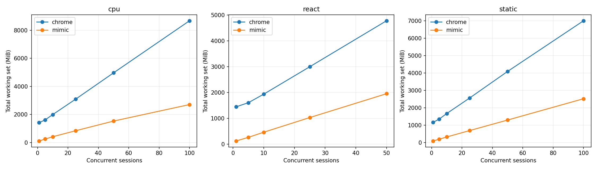
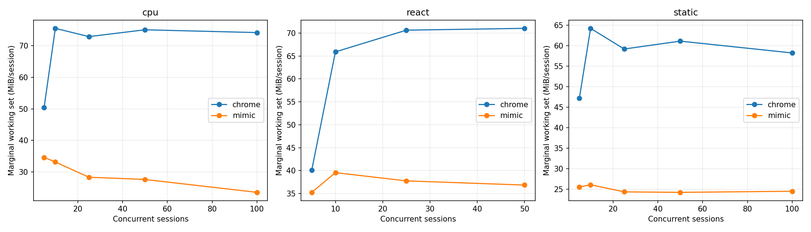
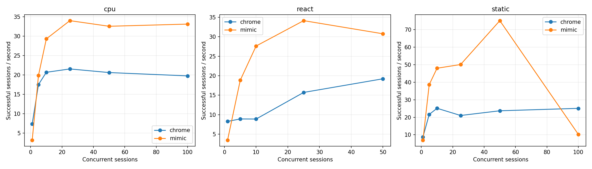
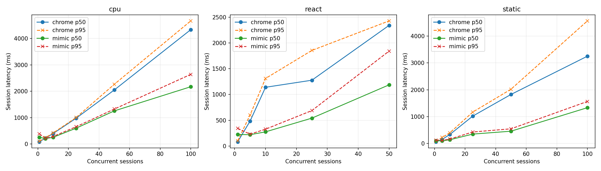
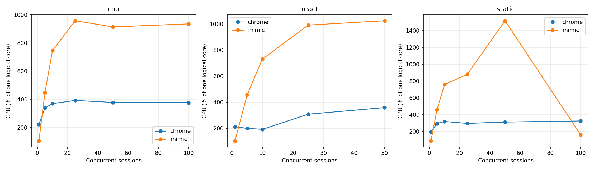

# Mimic V8 и Chrome 152: baseline Windows x64

Это измерение после исправления ошибок семантики, разрешённого пользователем. Оптимизации runtime ради производительности не выполнялись. Проверка исходной версии сохранена отдельно в `pre-fix/raw.json`.

## Окружение

| Параметр | Значение |
|---|---|
| Дата начала / конца | 2026-09-08T20:34:14.334999+04:00 / 2026-09-08T20:50:09.164730+04:00 |
| Chrome | {'protocolVersion': '1.3', 'product': 'Chrome/152.0.7977.82', 'revision': '@d04cdb24d67b081f6cf80200ffc5233f44b61109', 'userAgent': 'Mozilla/5.0 (Windows NT 10.0; Win64; x64) AppleWebKit/537.36 (KHTML, like Gecko) HeadlessChrome/152.0.0.0 Safari/537.36', 'jsVersion': '15.2.124.21'} |
| Chromium | 1669021 / d04cdb24d67b081f6cf80200ffc5233f44b61109 |
| Mimic commit | d69cff971c9aba22f28889ded904caff392ed8f1 |
| Mimic V8 | 15.2.124.1-rusty |
| OS | Windows-11-10.0.26200-SP0 |
| CPU | {"Name":"Intel(R) Core(TM) i7-14700KF","NumberOfCores":20,"NumberOfLogicalProcessors":28} |
| CPU physical / logical | 20 / 28 |
| RAM GiB | 31.83 |
| План питания | GUID схемы питания: 381b4222-f694-41f0-9685-ff5bb260df2e  (Сбалансированная) |
| Power overlay | 0 00000000-0000-0000-0000-000000000000 |
| Антивирус | {"displayName":"Windows Defender","productState":397568} |
| Chrome SHA-256 | ea36dd818a90176f1a70616f0363d9be527229389a6c073a0b1688b9e73f67e9 |
| Mimic SHA-256 | 967df4b8677f545b38ff9f5c74e7c607e0c6b7deadbc6fbceff0fda557461d68 |

Рабочая станция не была эксклюзивно выделена тесту: фоновые приложения и антивирус включены. Список процессов, версии инструментов, аргументы, SHA-256 фикстур и бинарников находятся в raw.json.

## Методика и корректность

В обеих системах создаётся новая страница и уникальный loopback-origin. HTTP cache отключён, ответы no-store; cookie не используются. Контексты, транспорт и процесс в warm сохраняются, состояние страницы не используется повторно. Это изоляция для данного контролируемого корпуса, а не проверка tenant/security isolation. Cold создаёт новый процесс и профиль. Кэш файлов Windows, DLL и DNS ОС не очищается; «cold» означает новый процесс, а не холодный диск. Вариант warm HTTP cache не измерялся.

Навигация заканчивается только при точном URL, document.readyState === "complete" и наличии __benchRun. Затем одинаковый явный запуск __benchRun; завершение — done и точное совпадение детерминированного результата. Settle = 0. Paint/networkidle не ожидаются. Chrome headless=new; результаты не переносятся автоматически на headful.

Внешние часы perf_counter/QPC; polling 5 ms плюс задержка CDP/планировщика ОС. navigation_ms включает разбор HTML и загрузку скриптов, execution_ms — запуск/выполнение приложения и обнаружение маркера. Они не являются изолированным временем JIT или чистого JavaScript. js_ms страницы диагностический: в Mimic виртуальное время часто равно нулю.

Процесс запускается приостановленным, включается в Windows Job Object, затем возобновляется. process_start_ms — вызов создания процесса; CDP readiness отсчитывается от начала создания до ответа протокола. runtime_initialization_ms — остаток между ними; внутренние фазы V8 отдельно не инструментированы. Cold total включает создание страницы, выполнение, teardown и завершение процесса; удаление временного профиля и обслуживание локального сервера не включены.

CPU — user+kernel всего Job Object, включая завершившихся потомков. Working set/private bytes — сумма всех текущих участников Job Object каждые 50 ms и в контрольных точках. Кратковременные пики памяти могут быть пропущены, общие страницы DLL могут учитываться несколько раз. CPU % задан относительно одного логического ядра; 100% машины = 2800%. Пики CPU чувствительны к дискретности счётчиков Windows.

Одна проверка и по одному первоначальному warmup на серию исключены явно. Основные серии: 10 cold и 20 warm, без удаления медленных наблюдений. p95 публикуется при n≥10, p99 при n≥100; используется линейная интерполяция эмпирических квантилей, хвосты при n=10–20 особенно неустойчивы. SD и CV, min/max всех серий доступны в summary.csv. Ускорение не агрегируется в одно отношение.

| Система / workload | Correctness gate |
|---|---|
| chrome/async | VALID |
| chrome/cpu | VALID |
| chrome/dom | VALID |
| chrome/react | VALID |
| chrome/static | VALID |
| chrome/wasm | VALID |
| mimic/async | VALID |
| mimic/cpu | VALID |
| mimic/dom | VALID |
| mimic/react | VALID |
| mimic/static | VALID |
| mimic/wasm | VALID |

### CDP readiness: отдельная серия с одинаковой пробой

В финальной серии обе системы отвечают на Target.getTargets после WebSocket handshake. По 10 новых процессов, порядок систем чередуется; warmup исключён. Дата: 2026-09-08T20:49:28.570744+04:00. Основная серия использует ту же общую пробу.

| Система | n | CDP p50 ms | p95 | Min | Max | SD | Ready RSS MiB |
|---|---|---|---|---|---|---|---|
| mimic | 10 | 231.84 | 243.46 | 220.24 | 244.26 | 8.83 | 24.41 |
| chrome | 10 | 337.09 | 392.66 | 230.45 | 399.86 | 53.44 | 381.87 |

## Cold startup (медианы, ms)

| Система | Workload | n | Process create | CDP ready | Runtime init | Cold total | Shutdown |
|---|---|---|---|---|---|---|---|
| chrome | static | 10 | 6.61 | 291.70 | 285.17 | 504.19 | 114.92 |
| mimic | static | 10 | 6.15 | 215.19 | 208.86 | 430.71 | 55.10 |
| mimic | cpu | 10 | 5.95 | 214.94 | 208.97 | 475.99 | 55.31 |
| chrome | cpu | 10 | 6.21 | 274.96 | 268.86 | 498.08 | 107.43 |
| chrome | dom | 10 | 5.98 | 266.99 | 261.06 | 460.30 | 108.09 |
| mimic | dom | 10 | 6.13 | 215.53 | 208.93 | 588.27 | 56.58 |
| mimic | async | 10 | 5.97 | 224.30 | 218.42 | 483.03 | 56.71 |
| chrome | async | 10 | 6.52 | 278.28 | 271.32 | 488.70 | 107.89 |
| chrome | react | 10 | 6.21 | 287.70 | 280.69 | 505.03 | 108.24 |
| mimic | react | 10 | 6.62 | 221.82 | 210.45 | 509.51 | 60.85 |
| mimic | wasm | 10 | 8.17 | 217.72 | 209.85 | 458.21 | 61.08 |
| chrome | wasm | 10 | 8.18 | 302.22 | 293.72 | 507.58 | 116.28 |

## Warm session startup / teardown (медианы)

| Система | Workload | n | Create ms | Teardown ms | RSS после teardown MiB |
|---|---|---|---|---|---|
| chrome | static | 20 | 26.68 | 9.97 | 1180.77 |
| mimic | static | 20 | 2.24 | 3.37 | 77.38 |
| mimic | cpu | 20 | 12.29 | 4.01 | 80.19 |
| chrome | cpu | 20 | 27.49 | 10.47 | 1411.31 |
| chrome | dom | 20 | 24.98 | 9.73 | 1369.64 |
| mimic | dom | 20 | 2.12 | 4.46 | 153.75 |
| mimic | async | 20 | 11.91 | 3.35 | 85.07 |
| chrome | async | 20 | 29.53 | 9.97 | 1250.03 |
| chrome | react | 20 | 39.13 | 13.99 | 1406.18 |
| mimic | react | 20 | 14.04 | 6.68 | 99.47 |
| mimic | wasm | 20 | 2.86 | 4.51 | 78.36 |
| chrome | wasm | 20 | 43.32 | 15.13 | 1274.62 |

## Single-session workload latency (ms)

| Система | Workload | Mode | n | Nav p50 | Execution p50 | Completion p50 | p95 | Min | Max | SD | CV |
|---|---|---|---|---|---|---|---|---|---|---|---|
| chrome | static | cold | 10 | 24.95 | 2.65 | 27.51 | 31.24 | 22.56 | 31.89 | 2.91 | 0.11 |
| mimic | static | cold | 10 | 146.58 | 1.12 | 147.79 | 149.13 | 143.22 | 149.46 | 2.10 | 0.01 |
| chrome | static | warm | 20 | 17.32 | 3.60 | 20.93 | 22.97 | 18.25 | 23.27 | 1.30 | 0.06 |
| mimic | static | warm | 20 | 53.10 | 1.04 | 54.22 | 56.73 | 52.89 | 58.95 | 1.33 | 0.02 |
| mimic | cpu | cold | 10 | 144.06 | 47.81 | 192.08 | 196.05 | 189.68 | 197.94 | 2.44 | 0.01 |
| chrome | cpu | cold | 10 | 22.58 | 30.48 | 53.02 | — | 49.64 | 61.36 | 3.60 | 0.07 |
| mimic | cpu | warm | 20 | 53.53 | 45.38 | 98.79 | 101.51 | 95.66 | 101.76 | 1.42 | 0.01 |
| chrome | cpu | warm | 20 | 18.10 | 29.57 | 47.57 | 51.58 | 43.47 | 55.30 | 2.95 | 0.06 |
| chrome | dom | cold | 10 | 23.58 | 12.06 | 35.24 | 44.85 | 32.43 | 49.11 | 4.78 | 0.13 |
| mimic | dom | cold | 10 | 146.78 | 153.71 | 299.81 | 303.61 | 296.69 | 303.69 | 2.35 | 0.01 |
| chrome | dom | warm | 20 | 16.93 | 31.08 | 48.09 | 54.09 | 45.33 | 63.49 | 4.16 | 0.08 |
| mimic | dom | warm | 20 | 54.08 | 153.50 | 207.32 | 222.00 | 202.87 | 234.85 | 7.48 | 0.04 |
| mimic | async | cold | 10 | 147.15 | 45.18 | 192.12 | 193.12 | 191.01 | 193.27 | 0.78 | 0.00 |
| chrome | async | cold | 10 | 22.03 | 26.38 | 48.87 | 198.85 | 47.05 | 316.49 | 84.49 | 1.11 |
| mimic | async | warm | 20 | 53.98 | 48.37 | 102.03 | 105.91 | 97.62 | 131.99 | 7.33 | 0.07 |
| chrome | async | warm | 20 | 16.95 | 27.67 | 44.63 | 49.14 | 38.66 | 50.99 | 2.67 | 0.06 |
| chrome | react | cold | 10 | 25.61 | 16.82 | 44.47 | 56.39 | 35.53 | 60.07 | 7.53 | 0.17 |
| mimic | react | cold | 10 | 158.39 | 42.37 | 203.35 | 213.28 | 195.13 | 215.20 | 6.51 | 0.03 |
| chrome | react | warm | 20 | 24.78 | 24.79 | 48.52 | 60.52 | 36.43 | 62.44 | 5.72 | 0.12 |
| mimic | react | warm | 20 | 106.17 | 87.83 | 194.87 | 223.62 | 105.36 | 224.00 | 40.58 | 0.23 |
| mimic | wasm | cold | 10 | 151.98 | 9.20 | 161.59 | 188.89 | 155.56 | 207.46 | 14.96 | 0.09 |
| chrome | wasm | cold | 10 | 27.83 | 6.23 | 33.41 | 74.59 | 29.04 | 106.37 | 23.44 | 0.59 |
| mimic | wasm | warm | 20 | 64.49 | 9.28 | 73.88 | 83.68 | 63.88 | 88.69 | 6.01 | 0.08 |
| chrome | wasm | warm | 20 | 24.20 | 5.60 | 30.10 | 37.07 | 21.51 | 38.71 | 4.38 | 0.15 |

## Single-session память / CPU (медианы)

| Система | Workload | Mode | До страницы MiB | После create MiB | Peak RSS MiB | Peak private MiB | CPU/session ms | CPU/workload ms |
|---|---|---|---|---|---|---|---|---|
| chrome | static | cold | 386.45 | 430.81 | 482.50 | 250.72 | 320.31 | 125.00 |
| mimic | static | cold | 24.60 | 24.74 | 94.22 | 127.28 | 171.88 | 164.06 |
| chrome | static | warm | 1121.56 | 1160.03 | 1180.77 | 589.18 | 148.44 | 46.88 |
| mimic | static | warm | 76.52 | 76.56 | 99.92 | 132.43 | 78.12 | 78.12 |
| mimic | cpu | cold | 24.32 | 24.55 | 104.88 | 138.00 | 281.25 | 265.62 |
| chrome | cpu | cold | 381.09 | 433.46 | 521.33 | 276.78 | 390.62 | 187.50 |
| mimic | cpu | warm | 79.16 | 79.22 | 113.81 | 148.11 | 125.00 | 125.00 |
| chrome | cpu | warm | 1332.93 | 1373.63 | 1411.31 | 783.71 | 226.56 | 109.38 |
| chrome | dom | cold | 375.18 | 425.34 | 480.42 | 256.12 | 328.12 | 140.62 |
| mimic | dom | cold | 24.34 | 24.50 | 119.98 | 154.01 | 367.19 | 367.19 |
| chrome | dom | warm | 1285.20 | 1318.68 | 1369.64 | 721.09 | 242.19 | 132.81 |
| mimic | dom | warm | 147.48 | 147.48 | 189.94 | 224.08 | 265.62 | 265.62 |
| mimic | async | cold | 24.31 | 24.52 | 97.90 | 130.67 | 195.31 | 195.31 |
| chrome | async | cold | 377.25 | 426.56 | 493.57 | 259.41 | 382.81 | 179.69 |
| mimic | async | warm | 84.18 | 84.18 | 114.19 | 147.59 | 117.19 | 109.38 |
| chrome | async | warm | 1185.56 | 1226.48 | 1250.18 | 628.25 | 179.69 | 85.94 |
| chrome | react | cold | 382.69 | 434.65 | 513.59 | 274.28 | 390.62 | 195.31 |
| mimic | react | cold | 24.40 | 24.54 | 104.31 | 137.28 | 257.81 | 257.81 |
| chrome | react | warm | 1324.54 | 1372.35 | 1406.18 | 789.91 | 257.81 | 109.38 |
| mimic | react | warm | 97.34 | 97.35 | 127.92 | 162.78 | 242.19 | 234.38 |
| mimic | wasm | cold | 24.28 | 24.52 | 94.99 | 127.44 | 195.31 | 187.50 |
| chrome | wasm | cold | 377.95 | 431.73 | 487.51 | 254.30 | 398.44 | 179.69 |
| mimic | wasm | warm | 77.52 | 77.55 | 100.98 | 133.56 | 109.38 | 109.38 |
| chrome | wasm | warm | 1206.82 | 1255.40 | 1274.62 | 633.31 | 187.50 | 78.12 |

## Concurrency / density

Каждый уровень — отдельный процесс; один исключённый warmup и max(5, ceil(20/N)) измеряемых волн. Страницы создаются параллельно; после барьера все начинают навигацию. Завершившиеся страницы удерживаются до окончания волны для одновременного RSS. Throughput = успешные сессии / время create→последний teardown, включая барьер и измерения, но без HTTP-server setup/cleanup. Latency = create→completion, включая ожидание барьера. Это batch throughput, не оптимизированный постоянный поток запросов. Удержание не добавляется в latency, но входит в throughput. CPU на сессию = CPU всей волны / число успехов; пересекающиеся интервалы CPU отдельных страниц не суммируются.

Пределы остановки: любая ошибка, <15% либо <2 GiB доступной RAM, >1024 pages input/s в течение 3 s, timeout 180 s. Это защита рабочей машины; максимум прошедшего уровня — нижняя граница поддержанной здесь ёмкости, не доказательство абсолютного максимума.

Mimic сериализует команды CDP общим mutex. Измерение включает это поведение; профилирование причин затрат не проводилось. В строках с остановкой RSS может быть снят раньше завершения всех страниц, а число волн 0 означает остановку на исключаемом warmup. Такие строки диагностические и не входят в fit/графики стабильных уровней. Между волнами дополнительно выполняются 250 ms recovery, очистка серверов и запись checkpoint вне batch throughput.

| Система | Workload | N | Волн | Успех % | RSS MiB | RSS/N MiB | Peak MiB | CPU/session ms | Сессий/s | p50 ms | p95 ms | p99 ms | Стоп |
|---|---|---|---|---|---|---|---|---|---|---|---|---|---|
| chrome | static | 1 | 20 | 100.00 | 1170.44 | 1170.44 | 1179.43 | 225.00 | 8.67 | 64.66 | 81.15 | — |  |
| mimic | static | 1 | 20 | 100.00 | 100.63 | 100.63 | 106.92 | 127.34 | 6.97 | 104.86 | 125.21 | — |  |
| chrome | static | 5 | 5 | 100.00 | 1359.31 | 271.86 | 1392.96 | 136.88 | 21.62 | 153.41 | 226.03 | — |  |
| mimic | static | 5 | 5 | 100.00 | 202.77 | 40.55 | 206.32 | 119.38 | 38.60 | 98.07 | 115.76 | — |  |
| chrome | static | 10 | 5 | 100.00 | 1680.55 | 168.06 | 1691.61 | 127.19 | 25.13 | 334.56 | 398.18 | — |  |
| mimic | static | 10 | 5 | 100.00 | 333.20 | 33.32 | 346.88 | 158.12 | 47.97 | 140.07 | 166.38 | — |  |
| chrome | static | 25 | 5 | 100.00 | 2568.61 | 102.74 | 2581.87 | 141.25 | 21.02 | 1019.74 | 1169.08 | 1173.26 |  |
| mimic | static | 25 | 5 | 100.00 | 698.29 | 27.93 | 736.26 | 175.50 | 50.08 | 350.84 | 428.58 | 434.83 |  |
| chrome | static | 50 | 5 | 100.00 | 4096.80 | 81.94 | 4113.78 | 132.00 | 23.70 | 1825.18 | 2019.20 | 2025.29 |  |
| mimic | static | 50 | 5 | 100.00 | 1303.88 | 26.08 | 1387.41 | 201.81 | 75.11 | 458.39 | 547.02 | 578.67 |  |
| chrome | static | 100 | 5 | 100.00 | 7009.06 | 70.09 | 7032.65 | 130.00 | 25.09 | 3249.61 | 4562.24 | 4605.83 |  |
| mimic | static | 100 | 5 | 100.00 | 2528.61 | 25.29 | 2556.28 | 159.06 | 10.28 | 1333.69 | 1565.23 | 1608.77 |  |
| chrome | cpu | 1 | 20 | 100.00 | 1415.84 | 1415.84 | 1428.06 | 300.78 | 7.41 | 86.40 | 107.18 | — |  |
| mimic | cpu | 1 | 20 | 100.00 | 112.44 | 112.44 | 121.77 | 324.22 | 3.22 | 255.41 | 384.99 | — |  |
| chrome | cpu | 5 | 5 | 100.00 | 1617.57 | 323.51 | 1628.63 | 193.12 | 17.52 | 227.17 | 242.66 | — |  |
| mimic | cpu | 5 | 5 | 100.00 | 250.86 | 50.17 | 270.61 | 225.62 | 19.88 | 206.88 | 218.49 | — |  |
| chrome | cpu | 10 | 5 | 100.00 | 1995.30 | 199.53 | 2001.31 | 178.75 | 20.68 | 400.14 | 420.88 | — |  |
| mimic | cpu | 10 | 5 | 100.00 | 416.60 | 41.66 | 458.15 | 255.00 | 29.28 | 257.01 | 288.53 | — |  |
| chrome | cpu | 25 | 5 | 100.00 | 3089.12 | 123.56 | 3111.55 | 181.88 | 21.54 | 977.92 | 1004.24 | 1007.92 |  |
| mimic | cpu | 25 | 5 | 100.00 | 841.22 | 33.65 | 946.72 | 281.88 | 33.97 | 601.16 | 655.31 | 666.98 |  |
| chrome | cpu | 50 | 5 | 100.00 | 4966.27 | 99.33 | 4979.23 | 183.44 | 20.61 | 2049.38 | 2264.60 | 2278.93 |  |
| mimic | cpu | 50 | 5 | 100.00 | 1531.27 | 30.63 | 1735.39 | 281.00 | 32.52 | 1256.67 | 1325.65 | 1366.69 |  |
| chrome | cpu | 100 | 5 | 100.00 | 8676.45 | 86.76 | 8714.56 | 190.47 | 19.76 | 4333.62 | 4665.67 | 4700.58 |  |
| mimic | cpu | 100 | 5 | 100.00 | 2706.71 | 27.07 | 2880.00 | 282.75 | 33.09 | 2171.41 | 2640.03 | 2689.22 |  |
| chrome | react | 1 | 20 | 100.00 | 1447.62 | 1447.62 | 1457.09 | 257.81 | 8.27 | 81.75 | 100.95 | — |  |
| mimic | react | 1 | 20 | 100.00 | 128.49 | 128.49 | 149.63 | 301.56 | 3.46 | 224.10 | 341.67 | — |  |
| chrome | react | 5 | 5 | 100.00 | 1608.03 | 321.61 | 1613.96 | 225.62 | 8.90 | 482.58 | 601.68 | — |  |
| mimic | react | 5 | 5 | 100.00 | 269.54 | 53.91 | 288.88 | 242.50 | 18.84 | 219.32 | 229.41 | — |  |
| chrome | react | 10 | 5 | 100.00 | 1937.54 | 193.75 | 1963.09 | 217.81 | 8.88 | 1139.66 | 1310.81 | — |  |
| mimic | react | 10 | 5 | 100.00 | 467.35 | 46.74 | 508.15 | 264.69 | 27.63 | 274.42 | 326.21 | — |  |
| chrome | react | 25 | 5 | 100.00 | 2997.05 | 119.88 | 3001.25 | 196.75 | 15.71 | 1276.73 | 1855.13 | 1857.71 |  |
| mimic | react | 25 | 5 | 100.00 | 1033.86 | 41.35 | 1085.39 | 290.38 | 34.15 | 540.56 | 687.14 | 692.63 |  |
| chrome | react | 50 | 5 | 100.00 | 4772.89 | 95.46 | 4785.00 | 187.19 | 19.22 | 2341.56 | 2428.36 | 2434.53 |  |
| mimic | react | 50 | 5 | 100.00 | 1955.21 | 39.10 | 2079.02 | 333.00 | 30.78 | 1186.84 | 1842.45 | 1874.34 |  |
| chrome | react | 100 | 0 | 0.00 | 5316.59 | 53.17 | 5406.95 | — | 0.00 | 5667.87 | 8532.86 | 8782.59 | sustained paging (>1024 pages/s for 3 seconds) |
| mimic | react | 100 | 0 | 99.00 | 3042.31 | 30.42 | 3042.31 | 379.26 | 7.25 | 3449.32 | 4007.11 | 4137.95 | sustained paging (>1024 pages/s for 3 seconds) |

## Marginal RAM/session

Измерена конечная разность между соседними протестированными N, делённая на ΔN; это не прямое измерение каждого N→N+1. Линейная модель — описательный OLS fit по медианам только успешных уровней. Пересечение — экстраполяция; реальный startup overhead включает исходную пустую страницу. Общий RSS включает процессы и кэши, оставшиеся от предыдущих волн, а число волн зависит от N. Поэтому fit смешивает стоимость активных страниц с историей процесса. Дополнительно показан прирост RSS относительно начала той же волны: он тоже может включать фоновую активность и GC.

| Система | Workload | N | (Active RSS − before wave RSS)/N MiB |
|---|---|---|---|
| chrome | static | 1 | 58.26 |
| mimic | static | 1 | 23.20 |
| chrome | static | 5 | 57.69 |
| mimic | static | 5 | 22.89 |
| chrome | static | 10 | 54.48 |
| mimic | static | 10 | 23.11 |
| chrome | static | 25 | 56.65 |
| mimic | static | 25 | 22.67 |
| chrome | static | 50 | 57.71 |
| mimic | static | 50 | 23.08 |
| chrome | static | 100 | 57.84 |
| mimic | static | 100 | 22.99 |
| chrome | cpu | 1 | 78.10 |
| mimic | cpu | 1 | 32.09 |
| chrome | cpu | 5 | 67.52 |
| mimic | cpu | 5 | 32.49 |
| chrome | cpu | 10 | 69.81 |
| mimic | cpu | 10 | 31.56 |
| chrome | cpu | 25 | 71.56 |
| mimic | cpu | 25 | 28.77 |
| chrome | cpu | 50 | 72.43 |
| mimic | cpu | 50 | 27.08 |
| chrome | cpu | 100 | 72.82 |
| mimic | cpu | 100 | 24.52 |
| chrome | react | 1 | 80.50 |
| mimic | react | 1 | 29.80 |
| chrome | react | 5 | 64.77 |
| mimic | react | 5 | 29.21 |
| chrome | react | 10 | 67.16 |
| mimic | react | 10 | 29.71 |
| chrome | react | 25 | 68.23 |
| mimic | react | 25 | 28.55 |
| chrome | react | 50 | 68.97 |
| mimic | react | 50 | 28.94 |
| chrome | react | 100 | 48.47 |
| mimic | react | 100 | 30.18 |

| Система | Workload | N low→high | ΔRSS MiB | ΔRSS/ΔN MiB |
|---|---|---|---|---|
| chrome | cpu | 1→5 | 201.74 | 50.43 |
| chrome | cpu | 5→10 | 377.73 | 75.55 |
| chrome | cpu | 10→25 | 1093.82 | 72.92 |
| chrome | cpu | 25→50 | 1877.14 | 75.09 |
| chrome | cpu | 50→100 | 3710.18 | 74.20 |
| mimic | cpu | 1→5 | 138.42 | 34.61 |
| mimic | cpu | 5→10 | 165.74 | 33.15 |
| mimic | cpu | 10→25 | 424.62 | 28.31 |
| mimic | cpu | 25→50 | 690.05 | 27.60 |
| mimic | cpu | 50→100 | 1175.44 | 23.51 |
| chrome | react | 1→5 | 160.41 | 40.10 |
| chrome | react | 5→10 | 329.51 | 65.90 |
| chrome | react | 10→25 | 1059.52 | 70.63 |
| chrome | react | 25→50 | 1775.83 | 71.03 |
| mimic | react | 1→5 | 141.05 | 35.26 |
| mimic | react | 5→10 | 197.81 | 39.56 |
| mimic | react | 10→25 | 566.51 | 37.77 |
| mimic | react | 25→50 | 921.35 | 36.85 |
| chrome | static | 1→5 | 188.87 | 47.22 |
| chrome | static | 5→10 | 321.24 | 64.25 |
| chrome | static | 10→25 | 888.05 | 59.20 |
| chrome | static | 25→50 | 1528.19 | 61.13 |
| chrome | static | 50→100 | 2912.26 | 58.25 |
| mimic | static | 1→5 | 102.14 | 25.54 |
| mimic | static | 5→10 | 130.43 | 26.09 |
| mimic | static | 10→25 | 365.10 | 24.34 |
| mimic | static | 25→50 | 605.59 | 24.22 |
| mimic | static | 50→100 | 1224.73 | 24.49 |

| Система | Workload | Fixed fit MiB | Marginal fit MiB | R² | Max stable N |
|---|---|---|---|---|---|
| chrome | cpu | 1274.24 | 73.90 | 1.00 | 100 |
| mimic | cpu | 145.12 | 26.12 | 1.00 | 100 |
| chrome | react | 1295.65 | 69.06 | 1.00 | 50 |
| mimic | react | 90.66 | 37.38 | 1.00 | 50 |
| chrome | static | 1092.32 | 59.32 | 1.00 | 100 |
| mimic | static | 82.30 | 24.47 | 1.00 | 100 |

## Teardown / recovery

| Система | Workload | N | Ready RSS MiB | RSS после волн MiB | CPU всей серии s | CPU % |
|---|---|---|---|---|---|---|
| chrome | static | 1 | 381.43 | 1115.23 | 4.50 | 195.07 |
| mimic | static | 1 | 24.84 | 78.08 | 2.55 | 88.73 |
| chrome | static | 5 | 370.83 | 1123.66 | 3.42 | 295.86 |
| mimic | static | 5 | 24.82 | 90.66 | 2.98 | 460.76 |
| chrome | static | 10 | 379.78 | 1142.77 | 6.36 | 319.66 |
| mimic | static | 10 | 24.80 | 101.46 | 7.91 | 758.50 |
| chrome | static | 25 | 377.12 | 1152.31 | 17.66 | 296.87 |
| mimic | static | 25 | 24.21 | 132.54 | 21.94 | 878.99 |
| chrome | static | 50 | 387.99 | 1223.71 | 33.00 | 312.86 |
| mimic | static | 50 | 24.29 | 175.18 | 50.45 | 1515.80 |
| chrome | static | 100 | 376.89 | 1239.39 | 65.00 | 326.15 |
| mimic | static | 100 | 24.36 | 245.39 | 79.53 | 163.58 |
| chrome | cpu | 1 | 385.34 | 1340.50 | 6.02 | 222.92 |
| mimic | cpu | 1 | 24.45 | 80.99 | 6.48 | 104.55 |
| chrome | cpu | 5 | 375.44 | 1289.40 | 4.83 | 338.38 |
| mimic | cpu | 5 | 24.31 | 89.56 | 5.64 | 448.46 |
| chrome | cpu | 10 | 378.28 | 1296.17 | 8.94 | 369.63 |
| mimic | cpu | 10 | 24.38 | 103.51 | 12.75 | 746.70 |
| chrome | cpu | 25 | 375.69 | 1307.79 | 22.73 | 391.81 |
| mimic | cpu | 25 | 24.33 | 145.45 | 35.23 | 957.58 |
| chrome | cpu | 50 | 377.76 | 1347.19 | 45.86 | 378.11 |
| mimic | cpu | 50 | 24.21 | 177.15 | 70.25 | 913.90 |
| chrome | cpu | 100 | 375.00 | 1400.72 | 95.23 | 376.29 |
| mimic | cpu | 100 | 24.93 | 284.61 | 141.38 | 935.50 |
| chrome | react | 1 | 391.88 | 1369.84 | 5.16 | 213.21 |
| mimic | react | 1 | 24.38 | 99.93 | 6.03 | 104.28 |
| chrome | react | 5 | 386.63 | 1288.68 | 5.64 | 200.71 |
| mimic | react | 5 | 24.27 | 131.29 | 6.06 | 456.78 |
| chrome | react | 10 | 381.85 | 1277.74 | 10.89 | 193.33 |
| mimic | react | 10 | 24.45 | 181.72 | 13.23 | 731.42 |
| chrome | react | 25 | 375.34 | 1290.14 | 24.59 | 309.11 |
| mimic | react | 25 | 24.35 | 366.18 | 36.30 | 991.67 |
| chrome | react | 50 | 387.91 | 1334.77 | 46.80 | 359.71 |
| mimic | react | 50 | 24.37 | 606.65 | 83.25 | 1024.82 |
| chrome | react | 100 | 403.30 | 4807.05 | 16.42 | 184.01 |
| mimic | react | 100 | 24.39 | 411.96 | 37.55 | 275.12 |

## Локальный сервер (измеряется независимо)

Время обработчика HTTP — от получения запроса обработчиком до завершения записи ответа; не включает очередь TCP/планировщика сервера или сетевой roundtrip. До основного workload сервер создаётся вне измеряемого интервала. Запросы и bytes каждого ресурса записаны в raw.json.

| Система | Workload | Mode | Запросов | Server p50 ms | Server p95 ms | Server max ms |
|---|---|---|---|---|---|---|
| chrome | static | cold | 20 | 0.23 | 0.44 | 0.52 |
| mimic | static | cold | 20 | 0.18 | 0.24 | 0.28 |
| chrome | static | warm | 40 | 0.20 | 0.32 | 0.36 |
| mimic | static | warm | 40 | 0.19 | 0.25 | 0.29 |
| mimic | cpu | cold | 20 | 0.14 | 0.25 | 0.44 |
| chrome | cpu | cold | 18 | 0.24 | 0.35 | 0.42 |
| mimic | cpu | warm | 40 | 0.17 | 0.24 | 0.24 |
| chrome | cpu | warm | 40 | 0.19 | 0.36 | 0.38 |
| chrome | dom | cold | 20 | 0.19 | 0.34 | 0.46 |
| mimic | dom | cold | 20 | 0.14 | 0.23 | 0.23 |
| chrome | dom | warm | 40 | 0.23 | 0.39 | 0.79 |
| mimic | dom | warm | 40 | 0.19 | 0.26 | 0.30 |
| mimic | async | cold | 50 | 0.08 | 0.24 | 0.33 |
| chrome | async | cold | 50 | 0.12 | 0.34 | 0.41 |
| mimic | async | warm | 100 | 0.08 | 0.23 | 0.49 |
| chrome | async | warm | 100 | 0.11 | 0.30 | 0.45 |
| chrome | react | cold | 50 | 0.33 | 0.88 | 0.98 |
| mimic | react | cold | 50 | 0.26 | 0.93 | 3.18 |
| chrome | react | warm | 100 | 0.36 | 0.91 | 1.89 |
| mimic | react | warm | 100 | 0.32 | 0.49 | 0.59 |
| mimic | wasm | cold | 20 | 0.22 | 1.04 | 1.20 |
| chrome | wasm | cold | 20 | 0.34 | 0.49 | 0.54 |
| mimic | wasm | warm | 40 | 0.19 | 0.47 | 0.57 |
| chrome | wasm | warm | 40 | 0.31 | 0.49 | 0.60 |

## Валидность измеряемых серий

| Система | Workload | Mode | Успех / попыток | Использование сравнения |
|---|---|---|---|---|
| chrome | static | cold | 10/10 | VALID |
| mimic | static | cold | 10/10 | VALID |
| chrome | static | warm | 20/20 | VALID |
| mimic | static | warm | 20/20 | VALID |
| mimic | cpu | cold | 10/10 | VALID |
| chrome | cpu | cold | 9/10 | INVALID — error or semantic mismatch; no speed claim |
| mimic | cpu | warm | 20/20 | VALID |
| chrome | cpu | warm | 20/20 | VALID |
| chrome | dom | cold | 10/10 | VALID |
| mimic | dom | cold | 10/10 | VALID |
| chrome | dom | warm | 20/20 | VALID |
| mimic | dom | warm | 20/20 | VALID |
| mimic | async | cold | 10/10 | VALID |
| chrome | async | cold | 10/10 | VALID |
| mimic | async | warm | 20/20 | VALID |
| chrome | async | warm | 20/20 | VALID |
| chrome | react | cold | 10/10 | VALID |
| mimic | react | cold | 10/10 | VALID |
| chrome | react | warm | 20/20 | VALID |
| mimic | react | warm | 20/20 | VALID |
| mimic | wasm | cold | 10/10 | VALID |
| chrome | wasm | cold | 10/10 | VALID |
| mimic | wasm | warm | 20/20 | VALID |
| chrome | wasm | warm | 20/20 | VALID |

## Инженерный вывод

1. По медиане warm navigation→completion Mimic быстрее: ни на одной из измеренных нагрузок. CDP readiness (общая проба, отдельные cold): mimic 231.84 ms; chrome 337.09 ms

2. Chrome быстрее по той же метрике: async (102.03 / 44.63 ms Mimic/Chrome); cpu (98.79 / 47.57 ms Mimic/Chrome); dom (207.32 / 48.09 ms Mimic/Chrome); react (194.87 / 48.52 ms Mimic/Chrome); static (54.22 / 20.93 ms Mimic/Chrome); wasm (73.88 / 30.10 ms Mimic/Chrome).

3. Фиксированный overhead процесса (CDP ready, включая исходную страницу): mimic 24.36 MiB; chrome 386.42 MiB. Startup latency и OLS intercept приведены отдельно выше.

4. Оценки marginal RAM/session: chrome/cpu 73.90 MiB; mimic/cpu 26.12 MiB; chrome/react 69.06 MiB; mimic/react 37.38 MiB; chrome/static 59.32 MiB; mimic/static 24.47 MiB.

5. Максимальный стабильный N по нагрузке: mimic/cpu 100; chrome/cpu 100; mimic/react 50; chrome/react 50; mimic/static 100; chrome/static 100.

6. Throughput на максимальном общем стабильном уровне:

cpu, N=100: Mimic 33.09 и Chrome 19.76 успешных сессий/s; RSS 2706.71 и 8676.45 MiB; CPU/session 282.75 и 190.47 ms.

react, N=50: Mimic 30.78 и Chrome 19.22 успешных сессий/s; RSS 1955.21 и 4772.89 MiB; CPU/session 333.00 и 187.19 ms.

static, N=100: Mimic 10.28 и Chrome 25.09 успешных сессий/s; RSS 2528.61 и 7009.06 MiB; CPU/session 159.06 и 130.00 ms.

7. Невалидные сравнения после исправлений: нет на correctness gate; ошибки отдельных итераций остаются в raw.json. До исправлений: DOM, async, React, WebAssembly (см. pre-fix).

8. Ограничения: одна занятая рабочая станция; headless Chrome; различные сборки V8; HTTP cache отключён; ограниченные размеры и семантические проверки корпуса; React-фикстура синтетическая, не Next.js/production-приложение. Polling и sampler входят в нагрузку системы. RSS — сумма рабочих наборов, не уникальная физическая RAM; нет финансовой модели стоимости сессии. Paging — общесистемный счётчик, не атрибуция hard faults конкретному процессу. Значения виртуальных часов Mimic не используются для сравнений.

9. Наиболее сильная защищаемая формулировка для README: «На Windows x64 локальные контролируемые нагрузки прошли проверку результатов в Mimic V8 и Chrome 152.0.7977.82; опубликованы воспроизводимый harness, исходные наблюдения и отдельные показатели latency, CPU и памяти. cpu, N=100: Mimic 33.09 и Chrome 19.76 успешных сессий/s; RSS 2706.71 и 8676.45 MiB; CPU/session 282.75 и 190.47 ms.»

10. Данные НЕ подтверждают утверждение «Mimic в X раз быстрее Chrome вообще», полную совместимость с браузером, безопасность изоляции tenants, преимущество чистого V8/JIT, выигрыш на произвольных сайтах или денежную экономию без модели эксплуатации.
