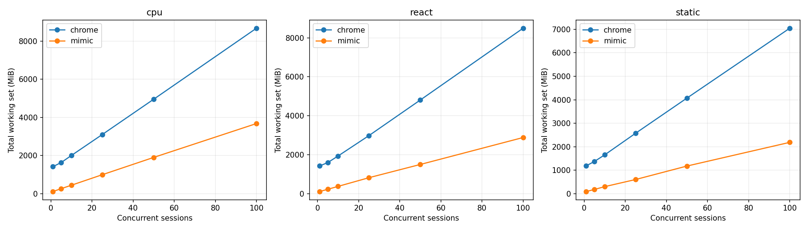
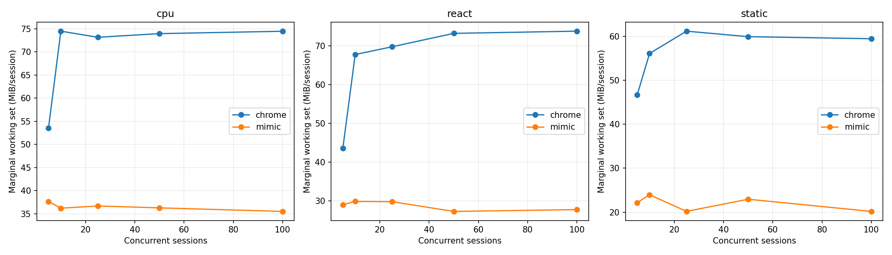
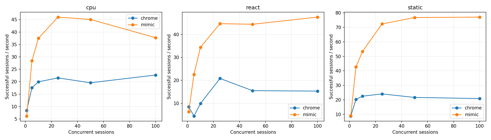
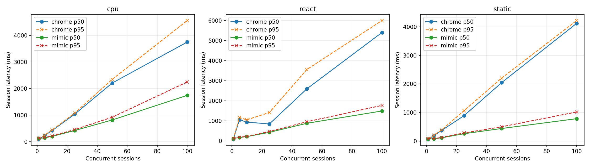
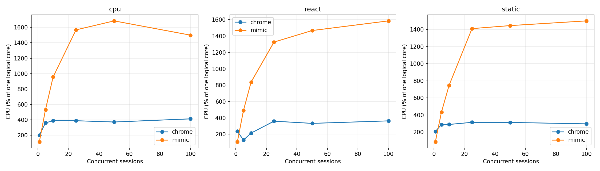

# Mimic V8 и Chrome 152: baseline Windows x64

Это измерение после исправления ошибок семантики, разрешённого пользователем. Оптимизации runtime ради производительности не выполнялись. Проверка исходной версии сохранена отдельно в `pre-fix/raw.json`.

## Окружение

| Параметр | Значение |
|---|---|
| Дата начала / конца | 2026-09-08T21:58:08.492475+04:00 / 2026-09-08T22:12:49.944391+04:00 |
| Chrome | {'protocolVersion': '1.3', 'product': 'Chrome/152.0.7977.82', 'revision': '@d04cdb24d67b081f6cf80200ffc5233f44b61109', 'userAgent': 'Mozilla/5.0 (Windows NT 10.0; Win64; x64) AppleWebKit/537.36 (KHTML, like Gecko) HeadlessChrome/152.0.0.0 Safari/537.36', 'jsVersion': '15.2.124.21'} |
| Chromium | 1669021 / d04cdb24d67b081f6cf80200ffc5233f44b61109 |
| Mimic commit | 082a22657dd7117affcb4fa3ab8b57a9c7b04359 |
| Mimic V8 | 15.2.124.1-rusty |
| OS | Windows-11-10.0.26200-SP0 |
| CPU | {"Name":"Intel(R) Core(TM) i7-14700KF","NumberOfCores":20,"NumberOfLogicalProcessors":28} |
| CPU physical / logical | 20 / 28 |
| RAM GiB | 31.83 |
| План питания | GUID схемы питания: 381b4222-f694-41f0-9685-ff5bb260df2e  (Сбалансированная) |
| Power overlay | 0 00000000-0000-0000-0000-000000000000 |
| Антивирус | {"displayName":"Windows Defender","productState":397568} |
| Chrome SHA-256 | ea36dd818a90176f1a70616f0363d9be527229389a6c073a0b1688b9e73f67e9 |
| Mimic SHA-256 | 3d5c896c4f710e93ab876a40f46b49c6ac3b6ac85246e192907e02dc9e708a46 |

Рабочая станция не была эксклюзивно выделена тесту: фоновые приложения и антивирус включены. Список процессов, версии инструментов, аргументы, SHA-256 фикстур и бинарников находятся в raw.json.

## Методика и корректность

В обеих системах создаётся новая страница и уникальный loopback-origin. HTTP cache отключён, ответы no-store; cookie не используются. Контексты, транспорт и процесс в warm сохраняются, состояние страницы не используется повторно. Это изоляция для данного контролируемого корпуса, а не проверка tenant/security isolation. Cold создаёт новый процесс и профиль. Кэш файлов Windows, DLL и DNS ОС не очищается; «cold» означает новый процесс, а не холодный диск. Вариант warm HTTP cache не измерялся.

Навигация заканчивается только при точном URL, document.readyState === "complete" и наличии __benchRun. Затем одинаковый явный запуск __benchRun; завершение — done и точное совпадение детерминированного результата. Settle = 0. Paint/networkidle не ожидаются. Chrome headless=new; результаты не переносятся автоматически на headful.

Внешние часы perf_counter/QPC; polling 5 ms плюс задержка CDP/планировщика ОС. navigation_ms включает разбор HTML и загрузку скриптов, execution_ms — запуск/выполнение приложения и обнаружение маркера. Они не являются изолированным временем JIT или чистого JavaScript. js_ms страницы диагностический: в Mimic виртуальное время часто равно нулю.

Процесс запускается приостановленным, включается в Windows Job Object, затем возобновляется. process_start_ms — вызов создания процесса; CDP readiness отсчитывается от начала создания до ответа протокола. runtime_initialization_ms — остаток между ними; внутренние фазы V8 отдельно не инструментированы. Cold total включает создание страницы, выполнение, teardown и завершение процесса; удаление временного профиля и обслуживание локального сервера не включены.

CPU — user+kernel всего Job Object, включая завершившихся потомков. Working set/private bytes — сумма всех текущих участников Job Object каждые 50 ms и в контрольных точках. Кратковременные пики памяти могут быть пропущены, общие страницы DLL могут учитываться несколько раз. CPU % задан относительно одного логического ядра; 100% машины = 2800%. Пики CPU чувствительны к дискретности счётчиков Windows.

Одна проверка и по одному первоначальному warmup на серию исключены явно. Основные серии: 10 cold и 20 warm, без удаления медленных наблюдений. p95 публикуется при n≥10, p99 при n≥100; используется линейная интерполяция эмпирических квантилей, хвосты при n=10–20 особенно неустойчивы. SD и CV, min/max всех серий доступны в summary.csv. Ускорение не агрегируется в одно отношение.

| Система / workload | Correctness gate |
|---|---|
| chrome/async | VALID |
| chrome/cpu | VALID |
| chrome/dom | VALID |
| chrome/react | VALID |
| chrome/static | VALID |
| chrome/wasm | VALID |
| mimic/async | VALID |
| mimic/cpu | VALID |
| mimic/dom | VALID |
| mimic/react | VALID |
| mimic/static | VALID |
| mimic/wasm | VALID |

### CDP readiness: отдельная серия с одинаковой пробой

В финальной серии обе системы отвечают на Target.getTargets после WebSocket handshake. По 10 новых процессов, порядок систем чередуется; warmup исключён. Дата: 2026-09-08T22:12:06.057461+04:00. Основная серия использует ту же общую пробу.

| Система | n | CDP p50 ms | p95 | Min | Max | SD | Ready RSS MiB |
|---|---|---|---|---|---|---|---|
| mimic | 10 | 229.07 | 237.06 | 217.75 | 239.81 | 6.20 | 24.39 |
| chrome | 10 | 292.11 | 308.93 | 259.16 | 309.81 | 17.86 | 379.89 |

## Cold startup (медианы, ms)

| Система | Workload | n | Process create | CDP ready | Runtime init | Cold total | Shutdown |
|---|---|---|---|---|---|---|---|
| chrome | static | 10 | 7.05 | 307.78 | 299.78 | 492.68 | 104.10 |
| mimic | static | 10 | 6.06 | 220.20 | 213.68 | 437.50 | 57.42 |
| mimic | cpu | 10 | 6.81 | 223.84 | 213.71 | 500.55 | 60.45 |
| chrome | cpu | 10 | 9.37 | 266.09 | 256.72 | 464.04 | 102.40 |
| chrome | dom | 10 | 9.98 | 272.69 | 262.46 | 445.78 | 89.03 |
| mimic | dom | 10 | 5.97 | 219.94 | 213.95 | 591.12 | 58.51 |
| mimic | async | 10 | 6.78 | 220.46 | 213.72 | 491.32 | 59.48 |
| chrome | async | 10 | 8.12 | 293.02 | 285.08 | 523.71 | 109.13 |
| chrome | react | 10 | 10.16 | 266.96 | 255.77 | 451.64 | 94.13 |
| mimic | react | 10 | 10.33 | 233.07 | 223.43 | 512.12 | 58.65 |
| mimic | wasm | 10 | 9.00 | 232.44 | 223.00 | 466.85 | 60.40 |
| chrome | wasm | 10 | 8.96 | 280.57 | 271.83 | 471.29 | 96.32 |

## Warm session startup / teardown (медианы)

| Система | Workload | n | Create ms | Teardown ms | RSS после teardown MiB |
|---|---|---|---|---|---|
| chrome | static | 20 | 26.31 | 10.31 | 1185.53 |
| mimic | static | 20 | 8.28 | 3.58 | 75.62 |
| mimic | cpu | 20 | 12.96 | 5.53 | 78.56 |
| chrome | cpu | 20 | 36.09 | 13.63 | 1401.01 |
| chrome | dom | 20 | 26.89 | 10.24 | 1382.23 |
| mimic | dom | 20 | 12.04 | 4.39 | 84.68 |
| mimic | async | 20 | 13.34 | 4.50 | 78.68 |
| chrome | async | 20 | 37.70 | 13.89 | 1217.34 |
| chrome | react | 20 | 36.73 | 13.84 | 1422.49 |
| mimic | react | 20 | 13.50 | 5.26 | 81.52 |
| mimic | wasm | 20 | 8.43 | 4.31 | 76.61 |
| chrome | wasm | 20 | 38.46 | 14.23 | 1273.92 |

## Single-session workload latency (ms)

| Система | Workload | Mode | n | Nav p50 | Execution p50 | Completion p50 | p95 | Min | Max | SD | CV |
|---|---|---|---|---|---|---|---|---|---|---|---|
| chrome | static | cold | 10 | 24.21 | 2.38 | 26.46 | 30.54 | 23.78 | 31.71 | 2.18 | 0.08 |
| mimic | static | cold | 10 | 147.69 | 1.20 | 148.85 | 168.46 | 143.87 | 182.86 | 11.22 | 0.07 |
| chrome | static | warm | 20 | 18.30 | 3.99 | 22.44 | 24.49 | 20.16 | 27.84 | 1.63 | 0.07 |
| mimic | static | warm | 20 | 54.45 | 1.10 | 55.53 | 66.42 | 51.82 | 71.25 | 4.71 | 0.08 |
| mimic | cpu | cold | 10 | 146.51 | 48.34 | 194.89 | 212.55 | 185.16 | 223.04 | 10.00 | 0.05 |
| chrome | cpu | cold | 10 | 20.02 | 28.21 | 48.68 | 62.96 | 46.67 | 73.69 | 8.13 | 0.16 |
| mimic | cpu | warm | 20 | 55.92 | 46.91 | 103.14 | 115.00 | 94.46 | 117.77 | 6.24 | 0.06 |
| chrome | cpu | warm | 20 | 22.98 | 28.12 | 50.55 | 54.11 | 43.27 | 55.39 | 3.66 | 0.07 |
| chrome | dom | cold | 10 | 21.36 | 11.31 | 32.96 | 39.91 | 30.55 | 44.37 | 4.09 | 0.12 |
| mimic | dom | cold | 10 | 145.38 | 152.02 | 296.27 | 299.35 | 292.02 | 299.97 | 2.39 | 0.01 |
| chrome | dom | warm | 20 | 18.32 | 30.69 | 48.75 | 52.33 | 32.73 | 53.13 | 4.10 | 0.08 |
| mimic | dom | warm | 20 | 52.86 | 148.62 | 201.91 | 210.67 | 196.13 | 227.08 | 6.56 | 0.03 |
| mimic | async | cold | 10 | 147.89 | 46.98 | 192.53 | 207.88 | 187.53 | 211.58 | 8.05 | 0.04 |
| chrome | async | cold | 10 | 27.07 | 29.95 | 57.17 | 71.46 | 48.40 | 77.41 | 8.59 | 0.15 |
| mimic | async | warm | 20 | 56.21 | 52.13 | 104.47 | 121.60 | 99.30 | 124.38 | 7.35 | 0.07 |
| chrome | async | warm | 20 | 23.30 | 29.35 | 53.49 | 55.67 | 44.25 | 55.89 | 3.89 | 0.08 |
| chrome | react | cold | 10 | 22.85 | 15.57 | 38.08 | 41.62 | 35.62 | 42.54 | 2.11 | 0.05 |
| mimic | react | cold | 10 | 155.01 | 42.84 | 200.99 | 206.98 | 192.76 | 207.23 | 5.93 | 0.03 |
| chrome | react | warm | 20 | 24.04 | 23.75 | 47.94 | 52.00 | 39.36 | 54.00 | 3.09 | 0.07 |
| mimic | react | warm | 20 | 64.45 | 44.33 | 107.05 | 127.56 | 101.57 | 127.85 | 7.84 | 0.07 |
| mimic | wasm | cold | 10 | 143.01 | 9.05 | 151.42 | 155.26 | 149.45 | 155.44 | 2.02 | 0.01 |
| chrome | wasm | cold | 10 | 21.68 | 4.75 | 26.29 | 77.79 | 23.83 | 110.35 | 26.42 | 0.73 |
| mimic | wasm | warm | 20 | 58.22 | 9.25 | 67.63 | 72.26 | 60.81 | 73.05 | 3.61 | 0.05 |
| chrome | wasm | warm | 20 | 23.92 | 5.80 | 29.30 | 34.80 | 22.17 | 38.38 | 4.05 | 0.14 |

## Single-session память / CPU (медианы)

| Система | Workload | Mode | До страницы MiB | После create MiB | Peak RSS MiB | Peak private MiB | CPU/session ms | CPU/workload ms |
|---|---|---|---|---|---|---|---|---|
| chrome | static | cold | 380.67 | 435.04 | 479.12 | 251.55 | 335.94 | 109.38 |
| mimic | static | cold | 24.60 | 24.77 | 89.17 | 123.01 | 187.50 | 187.50 |
| chrome | static | warm | 1124.70 | 1153.02 | 1185.53 | 595.56 | 164.06 | 70.31 |
| mimic | static | warm | 75.37 | 75.37 | 95.57 | 128.71 | 78.12 | 78.12 |
| mimic | cpu | cold | 24.31 | 24.51 | 106.10 | 139.80 | 242.19 | 234.38 |
| chrome | cpu | cold | 378.07 | 432.32 | 508.11 | 271.50 | 328.12 | 164.06 |
| mimic | cpu | warm | 77.99 | 77.96 | 114.41 | 148.42 | 148.44 | 140.62 |
| chrome | cpu | warm | 1321.71 | 1369.89 | 1401.01 | 773.77 | 234.38 | 109.38 |
| chrome | dom | cold | 380.80 | 432.90 | 478.42 | 252.20 | 312.50 | 148.44 |
| mimic | dom | cold | 24.35 | 24.53 | 113.11 | 148.00 | 351.56 | 328.12 |
| chrome | dom | warm | 1298.06 | 1336.41 | 1382.23 | 721.62 | 265.62 | 109.38 |
| mimic | dom | warm | 84.59 | 84.61 | 118.21 | 152.35 | 273.44 | 265.62 |
| mimic | async | cold | 24.38 | 24.55 | 92.47 | 125.15 | 218.75 | 210.94 |
| chrome | async | cold | 380.50 | 431.40 | 517.31 | 271.94 | 429.69 | 195.31 |
| mimic | async | warm | 78.53 | 78.41 | 101.04 | 136.01 | 125.00 | 117.19 |
| chrome | async | warm | 1154.78 | 1201.83 | 1217.67 | 617.86 | 242.19 | 117.19 |
| chrome | react | cold | 381.96 | 424.34 | 498.41 | 270.37 | 328.12 | 140.62 |
| mimic | react | cold | 24.41 | 24.55 | 99.89 | 132.52 | 218.75 | 210.94 |
| chrome | react | warm | 1340.39 | 1388.72 | 1422.49 | 810.06 | 265.62 | 125.00 |
| mimic | react | warm | 81.36 | 81.36 | 107.63 | 140.16 | 187.50 | 179.69 |
| mimic | wasm | cold | 24.37 | 24.55 | 90.11 | 122.45 | 203.12 | 203.12 |
| chrome | wasm | cold | 389.48 | 435.31 | 490.98 | 254.89 | 273.44 | 140.62 |
| mimic | wasm | warm | 76.29 | 76.30 | 97.10 | 130.47 | 109.38 | 101.56 |
| chrome | wasm | warm | 1204.53 | 1254.61 | 1273.92 | 632.58 | 187.50 | 62.50 |

## Concurrency / density

Каждый уровень — отдельный процесс; один исключённый warmup и max(5, ceil(20/N)) измеряемых волн. Страницы создаются параллельно; после барьера все начинают навигацию. Завершившиеся страницы удерживаются до окончания волны для одновременного RSS. Throughput = успешные сессии / время create→последний teardown, включая барьер и измерения, но без HTTP-server setup/cleanup. Latency = create→completion, включая ожидание барьера. Это batch throughput, не оптимизированный постоянный поток запросов. Удержание не добавляется в latency, но входит в throughput. CPU на сессию = CPU всей волны / число успехов; пересекающиеся интервалы CPU отдельных страниц не суммируются.

Пределы остановки: любая ошибка, <15% либо <2 GiB доступной RAM, >1024 pages input/s в течение 3 s, timeout 180 s. Это защита рабочей машины; максимум прошедшего уровня — нижняя граница поддержанной здесь ёмкости, не доказательство абсолютного максимума.

Mimic сериализует команды CDP общим mutex. Измерение включает это поведение; профилирование причин затрат не проводилось. В строках с остановкой RSS может быть снят раньше завершения всех страниц, а число волн 0 означает остановку на исключаемом warmup. Такие строки диагностические и не входят в fit/графики стабильных уровней. Между волнами дополнительно выполняются 250 ms recovery, очистка серверов и запись checkpoint вне batch throughput.

| Система | Workload | N | Волн | Успех % | RSS MiB | RSS/N MiB | Peak MiB | CPU/session ms | Сессий/s | p50 ms | p95 ms | p99 ms | Стоп |
|---|---|---|---|---|---|---|---|---|---|---|---|---|---|
| chrome | static | 1 | 20 | 100.00 | 1189.95 | 1189.95 | 1199.93 | 234.38 | 8.88 | 63.92 | 79.46 | — |  |
| mimic | static | 1 | 20 | 100.00 | 95.73 | 95.73 | 100.55 | 96.09 | 9.11 | 74.07 | 86.94 | — |  |
| chrome | static | 5 | 5 | 100.00 | 1376.84 | 275.37 | 1385.07 | 141.88 | 20.39 | 196.11 | 207.83 | — |  |
| mimic | static | 5 | 5 | 100.00 | 184.41 | 36.88 | 186.20 | 101.88 | 42.69 | 83.47 | 88.78 | — |  |
| chrome | static | 10 | 5 | 100.00 | 1657.45 | 165.74 | 1664.68 | 128.44 | 22.57 | 371.92 | 389.65 | — |  |
| mimic | static | 10 | 5 | 100.00 | 304.21 | 30.42 | 308.48 | 140.00 | 53.41 | 116.26 | 129.39 | — |  |
| chrome | static | 25 | 5 | 100.00 | 2575.38 | 103.02 | 2585.98 | 130.38 | 24.14 | 892.26 | 1067.36 | 1071.48 |  |
| mimic | static | 25 | 5 | 100.00 | 606.89 | 24.28 | 649.93 | 195.00 | 72.28 | 258.94 | 285.85 | 295.16 |  |
| chrome | static | 50 | 5 | 100.00 | 4073.85 | 81.48 | 4085.26 | 144.31 | 21.72 | 2045.55 | 2205.23 | 2214.07 |  |
| mimic | static | 50 | 5 | 100.00 | 1180.47 | 23.61 | 1211.82 | 188.31 | 76.72 | 441.67 | 501.29 | 517.82 |  |
| chrome | static | 100 | 5 | 100.00 | 7047.36 | 70.47 | 7125.38 | 141.84 | 20.94 | 4122.57 | 4220.38 | 4238.00 |  |
| mimic | static | 100 | 5 | 100.00 | 2188.79 | 21.89 | 2243.27 | 194.75 | 77.01 | 785.18 | 1020.38 | 1059.00 |  |
| chrome | cpu | 1 | 20 | 100.00 | 1420.84 | 1420.84 | 1428.97 | 237.50 | 8.40 | 85.92 | 90.43 | — |  |
| mimic | cpu | 1 | 20 | 100.00 | 115.72 | 115.72 | 121.07 | 185.94 | 6.16 | 118.24 | 130.57 | — |  |
| chrome | cpu | 5 | 5 | 100.00 | 1634.99 | 327.00 | 1645.32 | 205.00 | 17.57 | 230.87 | 245.00 | — |  |
| mimic | cpu | 5 | 5 | 100.00 | 266.33 | 53.27 | 275.97 | 186.88 | 28.42 | 142.24 | 153.40 | — |  |
| chrome | cpu | 10 | 5 | 100.00 | 2007.42 | 200.74 | 2021.00 | 194.69 | 19.97 | 416.03 | 434.11 | — |  |
| mimic | cpu | 10 | 5 | 100.00 | 447.31 | 44.73 | 470.77 | 255.00 | 37.50 | 195.90 | 213.11 | — |  |
| chrome | cpu | 25 | 5 | 100.00 | 3104.82 | 124.19 | 3113.31 | 180.25 | 21.53 | 1032.33 | 1074.58 | 1082.26 |  |
| mimic | cpu | 25 | 5 | 100.00 | 997.47 | 39.90 | 1000.23 | 340.75 | 46.01 | 416.99 | 452.41 | 462.72 |  |
| chrome | cpu | 50 | 5 | 100.00 | 4953.60 | 99.07 | 4981.25 | 189.69 | 19.58 | 2207.25 | 2345.11 | 2351.39 |  |
| mimic | cpu | 50 | 5 | 100.00 | 1904.17 | 38.08 | 1922.98 | 373.81 | 45.07 | 814.80 | 917.58 | 937.08 |  |
| chrome | cpu | 100 | 5 | 100.00 | 8676.80 | 86.77 | 8713.44 | 181.72 | 22.68 | 3752.90 | 4564.58 | 4584.72 |  |
| mimic | cpu | 100 | 5 | 100.00 | 3679.06 | 36.79 | 3795.05 | 397.59 | 37.72 | 1743.24 | 2248.91 | 2317.11 |  |
| chrome | react | 1 | 20 | 100.00 | 1419.65 | 1419.65 | 1433.49 | 279.69 | 8.46 | 78.95 | 94.13 | — |  |
| mimic | react | 1 | 20 | 100.00 | 105.53 | 105.53 | 108.26 | 171.88 | 6.31 | 120.67 | 131.21 | — |  |
| chrome | react | 5 | 5 | 100.00 | 1593.93 | 318.79 | 1600.04 | 290.62 | 4.45 | 1051.05 | 1162.57 | — |  |
| mimic | react | 5 | 5 | 100.00 | 221.34 | 44.27 | 227.70 | 217.50 | 22.59 | 167.57 | 182.16 | — |  |
| chrome | react | 10 | 5 | 100.00 | 1932.63 | 193.26 | 1935.11 | 216.88 | 9.91 | 935.61 | 1051.43 | — |  |
| mimic | react | 10 | 5 | 100.00 | 370.34 | 37.03 | 375.35 | 243.44 | 34.41 | 213.34 | 224.10 | — |  |
| chrome | react | 25 | 5 | 100.00 | 2978.81 | 119.15 | 2997.12 | 172.88 | 20.83 | 843.34 | 1414.45 | 1417.22 |  |
| mimic | react | 25 | 5 | 100.00 | 816.19 | 32.65 | 822.15 | 296.88 | 44.68 | 425.00 | 466.30 | 481.56 |  |
| chrome | react | 50 | 5 | 100.00 | 4808.76 | 96.18 | 4922.75 | 214.88 | 15.51 | 2597.21 | 3558.77 | 3577.74 |  |
| mimic | react | 50 | 5 | 100.00 | 1496.56 | 29.93 | 1514.01 | 330.38 | 44.42 | 877.77 | 954.61 | 974.06 |  |
| chrome | react | 100 | 5 | 100.00 | 8497.30 | 84.97 | 8509.90 | 237.44 | 15.33 | 5405.01 | 6001.57 | 6569.12 |  |
| mimic | react | 100 | 5 | 100.00 | 2880.86 | 28.81 | 2889.27 | 333.47 | 47.54 | 1490.79 | 1769.20 | 1820.87 |  |

## Marginal RAM/session

Измерена конечная разность между соседними протестированными N, делённая на ΔN; это не прямое измерение каждого N→N+1. Линейная модель — описательный OLS fit по медианам только успешных уровней. Пересечение — экстраполяция; реальный startup overhead включает исходную пустую страницу. Общий RSS включает процессы и кэши, оставшиеся от предыдущих волн, а число волн зависит от N. Поэтому fit смешивает стоимость активных страниц с историей процесса. Дополнительно показан прирост RSS относительно начала той же волны: он тоже может включать фоновую активность и GC.

| Система | Workload | N | (Active RSS − before wave RSS)/N MiB |
|---|---|---|---|
| chrome | static | 1 | 58.57 |
| mimic | static | 1 | 20.65 |
| chrome | static | 5 | 51.43 |
| mimic | static | 5 | 20.31 |
| chrome | static | 10 | 54.65 |
| mimic | static | 10 | 20.34 |
| chrome | static | 25 | 56.93 |
| mimic | static | 25 | 19.86 |
| chrome | static | 50 | 57.42 |
| mimic | static | 50 | 20.29 |
| chrome | static | 100 | 58.13 |
| mimic | static | 100 | 20.04 |
| chrome | cpu | 1 | 77.80 |
| mimic | cpu | 1 | 36.87 |
| chrome | cpu | 5 | 67.56 |
| mimic | cpu | 5 | 36.22 |
| chrome | cpu | 10 | 70.08 |
| mimic | cpu | 10 | 35.04 |
| chrome | cpu | 25 | 71.62 |
| mimic | cpu | 25 | 35.10 |
| chrome | cpu | 50 | 72.39 |
| mimic | cpu | 50 | 35.14 |
| chrome | cpu | 100 | 72.89 |
| mimic | cpu | 100 | 34.77 |
| chrome | react | 1 | 80.33 |
| mimic | react | 1 | 25.64 |
| chrome | react | 5 | 65.24 |
| mimic | react | 5 | 24.33 |
| chrome | react | 10 | 67.17 |
| mimic | react | 10 | 24.92 |
| chrome | react | 25 | 67.28 |
| mimic | react | 25 | 25.72 |
| chrome | react | 50 | 68.94 |
| mimic | react | 50 | 24.30 |
| chrome | react | 100 | 71.15 |
| mimic | react | 100 | 24.47 |

| Система | Workload | N low→high | ΔRSS MiB | ΔRSS/ΔN MiB |
|---|---|---|---|---|
| chrome | cpu | 1→5 | 214.15 | 53.54 |
| chrome | cpu | 5→10 | 372.43 | 74.49 |
| chrome | cpu | 10→25 | 1097.41 | 73.16 |
| chrome | cpu | 25→50 | 1848.77 | 73.95 |
| chrome | cpu | 50→100 | 3723.20 | 74.46 |
| mimic | cpu | 1→5 | 150.61 | 37.65 |
| mimic | cpu | 5→10 | 180.98 | 36.20 |
| mimic | cpu | 10→25 | 550.16 | 36.68 |
| mimic | cpu | 25→50 | 906.70 | 36.27 |
| mimic | cpu | 50→100 | 1774.89 | 35.50 |
| chrome | react | 1→5 | 174.28 | 43.57 |
| chrome | react | 5→10 | 338.70 | 67.74 |
| chrome | react | 10→25 | 1046.18 | 69.75 |
| chrome | react | 25→50 | 1829.95 | 73.20 |
| chrome | react | 50→100 | 3688.54 | 73.77 |
| mimic | react | 1→5 | 115.81 | 28.95 |
| mimic | react | 5→10 | 149.00 | 29.80 |
| mimic | react | 10→25 | 445.85 | 29.72 |
| mimic | react | 25→50 | 680.37 | 27.21 |
| mimic | react | 50→100 | 1384.30 | 27.69 |
| chrome | static | 1→5 | 186.89 | 46.72 |
| chrome | static | 5→10 | 280.61 | 56.12 |
| chrome | static | 10→25 | 917.93 | 61.20 |
| chrome | static | 25→50 | 1498.47 | 59.94 |
| chrome | static | 50→100 | 2973.51 | 59.47 |
| mimic | static | 1→5 | 88.68 | 22.17 |
| mimic | static | 5→10 | 119.80 | 23.96 |
| mimic | static | 10→25 | 302.68 | 20.18 |
| mimic | static | 25→50 | 573.59 | 22.94 |
| mimic | static | 50→100 | 1008.31 | 20.17 |

| Система | Workload | Fixed fit MiB | Marginal fit MiB | R² | Max stable N |
|---|---|---|---|---|---|
| chrome | cpu | 1285.89 | 73.73 | 1.00 | 100 |
| mimic | cpu | 89.30 | 35.99 | 1.00 | 100 |
| chrome | react | 1241.19 | 72.17 | 1.00 | 100 |
| mimic | react | 90.79 | 27.99 | 1.00 | 100 |
| chrome | static | 1091.31 | 59.54 | 1.00 | 100 |
| mimic | static | 85.50 | 21.19 | 1.00 | 100 |

## Teardown / recovery

| Система | Workload | N | Ready RSS MiB | RSS после волн MiB | CPU всей серии s | CPU % |
|---|---|---|---|---|---|---|
| chrome | static | 1 | 354.16 | 1131.62 | 4.69 | 208.15 |
| mimic | static | 1 | 24.21 | 75.63 | 1.92 | 87.56 |
| chrome | static | 5 | 379.06 | 1124.49 | 3.55 | 289.25 |
| mimic | static | 5 | 24.27 | 84.34 | 2.55 | 434.93 |
| chrome | static | 10 | 378.17 | 1116.20 | 6.42 | 289.94 |
| mimic | static | 10 | 24.47 | 94.34 | 7.00 | 747.72 |
| chrome | static | 25 | 391.80 | 1155.98 | 16.30 | 314.69 |
| mimic | static | 25 | 24.36 | 115.38 | 24.38 | 1409.41 |
| chrome | static | 50 | 368.88 | 1203.75 | 36.08 | 313.48 |
| mimic | static | 50 | 24.49 | 138.61 | 47.08 | 1444.70 |
| chrome | static | 100 | 375.21 | 1245.41 | 70.92 | 297.03 |
| mimic | static | 100 | 24.27 | 189.68 | 97.38 | 1499.68 |
| chrome | cpu | 1 | 388.79 | 1343.66 | 4.75 | 199.42 |
| mimic | cpu | 1 | 24.89 | 79.60 | 3.72 | 114.51 |
| chrome | cpu | 5 | 387.07 | 1300.85 | 5.12 | 360.11 |
| mimic | cpu | 5 | 24.25 | 89.79 | 4.67 | 531.14 |
| chrome | cpu | 10 | 388.82 | 1312.91 | 9.73 | 388.69 |
| mimic | cpu | 10 | 24.25 | 97.54 | 12.75 | 956.23 |
| chrome | cpu | 25 | 388.97 | 1322.08 | 22.53 | 388.00 |
| mimic | cpu | 25 | 24.38 | 118.70 | 42.59 | 1567.86 |
| chrome | cpu | 50 | 373.13 | 1348.54 | 47.42 | 371.36 |
| mimic | cpu | 50 | 24.80 | 147.30 | 93.45 | 1684.60 |
| chrome | cpu | 100 | 385.88 | 1405.70 | 90.86 | 412.23 |
| mimic | cpu | 100 | 24.21 | 203.30 | 198.80 | 1499.61 |
| chrome | react | 1 | 373.25 | 1344.88 | 5.59 | 236.70 |
| mimic | react | 1 | 24.36 | 80.38 | 3.44 | 108.38 |
| chrome | react | 5 | 387.21 | 1273.21 | 7.27 | 129.21 |
| mimic | react | 5 | 24.30 | 100.05 | 5.44 | 491.34 |
| chrome | react | 10 | 385.76 | 1262.59 | 10.84 | 214.88 |
| mimic | react | 10 | 24.41 | 121.14 | 12.17 | 837.79 |
| chrome | react | 25 | 391.46 | 1297.34 | 21.61 | 360.11 |
| mimic | react | 25 | 24.75 | 179.22 | 37.11 | 1326.41 |
| chrome | react | 50 | 393.38 | 1356.95 | 53.72 | 333.27 |
| mimic | react | 50 | 24.36 | 281.28 | 82.59 | 1467.49 |
| chrome | react | 100 | 373.19 | 1397.65 | 118.72 | 363.89 |
| mimic | react | 100 | 24.35 | 434.96 | 166.73 | 1585.28 |

## Локальный сервер (измеряется независимо)

Время обработчика HTTP — от получения запроса обработчиком до завершения записи ответа; не включает очередь TCP/планировщика сервера или сетевой roundtrip. До основного workload сервер создаётся вне измеряемого интервала. Запросы и bytes каждого ресурса записаны в raw.json.

| Система | Workload | Mode | Запросов | Server p50 ms | Server p95 ms | Server max ms |
|---|---|---|---|---|---|---|
| chrome | static | cold | 20 | 0.21 | 0.32 | 0.38 |
| mimic | static | cold | 20 | 0.14 | 0.24 | 0.31 |
| chrome | static | warm | 40 | 0.21 | 0.40 | 0.44 |
| mimic | static | warm | 40 | 0.16 | 0.26 | 0.28 |
| mimic | cpu | cold | 20 | 0.25 | 1.00 | 2.70 |
| chrome | cpu | cold | 20 | 0.30 | 0.47 | 0.47 |
| mimic | cpu | warm | 40 | 0.23 | 1.03 | 3.15 |
| chrome | cpu | warm | 40 | 0.30 | 0.47 | 1.35 |
| chrome | dom | cold | 20 | 0.32 | 0.54 | 0.54 |
| mimic | dom | cold | 20 | 0.15 | 0.26 | 0.31 |
| chrome | dom | warm | 40 | 0.22 | 0.40 | 0.60 |
| mimic | dom | warm | 40 | 0.16 | 0.29 | 0.30 |
| mimic | async | cold | 50 | 0.09 | 0.32 | 0.44 |
| chrome | async | cold | 50 | 0.16 | 0.42 | 0.50 |
| mimic | async | warm | 100 | 0.19 | 0.80 | 1.12 |
| chrome | async | warm | 100 | 0.15 | 0.38 | 1.26 |
| chrome | react | cold | 50 | 0.45 | 0.95 | 1.20 |
| mimic | react | cold | 50 | 0.26 | 1.44 | 2.26 |
| chrome | react | warm | 100 | 0.34 | 0.99 | 1.77 |
| mimic | react | warm | 100 | 0.28 | 0.88 | 1.88 |
| mimic | wasm | cold | 20 | 0.37 | 1.08 | 1.69 |
| chrome | wasm | cold | 20 | 0.34 | 0.53 | 0.55 |
| mimic | wasm | warm | 40 | 0.31 | 0.43 | 2.15 |
| chrome | wasm | warm | 40 | 0.30 | 0.47 | 1.34 |

## Валидность измеряемых серий

| Система | Workload | Mode | Успех / попыток | Использование сравнения |
|---|---|---|---|---|
| chrome | static | cold | 10/10 | VALID |
| mimic | static | cold | 10/10 | VALID |
| chrome | static | warm | 20/20 | VALID |
| mimic | static | warm | 20/20 | VALID |
| mimic | cpu | cold | 10/10 | VALID |
| chrome | cpu | cold | 10/10 | VALID |
| mimic | cpu | warm | 20/20 | VALID |
| chrome | cpu | warm | 20/20 | VALID |
| chrome | dom | cold | 10/10 | VALID |
| mimic | dom | cold | 10/10 | VALID |
| chrome | dom | warm | 20/20 | VALID |
| mimic | dom | warm | 20/20 | VALID |
| mimic | async | cold | 10/10 | VALID |
| chrome | async | cold | 10/10 | VALID |
| mimic | async | warm | 20/20 | VALID |
| chrome | async | warm | 20/20 | VALID |
| chrome | react | cold | 10/10 | VALID |
| mimic | react | cold | 10/10 | VALID |
| chrome | react | warm | 20/20 | VALID |
| mimic | react | warm | 20/20 | VALID |
| mimic | wasm | cold | 10/10 | VALID |
| chrome | wasm | cold | 10/10 | VALID |
| mimic | wasm | warm | 20/20 | VALID |
| chrome | wasm | warm | 20/20 | VALID |

## Инженерный вывод

1. По медиане warm navigation→completion Mimic быстрее: ни на одной из измеренных нагрузок. CDP readiness (общая проба, отдельные cold): mimic 229.07 ms; chrome 292.11 ms

2. Chrome быстрее по той же метрике: async (104.47 / 53.49 ms Mimic/Chrome); cpu (103.14 / 50.55 ms Mimic/Chrome); dom (201.91 / 48.75 ms Mimic/Chrome); react (107.05 / 47.94 ms Mimic/Chrome); static (55.53 / 22.44 ms Mimic/Chrome); wasm (67.63 / 29.30 ms Mimic/Chrome).

3. Фиксированный overhead процесса (CDP ready, включая исходную страницу): mimic 24.36 MiB; chrome 378.79 MiB. Startup latency и OLS intercept приведены отдельно выше.

4. Оценки marginal RAM/session: chrome/cpu 73.73 MiB; mimic/cpu 35.99 MiB; chrome/react 72.17 MiB; mimic/react 27.99 MiB; chrome/static 59.54 MiB; mimic/static 21.19 MiB.

5. Максимальный стабильный N по нагрузке: mimic/cpu 100; chrome/cpu 100; mimic/react 100; chrome/react 100; mimic/static 100; chrome/static 100.

6. Throughput на максимальном общем стабильном уровне:

cpu, N=100: Mimic 37.72 и Chrome 22.68 успешных сессий/s; RSS 3679.06 и 8676.80 MiB; CPU/session 397.59 и 181.72 ms.

react, N=100: Mimic 47.54 и Chrome 15.33 успешных сессий/s; RSS 2880.86 и 8497.30 MiB; CPU/session 333.47 и 237.44 ms.

static, N=100: Mimic 77.01 и Chrome 20.94 успешных сессий/s; RSS 2188.79 и 7047.36 MiB; CPU/session 194.75 и 141.84 ms.

7. Невалидные сравнения после исправлений: нет на correctness gate; ошибки отдельных итераций остаются в raw.json. До исправлений: DOM, async, React, WebAssembly (см. pre-fix).

8. Ограничения: одна занятая рабочая станция; headless Chrome; различные сборки V8; HTTP cache отключён; ограниченные размеры и семантические проверки корпуса; React-фикстура синтетическая, не Next.js/production-приложение. Polling и sampler входят в нагрузку системы. RSS — сумма рабочих наборов, не уникальная физическая RAM; нет финансовой модели стоимости сессии. Paging — общесистемный счётчик, не атрибуция hard faults конкретному процессу. Значения виртуальных часов Mimic не используются для сравнений.

9. Наиболее сильная защищаемая формулировка для README: «На Windows x64 локальные контролируемые нагрузки прошли проверку результатов в Mimic V8 и Chrome 152.0.7977.82; опубликованы воспроизводимый harness, исходные наблюдения и отдельные показатели latency, CPU и памяти. cpu, N=100: Mimic 37.72 и Chrome 22.68 успешных сессий/s; RSS 3679.06 и 8676.80 MiB; CPU/session 397.59 и 181.72 ms.»

10. Данные НЕ подтверждают утверждение «Mimic в X раз быстрее Chrome вообще», полную совместимость с браузером, безопасность изоляции tenants, преимущество чистого V8/JIT, выигрыш на произвольных сайтах или денежную экономию без модели эксплуатации.
