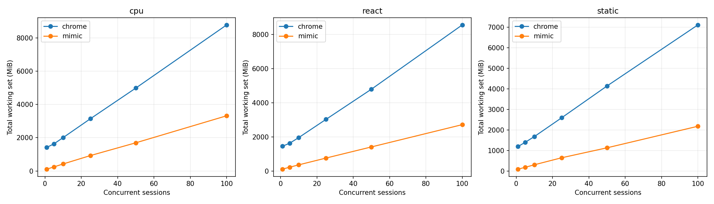
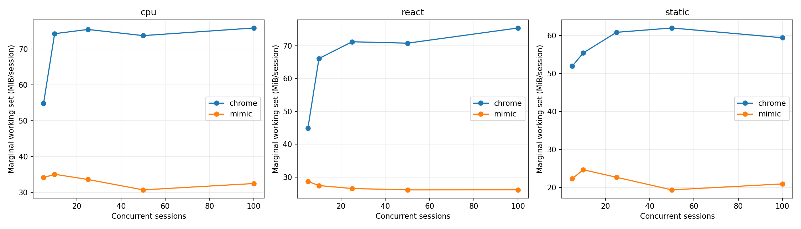
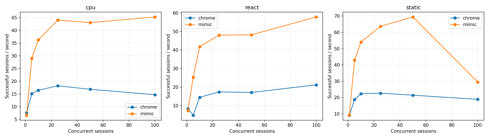
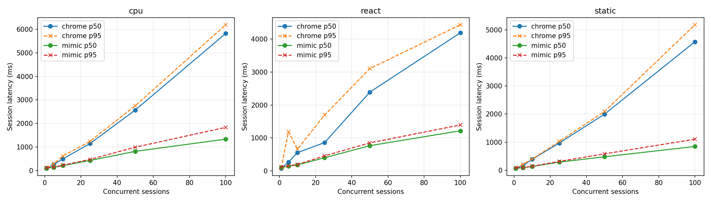
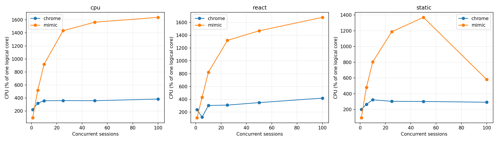

# Mimic V8 and Chrome 152: Windows x64 baseline

This is a measurement after semantic fixes. No runtime performance optimizations were performed. The original version's correctness check is saved separately in `pre-fix/raw.json`.

## Environment

| Parameter | Value |
|---|---|
| Start / end date | 2026-09-09T01:22:32.229772+04:00 / 2026-09-09T01:37:49.952307+04:00 |
| Chrome | {'protocolVersion': '1.3', 'product': 'Chrome/152.0.7977.82', 'revision': '@d04cdb24d67b081f6cf80200ffc5233f44b61109', 'userAgent': 'Mozilla/5.0 (Windows NT 10.0; Win64; x64) AppleWebKit/537.36 (KHTML, like Gecko) HeadlessChrome/152.0.0.0 Safari/537.36', 'jsVersion': '15.2.124.21'} |
| Chromium | 1669021 / d04cdb24d67b081f6cf80200ffc5233f44b61109 |
| Mimic commit | 4d0f0a1221572ac5ba5300707a9b61f5431ae9fc |
| Mimic V8 | 15.2.124.1-rusty |
| OS | Windows-11-10.0.26200-SP0 |
| CPU | {"Name":"Intel(R) Core(TM) i7-14700KF","NumberOfCores":20,"NumberOfLogicalProcessors":28} |
| CPU physical / logical | 20 / 28 |
| RAM GiB | 31.83 |
| Power plan | Power Scheme GUID: 381b4222-f694-41f0-9685-ff5bb260df2e  (Balanced) |
| Power overlay | 0 00000000-0000-0000-0000-000000000000 |
| Antivirus | {"displayName":"Windows Defender","productState":397568} |
| Chrome SHA-256 | ea36dd818a90176f1a70616f0363d9be527229389a6c073a0b1688b9e73f67e9 |
| Mimic SHA-256 | efb073cdb7ac8b54671c74a14c49bdf2cd7e4a544960eb16d6b68fcfac0016a6 |

The workstation was not dedicated exclusively to the test: background applications and antivirus were enabled. Process lists, tool versions, arguments, and fixture/binary SHA-256 hashes are in raw.json.

## Methodology and correctness

Both systems create a fresh page and a unique loopback origin. HTTP cache is disabled, responses use no-store, and cookies are not used. Contexts, transport, and the process persist in warm runs; page state is not reused. This provides isolation for this controlled corpus, not a test of tenant/security isolation. Cold runs create a new process and profile. Windows file, DLL, and OS DNS caches are not cleared; “cold” means a fresh process, not a cold disk. Warm HTTP-cache behavior was not measured.

Navigation completes only at the exact URL, with document.readyState === "complete" and __benchRun present. Both systems then explicitly invoke __benchRun; completion requires done and an exact match of the deterministic result. Settle = 0. Paint/networkidle are not awaited. Chrome uses headless=new; results do not automatically apply to headful mode.

External perf_counter/QPC clock; 5 ms polling plus CDP/OS scheduler latency. navigation_ms includes HTML parsing and script loading; execution_ms includes application startup/execution and marker detection. These are not isolated JIT or pure JavaScript timings. The page's js_ms is diagnostic: Mimic's virtual time is often zero.

The process starts suspended, is assigned to a Windows Job Object, and then resumes. process_start_ms measures the process-creation call; CDP readiness runs from the start of creation to the protocol response. runtime_initialization_ms is the remainder between them; internal V8 phases are not separately instrumented. Cold total includes page creation, execution, teardown, and process exit; temporary-profile removal and local-server maintenance are excluded.

CPU is user+kernel for the entire Job Object, including exited descendants. Working set/private bytes sum all current Job Object members every 50 ms and at checkpoints. Short memory peaks may be missed, and shared DLL pages may be counted multiple times. CPU % is relative to one logical core; 100% of the machine = 2800%. CPU peaks are sensitive to Windows counter granularity.

One correctness check and one initial warmup per series are explicitly excluded. Main series: 10 cold and 20 warm runs, without removing slow observations. p95 is published at n≥10 and p99 at n≥100; empirical quantiles use linear interpolation, and tails at n=10–20 are particularly unstable. SD, CV, and min/max for all series are available in summary.csv. Speedups are not aggregated into a single ratio.

| System / workload | Correctness gate |
|---|---|
| chrome/async | VALID |
| chrome/cpu | VALID |
| chrome/dom | VALID |
| chrome/react | VALID |
| chrome/static | VALID |
| chrome/wasm | VALID |
| mimic/async | VALID |
| mimic/cpu | VALID |
| mimic/dom | VALID |
| mimic/react | VALID |
| mimic/static | VALID |
| mimic/wasm | VALID |

### CDP readiness: separate series with an identical probe

In the final series, both systems respond to Target.getTargets after the WebSocket handshake. Each uses 10 fresh processes, alternating system order; warmup is excluded. Date: 2026-09-09T01:37:08.195847+04:00. The main series uses the same shared probe.

| System | n | CDP p50 ms | p95 | Min | Max | SD | Ready RSS MiB |
|---|---|---|---|---|---|---|---|
| mimic | 10 | 221.04 | 230.57 | 216.48 | 232.01 | 5.47 | 25.48 |
| chrome | 10 | 281.51 | 325.09 | 247.76 | 330.00 | 25.34 | 383.22 |

## Cold startup (medians, ms)

| System | Workload | n | Process create | CDP ready | Runtime init | Cold total | Shutdown |
|---|---|---|---|---|---|---|---|
| chrome | static | 10 | 9.90 | 282.13 | 272.61 | 465.05 | 98.71 |
| mimic | static | 10 | 9.22 | 220.72 | 210.60 | 459.06 | 63.98 |
| mimic | cpu | 10 | 8.99 | 230.91 | 221.82 | 485.22 | 58.38 |
| chrome | cpu | 10 | 9.09 | 264.59 | 255.64 | 477.93 | 105.75 |
| chrome | dom | 10 | 10.49 | 292.05 | 281.81 | 535.62 | 119.95 |
| mimic | dom | 10 | 9.88 | 227.31 | 216.00 | 545.72 | 67.05 |
| mimic | async | 10 | 9.47 | 228.64 | 218.01 | 513.20 | 63.75 |
| chrome | async | 10 | 9.60 | 294.77 | 283.85 | 540.39 | 121.37 |
| chrome | react | 10 | 9.71 | 308.24 | 299.74 | 542.06 | 113.24 |
| mimic | react | 10 | 10.13 | 231.69 | 221.75 | 500.62 | 66.44 |
| mimic | wasm | 10 | 10.25 | 227.17 | 217.08 | 472.77 | 67.37 |
| chrome | wasm | 10 | 10.05 | 316.42 | 304.72 | 515.13 | 106.27 |

## Warm session startup / teardown (medians)

| System | Workload | n | Create ms | Teardown ms | RSS after teardown MiB |
|---|---|---|---|---|---|
| chrome | static | 20 | 40.47 | 14.09 | 1217.32 |
| mimic | static | 20 | 13.22 | 4.06 | 78.84 |
| mimic | cpu | 20 | 13.25 | 5.58 | 80.06 |
| chrome | cpu | 20 | 37.47 | 13.95 | 1390.33 |
| chrome | dom | 20 | 39.00 | 16.25 | 1400.89 |
| mimic | dom | 20 | 14.01 | 5.13 | 86.71 |
| mimic | async | 20 | 13.94 | 4.51 | 80.16 |
| chrome | async | 20 | 39.00 | 14.74 | 1265.36 |
| chrome | react | 20 | 43.17 | 16.87 | 1421.60 |
| mimic | react | 20 | 13.26 | 5.35 | 82.12 |
| mimic | wasm | 20 | 13.88 | 4.28 | 79.57 |
| chrome | wasm | 20 | 41.66 | 15.14 | 1287.90 |

## Single-session workload latency (ms)

| System | Workload | Mode | n | Nav p50 | Execution p50 | Completion p50 | p95 | Min | Max | SD | CV |
|---|---|---|---|---|---|---|---|---|---|---|---|
| chrome | static | cold | 10 | 23.28 | 2.74 | 26.21 | 64.64 | 22.66 | 81.24 | 18.04 | 0.53 |
| mimic | static | cold | 10 | 145.50 | 1.46 | 147.05 | 157.57 | 142.78 | 158.70 | 5.23 | 0.04 |
| chrome | static | warm | 20 | 24.00 | 5.01 | 29.53 | 33.11 | 20.64 | 37.97 | 4.78 | 0.17 |
| mimic | static | warm | 20 | 53.42 | 1.40 | 54.70 | 59.06 | 49.22 | 62.07 | 3.43 | 0.06 |
| mimic | cpu | cold | 10 | 142.41 | 34.46 | 177.03 | 182.12 | 174.25 | 182.21 | 3.03 | 0.02 |
| chrome | cpu | cold | 10 | 22.45 | 29.93 | 52.41 | 236.27 | 48.22 | 378.20 | 103.08 | 1.21 |
| mimic | cpu | warm | 20 | 55.68 | 37.37 | 93.80 | 104.53 | 82.40 | 104.61 | 6.75 | 0.07 |
| chrome | cpu | warm | 20 | 24.06 | 29.12 | 53.07 | 58.09 | 43.76 | 58.81 | 4.43 | 0.08 |
| chrome | dom | cold | 10 | 26.34 | 13.45 | 38.91 | 78.44 | 32.83 | 79.93 | 17.37 | 0.37 |
| mimic | dom | cold | 10 | 154.33 | 77.62 | 230.64 | 252.35 | 220.70 | 256.97 | 10.98 | 0.05 |
| chrome | dom | warm | 20 | 24.63 | 34.03 | 60.37 | 65.17 | 52.83 | 65.87 | 4.19 | 0.07 |
| mimic | dom | warm | 20 | 56.72 | 74.14 | 131.29 | 140.70 | 123.11 | 150.04 | 6.65 | 0.05 |
| mimic | async | cold | 10 | 147.06 | 46.21 | 194.63 | 205.68 | 188.22 | 209.16 | 6.85 | 0.04 |
| chrome | async | cold | 10 | 26.89 | 31.73 | 57.92 | 64.97 | 51.94 | 65.41 | 5.14 | 0.09 |
| mimic | async | warm | 20 | 54.98 | 47.50 | 101.93 | 112.69 | 97.34 | 119.80 | 6.04 | 0.06 |
| chrome | async | warm | 20 | 24.33 | 30.29 | 55.25 | 60.91 | 46.19 | 61.05 | 4.61 | 0.09 |
| chrome | react | cold | 10 | 26.76 | 18.22 | 44.79 | 92.20 | 43.00 | 129.56 | 26.85 | 0.50 |
| mimic | react | cold | 10 | 156.03 | 31.12 | 186.24 | 205.79 | 181.84 | 211.94 | 9.42 | 0.05 |
| chrome | react | warm | 20 | 28.77 | 28.33 | 58.23 | 67.89 | 41.22 | 74.60 | 7.79 | 0.13 |
| mimic | react | warm | 20 | 65.49 | 33.28 | 96.16 | 121.93 | 92.43 | 142.30 | 12.52 | 0.12 |
| mimic | wasm | cold | 10 | 147.21 | 9.50 | 156.30 | 167.84 | 151.15 | 170.44 | 5.87 | 0.04 |
| chrome | wasm | cold | 10 | 27.19 | 6.45 | 34.51 | 37.92 | 29.45 | 38.31 | 3.08 | 0.09 |
| mimic | wasm | warm | 20 | 55.85 | 9.42 | 64.93 | 71.28 | 60.49 | 73.87 | 3.67 | 0.06 |
| chrome | wasm | warm | 20 | 26.76 | 5.44 | 32.09 | 41.31 | 22.68 | 42.85 | 5.54 | 0.17 |

## Single-session memory / CPU (medians)

| System | Workload | Mode | Before page MiB | After create MiB | Peak RSS MiB | Peak private MiB | CPU/session ms | CPU/workload ms |
|---|---|---|---|---|---|---|---|---|
| chrome | static | cold | 389.82 | 433.52 | 481.93 | 250.70 | 335.94 | 132.81 |
| mimic | static | cold | 25.35 | 25.58 | 91.25 | 124.63 | 195.31 | 187.50 |
| chrome | static | warm | 1157.02 | 1205.70 | 1217.32 | 604.55 | 195.31 | 70.31 |
| mimic | static | warm | 77.93 | 77.97 | 99.36 | 131.59 | 93.75 | 85.94 |
| mimic | cpu | cold | 25.42 | 25.62 | 103.50 | 136.15 | 234.38 | 234.38 |
| chrome | cpu | cold | 380.70 | 428.29 | 509.40 | 268.79 | 492.19 | 195.31 |
| mimic | cpu | warm | 79.27 | 79.31 | 111.91 | 144.14 | 140.62 | 140.62 |
| chrome | cpu | warm | 1310.21 | 1359.13 | 1390.33 | 772.43 | 257.81 | 125.00 |
| chrome | dom | cold | 383.25 | 435.99 | 507.72 | 263.20 | 414.06 | 171.88 |
| mimic | dom | cold | 25.45 | 25.62 | 109.29 | 142.54 | 320.31 | 312.50 |
| chrome | dom | warm | 1314.24 | 1363.32 | 1400.89 | 746.31 | 296.88 | 156.25 |
| mimic | dom | warm | 86.57 | 86.57 | 115.96 | 147.64 | 179.69 | 179.69 |
| mimic | async | cold | 25.38 | 25.61 | 93.57 | 125.61 | 218.75 | 210.94 |
| chrome | async | cold | 379.54 | 437.33 | 499.09 | 258.92 | 453.12 | 156.25 |
| mimic | async | warm | 80.01 | 80.03 | 102.65 | 134.26 | 125.00 | 109.38 |
| chrome | async | warm | 1199.75 | 1244.63 | 1265.36 | 627.96 | 265.62 | 109.38 |
| chrome | react | cold | 385.98 | 436.40 | 509.10 | 269.82 | 398.44 | 218.75 |
| mimic | react | cold | 25.46 | 25.59 | 98.29 | 129.78 | 250.00 | 234.38 |
| chrome | react | warm | 1339.04 | 1388.39 | 1421.60 | 801.59 | 343.75 | 179.69 |
| mimic | react | warm | 81.52 | 81.52 | 106.09 | 136.94 | 171.88 | 156.25 |
| mimic | wasm | cold | 25.38 | 25.60 | 91.81 | 123.73 | 234.38 | 226.56 |
| chrome | wasm | cold | 390.41 | 437.92 | 492.13 | 253.21 | 367.19 | 132.81 |
| mimic | wasm | warm | 78.79 | 78.84 | 100.22 | 130.75 | 93.75 | 93.75 |
| chrome | wasm | warm | 1220.55 | 1268.74 | 1287.90 | 635.46 | 218.75 | 78.12 |

## Concurrency / density

Each level uses a separate process, one excluded warmup, and max(5, ceil(20/N)) measured waves. Pages are created concurrently and all begin navigation after a barrier. Completed pages are held until the wave ends to measure simultaneous RSS. Throughput = successful sessions / time from create to final teardown, including the barrier and measurements but excluding HTTP-server setup/cleanup. Latency = create→completion, including barrier wait. This is batch throughput, not an optimized continuous request stream. Holding pages adds to throughput time but not latency. CPU per session = total wave CPU / successes; overlapping per-page CPU intervals are not summed.

Stopping limits: any error, <15% or <2 GiB available RAM, >1024 pages input/s for 3 s, or a 180 s timeout. These protect the workstation; the highest passing level is a lower bound on capacity supported here, not proof of an absolute maximum.

Mimic serializes CDP commands with a shared mutex. The measurement includes this behavior; its cost was not profiled. In stopped rows, RSS may have been sampled before all pages completed, and 0 waves means stopping during the excluded warmup. Such rows are diagnostic and excluded from stable-level fits/charts. Between waves, an additional 250 ms recovery, server cleanup, and checkpoint writing are outside batch throughput.

| System | Workload | N | Waves | Success % | RSS MiB | RSS/N MiB | Peak MiB | CPU/session ms | Sessions/s | p50 ms | p95 ms | p99 ms | Stop |
|---|---|---|---|---|---|---|---|---|---|---|---|---|---|
| chrome | static | 1 | 20 | 100.00 | 1198.46 | 1198.46 | 1210.32 | 221.09 | 9.11 | 66.64 | 80.63 | — |  |
| mimic | static | 1 | 20 | 100.00 | 97.98 | 97.98 | 103.46 | 103.91 | 9.21 | 68.63 | 83.31 | — |  |
| chrome | static | 5 | 5 | 100.00 | 1406.03 | 281.21 | 1430.94 | 142.50 | 18.74 | 168.10 | 212.58 | — |  |
| mimic | static | 5 | 5 | 100.00 | 187.33 | 37.47 | 188.25 | 111.88 | 42.89 | 85.20 | 89.28 | — |  |
| chrome | static | 10 | 5 | 100.00 | 1682.99 | 168.30 | 1690.10 | 144.69 | 22.35 | 389.38 | 395.48 | — |  |
| mimic | static | 10 | 5 | 100.00 | 310.70 | 31.07 | 311.94 | 149.06 | 54.05 | 132.41 | 140.88 | — |  |
| chrome | static | 25 | 5 | 100.00 | 2595.00 | 103.80 | 2621.79 | 134.38 | 22.63 | 966.86 | 1023.23 | 1027.39 |  |
| mimic | static | 25 | 5 | 100.00 | 651.14 | 26.05 | 663.34 | 186.50 | 63.67 | 288.30 | 313.28 | 327.31 |  |
| chrome | static | 50 | 5 | 100.00 | 4143.50 | 82.87 | 4149.98 | 141.00 | 21.44 | 1994.95 | 2091.88 | 2098.11 |  |
| mimic | static | 50 | 5 | 100.00 | 1135.84 | 22.72 | 1216.18 | 197.44 | 69.41 | 477.10 | 582.02 | 633.26 |  |
| chrome | static | 100 | 5 | 100.00 | 7112.08 | 71.12 | 7138.98 | 155.16 | 18.85 | 4576.53 | 5180.04 | 5202.52 |  |
| mimic | static | 100 | 5 | 100.00 | 2183.57 | 21.84 | 2192.49 | 196.81 | 29.48 | 844.04 | 1103.81 | 1165.07 |  |
| chrome | cpu | 1 | 20 | 100.00 | 1416.46 | 1416.46 | 1421.25 | 288.28 | 7.63 | 94.90 | 107.65 | — |  |
| mimic | cpu | 1 | 20 | 100.00 | 112.01 | 112.01 | 115.09 | 142.19 | 6.65 | 108.85 | 117.18 | — |  |
| chrome | cpu | 5 | 5 | 100.00 | 1635.88 | 327.18 | 1639.70 | 210.62 | 15.11 | 258.77 | 286.68 | — |  |
| mimic | cpu | 5 | 5 | 100.00 | 248.38 | 49.68 | 249.50 | 178.75 | 28.99 | 134.77 | 145.35 | — |  |
| chrome | cpu | 10 | 5 | 100.00 | 2007.14 | 200.71 | 2009.33 | 216.56 | 16.46 | 497.01 | 618.38 | — |  |
| mimic | cpu | 10 | 5 | 100.00 | 423.49 | 42.35 | 427.82 | 253.12 | 36.25 | 210.03 | 228.64 | — |  |
| chrome | cpu | 25 | 5 | 100.00 | 3138.68 | 125.55 | 3143.32 | 196.88 | 18.23 | 1144.69 | 1239.84 | 1253.86 |  |
| mimic | cpu | 25 | 5 | 100.00 | 927.15 | 37.09 | 960.92 | 325.38 | 44.08 | 427.53 | 472.19 | 480.29 |  |
| chrome | cpu | 50 | 5 | 100.00 | 4981.59 | 99.63 | 4985.52 | 211.50 | 16.87 | 2568.17 | 2749.66 | 2769.55 |  |
| mimic | cpu | 50 | 5 | 100.00 | 1693.99 | 33.88 | 1770.18 | 363.25 | 43.08 | 814.03 | 990.72 | 1029.31 |  |
| chrome | cpu | 100 | 5 | 100.00 | 8774.00 | 87.74 | 8794.07 | 259.56 | 14.71 | 5817.82 | 6187.24 | 6225.77 |  |
| mimic | cpu | 100 | 5 | 100.00 | 3316.24 | 33.16 | 3367.59 | 361.97 | 45.29 | 1333.03 | 1832.53 | 1925.75 |  |
| chrome | react | 1 | 20 | 100.00 | 1448.17 | 1448.17 | 1452.26 | 278.12 | 8.47 | 80.59 | 89.11 | — |  |
| mimic | react | 1 | 20 | 100.00 | 106.14 | 106.14 | 110.03 | 149.22 | 7.39 | 102.74 | 121.16 | — |  |
| chrome | react | 5 | 5 | 100.00 | 1627.70 | 325.54 | 1650.36 | 248.12 | 4.84 | 267.22 | 1187.65 | — |  |
| mimic | react | 5 | 5 | 100.00 | 220.88 | 44.17 | 221.56 | 170.62 | 25.25 | 147.49 | 158.69 | — |  |
| chrome | react | 10 | 5 | 100.00 | 1958.25 | 195.83 | 1966.58 | 208.12 | 14.50 | 557.99 | 665.35 | — |  |
| mimic | react | 10 | 5 | 100.00 | 358.04 | 35.80 | 362.89 | 196.88 | 41.80 | 183.95 | 197.79 | — |  |
| chrome | react | 25 | 5 | 100.00 | 3026.40 | 121.06 | 3076.02 | 176.88 | 17.40 | 860.39 | 1696.49 | 1699.37 |  |
| mimic | react | 25 | 5 | 100.00 | 756.03 | 30.24 | 793.11 | 274.88 | 48.04 | 401.61 | 459.28 | 466.06 |  |
| chrome | react | 50 | 5 | 100.00 | 4795.87 | 95.92 | 4804.83 | 202.50 | 17.13 | 2389.73 | 3104.38 | 3110.96 |  |
| mimic | react | 50 | 5 | 100.00 | 1409.01 | 28.18 | 1496.25 | 305.00 | 48.21 | 766.69 | 852.08 | 874.31 |  |
| chrome | react | 100 | 5 | 100.00 | 8566.05 | 85.66 | 8595.73 | 196.66 | 21.22 | 4187.67 | 4431.13 | 4468.65 |  |
| mimic | react | 100 | 5 | 100.00 | 2715.90 | 27.16 | 2740.43 | 290.72 | 57.82 | 1218.36 | 1394.43 | 1431.82 |  |

## Marginal RAM/session

The finite difference between adjacent tested N values is measured and divided by ΔN; this is not a direct measurement of every N→N+1 step. The linear model is a descriptive OLS fit to medians of successful levels only. The intercept is an extrapolation; actual startup overhead includes the initial blank page. Total RSS includes processes and caches retained from earlier waves, and the number of waves depends on N. The fit therefore combines active-page costs with process history. RSS growth relative to the start of the same wave is also shown; it can include background activity and GC.

| System | Workload | N | (Active RSS − before wave RSS)/N MiB |
|---|---|---|---|
| chrome | static | 1 | 59.74 |
| mimic | static | 1 | 20.96 |
| chrome | static | 5 | 53.65 |
| mimic | static | 5 | 20.19 |
| chrome | static | 10 | 55.62 |
| mimic | static | 10 | 21.57 |
| chrome | static | 25 | 57.26 |
| mimic | static | 25 | 19.93 |
| chrome | static | 50 | 58.31 |
| mimic | static | 50 | 20.13 |
| chrome | static | 100 | 58.59 |
| mimic | static | 100 | 19.93 |
| chrome | cpu | 1 | 77.95 |
| mimic | cpu | 1 | 32.34 |
| chrome | cpu | 5 | 67.52 |
| mimic | cpu | 5 | 31.59 |
| chrome | cpu | 10 | 70.32 |
| mimic | cpu | 10 | 31.90 |
| chrome | cpu | 25 | 72.16 |
| mimic | cpu | 25 | 31.78 |
| chrome | cpu | 50 | 72.95 |
| mimic | cpu | 50 | 30.95 |
| chrome | cpu | 100 | 73.50 |
| mimic | cpu | 100 | 31.12 |
| chrome | react | 1 | 80.77 |
| mimic | react | 1 | 24.73 |
| chrome | react | 5 | 68.37 |
| mimic | react | 5 | 23.63 |
| chrome | react | 10 | 67.28 |
| mimic | react | 10 | 23.84 |
| chrome | react | 25 | 68.91 |
| mimic | react | 25 | 23.31 |
| chrome | react | 50 | 69.53 |
| mimic | react | 50 | 23.39 |
| chrome | react | 100 | 71.48 |
| mimic | react | 100 | 23.20 |

| System | Workload | N low→high | ΔRSS MiB | ΔRSS/ΔN MiB |
|---|---|---|---|---|
| chrome | cpu | 1→5 | 219.42 | 54.86 |
| chrome | cpu | 5→10 | 371.26 | 74.25 |
| chrome | cpu | 10→25 | 1131.54 | 75.44 |
| chrome | cpu | 25→50 | 1842.91 | 73.72 |
| chrome | cpu | 50→100 | 3792.41 | 75.85 |
| mimic | cpu | 1→5 | 136.37 | 34.09 |
| mimic | cpu | 5→10 | 175.11 | 35.02 |
| mimic | cpu | 10→25 | 503.66 | 33.58 |
| mimic | cpu | 25→50 | 766.84 | 30.67 |
| mimic | cpu | 50→100 | 1622.25 | 32.45 |
| chrome | react | 1→5 | 179.54 | 44.88 |
| chrome | react | 5→10 | 330.55 | 66.11 |
| chrome | react | 10→25 | 1068.14 | 71.21 |
| chrome | react | 25→50 | 1769.47 | 70.78 |
| chrome | react | 50→100 | 3770.18 | 75.40 |
| mimic | react | 1→5 | 114.74 | 28.68 |
| mimic | react | 5→10 | 137.16 | 27.43 |
| mimic | react | 10→25 | 398.00 | 26.53 |
| mimic | react | 25→50 | 652.98 | 26.12 |
| mimic | react | 50→100 | 1306.89 | 26.14 |
| chrome | static | 1→5 | 207.57 | 51.89 |
| chrome | static | 5→10 | 276.96 | 55.39 |
| chrome | static | 10→25 | 912.02 | 60.80 |
| chrome | static | 25→50 | 1548.50 | 61.94 |
| chrome | static | 50→100 | 2968.58 | 59.37 |
| mimic | static | 1→5 | 89.35 | 22.34 |
| mimic | static | 5→10 | 123.36 | 24.67 |
| mimic | static | 10→25 | 340.45 | 22.70 |
| mimic | static | 25→50 | 484.70 | 19.39 |
| mimic | static | 50→100 | 1047.72 | 20.95 |

| System | Workload | Fixed fit MiB | Marginal fit MiB | R² | Max stable N |
|---|---|---|---|---|---|
| chrome | cpu | 1280.60 | 74.71 | 1.00 | 100 |
| mimic | cpu | 94.15 | 32.23 | 1.00 | 100 |
| chrome | react | 1265.18 | 72.42 | 1.00 | 100 |
| mimic | react | 90.65 | 26.29 | 1.00 | 100 |
| chrome | static | 1110.03 | 60.09 | 1.00 | 100 |
| mimic | static | 94.31 | 20.95 | 1.00 | 100 |

## Teardown / recovery

| System | Workload | N | Ready RSS MiB | RSS after waves MiB | Whole-series CPU s | CPU % |
|---|---|---|---|---|---|---|
| chrome | static | 1 | 397.11 | 1140.96 | 4.42 | 201.51 |
| mimic | static | 1 | 25.28 | 77.55 | 2.08 | 95.74 |
| chrome | static | 5 | 383.60 | 1145.78 | 3.56 | 267.01 |
| mimic | static | 5 | 25.34 | 87.21 | 2.80 | 479.88 |
| chrome | static | 10 | 375.94 | 1131.47 | 7.23 | 323.42 |
| mimic | static | 10 | 25.49 | 95.04 | 7.45 | 805.65 |
| chrome | static | 25 | 397.03 | 1171.21 | 16.80 | 304.12 |
| mimic | static | 25 | 25.43 | 116.56 | 23.31 | 1187.40 |
| chrome | static | 50 | 393.95 | 1231.94 | 35.25 | 302.25 |
| mimic | static | 50 | 25.42 | 137.11 | 49.36 | 1370.41 |
| chrome | static | 100 | 385.74 | 1257.43 | 77.58 | 292.51 |
| mimic | static | 100 | 25.28 | 194.80 | 98.41 | 580.26 |
| chrome | cpu | 1 | 377.42 | 1338.89 | 5.77 | 219.90 |
| mimic | cpu | 1 | 25.41 | 80.46 | 2.84 | 94.60 |
| chrome | cpu | 5 | 386.75 | 1297.44 | 5.27 | 318.22 |
| mimic | cpu | 5 | 25.50 | 91.20 | 4.47 | 518.12 |
| chrome | cpu | 10 | 382.93 | 1305.21 | 10.83 | 356.38 |
| mimic | cpu | 10 | 25.93 | 102.47 | 12.66 | 917.67 |
| chrome | cpu | 25 | 390.96 | 1336.25 | 24.61 | 358.84 |
| mimic | cpu | 25 | 25.44 | 119.30 | 40.67 | 1434.38 |
| chrome | cpu | 50 | 382.88 | 1334.54 | 52.88 | 356.79 |
| mimic | cpu | 50 | 25.27 | 147.93 | 90.81 | 1564.81 |
| chrome | cpu | 100 | 390.00 | 1432.28 | 129.78 | 381.76 |
| mimic | cpu | 100 | 25.35 | 208.96 | 180.98 | 1639.42 |
| chrome | react | 1 | 392.20 | 1369.16 | 5.56 | 235.62 |
| mimic | react | 1 | 25.86 | 82.12 | 2.98 | 110.25 |
| chrome | react | 5 | 389.87 | 1304.26 | 6.20 | 120.17 |
| mimic | react | 5 | 25.34 | 103.71 | 4.27 | 430.81 |
| chrome | react | 10 | 394.61 | 1287.47 | 10.41 | 301.81 |
| mimic | react | 10 | 25.39 | 119.20 | 9.84 | 822.90 |
| chrome | react | 25 | 391.86 | 1307.26 | 22.11 | 307.82 |
| mimic | react | 25 | 25.41 | 174.53 | 34.36 | 1320.40 |
| chrome | react | 50 | 376.43 | 1331.89 | 50.62 | 346.91 |
| mimic | react | 50 | 25.34 | 250.06 | 76.25 | 1470.28 |
| chrome | react | 100 | 382.97 | 1421.99 | 98.33 | 417.28 |
| mimic | react | 100 | 25.91 | 395.73 | 145.36 | 1680.81 |

## Local server (measured independently)

HTTP handler time runs from the handler receiving a request to completion of response writing; it excludes TCP/server scheduler queues and network roundtrip. Before the main workload, the server is created outside the measured interval. Requests and bytes for each resource are recorded in raw.json.

| System | Workload | Mode | Requests | Server p50 ms | Server p95 ms | Server max ms |
|---|---|---|---|---|---|---|
| chrome | static | cold | 20 | 0.32 | 0.59 | 1.14 |
| mimic | static | cold | 20 | 0.31 | 1.29 | 1.56 |
| chrome | static | warm | 40 | 0.31 | 0.41 | 0.42 |
| mimic | static | warm | 40 | 0.22 | 1.30 | 1.89 |
| mimic | cpu | cold | 20 | 0.41 | 1.75 | 1.75 |
| chrome | cpu | cold | 20 | 0.30 | 0.62 | 0.63 |
| mimic | cpu | warm | 40 | 0.25 | 1.22 | 1.59 |
| chrome | cpu | warm | 40 | 0.29 | 0.42 | 0.55 |
| chrome | dom | cold | 20 | 0.34 | 0.58 | 0.59 |
| mimic | dom | cold | 20 | 0.26 | 1.23 | 1.35 |
| chrome | dom | warm | 40 | 0.31 | 0.42 | 0.45 |
| mimic | dom | warm | 40 | 0.30 | 0.54 | 0.58 |
| mimic | async | cold | 50 | 0.16 | 0.81 | 2.33 |
| chrome | async | cold | 50 | 0.18 | 0.50 | 0.59 |
| mimic | async | warm | 100 | 0.14 | 0.50 | 0.61 |
| chrome | async | warm | 100 | 0.17 | 0.42 | 0.45 |
| chrome | react | cold | 50 | 0.49 | 1.13 | 1.25 |
| mimic | react | cold | 50 | 0.34 | 0.62 | 1.07 |
| chrome | react | warm | 100 | 0.41 | 0.95 | 1.78 |
| mimic | react | warm | 100 | 0.32 | 0.57 | 0.88 |
| mimic | wasm | cold | 20 | 0.27 | 0.45 | 0.75 |
| chrome | wasm | cold | 20 | 0.37 | 0.65 | 0.68 |
| mimic | wasm | warm | 40 | 0.25 | 0.37 | 0.60 |
| chrome | wasm | warm | 40 | 0.29 | 0.54 | 1.19 |

## Validity of measured series

| System | Workload | Mode | Successes / attempts | Comparison use |
|---|---|---|---|---|
| chrome | static | cold | 10/10 | VALID |
| mimic | static | cold | 10/10 | VALID |
| chrome | static | warm | 20/20 | VALID |
| mimic | static | warm | 20/20 | VALID |
| mimic | cpu | cold | 10/10 | VALID |
| chrome | cpu | cold | 10/10 | VALID |
| mimic | cpu | warm | 20/20 | VALID |
| chrome | cpu | warm | 20/20 | VALID |
| chrome | dom | cold | 10/10 | VALID |
| mimic | dom | cold | 10/10 | VALID |
| chrome | dom | warm | 20/20 | VALID |
| mimic | dom | warm | 20/20 | VALID |
| mimic | async | cold | 10/10 | VALID |
| chrome | async | cold | 10/10 | VALID |
| mimic | async | warm | 20/20 | VALID |
| chrome | async | warm | 20/20 | VALID |
| chrome | react | cold | 10/10 | VALID |
| mimic | react | cold | 10/10 | VALID |
| chrome | react | warm | 20/20 | VALID |
| mimic | react | warm | 20/20 | VALID |
| mimic | wasm | cold | 10/10 | VALID |
| chrome | wasm | cold | 10/10 | VALID |
| mimic | wasm | warm | 20/20 | VALID |
| chrome | wasm | warm | 20/20 | VALID |

## Engineering conclusions

1. By median warm navigation→completion, Mimic is faster on: none of the measured workloads. CDP readiness (shared probe, separate cold runs): mimic 221.04 ms; chrome 281.51 ms

2. Chrome is faster by the same metric on: async (101.93 / 55.25 ms Mimic/Chrome); cpu (93.80 / 53.07 ms Mimic/Chrome); dom (131.29 / 60.37 ms Mimic/Chrome); react (96.16 / 58.23 ms Mimic/Chrome); static (54.70 / 29.53 ms Mimic/Chrome); wasm (64.93 / 32.09 ms Mimic/Chrome).

3. Fixed process overhead (CDP ready, including the initial page): mimic 25.43 MiB; chrome 382.82 MiB. Startup latency and the OLS intercept are reported separately above.

4. Estimated marginal RAM/session: chrome/cpu 74.71 MiB; mimic/cpu 32.23 MiB; chrome/react 72.42 MiB; mimic/react 26.29 MiB; chrome/static 60.09 MiB; mimic/static 20.95 MiB.

5. Maximum stable N by workload: mimic/cpu 100; chrome/cpu 100; mimic/react 100; chrome/react 100; mimic/static 100; chrome/static 100.

6. Throughput at the highest common stable level:

cpu, N=100: Mimic 45.29 and Chrome 14.71 successful sessions/s; RSS 3316.24 and 8774.00 MiB; CPU/session 361.97 and 259.56 ms.

react, N=100: Mimic 57.82 and Chrome 21.22 successful sessions/s; RSS 2715.90 and 8566.05 MiB; CPU/session 290.72 and 196.66 ms.

static, N=100: Mimic 29.48 and Chrome 18.85 successful sessions/s; RSS 2183.57 and 7112.08 MiB; CPU/session 196.81 and 155.16 ms.

7. Invalid comparisons after fixes: none at the correctness gate; individual iteration errors remain in raw.json. Before fixes: DOM, async, React, WebAssembly (see pre-fix).

8. Limitations: one busy workstation; headless Chrome; different V8 builds; HTTP cache disabled; limited corpus sizes and semantic checks; a synthetic React fixture, not a Next.js/production application. Polling and sampling add system load. RSS sums working sets, not unique physical RAM; no financial model of session cost is provided. Paging is a system-wide counter, not attribution of hard faults to a specific process. Mimic virtual-clock values are not used for comparisons.

9. Supported scope: “On Windows x64, local controlled workloads passed result validation in Mimic V8 and Chrome 152.0.7977.82; a reproducible harness, raw observations, and separate latency, CPU, and memory metrics are published. cpu, N=100: Mimic 45.29 and Chrome 14.71 successful sessions/s; RSS 3316.24 and 8774.00 MiB; CPU/session 361.97 and 259.56 ms.”

10. The data do NOT support claims that “Mimic is X times faster than Chrome in general,” full browser compatibility, tenant-isolation security, an advantage in pure V8/JIT execution, gains on arbitrary sites, or monetary savings without an operating model.
