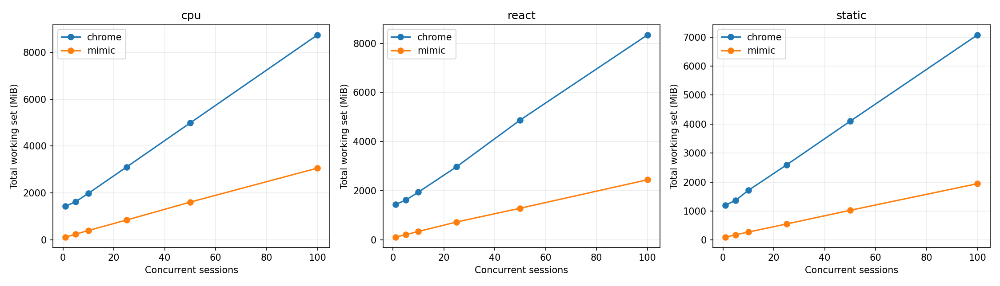
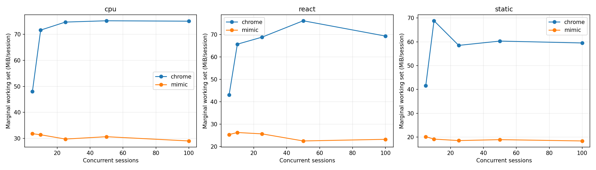
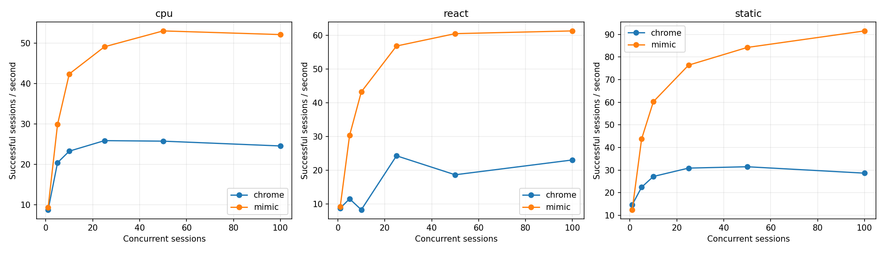
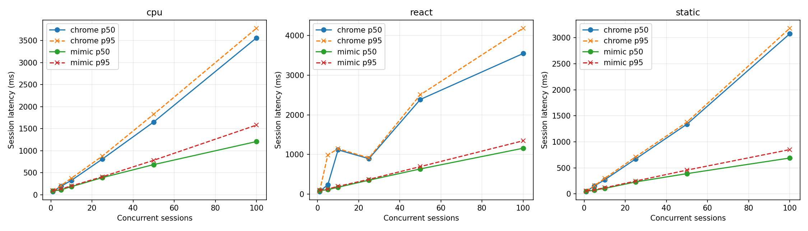
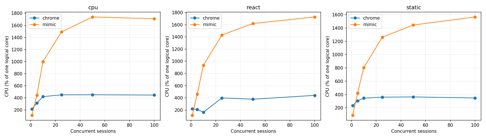

# Mimic V8 и Chrome 152: baseline Windows x64

Это измерение после исправления ошибок семантики, разрешённого пользователем. Оптимизации runtime ради производительности не выполнялись. Проверка исходной версии сохранена отдельно в `pre-fix/raw.json`.

## Окружение

| Параметр | Значение |
|---|---|
| Дата начала / конца | 2026-09-09T02:01:30.636001+04:00 / 2026-09-09T02:13:06.474314+04:00 |
| Chrome | {'protocolVersion': '1.3', 'product': 'Chrome/152.0.7977.82', 'revision': '@d04cdb24d67b081f6cf80200ffc5233f44b61109', 'userAgent': 'Mozilla/5.0 (Windows NT 10.0; Win64; x64) AppleWebKit/537.36 (KHTML, like Gecko) HeadlessChrome/152.0.0.0 Safari/537.36', 'jsVersion': '15.2.124.21'} |
| Chromium | 1669021 / d04cdb24d67b081f6cf80200ffc5233f44b61109 |
| Mimic commit | 52a2aa2f8f8e53125d4e6cb5261366d99707df68 |
| Mimic V8 | 15.2.124.1-rusty |
| OS | Windows-11-10.0.26200-SP0 |
| CPU | {"Name":"Intel(R) Core(TM) i7-14700KF","NumberOfCores":20,"NumberOfLogicalProcessors":28} |
| CPU physical / logical | 20 / 28 |
| RAM GiB | 31.83 |
| План питания | GUID схемы питания: 381b4222-f694-41f0-9685-ff5bb260df2e  (Сбалансированная) |
| Power overlay | 0 00000000-0000-0000-0000-000000000000 |
| Антивирус | {"displayName":"Windows Defender","productState":397568} |
| Chrome SHA-256 | ea36dd818a90176f1a70616f0363d9be527229389a6c073a0b1688b9e73f67e9 |
| Mimic SHA-256 | 0f3711649ff8d3c7421f7bb87f46c169e0b617c0bc919b82e8b457421e15742c |

Рабочая станция не была эксклюзивно выделена тесту: фоновые приложения и антивирус включены. Список процессов, версии инструментов, аргументы, SHA-256 фикстур и бинарников находятся в raw.json.

## Методика и корректность

В обеих системах создаётся новая страница и уникальный loopback-origin. HTTP cache отключён, ответы no-store; cookie не используются. Контексты, транспорт и процесс в warm сохраняются, состояние страницы не используется повторно. Это изоляция для данного контролируемого корпуса, а не проверка tenant/security isolation. Cold создаёт новый процесс и профиль. Кэш файлов Windows, DLL и DNS ОС не очищается; «cold» означает новый процесс, а не холодный диск. Вариант warm HTTP cache не измерялся.

Навигация заканчивается только при точном URL, document.readyState === "complete" и наличии __benchRun. Затем одинаковый явный запуск __benchRun; завершение — done и точное совпадение детерминированного результата. Settle = 0. Paint/networkidle не ожидаются. Chrome headless=new; результаты не переносятся автоматически на headful.

Внешние часы perf_counter/QPC; polling 5 ms плюс задержка CDP/планировщика ОС. navigation_ms включает разбор HTML и загрузку скриптов, execution_ms — запуск/выполнение приложения и обнаружение маркера. Они не являются изолированным временем JIT или чистого JavaScript. js_ms страницы диагностический: в Mimic виртуальное время часто равно нулю.

Процесс запускается приостановленным, включается в Windows Job Object, затем возобновляется. process_start_ms — вызов создания процесса; CDP readiness отсчитывается от начала создания до ответа протокола. runtime_initialization_ms — остаток между ними; внутренние фазы V8 отдельно не инструментированы. Cold total включает создание страницы, выполнение, teardown и завершение процесса; удаление временного профиля и обслуживание локального сервера не включены.

CPU — user+kernel всего Job Object, включая завершившихся потомков. Working set/private bytes — сумма всех текущих участников Job Object каждые 50 ms и в контрольных точках. Кратковременные пики памяти могут быть пропущены, общие страницы DLL могут учитываться несколько раз. CPU % задан относительно одного логического ядра; 100% машины = 2800%. Пики CPU чувствительны к дискретности счётчиков Windows.

Одна проверка и по одному первоначальному warmup на серию исключены явно. Основные серии: 10 cold и 20 warm, без удаления медленных наблюдений. p95 публикуется при n≥10, p99 при n≥100; используется линейная интерполяция эмпирических квантилей, хвосты при n=10–20 особенно неустойчивы. SD и CV, min/max всех серий доступны в summary.csv. Ускорение не агрегируется в одно отношение.

| Система / workload | Correctness gate |
|---|---|
| chrome/async | VALID |
| chrome/cpu | VALID |
| chrome/dom | VALID |
| chrome/react | VALID |
| chrome/static | VALID |
| chrome/wasm | VALID |
| mimic/async | VALID |
| mimic/cpu | VALID |
| mimic/dom | VALID |
| mimic/react | VALID |
| mimic/static | VALID |
| mimic/wasm | VALID |

### CDP readiness: отдельная серия с одинаковой пробой

В финальной серии обе системы отвечают на Target.getTargets после WebSocket handshake. По 10 новых процессов, порядок систем чередуется; warmup исключён. Дата: 2026-09-09T02:12:42.401367+04:00. Основная серия использует ту же общую пробу.

| Система | n | CDP p50 ms | p95 | Min | Max | SD | Ready RSS MiB |
|---|---|---|---|---|---|---|---|
| mimic | 10 | 214.90 | 230.46 | 214.32 | 234.85 | 6.79 | 25.69 |
| chrome | 10 | 278.03 | 291.35 | 263.57 | 297.17 | 8.52 | 392.20 |

## Cold startup (медианы, ms)

| Система | Workload | n | Process create | CDP ready | Runtime init | Cold total | Shutdown |
|---|---|---|---|---|---|---|---|
| chrome | static | 10 | 6.46 | 291.53 | 282.27 | 459.07 | 100.27 |
| mimic | static | 10 | 6.20 | 220.30 | 213.95 | 461.14 | 58.17 |
| mimic | cpu | 10 | 6.38 | 215.36 | 208.48 | 483.72 | 57.64 |
| chrome | cpu | 10 | 6.24 | 273.04 | 266.71 | 482.55 | 106.43 |
| chrome | dom | 10 | 6.74 | 281.28 | 274.65 | 463.79 | 107.20 |
| mimic | dom | 10 | 6.27 | 217.04 | 209.06 | 525.15 | 57.62 |
| mimic | async | 10 | 6.11 | 218.25 | 209.51 | 497.56 | 57.64 |
| chrome | async | 10 | 6.14 | 278.77 | 272.50 | 489.20 | 109.68 |
| chrome | react | 10 | 6.28 | 277.27 | 266.38 | 485.92 | 108.21 |
| mimic | react | 10 | 5.92 | 215.29 | 209.09 | 492.83 | 57.66 |
| mimic | wasm | 10 | 5.88 | 215.26 | 208.37 | 461.76 | 58.44 |
| chrome | wasm | 10 | 6.10 | 283.83 | 277.61 | 468.84 | 99.67 |

## Warm session startup / teardown (медианы)

| Система | Workload | n | Create ms | Teardown ms | RSS после teardown MiB |
|---|---|---|---|---|---|
| chrome | static | 20 | 28.59 | 10.15 | 1193.38 |
| mimic | static | 20 | 2.07 | 6.48 | 86.78 |
| mimic | cpu | 20 | 2.07 | 4.16 | 82.05 |
| chrome | cpu | 20 | 29.50 | 9.60 | 1412.47 |
| chrome | dom | 20 | 23.55 | 10.32 | 1391.38 |
| mimic | dom | 20 | 11.92 | 4.00 | 87.80 |
| mimic | async | 20 | 7.06 | 3.21 | 82.46 |
| chrome | async | 20 | 28.67 | 9.68 | 1248.13 |
| chrome | react | 20 | 30.98 | 9.99 | 1427.25 |
| mimic | react | 20 | 7.19 | 3.99 | 82.52 |
| mimic | wasm | 20 | 11.96 | 3.33 | 83.26 |
| chrome | wasm | 20 | 27.68 | 10.38 | 1301.85 |

## Single-session workload latency (ms)

| Система | Workload | Mode | n | Nav p50 | Execution p50 | Completion p50 | p95 | Min | Max | SD | CV |
|---|---|---|---|---|---|---|---|---|---|---|---|
| chrome | static | cold | 10 | 24.26 | 2.80 | 26.91 | 92.12 | 24.68 | 99.82 | 27.44 | 0.68 |
| mimic | static | cold | 10 | 167.18 | 1.45 | 168.43 | 173.06 | 166.41 | 175.31 | 2.60 | 0.02 |
| chrome | static | warm | 20 | 17.11 | 3.62 | 20.65 | 24.14 | 19.41 | 33.27 | 2.99 | 0.14 |
| mimic | static | warm | 20 | 42.95 | 1.26 | 44.18 | 46.67 | 42.32 | 46.76 | 1.38 | 0.03 |
| mimic | cpu | cold | 10 | 166.13 | 34.99 | 201.17 | 220.25 | 198.31 | 230.45 | 9.55 | 0.05 |
| chrome | cpu | cold | 10 | 23.04 | 28.94 | 51.50 | 67.94 | 46.89 | 79.35 | 9.22 | 0.17 |
| mimic | cpu | warm | 20 | 42.43 | 34.71 | 77.09 | 83.61 | 75.45 | 84.01 | 2.40 | 0.03 |
| chrome | cpu | warm | 20 | 17.09 | 28.23 | 45.33 | 47.86 | 42.76 | 49.30 | 1.62 | 0.04 |
| chrome | dom | cold | 10 | 22.54 | 11.60 | 34.49 | 46.31 | 29.18 | 53.86 | 6.66 | 0.18 |
| mimic | dom | cold | 10 | 166.63 | 70.13 | 235.88 | 245.56 | 233.84 | 247.17 | 4.72 | 0.02 |
| chrome | dom | warm | 20 | 17.28 | 30.75 | 48.13 | 52.90 | 45.74 | 57.20 | 2.68 | 0.06 |
| mimic | dom | warm | 20 | 41.98 | 68.93 | 111.15 | 113.73 | 107.12 | 115.46 | 2.02 | 0.02 |
| mimic | async | cold | 10 | 166.16 | 45.42 | 211.00 | 238.49 | 208.55 | 254.65 | 14.01 | 0.06 |
| chrome | async | cold | 10 | 22.57 | 26.79 | 48.88 | 58.88 | 45.90 | 61.05 | 4.77 | 0.09 |
| mimic | async | warm | 20 | 42.66 | 49.21 | 91.78 | 93.24 | 87.46 | 93.40 | 1.95 | 0.02 |
| chrome | async | warm | 20 | 17.09 | 27.54 | 44.44 | 46.83 | 38.73 | 47.16 | 2.05 | 0.05 |
| chrome | react | cold | 10 | 24.30 | 16.04 | 40.32 | 228.51 | 36.71 | 376.57 | 106.09 | 1.42 |
| mimic | react | cold | 10 | 173.57 | 30.30 | 203.80 | 210.90 | 202.58 | 213.26 | 3.28 | 0.02 |
| chrome | react | warm | 20 | 19.06 | 22.41 | 41.22 | 47.10 | 35.65 | 47.50 | 3.02 | 0.07 |
| mimic | react | warm | 20 | 49.38 | 36.31 | 85.88 | 89.87 | 83.35 | 90.65 | 2.08 | 0.02 |
| mimic | wasm | cold | 10 | 165.23 | 9.30 | 174.21 | 177.78 | 172.43 | 178.81 | 1.84 | 0.01 |
| chrome | wasm | cold | 10 | 22.23 | 5.21 | 27.44 | 74.94 | 25.89 | 104.23 | 24.25 | 0.67 |
| mimic | wasm | warm | 20 | 42.32 | 9.06 | 51.44 | 54.32 | 47.46 | 56.71 | 1.84 | 0.04 |
| chrome | wasm | warm | 20 | 17.22 | 5.16 | 22.48 | 25.29 | 20.38 | 26.99 | 1.73 | 0.08 |

## Single-session память / CPU (медианы)

| Система | Workload | Mode | До страницы MiB | После create MiB | Peak RSS MiB | Peak private MiB | CPU/session ms | CPU/workload ms |
|---|---|---|---|---|---|---|---|---|
| chrome | static | cold | 384.78 | 430.47 | 483.38 | 251.03 | 328.12 | 125.00 |
| mimic | static | cold | 25.52 | 25.67 | 105.26 | 138.29 | 218.75 | 218.75 |
| chrome | static | warm | 1133.73 | 1167.24 | 1193.38 | 593.71 | 164.06 | 62.50 |
| mimic | static | warm | 86.78 | 86.78 | 101.93 | 134.60 | 85.94 | 70.31 |
| mimic | cpu | cold | 25.44 | 25.68 | 115.06 | 147.69 | 273.44 | 250.00 |
| chrome | cpu | cold | 385.01 | 439.72 | 520.68 | 275.22 | 406.25 | 187.50 |
| mimic | cpu | warm | 82.05 | 82.06 | 111.10 | 141.62 | 125.00 | 109.38 |
| chrome | cpu | warm | 1334.15 | 1372.14 | 1412.47 | 781.11 | 210.94 | 101.56 |
| chrome | dom | cold | 385.67 | 438.42 | 492.96 | 257.81 | 312.50 | 140.62 |
| mimic | dom | cold | 25.51 | 25.70 | 112.46 | 144.14 | 312.50 | 296.88 |
| chrome | dom | warm | 1312.90 | 1343.53 | 1391.38 | 730.62 | 210.94 | 109.38 |
| mimic | dom | warm | 87.62 | 87.63 | 113.90 | 145.65 | 156.25 | 156.25 |
| mimic | async | cold | 25.44 | 25.65 | 106.34 | 139.30 | 242.19 | 242.19 |
| chrome | async | cold | 387.97 | 443.69 | 510.11 | 260.78 | 359.38 | 148.44 |
| mimic | async | warm | 82.57 | 82.57 | 100.88 | 132.38 | 85.94 | 85.94 |
| chrome | async | warm | 1184.78 | 1221.02 | 1248.22 | 625.93 | 218.75 | 125.00 |
| chrome | react | cold | 381.69 | 429.14 | 509.40 | 270.89 | 421.88 | 218.75 |
| mimic | react | cold | 25.51 | 25.63 | 107.59 | 138.86 | 257.81 | 257.81 |
| chrome | react | warm | 1358.95 | 1389.76 | 1427.25 | 807.12 | 203.12 | 125.00 |
| mimic | react | warm | 82.52 | 82.52 | 103.48 | 135.14 | 125.00 | 117.19 |
| mimic | wasm | cold | 25.46 | 25.65 | 103.60 | 135.44 | 226.56 | 218.75 |
| chrome | wasm | cold | 391.90 | 442.05 | 496.38 | 258.06 | 320.31 | 125.00 |
| mimic | wasm | warm | 83.18 | 83.18 | 101.53 | 133.19 | 78.12 | 70.31 |
| chrome | wasm | warm | 1233.77 | 1269.36 | 1301.85 | 636.19 | 156.25 | 78.12 |

## Concurrency / density

Каждый уровень — отдельный процесс; один исключённый warmup и max(5, ceil(20/N)) измеряемых волн. Страницы создаются параллельно; после барьера все начинают навигацию. Завершившиеся страницы удерживаются до окончания волны для одновременного RSS. Throughput = успешные сессии / время create→последний teardown, включая барьер и измерения, но без HTTP-server setup/cleanup. Latency = create→completion, включая ожидание барьера. Это batch throughput, не оптимизированный постоянный поток запросов. Удержание не добавляется в latency, но входит в throughput. CPU на сессию = CPU всей волны / число успехов; пересекающиеся интервалы CPU отдельных страниц не суммируются.

Пределы остановки: любая ошибка, <15% либо <2 GiB доступной RAM, >1024 pages input/s в течение 3 s, timeout 180 s. Это защита рабочей машины; максимум прошедшего уровня — нижняя граница поддержанной здесь ёмкости, не доказательство абсолютного максимума.

Mimic сериализует команды CDP общим mutex. Измерение включает это поведение; профилирование причин затрат не проводилось. В строках с остановкой RSS может быть снят раньше завершения всех страниц, а число волн 0 означает остановку на исключаемом warmup. Такие строки диагностические и не входят в fit/графики стабильных уровней. Между волнами дополнительно выполняются 250 ms recovery, очистка серверов и запись checkpoint вне batch throughput.

| Система | Workload | N | Волн | Успех % | RSS MiB | RSS/N MiB | Peak MiB | CPU/session ms | Сессий/s | p50 ms | p95 ms | p99 ms | Стоп |
|---|---|---|---|---|---|---|---|---|---|---|---|---|---|
| chrome | static | 1 | 20 | 100.00 | 1202.80 | 1202.80 | 1211.50 | 160.16 | 14.67 | 46.07 | 52.69 | — |  |
| mimic | static | 1 | 20 | 100.00 | 98.53 | 98.53 | 105.41 | 71.09 | 12.44 | 50.80 | 57.72 | — |  |
| chrome | static | 5 | 5 | 100.00 | 1369.33 | 273.87 | 1403.12 | 136.25 | 22.43 | 154.58 | 158.53 | — |  |
| mimic | static | 5 | 5 | 100.00 | 179.11 | 35.82 | 181.26 | 96.25 | 43.78 | 72.03 | 79.40 | — |  |
| chrome | static | 10 | 5 | 100.00 | 1713.62 | 171.36 | 1717.09 | 127.19 | 27.16 | 271.57 | 298.09 | — |  |
| mimic | static | 10 | 5 | 100.00 | 274.75 | 27.48 | 289.30 | 133.44 | 60.23 | 106.61 | 118.48 | — |  |
| chrome | static | 25 | 5 | 100.00 | 2591.29 | 103.65 | 2602.37 | 116.75 | 30.87 | 670.76 | 711.12 | 714.13 |  |
| mimic | static | 25 | 5 | 100.00 | 552.44 | 22.10 | 612.48 | 165.12 | 76.39 | 229.90 | 246.66 | 250.80 |  |
| chrome | static | 50 | 5 | 100.00 | 4099.40 | 81.99 | 4099.94 | 115.56 | 31.47 | 1339.27 | 1378.13 | 1381.65 |  |
| mimic | static | 50 | 5 | 100.00 | 1024.82 | 20.50 | 1071.19 | 171.50 | 84.21 | 389.88 | 457.42 | 473.87 |  |
| chrome | static | 100 | 5 | 100.00 | 7075.75 | 70.76 | 7090.62 | 121.59 | 28.63 | 3074.29 | 3181.05 | 3196.65 |  |
| mimic | static | 100 | 5 | 100.00 | 1942.44 | 19.42 | 1957.34 | 171.00 | 91.53 | 689.17 | 850.80 | 890.16 |  |
| chrome | cpu | 1 | 20 | 100.00 | 1431.57 | 1431.57 | 1442.66 | 243.75 | 8.78 | 70.95 | 81.50 | — |  |
| mimic | cpu | 1 | 20 | 100.00 | 112.18 | 112.18 | 118.75 | 120.31 | 9.38 | 82.10 | 92.56 | — |  |
| chrome | cpu | 5 | 5 | 100.00 | 1623.70 | 324.74 | 1632.35 | 153.75 | 20.42 | 193.61 | 209.43 | — |  |
| mimic | cpu | 5 | 5 | 100.00 | 239.29 | 47.86 | 247.56 | 148.75 | 29.86 | 112.63 | 130.86 | — |  |
| chrome | cpu | 10 | 5 | 100.00 | 1981.95 | 198.20 | 1995.95 | 180.94 | 23.28 | 325.40 | 374.32 | — |  |
| mimic | cpu | 10 | 5 | 100.00 | 396.13 | 39.61 | 402.55 | 236.25 | 42.37 | 182.08 | 198.66 | — |  |
| chrome | cpu | 25 | 5 | 100.00 | 3102.97 | 124.12 | 3118.64 | 174.00 | 25.88 | 807.85 | 876.04 | 883.46 |  |
| mimic | cpu | 25 | 5 | 100.00 | 841.78 | 33.67 | 872.95 | 304.00 | 49.09 | 386.84 | 406.00 | 410.94 |  |
| chrome | cpu | 50 | 5 | 100.00 | 4983.92 | 99.68 | 4994.84 | 175.38 | 25.75 | 1651.29 | 1827.60 | 1843.19 |  |
| mimic | cpu | 50 | 5 | 100.00 | 1607.16 | 32.14 | 1634.74 | 327.81 | 53.02 | 682.65 | 780.67 | 793.96 |  |
| chrome | cpu | 100 | 5 | 100.00 | 8737.82 | 87.38 | 8755.09 | 181.94 | 24.56 | 3562.80 | 3781.70 | 3813.36 |  |
| mimic | cpu | 100 | 5 | 100.00 | 3056.19 | 30.56 | 3102.37 | 328.00 | 52.11 | 1206.31 | 1580.79 | 1633.53 |  |
| chrome | react | 1 | 20 | 100.00 | 1438.37 | 1438.37 | 1443.18 | 250.78 | 8.79 | 66.52 | 73.60 | — |  |
| mimic | react | 1 | 20 | 100.00 | 104.18 | 104.18 | 108.57 | 126.56 | 9.18 | 89.16 | 99.05 | — |  |
| chrome | react | 5 | 5 | 100.00 | 1610.29 | 322.06 | 1630.76 | 182.50 | 11.57 | 237.78 | 987.48 | — |  |
| mimic | react | 5 | 5 | 100.00 | 205.38 | 41.08 | 212.85 | 151.88 | 30.31 | 114.76 | 132.15 | — |  |
| chrome | react | 10 | 5 | 100.00 | 1938.69 | 193.87 | 1943.36 | 199.38 | 8.33 | 1117.32 | 1146.25 | — |  |
| mimic | react | 10 | 5 | 100.00 | 336.45 | 33.64 | 339.14 | 216.56 | 43.22 | 174.72 | 197.13 | — |  |
| chrome | react | 25 | 5 | 100.00 | 2971.02 | 118.84 | 2988.62 | 164.38 | 24.30 | 894.11 | 913.54 | 915.14 |  |
| mimic | react | 25 | 5 | 100.00 | 720.61 | 28.82 | 722.25 | 251.88 | 56.79 | 352.79 | 373.40 | 380.37 |  |
| chrome | react | 50 | 5 | 100.00 | 4874.66 | 97.49 | 4931.27 | 203.00 | 18.68 | 2387.38 | 2506.57 | 2511.26 |  |
| mimic | react | 50 | 5 | 100.00 | 1281.63 | 25.63 | 1344.54 | 267.75 | 60.45 | 636.12 | 694.56 | 705.96 |  |
| chrome | react | 100 | 5 | 100.00 | 8339.89 | 83.40 | 8621.24 | 191.38 | 23.07 | 3545.05 | 4182.96 | 4538.21 |  |
| mimic | react | 100 | 5 | 100.00 | 2440.05 | 24.40 | 2487.27 | 281.78 | 61.26 | 1157.49 | 1346.10 | 1378.31 |  |

## Marginal RAM/session

Измерена конечная разность между соседними протестированными N, делённая на ΔN; это не прямое измерение каждого N→N+1. Линейная модель — описательный OLS fit по медианам только успешных уровней. Пересечение — экстраполяция; реальный startup overhead включает исходную пустую страницу. Общий RSS включает процессы и кэши, оставшиеся от предыдущих волн, а число волн зависит от N. Поэтому fit смешивает стоимость активных страниц с историей процесса. Дополнительно показан прирост RSS относительно начала той же волны: он тоже может включать фоновую активность и GC.

| Система | Workload | N | (Active RSS − before wave RSS)/N MiB |
|---|---|---|---|
| chrome | static | 1 | 59.11 |
| mimic | static | 1 | 17.99 |
| chrome | static | 5 | 57.70 |
| mimic | static | 5 | 17.43 |
| chrome | static | 10 | 55.26 |
| mimic | static | 10 | 17.94 |
| chrome | static | 25 | 56.91 |
| mimic | static | 25 | 17.71 |
| chrome | static | 50 | 57.57 |
| mimic | static | 50 | 17.85 |
| chrome | static | 100 | 58.35 |
| mimic | static | 100 | 17.58 |
| chrome | cpu | 1 | 78.65 |
| mimic | cpu | 1 | 29.17 |
| chrome | cpu | 5 | 68.05 |
| mimic | cpu | 5 | 29.19 |
| chrome | cpu | 10 | 71.17 |
| mimic | cpu | 10 | 29.55 |
| chrome | cpu | 25 | 72.17 |
| mimic | cpu | 25 | 28.68 |
| chrome | cpu | 50 | 72.52 |
| mimic | cpu | 50 | 29.28 |
| chrome | cpu | 100 | 73.43 |
| mimic | cpu | 100 | 28.56 |
| chrome | react | 1 | 80.54 |
| mimic | react | 1 | 21.07 |
| chrome | react | 5 | 65.36 |
| mimic | react | 5 | 20.88 |
| chrome | react | 10 | 67.20 |
| mimic | react | 10 | 21.35 |
| chrome | react | 25 | 68.19 |
| mimic | react | 25 | 21.60 |
| chrome | react | 50 | 70.87 |
| mimic | react | 50 | 20.79 |
| chrome | react | 100 | 69.72 |
| mimic | react | 100 | 20.55 |

| Система | Workload | N low→high | ΔRSS MiB | ΔRSS/ΔN MiB |
|---|---|---|---|---|
| chrome | cpu | 1→5 | 192.13 | 48.03 |
| chrome | cpu | 5→10 | 358.25 | 71.65 |
| chrome | cpu | 10→25 | 1121.02 | 74.73 |
| chrome | cpu | 25→50 | 1880.95 | 75.24 |
| chrome | cpu | 50→100 | 3753.90 | 75.08 |
| mimic | cpu | 1→5 | 127.11 | 31.78 |
| mimic | cpu | 5→10 | 156.84 | 31.37 |
| mimic | cpu | 10→25 | 445.65 | 29.71 |
| mimic | cpu | 25→50 | 765.39 | 30.62 |
| mimic | cpu | 50→100 | 1449.03 | 28.98 |
| chrome | react | 1→5 | 171.92 | 42.98 |
| chrome | react | 5→10 | 328.40 | 65.68 |
| chrome | react | 10→25 | 1032.33 | 68.82 |
| chrome | react | 25→50 | 1903.65 | 76.15 |
| chrome | react | 50→100 | 3465.23 | 69.30 |
| mimic | react | 1→5 | 101.19 | 25.30 |
| mimic | react | 5→10 | 131.07 | 26.21 |
| mimic | react | 10→25 | 384.16 | 25.61 |
| mimic | react | 25→50 | 561.03 | 22.44 |
| mimic | react | 50→100 | 1158.41 | 23.17 |
| chrome | static | 1→5 | 166.53 | 41.63 |
| chrome | static | 5→10 | 344.29 | 68.86 |
| chrome | static | 10→25 | 877.67 | 58.51 |
| chrome | static | 25→50 | 1508.12 | 60.32 |
| chrome | static | 50→100 | 2976.35 | 59.53 |
| mimic | static | 1→5 | 80.58 | 20.15 |
| mimic | static | 5→10 | 95.64 | 19.13 |
| mimic | static | 10→25 | 277.69 | 18.51 |
| mimic | static | 25→50 | 472.38 | 18.89 |
| mimic | static | 50→100 | 917.62 | 18.35 |

| Система | Workload | Fixed fit MiB | Marginal fit MiB | R² | Max stable N |
|---|---|---|---|---|---|
| chrome | cpu | 1273.15 | 74.47 | 1.00 | 100 |
| mimic | cpu | 95.46 | 29.74 | 1.00 | 100 |
| chrome | react | 1278.68 | 70.68 | 1.00 | 100 |
| mimic | react | 99.50 | 23.51 | 1.00 | 100 |
| chrome | static | 1109.34 | 59.67 | 1.00 | 100 |
| mimic | static | 86.44 | 18.60 | 1.00 | 100 |

## Teardown / recovery

| Система | Workload | N | Ready RSS MiB | RSS после волн MiB | CPU всей серии s | CPU % |
|---|---|---|---|---|---|---|
| chrome | static | 1 | 374.16 | 1145.02 | 3.20 | 234.89 |
| mimic | static | 1 | 25.43 | 80.62 | 1.42 | 88.46 |
| chrome | static | 5 | 379.69 | 1130.15 | 3.41 | 305.54 |
| mimic | static | 5 | 25.29 | 91.18 | 2.41 | 421.39 |
| chrome | static | 10 | 389.40 | 1165.79 | 6.36 | 345.48 |
| mimic | static | 10 | 25.58 | 99.62 | 6.67 | 803.64 |
| chrome | static | 25 | 381.07 | 1175.93 | 14.59 | 360.39 |
| mimic | static | 25 | 25.41 | 114.82 | 20.64 | 1261.39 |
| chrome | static | 50 | 385.93 | 1220.74 | 28.89 | 363.64 |
| mimic | static | 50 | 25.44 | 144.64 | 42.88 | 1444.24 |
| chrome | static | 100 | 378.95 | 1254.39 | 60.80 | 348.15 |
| mimic | static | 100 | 25.54 | 186.55 | 85.50 | 1565.20 |
| chrome | cpu | 1 | 392.08 | 1354.88 | 4.88 | 213.97 |
| mimic | cpu | 1 | 25.46 | 82.79 | 2.41 | 112.85 |
| chrome | cpu | 5 | 381.17 | 1291.18 | 3.84 | 313.94 |
| mimic | cpu | 5 | 25.29 | 93.16 | 3.72 | 444.19 |
| chrome | cpu | 10 | 376.81 | 1279.09 | 9.05 | 421.14 |
| mimic | cpu | 10 | 25.34 | 100.40 | 11.81 | 1001.05 |
| chrome | cpu | 25 | 380.93 | 1309.48 | 21.75 | 450.29 |
| mimic | cpu | 25 | 25.47 | 124.69 | 38.00 | 1492.43 |
| chrome | cpu | 50 | 380.82 | 1363.46 | 43.84 | 451.59 |
| mimic | cpu | 50 | 25.49 | 149.13 | 81.95 | 1738.05 |
| chrome | cpu | 100 | 386.25 | 1411.76 | 90.97 | 446.88 |
| mimic | cpu | 100 | 25.38 | 207.00 | 164.00 | 1709.31 |
| chrome | react | 1 | 373.30 | 1359.04 | 5.02 | 220.53 |
| mimic | react | 1 | 25.38 | 83.70 | 2.53 | 116.16 |
| chrome | react | 5 | 391.78 | 1292.70 | 4.56 | 211.16 |
| mimic | react | 5 | 25.63 | 102.09 | 3.80 | 460.40 |
| chrome | react | 10 | 391.35 | 1263.21 | 9.97 | 166.04 |
| mimic | react | 10 | 25.62 | 122.56 | 10.83 | 935.97 |
| chrome | react | 25 | 379.77 | 1272.71 | 20.55 | 399.50 |
| mimic | react | 25 | 25.82 | 182.30 | 31.48 | 1430.29 |
| chrome | react | 50 | 382.39 | 1376.71 | 50.75 | 379.29 |
| mimic | react | 50 | 25.41 | 253.07 | 66.94 | 1618.48 |
| chrome | react | 100 | 374.18 | 1375.90 | 95.69 | 441.50 |
| mimic | react | 100 | 25.40 | 394.01 | 140.89 | 1726.09 |

## Локальный сервер (измеряется независимо)

Время обработчика HTTP — от получения запроса обработчиком до завершения записи ответа; не включает очередь TCP/планировщика сервера или сетевой roundtrip. До основного workload сервер создаётся вне измеряемого интервала. Запросы и bytes каждого ресурса записаны в raw.json.

| Система | Workload | Mode | Запросов | Server p50 ms | Server p95 ms | Server max ms |
|---|---|---|---|---|---|---|
| chrome | static | cold | 20 | 0.23 | 0.43 | 0.58 |
| mimic | static | cold | 20 | 0.15 | 0.25 | 0.26 |
| chrome | static | warm | 40 | 0.21 | 0.42 | 0.53 |
| mimic | static | warm | 40 | 0.14 | 0.27 | 0.30 |
| mimic | cpu | cold | 20 | 0.14 | 0.24 | 0.24 |
| chrome | cpu | cold | 20 | 0.24 | 0.50 | 0.86 |
| mimic | cpu | warm | 40 | 0.14 | 0.24 | 0.34 |
| chrome | cpu | warm | 40 | 0.21 | 0.35 | 0.37 |
| chrome | dom | cold | 20 | 0.17 | 0.38 | 0.40 |
| mimic | dom | cold | 20 | 0.19 | 0.24 | 0.24 |
| chrome | dom | warm | 40 | 0.20 | 0.31 | 0.36 |
| mimic | dom | warm | 40 | 0.18 | 0.25 | 0.29 |
| mimic | async | cold | 50 | 0.08 | 0.23 | 0.39 |
| chrome | async | cold | 50 | 0.11 | 0.33 | 0.44 |
| mimic | async | warm | 100 | 0.08 | 0.24 | 0.35 |
| chrome | async | warm | 100 | 0.11 | 0.28 | 0.42 |
| chrome | react | cold | 50 | 0.31 | 0.85 | 0.91 |
| mimic | react | cold | 50 | 0.20 | 0.33 | 0.38 |
| chrome | react | warm | 100 | 0.24 | 0.62 | 1.03 |
| mimic | react | warm | 100 | 0.21 | 0.31 | 0.43 |
| mimic | wasm | cold | 20 | 0.15 | 0.25 | 0.35 |
| chrome | wasm | cold | 20 | 0.26 | 0.44 | 0.58 |
| mimic | wasm | warm | 40 | 0.15 | 0.25 | 0.27 |
| chrome | wasm | warm | 40 | 0.20 | 0.42 | 0.72 |

## Валидность измеряемых серий

| Система | Workload | Mode | Успех / попыток | Использование сравнения |
|---|---|---|---|---|
| chrome | static | cold | 10/10 | VALID |
| mimic | static | cold | 10/10 | VALID |
| chrome | static | warm | 20/20 | VALID |
| mimic | static | warm | 20/20 | VALID |
| mimic | cpu | cold | 10/10 | VALID |
| chrome | cpu | cold | 10/10 | VALID |
| mimic | cpu | warm | 20/20 | VALID |
| chrome | cpu | warm | 20/20 | VALID |
| chrome | dom | cold | 10/10 | VALID |
| mimic | dom | cold | 10/10 | VALID |
| chrome | dom | warm | 20/20 | VALID |
| mimic | dom | warm | 20/20 | VALID |
| mimic | async | cold | 10/10 | VALID |
| chrome | async | cold | 10/10 | VALID |
| mimic | async | warm | 20/20 | VALID |
| chrome | async | warm | 20/20 | VALID |
| chrome | react | cold | 10/10 | VALID |
| mimic | react | cold | 10/10 | VALID |
| chrome | react | warm | 20/20 | VALID |
| mimic | react | warm | 20/20 | VALID |
| mimic | wasm | cold | 10/10 | VALID |
| chrome | wasm | cold | 10/10 | VALID |
| mimic | wasm | warm | 20/20 | VALID |
| chrome | wasm | warm | 20/20 | VALID |

## Инженерный вывод

1. По медиане warm navigation→completion Mimic быстрее: ни на одной из измеренных нагрузок. CDP readiness (общая проба, отдельные cold): mimic 214.90 ms; chrome 278.03 ms

2. Chrome быстрее по той же метрике: async (91.78 / 44.44 ms Mimic/Chrome); cpu (77.09 / 45.33 ms Mimic/Chrome); dom (111.15 / 48.13 ms Mimic/Chrome); react (85.88 / 41.22 ms Mimic/Chrome); static (44.18 / 20.65 ms Mimic/Chrome); wasm (51.44 / 22.48 ms Mimic/Chrome).

3. Фиксированный overhead процесса (CDP ready, включая исходную страницу): mimic 25.45 MiB; chrome 388.09 MiB. Startup latency и OLS intercept приведены отдельно выше.

4. Оценки marginal RAM/session: chrome/cpu 74.47 MiB; mimic/cpu 29.74 MiB; chrome/react 70.68 MiB; mimic/react 23.51 MiB; chrome/static 59.67 MiB; mimic/static 18.60 MiB.

5. Максимальный стабильный N по нагрузке: mimic/cpu 100; chrome/cpu 100; mimic/react 100; chrome/react 100; mimic/static 100; chrome/static 100.

6. Throughput на максимальном общем стабильном уровне:

cpu, N=100: Mimic 52.11 и Chrome 24.56 успешных сессий/s; RSS 3056.19 и 8737.82 MiB; CPU/session 328.00 и 181.94 ms.

react, N=100: Mimic 61.26 и Chrome 23.07 успешных сессий/s; RSS 2440.05 и 8339.89 MiB; CPU/session 281.78 и 191.38 ms.

static, N=100: Mimic 91.53 и Chrome 28.63 успешных сессий/s; RSS 1942.44 и 7075.75 MiB; CPU/session 171.00 и 121.59 ms.

7. Невалидные сравнения после исправлений: нет на correctness gate; ошибки отдельных итераций остаются в raw.json. До исправлений: DOM, async, React, WebAssembly (см. pre-fix).

8. Ограничения: одна занятая рабочая станция; headless Chrome; различные сборки V8; HTTP cache отключён; ограниченные размеры и семантические проверки корпуса; React-фикстура синтетическая, не Next.js/production-приложение. Polling и sampler входят в нагрузку системы. RSS — сумма рабочих наборов, не уникальная физическая RAM; нет финансовой модели стоимости сессии. Paging — общесистемный счётчик, не атрибуция hard faults конкретному процессу. Значения виртуальных часов Mimic не используются для сравнений.

9. Наиболее сильная защищаемая формулировка для README: «На Windows x64 локальные контролируемые нагрузки прошли проверку результатов в Mimic V8 и Chrome 152.0.7977.82; опубликованы воспроизводимый harness, исходные наблюдения и отдельные показатели latency, CPU и памяти. cpu, N=100: Mimic 52.11 и Chrome 24.56 успешных сессий/s; RSS 3056.19 и 8737.82 MiB; CPU/session 328.00 и 181.94 ms.»

10. Данные НЕ подтверждают утверждение «Mimic в X раз быстрее Chrome вообще», полную совместимость с браузером, безопасность изоляции tenants, преимущество чистого V8/JIT, выигрыш на произвольных сайтах или денежную экономию без модели эксплуатации.
