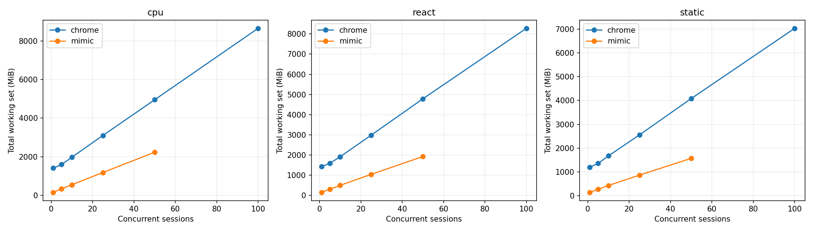
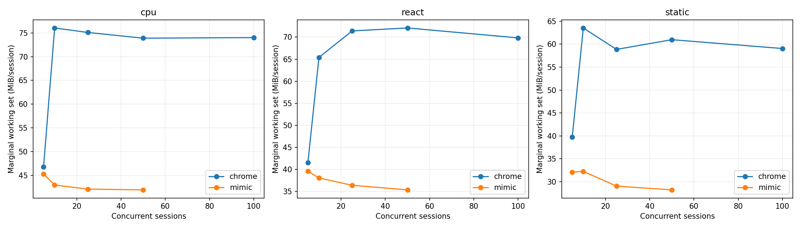
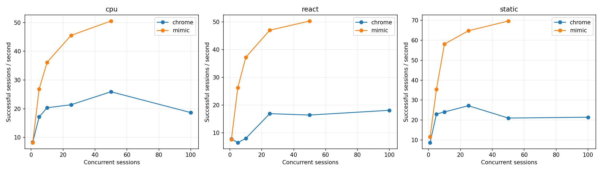
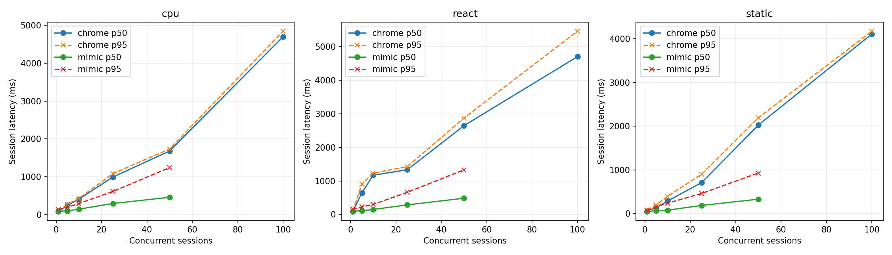
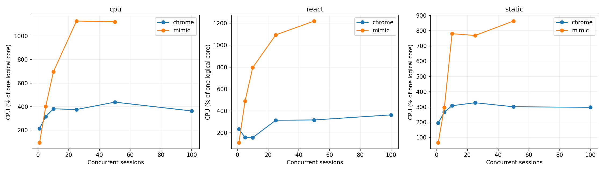

# Mimic V8 и Chrome 152: baseline Windows x64

Это измерение после исправления ошибок семантики, разрешённого пользователем. Оптимизации runtime ради производительности не выполнялись. Проверка исходной версии сохранена отдельно в `pre-fix/raw.json`.

## Окружение

| Параметр | Значение |
|---|---|
| Дата начала / конца | 2026-09-14T03:42:47.674701+04:00 / 2026-09-14T03:56:50.108854+04:00 |
| Chrome | {'protocolVersion': '1.3', 'product': 'Chrome/152.0.7977.82', 'revision': '@d04cdb24d67b081f6cf80200ffc5233f44b61109', 'userAgent': 'Mozilla/5.0 (Windows NT 10.0; Win64; x64) AppleWebKit/537.36 (KHTML, like Gecko) HeadlessChrome/152.0.0.0 Safari/537.36', 'jsVersion': '15.2.124.21'} |
| Chromium | 1669021 / d04cdb24d67b081f6cf80200ffc5233f44b61109 |
| Mimic commit | f07bd2d643eebbadc28d582ef93f01c832a50106 |
| Mimic V8 | 15.2.124.1-rusty |
| OS | Windows-11-10.0.26200-SP0 |
| CPU | {"Name":"Intel(R) Core(TM) i7-14700KF","NumberOfCores":20,"NumberOfLogicalProcessors":28} |
| CPU physical / logical | 20 / 28 |
| RAM GiB | 31.83 |
| План питания | GUID схемы питания: 381b4222-f694-41f0-9685-ff5bb260df2e  (Сбалансированная) |
| Power overlay | 0 00000000-0000-0000-0000-000000000000 |
| Антивирус | {"displayName":"Windows Defender","productState":397568} |
| Chrome SHA-256 | ea36dd818a90176f1a70616f0363d9be527229389a6c073a0b1688b9e73f67e9 |
| Mimic SHA-256 | eb6b31f79744ae659ad50b26da253fdbbc8a5d2ed6cff4c5a31b3acd71e30c20 |

Рабочая станция не была эксклюзивно выделена тесту: фоновые приложения и антивирус включены. Список процессов, версии инструментов, аргументы, SHA-256 фикстур и бинарников находятся в raw.json.

## Методика и корректность

В обеих системах создаётся новая страница и уникальный loopback-origin. HTTP cache отключён, ответы no-store; cookie не используются. Контексты, транспорт и процесс в warm сохраняются, состояние страницы не используется повторно. Это изоляция для данного контролируемого корпуса, а не проверка tenant/security isolation. Cold создаёт новый процесс и профиль. Кэш файлов Windows, DLL и DNS ОС не очищается; «cold» означает новый процесс, а не холодный диск. Вариант warm HTTP cache не измерялся.

Навигация заканчивается только при точном URL, document.readyState === "complete" и наличии __benchRun. Затем одинаковый явный запуск __benchRun; завершение — done и точное совпадение детерминированного результата. Settle = 0. Paint/networkidle не ожидаются. Chrome headless=new; результаты не переносятся автоматически на headful.

Внешние часы perf_counter/QPC; polling 5 ms плюс задержка CDP/планировщика ОС. navigation_ms включает разбор HTML и загрузку скриптов, execution_ms — запуск/выполнение приложения и обнаружение маркера. Они не являются изолированным временем JIT или чистого JavaScript. js_ms страницы диагностический: в Mimic виртуальное время часто равно нулю.

Процесс запускается приостановленным, включается в Windows Job Object, затем возобновляется. process_start_ms — вызов создания процесса; CDP readiness отсчитывается от начала создания до ответа протокола. runtime_initialization_ms — остаток между ними; внутренние фазы V8 отдельно не инструментированы. Cold total включает создание страницы, выполнение, teardown и завершение процесса; удаление временного профиля и обслуживание локального сервера не включены.

CPU — user+kernel всего Job Object, включая завершившихся потомков. Working set/private bytes — сумма всех текущих участников Job Object каждые 50 ms и в контрольных точках. Кратковременные пики памяти могут быть пропущены, общие страницы DLL могут учитываться несколько раз. CPU % задан относительно одного логического ядра; 100% машины = 2800%. Пики CPU чувствительны к дискретности счётчиков Windows.

Одна проверка и по одному первоначальному warmup на серию исключены явно. Основные серии: 10 cold и 20 warm, без удаления медленных наблюдений. p95 публикуется при n≥10, p99 при n≥100; используется линейная интерполяция эмпирических квантилей, хвосты при n=10–20 особенно неустойчивы. SD и CV, min/max всех серий доступны в summary.csv. Ускорение не агрегируется в одно отношение.

| Система / workload | Correctness gate |
|---|---|
| chrome/async | VALID |
| chrome/cpu | VALID |
| chrome/dom | VALID |
| chrome/react | VALID |
| chrome/static | VALID |
| chrome/wasm | VALID |
| mimic/async | VALID |
| mimic/cpu | VALID |
| mimic/dom | VALID |
| mimic/react | VALID |
| mimic/static | VALID |
| mimic/wasm | VALID |

### CDP readiness: отдельная серия с одинаковой пробой

В финальной серии обе системы отвечают на Target.getTargets после WebSocket handshake. По 10 новых процессов, порядок систем чередуется; warmup исключён. Дата: 2026-09-14T03:56:10.134683+04:00. Основная серия использует ту же общую пробу.

| Система | n | CDP p50 ms | p95 | Min | Max | SD | Ready RSS MiB |
|---|---|---|---|---|---|---|---|
| mimic | 10 | 229.57 | 276.30 | 217.77 | 287.09 | 21.47 | 28.84 |
| chrome | 10 | 236.68 | 269.42 | 222.52 | 279.31 | 16.18 | 376.26 |

## Cold startup (медианы, ms)

| Система | Workload | n | Process create | CDP ready | Runtime init | Cold total | Shutdown |
|---|---|---|---|---|---|---|---|
| chrome | static | 10 | 5.99 | 243.93 | 238.13 | 418.52 | 92.15 |
| mimic | static | 10 | 5.82 | 232.27 | 226.26 | 603.77 | 55.94 |
| mimic | cpu | 10 | 5.21 | 227.82 | 221.79 | 618.03 | 49.32 |
| chrome | cpu | 10 | 5.99 | 237.62 | 230.92 | 434.52 | 100.64 |
| chrome | dom | 10 | 6.20 | 240.70 | 233.36 | 420.75 | 94.15 |
| mimic | dom | 10 | 4.82 | 215.32 | 210.73 | 665.23 | 49.68 |
| mimic | async | 10 | 6.05 | 218.21 | 212.69 | 650.65 | 54.56 |
| chrome | async | 10 | 5.79 | 245.82 | 240.79 | 457.93 | 100.17 |
| chrome | react | 10 | 4.73 | 270.43 | 263.95 | 484.00 | 99.94 |
| mimic | react | 10 | 4.46 | 219.88 | 212.75 | 641.90 | 53.00 |
| mimic | wasm | 10 | 5.66 | 227.10 | 220.47 | 591.00 | 52.48 |
| chrome | wasm | 10 | 6.13 | 248.63 | 241.37 | 450.47 | 102.18 |

## Warm session startup / teardown (медианы)

| Система | Workload | n | Create ms | Teardown ms | RSS после teardown MiB |
|---|---|---|---|---|---|
| chrome | static | 20 | 37.14 | 13.66 | 1192.59 |
| mimic | static | 20 | 8.89 | 6.37 | 106.10 |
| mimic | cpu | 20 | 13.32 | 7.90 | 118.55 |
| chrome | cpu | 20 | 34.04 | 13.05 | 1408.86 |
| chrome | dom | 20 | 34.12 | 13.47 | 1381.75 |
| mimic | dom | 20 | 13.08 | 7.53 | 123.49 |
| mimic | async | 20 | 12.32 | 6.73 | 122.13 |
| chrome | async | 20 | 38.32 | 13.60 | 1223.10 |
| chrome | react | 20 | 34.52 | 14.08 | 1401.66 |
| mimic | react | 20 | 8.69 | 7.36 | 115.19 |
| mimic | wasm | 20 | 12.99 | 5.95 | 115.68 |
| chrome | wasm | 20 | 35.76 | 13.43 | 1276.15 |

## Single-session workload latency (ms)

| Система | Workload | Mode | n | Nav p50 | Execution p50 | Completion p50 | p95 | Min | Max | SD | CV |
|---|---|---|---|---|---|---|---|---|---|---|---|
| chrome | static | cold | 10 | 21.88 | 2.81 | 24.60 | 78.52 | 20.55 | 106.51 | 26.17 | 0.74 |
| mimic | static | cold | 10 | 291.27 | 3.34 | 295.47 | 305.01 | 284.73 | 307.71 | 6.87 | 0.02 |
| chrome | static | warm | 20 | 22.35 | 4.79 | 27.29 | 32.87 | 19.07 | 33.41 | 4.68 | 0.18 |
| mimic | static | warm | 20 | 34.84 | 3.61 | 38.63 | 44.76 | 30.59 | 95.87 | 13.55 | 0.34 |
| mimic | cpu | cold | 10 | 283.27 | 35.30 | 318.66 | 323.26 | 314.16 | 323.64 | 2.67 | 0.01 |
| chrome | cpu | cold | 10 | 19.81 | 29.92 | 53.43 | 71.05 | 46.52 | 71.07 | 9.10 | 0.16 |
| mimic | cpu | warm | 20 | 32.63 | 39.63 | 72.48 | 93.30 | 62.60 | 126.44 | 14.32 | 0.19 |
| chrome | cpu | warm | 20 | 21.78 | 27.80 | 49.36 | 54.37 | 42.54 | 57.17 | 3.88 | 0.08 |
| chrome | dom | cold | 10 | 21.27 | 11.57 | 33.76 | 48.27 | 29.00 | 58.43 | 8.50 | 0.24 |
| mimic | dom | cold | 10 | 283.42 | 90.49 | 373.50 | 382.55 | 368.45 | 384.70 | 5.17 | 0.01 |
| chrome | dom | warm | 20 | 22.59 | 29.63 | 52.26 | 55.74 | 44.35 | 57.82 | 3.88 | 0.08 |
| mimic | dom | warm | 20 | 32.87 | 96.58 | 131.10 | 150.69 | 119.43 | 194.53 | 16.72 | 0.12 |
| mimic | async | cold | 10 | 289.45 | 61.64 | 350.17 | 358.74 | 334.29 | 359.37 | 7.55 | 0.02 |
| chrome | async | cold | 10 | 20.95 | 28.35 | 49.79 | 56.94 | 47.10 | 57.25 | 3.74 | 0.07 |
| mimic | async | warm | 20 | 33.20 | 67.90 | 101.73 | 118.27 | 86.52 | 162.23 | 15.80 | 0.15 |
| chrome | async | warm | 20 | 22.89 | 28.92 | 54.24 | 56.00 | 37.93 | 56.00 | 5.38 | 0.11 |
| chrome | react | cold | 10 | 25.89 | 19.99 | 47.45 | 75.62 | 36.60 | 90.43 | 15.79 | 0.31 |
| mimic | react | cold | 10 | 300.74 | 40.20 | 341.72 | 361.79 | 329.72 | 367.84 | 12.22 | 0.04 |
| chrome | react | warm | 20 | 23.77 | 23.43 | 47.59 | 52.75 | 42.74 | 53.84 | 2.91 | 0.06 |
| mimic | react | warm | 20 | 42.18 | 42.14 | 84.21 | 116.60 | 76.29 | 171.93 | 20.93 | 0.23 |
| mimic | wasm | cold | 10 | 284.59 | 3.93 | 288.45 | 294.46 | 284.43 | 295.28 | 3.71 | 0.01 |
| chrome | wasm | cold | 10 | 27.33 | 6.20 | 34.82 | 41.58 | 26.47 | 42.99 | 5.63 | 0.16 |
| mimic | wasm | warm | 20 | 33.69 | 4.09 | 38.33 | 67.33 | 32.81 | 96.90 | 14.82 | 0.35 |
| chrome | wasm | warm | 20 | 21.38 | 4.91 | 27.35 | 34.80 | 19.73 | 36.96 | 5.23 | 0.19 |

## Single-session память / CPU (медианы)

| Система | Workload | Mode | До страницы MiB | После create MiB | Peak RSS MiB | Peak private MiB | CPU/session ms | CPU/workload ms |
|---|---|---|---|---|---|---|---|---|
| chrome | static | cold | 379.96 | 428.04 | 485.41 | 257.51 | 328.12 | 125.00 |
| mimic | static | cold | 28.81 | 29.40 | 139.81 | 170.89 | 445.31 | 437.50 |
| chrome | static | warm | 1131.63 | 1180.70 | 1192.59 | 595.12 | 187.50 | 62.50 |
| mimic | static | warm | 105.96 | 105.96 | 132.14 | 161.73 | 46.88 | 31.25 |
| mimic | cpu | cold | 28.88 | 29.22 | 142.00 | 172.36 | 421.88 | 421.88 |
| chrome | cpu | cold | 373.37 | 424.82 | 520.33 | 277.56 | 367.19 | 195.31 |
| mimic | cpu | warm | 118.55 | 118.57 | 158.16 | 187.26 | 93.75 | 78.12 |
| chrome | cpu | warm | 1329.29 | 1377.77 | 1408.86 | 789.30 | 250.00 | 93.75 |
| chrome | dom | cold | 374.16 | 422.40 | 492.15 | 261.14 | 320.31 | 140.62 |
| mimic | dom | cold | 28.81 | 30.12 | 149.53 | 179.42 | 539.06 | 523.44 |
| chrome | dom | warm | 1297.80 | 1345.72 | 1381.75 | 735.54 | 226.56 | 109.38 |
| mimic | dom | warm | 122.94 | 122.94 | 161.49 | 190.82 | 234.38 | 179.69 |
| mimic | async | cold | 28.85 | 29.48 | 148.31 | 181.21 | 453.12 | 453.12 |
| chrome | async | cold | 379.06 | 428.61 | 515.88 | 281.44 | 437.50 | 195.31 |
| mimic | async | warm | 122.13 | 122.13 | 156.70 | 189.73 | 156.25 | 125.00 |
| chrome | async | warm | 1157.51 | 1206.01 | 1223.23 | 626.18 | 210.94 | 101.56 |
| chrome | react | cold | 380.80 | 427.33 | 526.63 | 288.69 | 453.12 | 179.69 |
| mimic | react | cold | 28.81 | 29.17 | 141.28 | 171.19 | 484.38 | 476.56 |
| chrome | react | warm | 1319.33 | 1368.58 | 1401.66 | 797.12 | 234.38 | 125.00 |
| mimic | react | warm | 115.14 | 115.14 | 149.13 | 178.77 | 148.44 | 140.62 |
| mimic | wasm | cold | 28.81 | 29.19 | 141.72 | 171.82 | 367.19 | 359.38 |
| chrome | wasm | cold | 375.47 | 431.36 | 502.95 | 268.78 | 328.12 | 164.06 |
| mimic | wasm | warm | 115.64 | 115.65 | 142.01 | 172.05 | 46.88 | 46.88 |
| chrome | wasm | warm | 1208.36 | 1251.89 | 1276.15 | 632.98 | 187.50 | 62.50 |

## Concurrency / density

Каждый уровень — отдельный процесс; один исключённый warmup и max(5, ceil(20/N)) измеряемых волн. Страницы создаются параллельно; после барьера все начинают навигацию. Завершившиеся страницы удерживаются до окончания волны для одновременного RSS. Throughput = успешные сессии / время create→последний teardown, включая барьер и измерения, но без HTTP-server setup/cleanup. Latency = create→completion, включая ожидание барьера. Это batch throughput, не оптимизированный постоянный поток запросов. Удержание не добавляется в latency, но входит в throughput. CPU на сессию = CPU всей волны / число успехов; пересекающиеся интервалы CPU отдельных страниц не суммируются.

Пределы остановки: любая ошибка, <15% либо <2 GiB доступной RAM, >1024 pages input/s в течение 3 s, timeout 180 s. Это защита рабочей машины; максимум прошедшего уровня — нижняя граница поддержанной здесь ёмкости, не доказательство абсолютного максимума.

Mimic сериализует команды CDP общим mutex. Измерение включает это поведение; профилирование причин затрат не проводилось. В строках с остановкой RSS может быть снят раньше завершения всех страниц, а число волн 0 означает остановку на исключаемом warmup. Такие строки диагностические и не входят в fit/графики стабильных уровней. Между волнами дополнительно выполняются 250 ms recovery, очистка серверов и запись checkpoint вне batch throughput.

| Система | Workload | N | Волн | Успех % | RSS MiB | RSS/N MiB | Peak MiB | CPU/session ms | Сессий/s | p50 ms | p95 ms | p99 ms | Стоп |
|---|---|---|---|---|---|---|---|---|---|---|---|---|---|
| chrome | static | 1 | 20 | 100.00 | 1195.82 | 1195.82 | 1205.32 | 224.22 | 8.70 | 61.97 | 82.13 | — |  |
| mimic | static | 1 | 20 | 100.00 | 137.99 | 137.99 | 187.22 | 57.03 | 11.60 | 51.60 | 64.50 | — |  |
| chrome | static | 5 | 5 | 100.00 | 1354.80 | 270.96 | 1367.39 | 115.62 | 23.03 | 137.39 | 199.05 | — |  |
| mimic | static | 5 | 5 | 100.00 | 266.34 | 53.27 | 362.50 | 83.75 | 35.40 | 63.79 | 159.63 | — |  |
| chrome | static | 10 | 5 | 100.00 | 1672.49 | 167.25 | 1686.94 | 128.12 | 24.05 | 290.62 | 397.50 | — |  |
| mimic | static | 10 | 5 | 100.00 | 427.59 | 42.76 | 564.43 | 134.38 | 58.08 | 80.33 | 241.19 | — |  |
| chrome | static | 25 | 5 | 100.00 | 2555.39 | 102.22 | 2561.23 | 120.50 | 27.19 | 711.17 | 901.96 | 905.79 |  |
| mimic | static | 25 | 5 | 100.00 | 863.17 | 34.53 | 1174.99 | 118.75 | 64.73 | 188.54 | 462.80 | 473.98 |  |
| chrome | static | 50 | 5 | 100.00 | 4079.95 | 81.60 | 4091.47 | 143.44 | 21.00 | 2027.50 | 2195.72 | 2211.79 |  |
| mimic | static | 50 | 5 | 100.00 | 1568.62 | 31.37 | 2144.62 | 124.00 | 69.64 | 331.35 | 930.56 | 949.41 |  |
| chrome | static | 100 | 5 | 100.00 | 7032.88 | 70.33 | 7053.25 | 138.97 | 21.42 | 4110.67 | 4175.27 | 4198.20 |  |
| mimic | static | 100 | 0 | 100.00 | 4261.57 | 42.62 | 4261.57 | 556.56 | 28.33 | 2557.25 | 3343.95 | 3399.61 | memory pressure (<15% or 2 GiB available) |
| chrome | cpu | 1 | 20 | 100.00 | 1410.04 | 1410.04 | 1417.99 | 257.03 | 8.36 | 85.73 | 95.52 | — |  |
| mimic | cpu | 1 | 20 | 100.00 | 155.96 | 155.96 | 188.32 | 114.84 | 8.21 | 92.94 | 133.98 | — |  |
| chrome | cpu | 5 | 5 | 100.00 | 1597.24 | 319.45 | 1601.87 | 183.75 | 17.15 | 247.96 | 274.49 | — |  |
| mimic | cpu | 5 | 5 | 100.00 | 337.32 | 67.46 | 362.98 | 149.38 | 26.85 | 98.19 | 193.31 | — |  |
| chrome | cpu | 10 | 5 | 100.00 | 1977.37 | 197.74 | 1982.36 | 187.50 | 20.35 | 409.45 | 429.01 | — |  |
| mimic | cpu | 10 | 5 | 100.00 | 552.32 | 55.23 | 580.13 | 192.50 | 36.18 | 145.93 | 294.93 | — |  |
| chrome | cpu | 25 | 5 | 100.00 | 3103.66 | 124.15 | 3123.67 | 175.50 | 21.40 | 994.76 | 1083.35 | 1090.24 |  |
| mimic | cpu | 25 | 5 | 100.00 | 1184.45 | 47.38 | 1195.39 | 247.50 | 45.55 | 295.74 | 612.08 | 621.09 |  |
| chrome | cpu | 50 | 5 | 100.00 | 4950.75 | 99.02 | 4964.87 | 169.12 | 25.91 | 1681.99 | 1736.31 | 1747.76 |  |
| mimic | cpu | 50 | 5 | 100.00 | 2233.92 | 44.68 | 2238.53 | 221.81 | 50.55 | 458.99 | 1243.97 | 1285.46 |  |
| chrome | cpu | 100 | 5 | 100.00 | 8651.08 | 86.51 | 8666.10 | 194.62 | 18.66 | 4699.94 | 4846.18 | 4866.47 |  |
| mimic | cpu | 100 | 0 | 100.00 | 4784.39 | 47.84 | 6307.08 | 734.06 | 19.29 | 3682.84 | 3759.76 | 3789.02 | memory pressure (<15% or 2 GiB available) |
| chrome | react | 1 | 20 | 100.00 | 1420.46 | 1420.46 | 1429.41 | 300.78 | 7.82 | 90.05 | 106.25 | — |  |
| mimic | react | 1 | 20 | 100.00 | 147.53 | 147.53 | 180.48 | 146.88 | 7.61 | 97.67 | 154.02 | — |  |
| chrome | react | 5 | 5 | 100.00 | 1586.57 | 317.31 | 1596.41 | 246.25 | 6.47 | 644.86 | 903.38 | — |  |
| mimic | react | 5 | 5 | 100.00 | 305.87 | 61.17 | 370.45 | 186.88 | 26.23 | 108.70 | 226.02 | — |  |
| chrome | react | 10 | 5 | 100.00 | 1913.55 | 191.36 | 1920.82 | 197.19 | 7.98 | 1170.88 | 1232.73 | — |  |
| mimic | react | 10 | 5 | 100.00 | 495.99 | 49.60 | 581.81 | 214.06 | 37.20 | 147.99 | 299.78 | — |  |
| chrome | react | 25 | 5 | 100.00 | 2984.65 | 119.39 | 2996.36 | 186.75 | 16.91 | 1331.38 | 1424.43 | 1429.02 |  |
| mimic | react | 25 | 5 | 100.00 | 1041.46 | 41.66 | 1215.67 | 232.75 | 46.98 | 285.70 | 660.17 | 673.78 |  |
| chrome | react | 50 | 5 | 100.00 | 4786.41 | 95.73 | 4866.86 | 194.00 | 16.40 | 2647.81 | 2872.87 | 2926.41 |  |
| mimic | react | 50 | 5 | 100.00 | 1924.60 | 38.49 | 2303.05 | 242.50 | 50.29 | 483.60 | 1329.49 | 1349.62 |  |
| chrome | react | 100 | 5 | 100.00 | 8277.64 | 82.78 | 8536.26 | 201.19 | 18.12 | 4704.37 | 5464.82 | 5488.13 |  |
| mimic | react | 100 | 0 | 100.00 | 4914.61 | 49.15 | 4965.95 | 686.25 | 19.66 | 3206.27 | 4171.88 | 4985.74 | memory pressure (<15% or 2 GiB available) |

## Marginal RAM/session

Измерена конечная разность между соседними протестированными N, делённая на ΔN; это не прямое измерение каждого N→N+1. Линейная модель — описательный OLS fit по медианам только успешных уровней. Пересечение — экстраполяция; реальный startup overhead включает исходную пустую страницу. Общий RSS включает процессы и кэши, оставшиеся от предыдущих волн, а число волн зависит от N. Поэтому fit смешивает стоимость активных страниц с историей процесса. Дополнительно показан прирост RSS относительно начала той же волны: он тоже может включать фоновую активность и GC.

| Система | Workload | N | (Active RSS − before wave RSS)/N MiB |
|---|---|---|---|
| chrome | static | 1 | 58.89 |
| mimic | static | 1 | 26.40 |
| chrome | static | 5 | 57.80 |
| mimic | static | 5 | 26.06 |
| chrome | static | 10 | 55.12 |
| mimic | static | 10 | 25.71 |
| chrome | static | 25 | 56.82 |
| mimic | static | 25 | 25.91 |
| chrome | static | 50 | 57.57 |
| mimic | static | 50 | 24.67 |
| chrome | static | 100 | 58.13 |
| mimic | static | 100 | 42.33 |
| chrome | cpu | 1 | 77.74 |
| mimic | cpu | 1 | 39.92 |
| chrome | cpu | 5 | 67.14 |
| mimic | cpu | 5 | 38.92 |
| chrome | cpu | 10 | 70.38 |
| mimic | cpu | 10 | 39.60 |
| chrome | cpu | 25 | 71.91 |
| mimic | cpu | 25 | 39.14 |
| chrome | cpu | 50 | 72.39 |
| mimic | cpu | 50 | 39.45 |
| chrome | cpu | 100 | 72.86 |
| mimic | cpu | 100 | 47.56 |
| chrome | react | 1 | 80.53 |
| mimic | react | 1 | 32.44 |
| chrome | react | 5 | 65.05 |
| mimic | react | 5 | 32.17 |
| chrome | react | 10 | 66.26 |
| mimic | react | 10 | 32.02 |
| chrome | react | 25 | 68.35 |
| mimic | react | 25 | 31.40 |
| chrome | react | 50 | 69.19 |
| mimic | react | 50 | 31.59 |
| chrome | react | 100 | 69.44 |
| mimic | react | 100 | 48.86 |

| Система | Workload | N low→high | ΔRSS MiB | ΔRSS/ΔN MiB |
|---|---|---|---|---|
| chrome | cpu | 1→5 | 187.20 | 46.80 |
| chrome | cpu | 5→10 | 380.13 | 76.03 |
| chrome | cpu | 10→25 | 1126.30 | 75.09 |
| chrome | cpu | 25→50 | 1847.09 | 73.88 |
| chrome | cpu | 50→100 | 3700.33 | 74.01 |
| mimic | cpu | 1→5 | 181.37 | 45.34 |
| mimic | cpu | 5→10 | 215.00 | 43.00 |
| mimic | cpu | 10→25 | 632.13 | 42.14 |
| mimic | cpu | 25→50 | 1049.46 | 41.98 |
| chrome | react | 1→5 | 166.11 | 41.53 |
| chrome | react | 5→10 | 326.98 | 65.40 |
| chrome | react | 10→25 | 1071.10 | 71.41 |
| chrome | react | 25→50 | 1801.76 | 72.07 |
| chrome | react | 50→100 | 3491.23 | 69.82 |
| mimic | react | 1→5 | 158.34 | 39.59 |
| mimic | react | 5→10 | 190.12 | 38.02 |
| mimic | react | 10→25 | 545.47 | 36.36 |
| mimic | react | 25→50 | 883.14 | 35.33 |
| chrome | static | 1→5 | 158.98 | 39.75 |
| chrome | static | 5→10 | 317.69 | 63.54 |
| chrome | static | 10→25 | 882.90 | 58.86 |
| chrome | static | 25→50 | 1524.57 | 60.98 |
| chrome | static | 50→100 | 2952.92 | 59.06 |
| mimic | static | 1→5 | 128.35 | 32.09 |
| mimic | static | 5→10 | 161.25 | 32.25 |
| mimic | static | 10→25 | 435.59 | 29.04 |
| mimic | static | 25→50 | 705.45 | 28.22 |

| Система | Workload | Fixed fit MiB | Marginal fit MiB | R² | Max stable N |
|---|---|---|---|---|---|
| chrome | cpu | 1266.92 | 73.76 | 1.00 | 100 |
| mimic | cpu | 123.29 | 42.28 | 1.00 | 50 |
| chrome | react | 1263.40 | 70.10 | 1.00 | 100 |
| mimic | react | 125.27 | 36.14 | 1.00 | 50 |
| chrome | static | 1089.32 | 59.45 | 1.00 | 100 |
| mimic | static | 123.72 | 29.07 | 1.00 | 50 |

## Teardown / recovery

| Система | Workload | N | Ready RSS MiB | RSS после волн MiB | CPU всей серии s | CPU % |
|---|---|---|---|---|---|---|
| chrome | static | 1 | 379.84 | 1138.68 | 4.48 | 194.96 |
| mimic | static | 1 | 29.36 | 111.55 | 1.14 | 66.14 |
| chrome | static | 5 | 371.67 | 1100.93 | 2.89 | 266.25 |
| mimic | static | 5 | 28.91 | 128.91 | 2.09 | 296.51 |
| chrome | static | 10 | 376.20 | 1129.30 | 6.41 | 308.15 |
| mimic | static | 10 | 28.83 | 166.00 | 6.72 | 780.50 |
| chrome | static | 25 | 374.35 | 1135.20 | 15.06 | 327.62 |
| mimic | static | 25 | 29.37 | 226.32 | 14.84 | 768.72 |
| chrome | static | 50 | 381.90 | 1204.00 | 35.86 | 301.24 |
| mimic | static | 50 | 29.18 | 327.83 | 31.00 | 863.50 |
| chrome | static | 100 | 369.26 | 1230.30 | 69.48 | 297.66 |
| mimic | static | 100 | 28.78 | 220.37 | 55.66 | 1576.55 |
| chrome | cpu | 1 | 376.14 | 1333.15 | 5.14 | 214.80 |
| mimic | cpu | 1 | 28.78 | 116.28 | 2.30 | 94.26 |
| chrome | cpu | 5 | 378.48 | 1264.19 | 4.59 | 315.17 |
| mimic | cpu | 5 | 29.33 | 138.62 | 3.73 | 401.07 |
| chrome | cpu | 10 | 368.79 | 1279.54 | 9.38 | 381.52 |
| mimic | cpu | 10 | 28.82 | 159.82 | 9.62 | 696.43 |
| chrome | cpu | 25 | 387.15 | 1321.52 | 21.94 | 375.51 |
| mimic | cpu | 25 | 28.85 | 194.19 | 30.94 | 1127.48 |
| chrome | cpu | 50 | 363.46 | 1340.87 | 42.28 | 438.21 |
| mimic | cpu | 50 | 28.73 | 256.05 | 55.45 | 1121.25 |
| chrome | cpu | 100 | 367.27 | 1377.55 | 97.31 | 363.26 |
| mimic | cpu | 100 | 28.74 | 332.48 | 73.41 | 1416.17 |
| chrome | react | 1 | 364.56 | 1341.79 | 6.02 | 235.07 |
| mimic | react | 1 | 29.18 | 115.53 | 2.94 | 111.72 |
| chrome | react | 5 | 366.00 | 1267.60 | 6.16 | 159.27 |
| mimic | react | 5 | 28.89 | 145.00 | 4.67 | 490.17 |
| chrome | react | 10 | 388.20 | 1251.44 | 9.86 | 157.35 |
| mimic | react | 10 | 28.73 | 176.36 | 10.70 | 796.22 |
| chrome | react | 25 | 372.82 | 1278.16 | 23.34 | 315.77 |
| mimic | react | 25 | 28.79 | 251.05 | 29.09 | 1093.36 |
| chrome | react | 50 | 383.91 | 1328.32 | 48.50 | 318.18 |
| mimic | react | 50 | 28.73 | 351.08 | 60.62 | 1219.64 |
| chrome | react | 100 | 368.21 | 1356.93 | 100.59 | 364.47 |
| mimic | react | 100 | 28.94 | 541.29 | 68.62 | 1349.05 |

## Локальный сервер (измеряется независимо)

Время обработчика HTTP — от получения запроса обработчиком до завершения записи ответа; не включает очередь TCP/планировщика сервера или сетевой roundtrip. До основного workload сервер создаётся вне измеряемого интервала. Запросы и bytes каждого ресурса записаны в raw.json.

| Система | Workload | Mode | Запросов | Server p50 ms | Server p95 ms | Server max ms |
|---|---|---|---|---|---|---|
| chrome | static | cold | 20 | 0.30 | 0.40 | 0.46 |
| mimic | static | cold | 20 | 0.35 | 0.54 | 0.74 |
| chrome | static | warm | 40 | 0.30 | 0.41 | 0.47 |
| mimic | static | warm | 40 | 0.21 | 0.72 | 2.38 |
| mimic | cpu | cold | 20 | 0.24 | 0.94 | 1.52 |
| chrome | cpu | cold | 20 | 0.29 | 0.51 | 0.52 |
| mimic | cpu | warm | 40 | 0.24 | 1.15 | 2.00 |
| chrome | cpu | warm | 40 | 0.26 | 0.45 | 0.65 |
| chrome | dom | cold | 20 | 0.31 | 0.50 | 0.50 |
| mimic | dom | cold | 20 | 0.24 | 0.71 | 1.26 |
| chrome | dom | warm | 40 | 0.27 | 0.44 | 0.51 |
| mimic | dom | warm | 40 | 0.27 | 1.79 | 3.01 |
| mimic | async | cold | 50 | 0.22 | 1.01 | 1.89 |
| chrome | async | cold | 50 | 0.16 | 0.47 | 0.52 |
| mimic | async | warm | 100 | 0.14 | 0.72 | 1.89 |
| chrome | async | warm | 100 | 0.17 | 0.43 | 1.14 |
| chrome | react | cold | 50 | 0.41 | 1.02 | 1.27 |
| mimic | react | cold | 50 | 0.33 | 0.62 | 1.51 |
| chrome | react | warm | 100 | 0.35 | 0.98 | 2.18 |
| mimic | react | warm | 100 | 0.33 | 1.33 | 2.88 |
| mimic | wasm | cold | 20 | 0.27 | 0.46 | 1.13 |
| chrome | wasm | cold | 20 | 0.30 | 0.48 | 0.51 |
| mimic | wasm | warm | 40 | 0.24 | 0.72 | 0.85 |
| chrome | wasm | warm | 40 | 0.26 | 0.43 | 0.59 |

## Валидность измеряемых серий

| Система | Workload | Mode | Успех / попыток | Использование сравнения |
|---|---|---|---|---|
| chrome | static | cold | 10/10 | VALID |
| mimic | static | cold | 10/10 | VALID |
| chrome | static | warm | 20/20 | VALID |
| mimic | static | warm | 20/20 | VALID |
| mimic | cpu | cold | 10/10 | VALID |
| chrome | cpu | cold | 10/10 | VALID |
| mimic | cpu | warm | 20/20 | VALID |
| chrome | cpu | warm | 20/20 | VALID |
| chrome | dom | cold | 10/10 | VALID |
| mimic | dom | cold | 10/10 | VALID |
| chrome | dom | warm | 20/20 | VALID |
| mimic | dom | warm | 20/20 | VALID |
| mimic | async | cold | 10/10 | VALID |
| chrome | async | cold | 10/10 | VALID |
| mimic | async | warm | 20/20 | VALID |
| chrome | async | warm | 20/20 | VALID |
| chrome | react | cold | 10/10 | VALID |
| mimic | react | cold | 10/10 | VALID |
| chrome | react | warm | 20/20 | VALID |
| mimic | react | warm | 20/20 | VALID |
| mimic | wasm | cold | 10/10 | VALID |
| chrome | wasm | cold | 10/10 | VALID |
| mimic | wasm | warm | 20/20 | VALID |
| chrome | wasm | warm | 20/20 | VALID |

## Инженерный вывод

1. По медиане warm navigation→completion Mimic быстрее: ни на одной из измеренных нагрузок. CDP readiness (общая проба, отдельные cold): mimic 229.57 ms; chrome 236.68 ms

2. Chrome быстрее по той же метрике: async (101.73 / 54.24 ms Mimic/Chrome); cpu (72.48 / 49.36 ms Mimic/Chrome); dom (131.10 / 52.26 ms Mimic/Chrome); react (84.21 / 47.59 ms Mimic/Chrome); static (38.63 / 27.29 ms Mimic/Chrome); wasm (38.33 / 27.35 ms Mimic/Chrome).

3. Фиксированный overhead процесса (CDP ready, включая исходную страницу): mimic 28.83 MiB; chrome 381.30 MiB. Startup latency и OLS intercept приведены отдельно выше.

4. Оценки marginal RAM/session: chrome/cpu 73.76 MiB; mimic/cpu 42.28 MiB; chrome/react 70.10 MiB; mimic/react 36.14 MiB; chrome/static 59.45 MiB; mimic/static 29.07 MiB.

5. Максимальный стабильный N по нагрузке: mimic/cpu 50; chrome/cpu 100; mimic/react 50; chrome/react 100; mimic/static 50; chrome/static 100.

6. Throughput на максимальном общем стабильном уровне:

cpu, N=50: Mimic 50.55 и Chrome 25.91 успешных сессий/s; RSS 2233.92 и 4950.75 MiB; CPU/session 221.81 и 169.12 ms.

react, N=50: Mimic 50.29 и Chrome 16.40 успешных сессий/s; RSS 1924.60 и 4786.41 MiB; CPU/session 242.50 и 194.00 ms.

static, N=50: Mimic 69.64 и Chrome 21.00 успешных сессий/s; RSS 1568.62 и 4079.95 MiB; CPU/session 124.00 и 143.44 ms.

7. Невалидные сравнения после исправлений: нет на correctness gate; ошибки отдельных итераций остаются в raw.json. До исправлений: DOM, async, React, WebAssembly (см. pre-fix).

8. Ограничения: одна занятая рабочая станция; headless Chrome; различные сборки V8; HTTP cache отключён; ограниченные размеры и семантические проверки корпуса; React-фикстура синтетическая, не Next.js/production-приложение. Polling и sampler входят в нагрузку системы. RSS — сумма рабочих наборов, не уникальная физическая RAM; нет финансовой модели стоимости сессии. Paging — общесистемный счётчик, не атрибуция hard faults конкретному процессу. Значения виртуальных часов Mimic не используются для сравнений.

9. Наиболее сильная защищаемая формулировка для README: «На Windows x64 локальные контролируемые нагрузки прошли проверку результатов в Mimic V8 и Chrome 152.0.7977.82; опубликованы воспроизводимый harness, исходные наблюдения и отдельные показатели latency, CPU и памяти. cpu, N=50: Mimic 50.55 и Chrome 25.91 успешных сессий/s; RSS 2233.92 и 4950.75 MiB; CPU/session 221.81 и 169.12 ms.»

10. Данные НЕ подтверждают утверждение «Mimic в X раз быстрее Chrome вообще», полную совместимость с браузером, безопасность изоляции tenants, преимущество чистого V8/JIT, выигрыш на произвольных сайтах или денежную экономию без модели эксплуатации.
