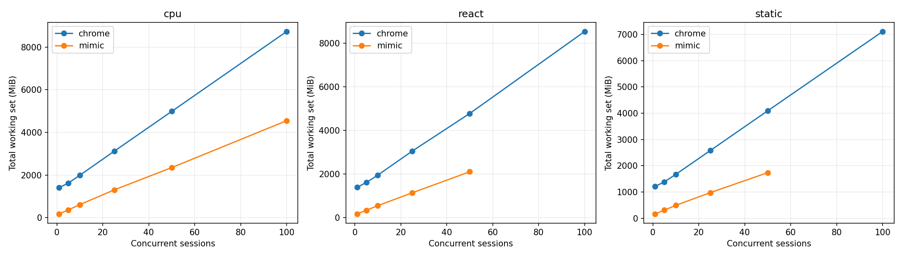
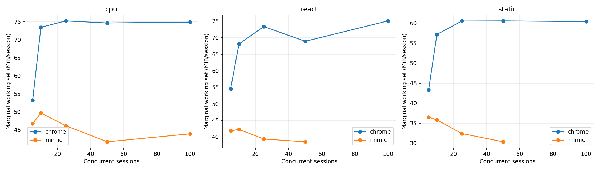
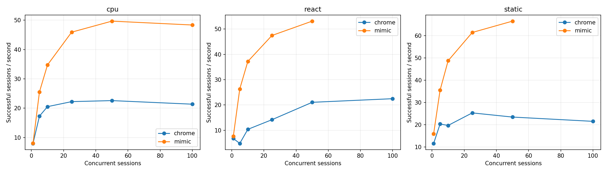
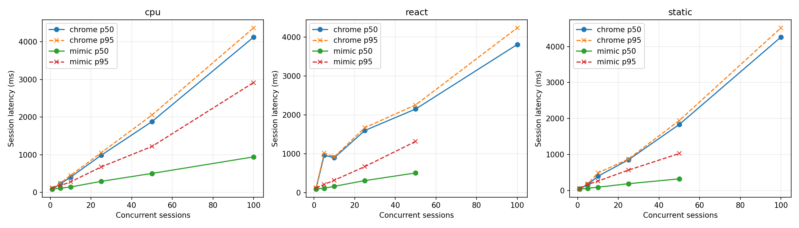
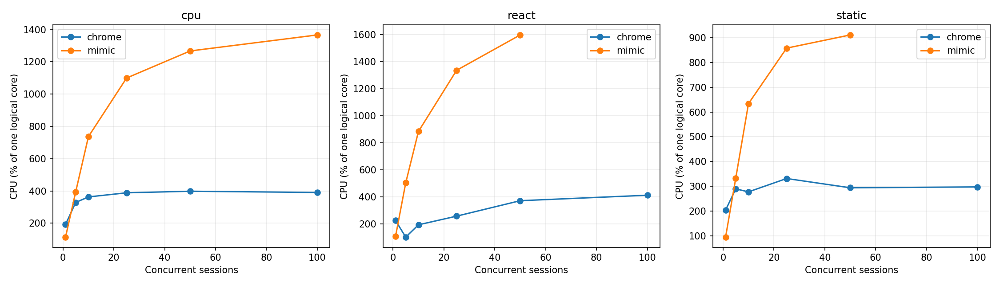

# Mimic V8 и Chrome 152: baseline Windows x64

Это измерение после исправления ошибок семантики, разрешённого пользователем. Оптимизации runtime ради производительности не выполнялись. Проверка исходной версии сохранена отдельно в `pre-fix/raw.json`.

## Окружение

| Параметр | Значение |
|---|---|
| Дата начала / конца | 2026-09-20T20:24:00.878033+04:00 / 2026-09-20T20:38:31.811856+04:00 |
| Chrome | {'protocolVersion': '1.3', 'product': 'Chrome/152.0.7977.82', 'revision': '@d04cdb24d67b081f6cf80200ffc5233f44b61109', 'userAgent': 'Mozilla/5.0 (Windows NT 10.0; Win64; x64) AppleWebKit/537.36 (KHTML, like Gecko) HeadlessChrome/152.0.0.0 Safari/537.36', 'jsVersion': '15.2.124.21'} |
| Chromium | 1669021 / d04cdb24d67b081f6cf80200ffc5233f44b61109 |
| Mimic commit | 06dd710a40dedc1f405b9704276e0950352306f3 |
| Mimic V8 | 15.2.124.1-rusty |
| OS | Windows-11-10.0.26200-SP0 |
| CPU | {"Name":"Intel(R) Core(TM) i7-14700KF","NumberOfCores":20,"NumberOfLogicalProcessors":28} |
| CPU physical / logical | 20 / 28 |
| RAM GiB | 31.83 |
| План питания | GUID схемы питания: 381b4222-f694-41f0-9685-ff5bb260df2e  (Сбалансированная) |
| Power overlay | 0 00000000-0000-0000-0000-000000000000 |
| Антивирус | {"displayName":"Windows Defender","productState":397568} |
| Chrome SHA-256 | ea36dd818a90176f1a70616f0363d9be527229389a6c073a0b1688b9e73f67e9 |
| Mimic SHA-256 | 61c1e19bdd3920dd0855e63df66df0f03ad45dacf4daa4977c5c01d823f1e663 |

Рабочая станция не была эксклюзивно выделена тесту: фоновые приложения и антивирус включены. Список процессов, версии инструментов, аргументы, SHA-256 фикстур и бинарников находятся в raw.json.

## Методика и корректность

В обеих системах создаётся новая страница и уникальный loopback-origin. HTTP cache отключён, ответы no-store; cookie не используются. Контексты, транспорт и процесс в warm сохраняются, состояние страницы не используется повторно. Это изоляция для данного контролируемого корпуса, а не проверка tenant/security isolation. Cold создаёт новый процесс и профиль. Кэш файлов Windows, DLL и DNS ОС не очищается; «cold» означает новый процесс, а не холодный диск. Вариант warm HTTP cache не измерялся.

Навигация заканчивается только при точном URL, document.readyState === "complete" и наличии __benchRun. Затем одинаковый явный запуск __benchRun; завершение — done и точное совпадение детерминированного результата. Settle = 0. Paint/networkidle не ожидаются. Chrome headless=new; результаты не переносятся автоматически на headful.

Внешние часы perf_counter/QPC; polling 5 ms плюс задержка CDP/планировщика ОС. navigation_ms включает разбор HTML и загрузку скриптов, execution_ms — запуск/выполнение приложения и обнаружение маркера. Они не являются изолированным временем JIT или чистого JavaScript. js_ms страницы диагностический: в Mimic виртуальное время часто равно нулю.

Процесс запускается приостановленным, включается в Windows Job Object, затем возобновляется. process_start_ms — вызов создания процесса; CDP readiness отсчитывается от начала создания до ответа протокола. runtime_initialization_ms — остаток между ними; внутренние фазы V8 отдельно не инструментированы. Cold total включает создание страницы, выполнение, teardown и завершение процесса; удаление временного профиля и обслуживание локального сервера не включены.

CPU — user+kernel всего Job Object, включая завершившихся потомков. Working set/private bytes — сумма всех текущих участников Job Object каждые 50 ms и в контрольных точках. Кратковременные пики памяти могут быть пропущены, общие страницы DLL могут учитываться несколько раз. CPU % задан относительно одного логического ядра; 100% машины = 2800%. Пики CPU чувствительны к дискретности счётчиков Windows.

Одна проверка и по одному первоначальному warmup на серию исключены явно. Основные серии: 10 cold и 20 warm, без удаления медленных наблюдений. p95 публикуется при n≥10, p99 при n≥100; используется линейная интерполяция эмпирических квантилей, хвосты при n=10–20 особенно неустойчивы. SD и CV, min/max всех серий доступны в summary.csv. Ускорение не агрегируется в одно отношение.

| Система / workload | Correctness gate |
|---|---|
| chrome/async | VALID |
| chrome/cpu | VALID |
| chrome/dom | VALID |
| chrome/react | VALID |
| chrome/static | VALID |
| chrome/wasm | VALID |
| mimic/async | VALID |
| mimic/cpu | VALID |
| mimic/dom | VALID |
| mimic/react | VALID |
| mimic/static | VALID |
| mimic/wasm | VALID |

### CDP readiness: отдельная серия с одинаковой пробой

В финальной серии обе системы отвечают на Target.getTargets после WebSocket handshake. По 10 новых процессов, порядок систем чередуется; warmup исключён. Дата: 2026-09-20T20:38:03.348606+04:00. Основная серия использует ту же общую пробу.

| Система | n | CDP p50 ms | p95 | Min | Max | SD | Ready RSS MiB |
|---|---|---|---|---|---|---|---|
| mimic | 10 | 212.62 | 232.79 | 211.30 | 233.16 | 8.70 | 45.04 |
| chrome | 10 | 244.72 | 257.41 | 235.13 | 258.61 | 8.24 | 373.89 |

## Cold startup (медианы, ms)

| Система | Workload | n | Process create | CDP ready | Runtime init | Cold total | Shutdown |
|---|---|---|---|---|---|---|---|
| chrome | static | 10 | 4.27 | 262.09 | 257.53 | 455.73 | 112.41 |
| mimic | static | 10 | 3.68 | 212.92 | 209.20 | 574.49 | 45.80 |
| mimic | cpu | 10 | 4.10 | 213.59 | 209.55 | 616.30 | 47.47 |
| chrome | cpu | 10 | 4.69 | 269.40 | 264.95 | 515.56 | 118.44 |
| chrome | dom | 10 | 4.48 | 270.40 | 266.20 | 507.63 | 110.57 |
| mimic | dom | 10 | 3.97 | 212.98 | 208.98 | 865.30 | 47.85 |
| mimic | async | 10 | 3.77 | 214.53 | 209.40 | 641.49 | 46.48 |
| chrome | async | 10 | 4.16 | 270.31 | 265.38 | 490.31 | 109.41 |
| chrome | react | 10 | 4.25 | 267.69 | 263.38 | 512.42 | 113.17 |
| mimic | react | 10 | 4.01 | 215.51 | 209.79 | 626.17 | 45.05 |
| mimic | wasm | 10 | 3.74 | 222.13 | 218.50 | 575.86 | 44.74 |
| chrome | wasm | 10 | 4.29 | 252.41 | 247.62 | 430.32 | 102.54 |

## Warm session startup / teardown (медианы)

| Система | Workload | n | Create ms | Teardown ms | RSS после teardown MiB |
|---|---|---|---|---|---|
| chrome | static | 20 | 31.40 | 11.51 | 1190.18 |
| mimic | static | 20 | 2.28 | 5.23 | 130.96 |
| mimic | cpu | 20 | 12.39 | 6.17 | 134.64 |
| chrome | cpu | 20 | 34.57 | 10.35 | 1406.91 |
| chrome | dom | 20 | 25.95 | 10.84 | 1348.84 |
| mimic | dom | 20 | 7.77 | 6.56 | 140.43 |
| mimic | async | 20 | 11.93 | 5.49 | 139.19 |
| chrome | async | 20 | 31.48 | 10.80 | 1246.79 |
| chrome | react | 20 | 32.94 | 9.99 | 1425.37 |
| mimic | react | 20 | 2.22 | 6.02 | 132.71 |
| mimic | wasm | 20 | 11.59 | 5.33 | 131.98 |
| chrome | wasm | 20 | 30.46 | 10.79 | 1268.99 |

## Single-session workload latency (ms)

| Система | Workload | Mode | n | Nav p50 | Execution p50 | Completion p50 | p95 | Min | Max | SD | CV |
|---|---|---|---|---|---|---|---|---|---|---|---|
| chrome | static | cold | 10 | 25.91 | 2.75 | 28.32 | 32.70 | 23.83 | 33.13 | 3.46 | 0.12 |
| mimic | static | cold | 10 | 299.43 | 1.93 | 301.38 | 306.61 | 295.59 | 307.15 | 3.93 | 0.01 |
| chrome | static | warm | 20 | 19.47 | 4.09 | 23.04 | 28.23 | 20.03 | 33.38 | 3.14 | 0.13 |
| mimic | static | warm | 20 | 30.57 | 3.23 | 33.69 | 38.81 | 31.75 | 101.84 | 15.26 | 0.41 |
| mimic | cpu | cold | 10 | 296.31 | 39.17 | 334.67 | 344.95 | 327.41 | 347.75 | 5.66 | 0.02 |
| chrome | cpu | cold | 10 | 25.90 | 32.76 | 65.09 | 74.73 | 57.02 | 78.46 | 6.19 | 0.10 |
| mimic | cpu | warm | 20 | 30.24 | 38.17 | 68.65 | 75.49 | 64.84 | 139.48 | 15.98 | 0.22 |
| chrome | cpu | warm | 20 | 18.81 | 28.77 | 47.84 | 52.89 | 45.90 | 53.11 | 2.21 | 0.05 |
| chrome | dom | cold | 10 | 24.26 | 16.42 | 39.51 | 69.50 | 33.18 | 70.01 | 16.10 | 0.32 |
| mimic | dom | cold | 10 | 296.27 | 287.11 | 584.74 | 596.67 | 579.23 | 598.54 | 6.72 | 0.01 |
| chrome | dom | warm | 20 | 18.54 | 30.59 | 49.56 | 52.54 | 27.89 | 56.95 | 5.38 | 0.11 |
| mimic | dom | warm | 20 | 29.78 | 274.29 | 304.49 | 325.47 | 296.63 | 382.84 | 18.59 | 0.06 |
| mimic | async | cold | 10 | 297.32 | 63.65 | 360.58 | 375.03 | 347.48 | 377.81 | 8.65 | 0.02 |
| chrome | async | cold | 10 | 25.61 | 31.33 | 57.15 | 97.31 | 52.05 | 127.05 | 22.64 | 0.36 |
| mimic | async | warm | 20 | 31.22 | 67.34 | 99.98 | 122.31 | 87.26 | 178.17 | 18.97 | 0.18 |
| chrome | async | warm | 20 | 19.18 | 26.59 | 45.41 | 54.44 | 36.88 | 56.11 | 5.14 | 0.11 |
| chrome | react | cold | 10 | 30.46 | 25.44 | 56.17 | 60.71 | 37.52 | 60.75 | 8.51 | 0.16 |
| mimic | react | cold | 10 | 298.47 | 45.63 | 343.31 | 362.68 | 337.56 | 365.73 | 9.24 | 0.03 |
| chrome | react | warm | 20 | 22.42 | 22.28 | 42.40 | 55.96 | 38.58 | 138.09 | 21.41 | 0.44 |
| mimic | react | warm | 20 | 36.59 | 48.27 | 85.43 | 94.36 | 82.46 | 162.32 | 17.32 | 0.19 |
| mimic | wasm | cold | 10 | 291.79 | 3.58 | 295.35 | 299.45 | 293.90 | 301.86 | 2.32 | 0.01 |
| chrome | wasm | cold | 10 | 21.84 | 5.24 | 27.67 | 46.52 | 23.81 | 54.41 | 9.22 | 0.30 |
| mimic | wasm | warm | 20 | 30.46 | 3.84 | 34.31 | 40.60 | 32.30 | 102.30 | 15.23 | 0.40 |
| chrome | wasm | warm | 20 | 18.89 | 5.48 | 24.85 | 30.70 | 21.27 | 33.46 | 2.92 | 0.12 |

## Single-session память / CPU (медианы)

| Система | Workload | Mode | До страницы MiB | После create MiB | Peak RSS MiB | Peak private MiB | CPU/session ms | CPU/workload ms |
|---|---|---|---|---|---|---|---|---|
| chrome | static | cold | 374.15 | 435.12 | 490.48 | 257.97 | 312.50 | 101.56 |
| mimic | static | cold | 45.22 | 45.43 | 153.54 | 182.54 | 406.25 | 398.44 |
| chrome | static | warm | 1129.94 | 1169.65 | 1190.18 | 599.25 | 156.25 | 54.69 |
| mimic | static | warm | 129.66 | 129.67 | 159.51 | 188.00 | 46.88 | 31.25 |
| mimic | cpu | cold | 45.26 | 45.43 | 162.57 | 190.40 | 421.88 | 414.06 |
| chrome | cpu | cold | 374.11 | 435.00 | 532.71 | 288.28 | 468.75 | 257.81 |
| mimic | cpu | warm | 134.59 | 134.60 | 179.06 | 206.21 | 85.94 | 78.12 |
| chrome | cpu | warm | 1326.36 | 1363.75 | 1406.91 | 786.02 | 195.31 | 125.00 |
| chrome | dom | cold | 376.67 | 428.50 | 542.30 | 299.22 | 421.88 | 234.38 |
| mimic | dom | cold | 45.50 | 45.86 | 167.84 | 195.59 | 796.88 | 796.88 |
| chrome | dom | warm | 1265.00 | 1305.62 | 1348.84 | 713.21 | 218.75 | 109.38 |
| mimic | dom | warm | 140.08 | 140.10 | 183.18 | 210.19 | 359.38 | 351.56 |
| mimic | async | cold | 45.32 | 45.58 | 166.15 | 195.71 | 453.12 | 453.12 |
| chrome | async | cold | 382.86 | 436.48 | 531.10 | 290.10 | 398.44 | 210.94 |
| mimic | async | warm | 139.13 | 139.13 | 176.58 | 204.72 | 117.19 | 109.38 |
| chrome | async | warm | 1182.54 | 1220.57 | 1246.93 | 631.34 | 226.56 | 93.75 |
| chrome | react | cold | 381.65 | 437.94 | 546.69 | 301.98 | 515.62 | 250.00 |
| mimic | react | cold | 45.34 | 45.63 | 155.68 | 183.56 | 421.88 | 414.06 |
| chrome | react | warm | 1344.97 | 1378.31 | 1425.37 | 810.08 | 210.94 | 125.00 |
| mimic | react | warm | 132.37 | 132.37 | 168.84 | 195.81 | 117.19 | 101.56 |
| mimic | wasm | cold | 45.23 | 45.38 | 154.84 | 182.36 | 421.88 | 414.06 |
| chrome | wasm | cold | 375.70 | 425.80 | 489.68 | 257.54 | 304.69 | 164.06 |
| mimic | wasm | warm | 131.94 | 131.94 | 160.82 | 187.62 | 31.25 | 31.25 |
| chrome | wasm | warm | 1201.18 | 1238.56 | 1268.99 | 625.02 | 171.88 | 78.12 |

## Concurrency / density

Каждый уровень — отдельный процесс; один исключённый warmup и max(5, ceil(20/N)) измеряемых волн. Страницы создаются параллельно; после барьера все начинают навигацию. Завершившиеся страницы удерживаются до окончания волны для одновременного RSS. Throughput = успешные сессии / время create→последний teardown, включая барьер и измерения, но без HTTP-server setup/cleanup. Latency = create→completion, включая ожидание барьера. Это batch throughput, не оптимизированный постоянный поток запросов. Удержание не добавляется в latency, но входит в throughput. CPU на сессию = CPU всей волны / число успехов; пересекающиеся интервалы CPU отдельных страниц не суммируются.

Пределы остановки: любая ошибка, <15% либо <2 GiB доступной RAM, >1024 pages input/s в течение 3 s, timeout 180 s. Это защита рабочей машины; максимум прошедшего уровня — нижняя граница поддержанной здесь ёмкости, не доказательство абсолютного максимума.

Mimic сериализует команды CDP общим mutex. Измерение включает это поведение; профилирование причин затрат не проводилось. В строках с остановкой RSS может быть снят раньше завершения всех страниц, а число волн 0 означает остановку на исключаемом warmup. Такие строки диагностические и не входят в fit/графики стабильных уровней. Между волнами дополнительно выполняются 250 ms recovery, очистка серверов и запись checkpoint вне batch throughput.

| Система | Workload | N | Волн | Успех % | RSS MiB | RSS/N MiB | Peak MiB | CPU/session ms | Сессий/s | p50 ms | p95 ms | p99 ms | Стоп |
|---|---|---|---|---|---|---|---|---|---|---|---|---|---|
| chrome | static | 1 | 20 | 100.00 | 1212.47 | 1212.47 | 1228.34 | 175.78 | 11.60 | 48.70 | 56.54 | — |  |
| mimic | static | 1 | 20 | 100.00 | 164.73 | 164.73 | 226.11 | 59.38 | 15.95 | 37.92 | 50.45 | — |  |
| chrome | static | 5 | 5 | 100.00 | 1385.82 | 277.16 | 1396.17 | 142.50 | 20.32 | 162.82 | 188.08 | — |  |
| mimic | static | 5 | 5 | 100.00 | 310.84 | 62.17 | 378.20 | 93.75 | 35.52 | 60.06 | 166.58 | — |  |
| chrome | static | 10 | 5 | 100.00 | 1671.69 | 167.17 | 1680.58 | 140.94 | 19.69 | 394.63 | 487.56 | — |  |
| mimic | static | 10 | 5 | 100.00 | 489.99 | 49.00 | 575.34 | 130.00 | 48.77 | 89.73 | 259.56 | — |  |
| chrome | static | 25 | 5 | 100.00 | 2579.41 | 103.18 | 2593.23 | 130.88 | 25.33 | 851.31 | 873.19 | 876.47 |  |
| mimic | static | 25 | 5 | 100.00 | 976.46 | 39.06 | 1244.91 | 139.62 | 61.46 | 185.85 | 565.20 | 577.91 |  |
| chrome | static | 50 | 5 | 100.00 | 4093.27 | 81.87 | 4110.51 | 125.37 | 23.45 | 1833.34 | 1944.08 | 1951.35 |  |
| mimic | static | 50 | 5 | 100.00 | 1735.62 | 34.71 | 2107.05 | 136.94 | 66.56 | 321.77 | 1025.05 | 1136.27 |  |
| chrome | static | 100 | 5 | 100.00 | 7112.53 | 71.13 | 7119.89 | 138.16 | 21.53 | 4261.87 | 4518.24 | 4529.86 |  |
| mimic | static | 100 | 0 | 100.00 | 4431.07 | 44.31 | 4431.07 | 634.22 | 24.46 | 2985.52 | 3611.80 | 3964.10 | memory pressure (<15% or 2 GiB available) |
| chrome | cpu | 1 | 20 | 100.00 | 1413.62 | 1413.62 | 1421.21 | 241.41 | 7.98 | 88.89 | 109.40 | — |  |
| mimic | cpu | 1 | 20 | 100.00 | 179.34 | 179.34 | 222.71 | 141.41 | 8.06 | 87.23 | 116.12 | — |  |
| chrome | cpu | 5 | 5 | 100.00 | 1626.54 | 325.31 | 1646.54 | 190.00 | 17.31 | 225.96 | 246.51 | — |  |
| mimic | cpu | 5 | 5 | 100.00 | 366.53 | 73.31 | 369.98 | 154.38 | 25.56 | 110.46 | 178.84 | — |  |
| chrome | cpu | 10 | 5 | 100.00 | 1993.72 | 199.37 | 2008.75 | 176.88 | 20.53 | 405.36 | 451.53 | — |  |
| mimic | cpu | 10 | 5 | 100.00 | 615.09 | 61.51 | 624.98 | 211.88 | 34.76 | 142.08 | 278.94 | — |  |
| chrome | cpu | 25 | 5 | 100.00 | 3121.74 | 124.87 | 3131.12 | 174.75 | 22.24 | 983.30 | 1052.26 | 1062.27 |  |
| mimic | cpu | 25 | 5 | 100.00 | 1308.00 | 52.32 | 1316.42 | 239.38 | 45.93 | 291.71 | 674.08 | 688.53 |  |
| chrome | cpu | 50 | 5 | 100.00 | 4987.22 | 99.74 | 5014.95 | 176.31 | 22.59 | 1881.27 | 2054.40 | 2066.65 |  |
| mimic | cpu | 50 | 5 | 100.00 | 2351.58 | 47.03 | 2405.42 | 255.00 | 49.70 | 502.35 | 1219.51 | 1255.86 |  |
| chrome | cpu | 100 | 5 | 100.00 | 8730.54 | 87.31 | 8751.02 | 182.81 | 21.37 | 4124.95 | 4371.60 | 4410.13 |  |
| mimic | cpu | 100 | 5 | 100.00 | 4548.79 | 45.49 | 4574.23 | 282.47 | 48.38 | 942.22 | 2917.75 | 3001.00 |  |
| chrome | react | 1 | 20 | 100.00 | 1390.78 | 1390.78 | 1405.82 | 332.03 | 6.78 | 103.16 | 115.98 | — |  |
| mimic | react | 1 | 20 | 100.00 | 169.68 | 169.68 | 204.68 | 141.41 | 7.64 | 91.75 | 116.75 | — |  |
| chrome | react | 5 | 5 | 100.00 | 1609.12 | 321.82 | 1610.89 | 211.88 | 4.83 | 960.06 | 1018.02 | — |  |
| mimic | react | 5 | 5 | 100.00 | 337.05 | 67.41 | 403.00 | 191.25 | 26.34 | 112.43 | 210.18 | — |  |
| chrome | react | 10 | 5 | 100.00 | 1949.55 | 194.96 | 1967.58 | 186.25 | 10.39 | 899.50 | 920.16 | — |  |
| mimic | react | 10 | 5 | 100.00 | 548.45 | 54.84 | 617.76 | 237.81 | 37.17 | 161.87 | 319.14 | — |  |
| chrome | react | 25 | 5 | 100.00 | 3050.26 | 122.01 | 3065.94 | 181.38 | 14.19 | 1598.74 | 1672.14 | 1675.36 |  |
| mimic | react | 25 | 5 | 100.00 | 1138.94 | 45.56 | 1297.07 | 281.75 | 47.43 | 309.10 | 670.48 | 675.59 |  |
| chrome | react | 50 | 5 | 100.00 | 4773.45 | 95.47 | 4779.35 | 176.56 | 21.06 | 2152.30 | 2258.44 | 2262.83 |  |
| mimic | react | 50 | 5 | 100.00 | 2102.10 | 42.04 | 2368.38 | 301.00 | 53.09 | 506.06 | 1317.81 | 1339.92 |  |
| chrome | react | 100 | 5 | 100.00 | 8528.11 | 85.28 | 8590.68 | 183.34 | 22.49 | 3814.06 | 4241.92 | 4253.65 |  |
| mimic | react | 100 | 0 | 99.00 | 4403.67 | 44.04 | 4713.46 | 855.27 | 6.63 | 4700.27 | 4790.02 | 4817.85 | non-zero failure rate |

## Marginal RAM/session

Измерена конечная разность между соседними протестированными N, делённая на ΔN; это не прямое измерение каждого N→N+1. Линейная модель — описательный OLS fit по медианам только успешных уровней. Пересечение — экстраполяция; реальный startup overhead включает исходную пустую страницу. Общий RSS включает процессы и кэши, оставшиеся от предыдущих волн, а число волн зависит от N. Поэтому fit смешивает стоимость активных страниц с историей процесса. Дополнительно показан прирост RSS относительно начала той же волны: он тоже может включать фоновую активность и GC.

| Система | Workload | N | (Active RSS − before wave RSS)/N MiB |
|---|---|---|---|
| chrome | static | 1 | 59.05 |
| mimic | static | 1 | 28.47 |
| chrome | static | 5 | 52.83 |
| mimic | static | 5 | 29.01 |
| chrome | static | 10 | 55.81 |
| mimic | static | 10 | 29.95 |
| chrome | static | 25 | 57.24 |
| mimic | static | 25 | 28.93 |
| chrome | static | 50 | 57.89 |
| mimic | static | 50 | 29.04 |
| chrome | static | 100 | 58.66 |
| mimic | static | 100 | 43.85 |
| chrome | cpu | 1 | 78.16 |
| mimic | cpu | 1 | 44.49 |
| chrome | cpu | 5 | 67.71 |
| mimic | cpu | 5 | 42.82 |
| chrome | cpu | 10 | 70.44 |
| mimic | cpu | 10 | 42.94 |
| chrome | cpu | 25 | 72.42 |
| mimic | cpu | 25 | 41.21 |
| chrome | cpu | 50 | 72.88 |
| mimic | cpu | 50 | 41.27 |
| chrome | cpu | 100 | 73.32 |
| mimic | cpu | 100 | 41.36 |
| chrome | react | 1 | 80.87 |
| mimic | react | 1 | 35.58 |
| chrome | react | 5 | 65.37 |
| mimic | react | 5 | 36.01 |
| chrome | react | 10 | 66.64 |
| mimic | react | 10 | 35.13 |
| chrome | react | 25 | 69.62 |
| mimic | react | 25 | 34.45 |
| chrome | react | 50 | 69.32 |
| mimic | react | 50 | 34.22 |
| chrome | react | 100 | 71.44 |
| mimic | react | 100 | 43.58 |

| Система | Workload | N low→high | ΔRSS MiB | ΔRSS/ΔN MiB |
|---|---|---|---|---|
| chrome | cpu | 1→5 | 212.92 | 53.23 |
| chrome | cpu | 5→10 | 367.18 | 73.44 |
| chrome | cpu | 10→25 | 1128.02 | 75.20 |
| chrome | cpu | 25→50 | 1865.48 | 74.62 |
| chrome | cpu | 50→100 | 3743.32 | 74.87 |
| mimic | cpu | 1→5 | 187.18 | 46.80 |
| mimic | cpu | 5→10 | 248.57 | 49.71 |
| mimic | cpu | 10→25 | 692.90 | 46.19 |
| mimic | cpu | 25→50 | 1043.58 | 41.74 |
| mimic | cpu | 50→100 | 2197.21 | 43.94 |
| chrome | react | 1→5 | 218.34 | 54.58 |
| chrome | react | 5→10 | 340.44 | 68.09 |
| chrome | react | 10→25 | 1100.71 | 73.38 |
| chrome | react | 25→50 | 1723.19 | 68.93 |
| chrome | react | 50→100 | 3754.66 | 75.09 |
| mimic | react | 1→5 | 167.37 | 41.84 |
| mimic | react | 5→10 | 211.40 | 42.28 |
| mimic | react | 10→25 | 590.49 | 39.37 |
| mimic | react | 25→50 | 963.16 | 38.53 |
| chrome | static | 1→5 | 173.36 | 43.34 |
| chrome | static | 5→10 | 285.87 | 57.17 |
| chrome | static | 10→25 | 907.71 | 60.51 |
| chrome | static | 25→50 | 1513.87 | 60.55 |
| chrome | static | 50→100 | 3019.26 | 60.39 |
| mimic | static | 1→5 | 146.11 | 36.53 |
| mimic | static | 5→10 | 179.15 | 35.83 |
| mimic | static | 10→25 | 486.47 | 32.43 |
| mimic | static | 25→50 | 759.16 | 30.37 |

| Система | Workload | Fixed fit MiB | Marginal fit MiB | R² | Max stable N |
|---|---|---|---|---|---|
| chrome | cpu | 1276.59 | 74.42 | 1.00 | 100 |
| mimic | cpu | 162.90 | 43.94 | 1.00 | 100 |
| chrome | react | 1248.08 | 72.32 | 1.00 | 100 |
| mimic | react | 143.40 | 39.33 | 1.00 | 50 |
| chrome | static | 1098.07 | 60.04 | 1.00 | 100 |
| mimic | static | 154.90 | 31.90 | 1.00 | 50 |

## Teardown / recovery

| Система | Workload | N | Ready RSS MiB | RSS после волн MiB | CPU всей серии s | CPU % |
|---|---|---|---|---|---|---|
| chrome | static | 1 | 386.13 | 1154.95 | 3.52 | 203.92 |
| mimic | static | 1 | 45.38 | 136.39 | 1.19 | 94.69 |
| chrome | static | 5 | 373.26 | 1133.92 | 3.56 | 289.61 |
| mimic | static | 5 | 45.40 | 161.36 | 2.34 | 332.97 |
| chrome | static | 10 | 370.48 | 1122.05 | 7.05 | 277.52 |
| mimic | static | 10 | 44.75 | 205.24 | 6.50 | 633.96 |
| chrome | static | 25 | 387.62 | 1151.58 | 16.36 | 331.45 |
| mimic | static | 25 | 45.22 | 278.59 | 17.45 | 858.13 |
| chrome | static | 50 | 370.25 | 1206.18 | 31.34 | 294.01 |
| mimic | static | 50 | 45.02 | 364.82 | 34.23 | 911.40 |
| chrome | static | 100 | 381.12 | 1251.42 | 69.08 | 297.46 |
| mimic | static | 100 | 45.25 | 346.35 | 63.42 | 1551.56 |
| chrome | cpu | 1 | 376.42 | 1336.87 | 4.83 | 192.60 |
| mimic | cpu | 1 | 45.16 | 135.52 | 2.83 | 114.01 |
| chrome | cpu | 5 | 379.28 | 1295.95 | 4.75 | 328.81 |
| mimic | cpu | 5 | 45.06 | 155.85 | 3.86 | 394.61 |
| chrome | cpu | 10 | 344.29 | 1290.79 | 8.84 | 363.09 |
| mimic | cpu | 10 | 45.48 | 190.65 | 10.59 | 736.47 |
| chrome | cpu | 25 | 371.16 | 1315.82 | 21.84 | 388.63 |
| mimic | cpu | 25 | 45.27 | 276.02 | 29.92 | 1099.54 |
| chrome | cpu | 50 | 371.46 | 1352.02 | 44.08 | 398.28 |
| mimic | cpu | 50 | 45.59 | 284.30 | 63.75 | 1267.26 |
| chrome | cpu | 100 | 385.06 | 1398.17 | 91.41 | 390.63 |
| mimic | cpu | 100 | 44.62 | 424.73 | 141.23 | 1366.47 |
| chrome | react | 1 | 374.95 | 1314.08 | 6.64 | 225.04 |
| mimic | react | 1 | 44.76 | 134.54 | 2.83 | 108.08 |
| chrome | react | 5 | 389.02 | 1284.84 | 5.30 | 102.25 |
| mimic | react | 5 | 45.10 | 165.20 | 4.78 | 503.82 |
| chrome | react | 10 | 385.63 | 1284.71 | 9.31 | 193.43 |
| mimic | react | 10 | 45.20 | 197.61 | 11.89 | 884.05 |
| chrome | react | 25 | 377.77 | 1319.25 | 22.67 | 257.42 |
| mimic | react | 25 | 45.62 | 282.39 | 35.22 | 1336.44 |
| chrome | react | 50 | 382.00 | 1307.29 | 44.14 | 371.80 |
| mimic | react | 50 | 44.75 | 390.90 | 75.25 | 1598.14 |
| chrome | react | 100 | 375.01 | 1414.06 | 91.67 | 412.27 |
| mimic | react | 100 | 45.88 | 444.02 | 84.67 | 567.38 |

## Локальный сервер (измеряется независимо)

Время обработчика HTTP — от получения запроса обработчиком до завершения записи ответа; не включает очередь TCP/планировщика сервера или сетевой roundtrip. До основного workload сервер создаётся вне измеряемого интервала. Запросы и bytes каждого ресурса записаны в raw.json.

| Система | Workload | Mode | Запросов | Server p50 ms | Server p95 ms | Server max ms |
|---|---|---|---|---|---|---|
| chrome | static | cold | 20 | 0.25 | 0.46 | 0.47 |
| mimic | static | cold | 20 | 0.16 | 0.48 | 0.92 |
| chrome | static | warm | 40 | 0.22 | 0.44 | 0.52 |
| mimic | static | warm | 40 | 0.14 | 0.30 | 0.55 |
| mimic | cpu | cold | 20 | 0.15 | 0.39 | 0.45 |
| chrome | cpu | cold | 20 | 0.30 | 0.58 | 0.59 |
| mimic | cpu | warm | 40 | 0.18 | 0.32 | 0.43 |
| chrome | cpu | warm | 40 | 0.21 | 0.48 | 0.54 |
| chrome | dom | cold | 20 | 0.26 | 0.51 | 0.52 |
| mimic | dom | cold | 20 | 0.16 | 0.29 | 0.62 |
| chrome | dom | warm | 40 | 0.22 | 0.44 | 0.62 |
| mimic | dom | warm | 40 | 0.17 | 0.39 | 0.60 |
| mimic | async | cold | 50 | 0.08 | 0.25 | 0.41 |
| chrome | async | cold | 50 | 0.20 | 0.48 | 0.55 |
| mimic | async | warm | 100 | 0.11 | 0.45 | 1.16 |
| chrome | async | warm | 100 | 0.14 | 0.41 | 2.01 |
| chrome | react | cold | 50 | 0.50 | 1.26 | 1.70 |
| mimic | react | cold | 50 | 0.20 | 0.31 | 0.33 |
| chrome | react | warm | 100 | 0.25 | 0.78 | 0.89 |
| mimic | react | warm | 100 | 0.21 | 0.32 | 0.62 |
| mimic | wasm | cold | 20 | 0.18 | 0.32 | 0.44 |
| chrome | wasm | cold | 20 | 0.30 | 0.50 | 0.53 |
| mimic | wasm | warm | 40 | 0.20 | 0.24 | 0.26 |
| chrome | wasm | warm | 40 | 0.22 | 0.51 | 1.60 |

## Валидность измеряемых серий

| Система | Workload | Mode | Успех / попыток | Использование сравнения |
|---|---|---|---|---|
| chrome | static | cold | 10/10 | VALID |
| mimic | static | cold | 10/10 | VALID |
| chrome | static | warm | 20/20 | VALID |
| mimic | static | warm | 20/20 | VALID |
| mimic | cpu | cold | 10/10 | VALID |
| chrome | cpu | cold | 10/10 | VALID |
| mimic | cpu | warm | 20/20 | VALID |
| chrome | cpu | warm | 20/20 | VALID |
| chrome | dom | cold | 10/10 | VALID |
| mimic | dom | cold | 10/10 | VALID |
| chrome | dom | warm | 20/20 | VALID |
| mimic | dom | warm | 20/20 | VALID |
| mimic | async | cold | 10/10 | VALID |
| chrome | async | cold | 10/10 | VALID |
| mimic | async | warm | 20/20 | VALID |
| chrome | async | warm | 20/20 | VALID |
| chrome | react | cold | 10/10 | VALID |
| mimic | react | cold | 10/10 | VALID |
| chrome | react | warm | 20/20 | VALID |
| mimic | react | warm | 20/20 | VALID |
| mimic | wasm | cold | 10/10 | VALID |
| chrome | wasm | cold | 10/10 | VALID |
| mimic | wasm | warm | 20/20 | VALID |
| chrome | wasm | warm | 20/20 | VALID |

## Инженерный вывод

1. По медиане warm navigation→completion Mimic быстрее: ни на одной из измеренных нагрузок. CDP readiness (общая проба, отдельные cold): mimic 212.62 ms; chrome 244.72 ms

2. Chrome быстрее по той же метрике: async (99.98 / 45.41 ms Mimic/Chrome); cpu (68.65 / 47.84 ms Mimic/Chrome); dom (304.49 / 49.56 ms Mimic/Chrome); react (85.43 / 42.40 ms Mimic/Chrome); static (33.69 / 23.04 ms Mimic/Chrome); wasm (34.31 / 24.85 ms Mimic/Chrome).

3. Фиксированный overhead процесса (CDP ready, включая исходную страницу): mimic 45.28 MiB; chrome 373.32 MiB. Startup latency и OLS intercept приведены отдельно выше.

4. Оценки marginal RAM/session: chrome/cpu 74.42 MiB; mimic/cpu 43.94 MiB; chrome/react 72.32 MiB; mimic/react 39.33 MiB; chrome/static 60.04 MiB; mimic/static 31.90 MiB.

5. Максимальный стабильный N по нагрузке: mimic/cpu 100; chrome/cpu 100; mimic/react 50; chrome/react 100; mimic/static 50; chrome/static 100.

6. Throughput на максимальном общем стабильном уровне:

cpu, N=100: Mimic 48.38 и Chrome 21.37 успешных сессий/s; RSS 4548.79 и 8730.54 MiB; CPU/session 282.47 и 182.81 ms.

react, N=50: Mimic 53.09 и Chrome 21.06 успешных сессий/s; RSS 2102.10 и 4773.45 MiB; CPU/session 301.00 и 176.56 ms.

static, N=50: Mimic 66.56 и Chrome 23.45 успешных сессий/s; RSS 1735.62 и 4093.27 MiB; CPU/session 136.94 и 125.37 ms.

7. Невалидные сравнения после исправлений: нет на correctness gate; ошибки отдельных итераций остаются в raw.json. До исправлений: DOM, async, React, WebAssembly (см. pre-fix).

8. Ограничения: одна занятая рабочая станция; headless Chrome; различные сборки V8; HTTP cache отключён; ограниченные размеры и семантические проверки корпуса; React-фикстура синтетическая, не Next.js/production-приложение. Polling и sampler входят в нагрузку системы. RSS — сумма рабочих наборов, не уникальная физическая RAM; нет финансовой модели стоимости сессии. Paging — общесистемный счётчик, не атрибуция hard faults конкретному процессу. Значения виртуальных часов Mimic не используются для сравнений.

9. Наиболее сильная защищаемая формулировка для README: «На Windows x64 локальные контролируемые нагрузки прошли проверку результатов в Mimic V8 и Chrome 152.0.7977.82; опубликованы воспроизводимый harness, исходные наблюдения и отдельные показатели latency, CPU и памяти. cpu, N=100: Mimic 48.38 и Chrome 21.37 успешных сессий/s; RSS 4548.79 и 8730.54 MiB; CPU/session 282.47 и 182.81 ms.»

10. Данные НЕ подтверждают утверждение «Mimic в X раз быстрее Chrome вообще», полную совместимость с браузером, безопасность изоляции tenants, преимущество чистого V8/JIT, выигрыш на произвольных сайтах или денежную экономию без модели эксплуатации.
