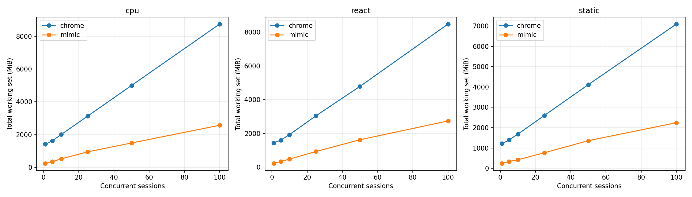
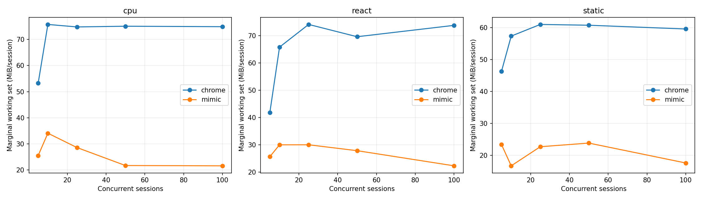
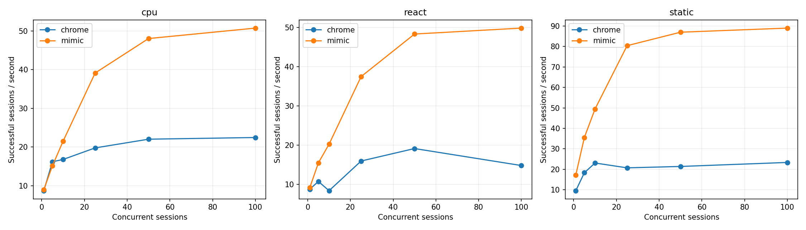
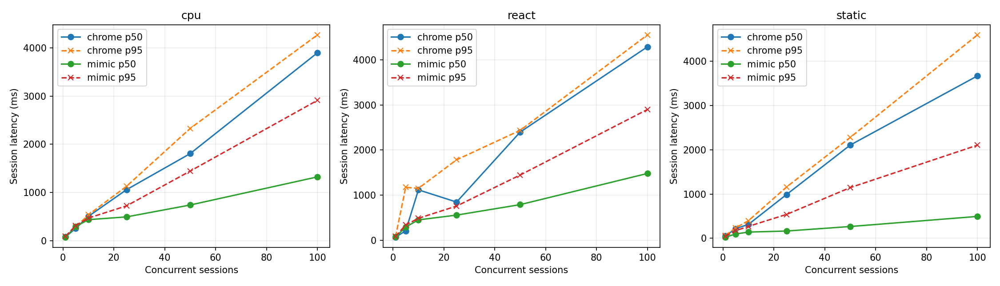
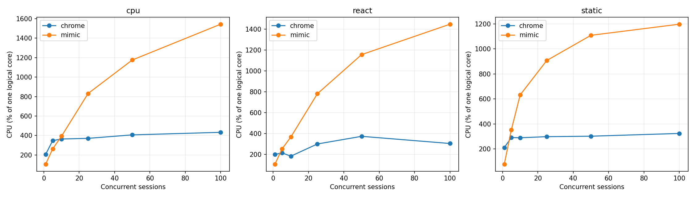

# Mimic V8 и Chrome 152: baseline Windows x64

Это измерение после исправления ошибок семантики, разрешённого пользователем. Оптимизации runtime ради производительности не выполнялись. Проверка исходной версии сохранена отдельно в `pre-fix/raw.json`.

## Окружение

| Параметр | Значение |
|---|---|
| Дата начала / конца | 2026-09-21T07:02:35.012031+04:00 / 2026-09-21T07:17:04.983256+04:00 |
| Chrome | {'protocolVersion': '1.3', 'product': 'Chrome/152.0.7977.82', 'revision': '@d04cdb24d67b081f6cf80200ffc5233f44b61109', 'userAgent': 'Mozilla/5.0 (Windows NT 10.0; Win64; x64) AppleWebKit/537.36 (KHTML, like Gecko) HeadlessChrome/152.0.0.0 Safari/537.36', 'jsVersion': '15.2.124.21'} |
| Chromium | 1669021 / d04cdb24d67b081f6cf80200ffc5233f44b61109 |
| Mimic commit | a51aa2228a9369bbc52a695e1f17276d3b840a53 |
| Mimic V8 | 15.2.124.1-rusty |
| OS | Windows-11-10.0.26200-SP0 |
| CPU | {"Name":"Intel(R) Core(TM) i7-14700KF","NumberOfCores":20,"NumberOfLogicalProcessors":28} |
| CPU physical / logical | 20 / 28 |
| RAM GiB | 31.83 |
| План питания | GUID схемы питания: 381b4222-f694-41f0-9685-ff5bb260df2e  (Сбалансированная) |
| Power overlay | 0 00000000-0000-0000-0000-000000000000 |
| Антивирус | {"displayName":"Windows Defender","productState":397568} |
| Chrome SHA-256 | ea36dd818a90176f1a70616f0363d9be527229389a6c073a0b1688b9e73f67e9 |
| Mimic SHA-256 | 0a8a4492b9c4e68b999591ad6a60dbe5fc59c0f05e6036fcd7c9fd2e37dff1f7 |

Рабочая станция не была эксклюзивно выделена тесту: фоновые приложения и антивирус включены. Список процессов, версии инструментов, аргументы, SHA-256 фикстур и бинарников находятся в raw.json.

## Методика и корректность

В обеих системах создаётся новая страница и уникальный loopback-origin. HTTP cache отключён, ответы no-store; cookie не используются. Контексты, транспорт и процесс в warm сохраняются, состояние страницы не используется повторно. Это изоляция для данного контролируемого корпуса, а не проверка tenant/security isolation. Cold создаёт новый процесс и профиль. Кэш файлов Windows, DLL и DNS ОС не очищается; «cold» означает новый процесс, а не холодный диск. Вариант warm HTTP cache не измерялся.

Навигация заканчивается только при точном URL, document.readyState === "complete" и наличии __benchRun. Затем одинаковый явный запуск __benchRun; завершение — done и точное совпадение детерминированного результата. Settle = 0. Paint/networkidle не ожидаются. Chrome headless=new; результаты не переносятся автоматически на headful.

Внешние часы perf_counter/QPC; polling 5 ms плюс задержка CDP/планировщика ОС. navigation_ms включает разбор HTML и загрузку скриптов, execution_ms — запуск/выполнение приложения и обнаружение маркера. Они не являются изолированным временем JIT или чистого JavaScript. js_ms страницы диагностический: в Mimic виртуальное время часто равно нулю.

Процесс запускается приостановленным, включается в Windows Job Object, затем возобновляется. process_start_ms — вызов создания процесса; CDP readiness отсчитывается от начала создания до ответа протокола. runtime_initialization_ms — остаток между ними; внутренние фазы V8 отдельно не инструментированы. Cold total включает создание страницы, выполнение, teardown и завершение процесса; удаление временного профиля и обслуживание локального сервера не включены.

CPU — user+kernel всего Job Object, включая завершившихся потомков. Working set/private bytes — сумма всех текущих участников Job Object каждые 50 ms и в контрольных точках. Кратковременные пики памяти могут быть пропущены, общие страницы DLL могут учитываться несколько раз. CPU % задан относительно одного логического ядра; 100% машины = 2800%. Пики CPU чувствительны к дискретности счётчиков Windows.

Одна проверка и по одному первоначальному warmup на серию исключены явно. Основные серии: 10 cold и 20 warm, без удаления медленных наблюдений. p95 публикуется при n≥10, p99 при n≥100; используется линейная интерполяция эмпирических квантилей, хвосты при n=10–20 особенно неустойчивы. SD и CV, min/max всех серий доступны в summary.csv. Ускорение не агрегируется в одно отношение.

| Система / workload | Correctness gate |
|---|---|
| chrome/async | VALID |
| chrome/cpu | VALID |
| chrome/dom | VALID |
| chrome/react | VALID |
| chrome/static | VALID |
| chrome/wasm | VALID |
| mimic/async | VALID |
| mimic/cpu | VALID |
| mimic/dom | VALID |
| mimic/react | VALID |
| mimic/static | VALID |
| mimic/wasm | VALID |

### CDP readiness: отдельная серия с одинаковой пробой

В финальной серии обе системы отвечают на Target.getTargets после WebSocket handshake. По 10 новых процессов, порядок систем чередуется; warmup исключён. Дата: 2026-09-21T07:16:35.809360+04:00. Основная серия использует ту же общую пробу.

| Система | n | CDP p50 ms | p95 | Min | Max | SD | Ready RSS MiB |
|---|---|---|---|---|---|---|---|
| mimic | 10 | 734.94 | 1403.30 | 624.33 | 1862.58 | 374.53 | 147.71 |
| chrome | 10 | 264.47 | 278.83 | 248.81 | 279.93 | 9.31 | 374.99 |

## Cold startup (медианы, ms)

| Система | Workload | n | Process create | CDP ready | Runtime init | Cold total | Shutdown |
|---|---|---|---|---|---|---|---|
| chrome | static | 10 | 4.40 | 290.73 | 286.64 | 508.62 | 120.17 |
| mimic | static | 10 | 4.18 | 831.26 | 826.89 | 1061.31 | 60.76 |
| mimic | cpu | 10 | 4.31 | 830.72 | 826.24 | 1104.81 | 62.31 |
| chrome | cpu | 10 | 4.55 | 283.17 | 278.14 | 539.76 | 117.73 |
| chrome | dom | 10 | 6.41 | 311.43 | 304.50 | 597.93 | 135.38 |
| mimic | dom | 10 | 4.58 | 831.96 | 827.08 | 1357.71 | 61.61 |
| mimic | async | 10 | 5.72 | 741.98 | 736.89 | 1026.70 | 62.60 |
| chrome | async | 10 | 6.16 | 277.89 | 270.84 | 505.64 | 116.57 |
| chrome | react | 10 | 11.42 | 447.79 | 427.78 | 812.51 | 165.61 |
| mimic | react | 10 | 4.02 | 832.09 | 828.24 | 1120.66 | 61.92 |
| mimic | wasm | 10 | 3.68 | 629.07 | 624.99 | 848.62 | 57.67 |
| chrome | wasm | 10 | 4.61 | 275.12 | 270.52 | 475.25 | 114.66 |

## Warm session startup / teardown (медианы)

| Система | Workload | n | Create ms | Teardown ms | RSS после teardown MiB |
|---|---|---|---|---|---|
| chrome | static | 20 | 29.42 | 10.86 | 1168.50 |
| mimic | static | 20 | 6.74 | 0.98 | 254.56 |
| mimic | cpu | 20 | 7.71 | 1.29 | 251.98 |
| chrome | cpu | 20 | 33.25 | 13.76 | 1411.78 |
| chrome | dom | 20 | 28.68 | 12.43 | 1388.35 |
| mimic | dom | 20 | 10.69 | 2.03 | 222.39 |
| mimic | async | 20 | 3.84 | 1.53 | 212.89 |
| chrome | async | 20 | 61.41 | 23.27 | 1262.17 |
| chrome | react | 20 | 29.14 | 11.11 | 1404.01 |
| mimic | react | 20 | 2.23 | 1.13 | 228.23 |
| mimic | wasm | 20 | 2.58 | 1.17 | 222.87 |
| chrome | wasm | 20 | 31.24 | 11.32 | 1275.23 |

## Single-session workload latency (ms)

| Система | Workload | Mode | n | Nav p50 | Execution p50 | Completion p50 | p95 | Min | Max | SD | CV |
|---|---|---|---|---|---|---|---|---|---|---|---|
| chrome | static | cold | 10 | 29.26 | 3.50 | 33.24 | 57.15 | 27.43 | 70.59 | 13.00 | 0.35 |
| mimic | static | cold | 10 | 149.88 | 1.95 | 151.83 | 166.13 | 147.32 | 168.66 | 7.18 | 0.05 |
| chrome | static | warm | 20 | 18.75 | 4.07 | 22.76 | 26.00 | 20.19 | 26.59 | 1.92 | 0.08 |
| mimic | static | warm | 20 | 21.73 | 1.58 | 23.32 | 36.41 | 21.78 | 100.93 | 17.38 | 0.61 |
| mimic | cpu | cold | 10 | 152.62 | 38.87 | 193.85 | 202.41 | 180.90 | 204.56 | 7.37 | 0.04 |
| chrome | cpu | cold | 10 | 26.21 | 46.00 | 75.61 | 107.31 | 59.21 | 126.16 | 19.39 | 0.25 |
| mimic | cpu | warm | 20 | 22.39 | 41.80 | 64.28 | 101.93 | 56.05 | 137.29 | 18.69 | 0.27 |
| chrome | cpu | warm | 20 | 23.85 | 32.26 | 56.34 | 61.69 | 51.69 | 66.12 | 3.64 | 0.06 |
| chrome | dom | cold | 10 | 33.18 | 38.68 | 74.55 | 98.34 | 42.00 | 101.28 | 22.13 | 0.30 |
| mimic | dom | cold | 10 | 151.92 | 294.89 | 446.54 | 512.33 | 435.70 | 521.36 | 29.16 | 0.06 |
| chrome | dom | warm | 20 | 19.60 | 33.50 | 52.50 | 58.86 | 48.18 | 60.12 | 3.27 | 0.06 |
| mimic | dom | warm | 20 | 28.78 | 458.97 | 491.72 | 1277.97 | 302.04 | 1370.93 | 335.92 | 0.54 |
| mimic | async | cold | 10 | 147.73 | 64.52 | 211.02 | 235.40 | 203.73 | 236.90 | 11.62 | 0.05 |
| chrome | async | cold | 10 | 24.95 | 30.72 | 55.78 | 72.63 | 51.64 | 78.11 | 7.88 | 0.13 |
| mimic | async | warm | 20 | 24.89 | 64.26 | 89.86 | 100.67 | 77.42 | 161.94 | 17.38 | 0.19 |
| chrome | async | warm | 20 | 38.75 | 39.08 | 77.53 | 99.10 | 43.61 | 116.39 | 19.89 | 0.27 |
| chrome | react | cold | 10 | 57.85 | 33.68 | 88.94 | 112.21 | 65.21 | 117.57 | 15.58 | 0.18 |
| mimic | react | cold | 10 | 157.53 | 49.58 | 207.58 | 385.64 | 196.95 | 407.03 | 77.86 | 0.31 |
| chrome | react | warm | 20 | 20.94 | 22.55 | 44.27 | 48.92 | 40.32 | 49.16 | 2.47 | 0.06 |
| mimic | react | warm | 20 | 28.31 | 40.52 | 70.12 | 86.37 | 64.66 | 156.88 | 19.93 | 0.27 |
| mimic | wasm | cold | 10 | 146.38 | 3.65 | 150.19 | 151.43 | 149.29 | 151.55 | 0.76 | 0.01 |
| chrome | wasm | cold | 10 | 23.63 | 5.82 | 29.86 | 34.09 | 26.39 | 34.41 | 2.58 | 0.09 |
| mimic | wasm | warm | 20 | 22.60 | 3.42 | 26.97 | 35.82 | 22.98 | 113.42 | 19.58 | 0.63 |
| chrome | wasm | warm | 20 | 19.18 | 5.18 | 24.55 | 26.07 | 21.27 | 26.72 | 1.63 | 0.07 |

## Single-session память / CPU (медианы)

| Система | Workload | Mode | До страницы MiB | После create MiB | Peak RSS MiB | Peak private MiB | CPU/session ms | CPU/workload ms |
|---|---|---|---|---|---|---|---|---|
| chrome | static | cold | 381.59 | 444.71 | 497.78 | 259.03 | 398.44 | 156.25 |
| mimic | static | cold | 149.01 | 149.07 | 181.09 | 209.75 | 226.56 | 226.56 |
| chrome | static | warm | 1108.27 | 1148.18 | 1168.50 | 583.26 | 164.06 | 62.50 |
| mimic | static | warm | 246.82 | 246.89 | 254.56 | 285.88 | 31.25 | 23.44 |
| mimic | cpu | cold | 150.10 | 150.16 | 184.58 | 213.67 | 304.69 | 289.06 |
| chrome | cpu | cold | 384.85 | 445.82 | 540.30 | 290.47 | 468.75 | 273.44 |
| mimic | cpu | warm | 250.93 | 250.97 | 255.12 | 284.00 | 85.94 | 85.94 |
| chrome | cpu | warm | 1331.54 | 1377.91 | 1411.78 | 778.09 | 250.00 | 148.44 |
| chrome | dom | cold | 382.47 | 451.95 | 548.28 | 304.19 | 562.50 | 265.62 |
| mimic | dom | cold | 148.31 | 148.37 | 187.63 | 216.14 | 609.38 | 609.38 |
| chrome | dom | warm | 1303.79 | 1347.31 | 1388.35 | 734.58 | 226.56 | 125.00 |
| mimic | dom | warm | 221.50 | 221.50 | 229.67 | 257.81 | 632.81 | 625.00 |
| mimic | async | cold | 147.18 | 147.24 | 185.92 | 215.24 | 320.31 | 289.06 |
| chrome | async | cold | 383.63 | 431.00 | 528.49 | 285.54 | 484.38 | 218.75 |
| mimic | async | warm | 207.30 | 207.30 | 222.96 | 253.41 | 109.38 | 101.56 |
| chrome | async | warm | 1197.77 | 1246.16 | 1262.30 | 634.50 | 414.06 | 179.69 |
| chrome | react | cold | 388.58 | 465.74 | 549.83 | 299.17 | 742.19 | 359.38 |
| mimic | react | cold | 146.96 | 147.02 | 181.72 | 209.96 | 304.69 | 296.88 |
| chrome | react | warm | 1322.68 | 1361.42 | 1404.01 | 800.95 | 226.56 | 117.19 |
| mimic | react | warm | 226.36 | 226.36 | 229.35 | 258.08 | 93.75 | 93.75 |
| mimic | wasm | cold | 151.98 | 152.04 | 181.79 | 211.77 | 226.56 | 218.75 |
| chrome | wasm | cold | 379.59 | 430.33 | 492.12 | 258.62 | 367.19 | 132.81 |
| mimic | wasm | warm | 217.83 | 217.83 | 224.46 | 252.64 | 15.62 | 15.62 |
| chrome | wasm | warm | 1207.49 | 1247.63 | 1275.23 | 636.83 | 203.12 | 85.94 |

## Concurrency / density

Каждый уровень — отдельный процесс; один исключённый warmup и max(5, ceil(20/N)) измеряемых волн. Страницы создаются параллельно; после барьера все начинают навигацию. Завершившиеся страницы удерживаются до окончания волны для одновременного RSS. Throughput = успешные сессии / время create→последний teardown, включая барьер и измерения, но без HTTP-server setup/cleanup. Latency = create→completion, включая ожидание барьера. Это batch throughput, не оптимизированный постоянный поток запросов. Удержание не добавляется в latency, но входит в throughput. CPU на сессию = CPU всей волны / число успехов; пересекающиеся интервалы CPU отдельных страниц не суммируются.

Пределы остановки: любая ошибка, <15% либо <2 GiB доступной RAM, >1024 pages input/s в течение 3 s, timeout 180 s. Это защита рабочей машины; максимум прошедшего уровня — нижняя граница поддержанной здесь ёмкости, не доказательство абсолютного максимума.

Mimic сериализует команды CDP общим mutex. Измерение включает это поведение; профилирование причин затрат не проводилось. В строках с остановкой RSS может быть снят раньше завершения всех страниц, а число волн 0 означает остановку на исключаемом warmup. Такие строки диагностические и не входят в fit/графики стабильных уровней. Между волнами дополнительно выполняются 250 ms recovery, очистка серверов и запись checkpoint вне batch throughput.

| Система | Workload | N | Волн | Успех % | RSS MiB | RSS/N MiB | Peak MiB | CPU/session ms | Сессий/s | p50 ms | p95 ms | p99 ms | Стоп |
|---|---|---|---|---|---|---|---|---|---|---|---|---|---|
| chrome | static | 1 | 20 | 100.00 | 1211.54 | 1211.54 | 1219.25 | 221.09 | 9.52 | 55.35 | 66.95 | — |  |
| mimic | static | 1 | 20 | 100.00 | 245.21 | 245.21 | 314.05 | 45.31 | 17.16 | 26.27 | 45.96 | — |  |
| chrome | static | 5 | 5 | 100.00 | 1396.87 | 279.37 | 1399.36 | 158.75 | 18.29 | 218.51 | 237.35 | — |  |
| mimic | static | 5 | 5 | 100.00 | 338.88 | 67.78 | 395.07 | 99.38 | 35.52 | 97.29 | 172.71 | — |  |
| chrome | static | 10 | 5 | 100.00 | 1683.59 | 168.36 | 1690.12 | 125.31 | 23.06 | 313.57 | 397.41 | — |  |
| mimic | static | 10 | 5 | 100.00 | 422.69 | 42.27 | 622.29 | 127.81 | 49.45 | 140.81 | 269.66 | — |  |
| chrome | static | 25 | 5 | 100.00 | 2598.54 | 103.94 | 2605.34 | 143.88 | 20.69 | 990.09 | 1159.74 | 1162.96 |  |
| mimic | static | 25 | 5 | 100.00 | 763.72 | 30.55 | 1186.46 | 112.75 | 80.41 | 164.06 | 540.03 | 551.80 |  |
| chrome | static | 50 | 5 | 100.00 | 4117.22 | 82.34 | 4122.84 | 141.06 | 21.37 | 2106.71 | 2278.61 | 2284.26 |  |
| mimic | static | 50 | 5 | 100.00 | 1360.69 | 27.21 | 2258.90 | 127.37 | 87.01 | 266.09 | 1145.50 | 1164.29 |  |
| chrome | static | 100 | 5 | 100.00 | 7095.85 | 70.96 | 7104.18 | 138.62 | 23.33 | 3670.61 | 4596.58 | 4605.92 |  |
| mimic | static | 100 | 5 | 100.00 | 2243.30 | 22.43 | 4203.62 | 134.50 | 89.01 | 494.35 | 2104.36 | 2281.96 |  |
| chrome | cpu | 1 | 20 | 100.00 | 1410.89 | 1410.89 | 1425.07 | 236.72 | 8.69 | 76.05 | 85.01 | — |  |
| mimic | cpu | 1 | 20 | 100.00 | 244.07 | 244.07 | 255.30 | 117.97 | 8.98 | 72.11 | 90.53 | — |  |
| chrome | cpu | 5 | 5 | 100.00 | 1623.98 | 324.80 | 1630.30 | 215.00 | 16.18 | 255.01 | 279.92 | — |  |
| mimic | cpu | 5 | 5 | 100.00 | 346.19 | 69.24 | 419.44 | 174.38 | 15.09 | 292.09 | 312.17 | — |  |
| chrome | cpu | 10 | 5 | 100.00 | 2002.72 | 200.27 | 2014.36 | 217.19 | 16.77 | 503.95 | 536.34 | — |  |
| mimic | cpu | 10 | 5 | 100.00 | 516.60 | 51.66 | 634.40 | 183.12 | 21.49 | 435.00 | 467.97 | — |  |
| chrome | cpu | 25 | 5 | 100.00 | 3124.54 | 124.98 | 3140.88 | 187.75 | 19.76 | 1058.25 | 1129.02 | 1134.07 |  |
| mimic | cpu | 25 | 5 | 100.00 | 945.39 | 37.82 | 1295.07 | 212.38 | 39.13 | 492.54 | 721.75 | 729.89 |  |
| chrome | cpu | 50 | 5 | 100.00 | 5001.09 | 100.02 | 5016.76 | 184.69 | 22.01 | 1806.72 | 2329.87 | 2346.50 |  |
| mimic | cpu | 50 | 5 | 100.00 | 1487.84 | 29.76 | 2268.72 | 244.56 | 48.05 | 739.36 | 1443.81 | 1510.61 |  |
| chrome | cpu | 100 | 5 | 100.00 | 8745.16 | 87.45 | 8757.53 | 192.81 | 22.45 | 3899.89 | 4271.09 | 4298.11 |  |
| mimic | cpu | 100 | 5 | 100.00 | 2567.22 | 25.67 | 4220.41 | 303.97 | 50.75 | 1322.92 | 2912.67 | 3119.70 |  |
| chrome | react | 1 | 20 | 100.00 | 1433.39 | 1433.39 | 1442.13 | 228.12 | 8.78 | 69.99 | 76.20 | — |  |
| mimic | react | 1 | 20 | 100.00 | 225.86 | 225.86 | 237.22 | 117.19 | 9.20 | 73.53 | 86.84 | — |  |
| chrome | react | 5 | 5 | 100.00 | 1600.67 | 320.13 | 1609.02 | 200.62 | 10.77 | 209.47 | 1173.83 | — |  |
| mimic | react | 5 | 5 | 100.00 | 328.32 | 65.66 | 410.85 | 163.75 | 15.49 | 293.85 | 339.18 | — |  |
| chrome | react | 10 | 5 | 100.00 | 1929.81 | 192.98 | 1934.41 | 219.38 | 8.41 | 1117.72 | 1150.23 | — |  |
| mimic | react | 10 | 5 | 100.00 | 478.16 | 47.82 | 644.84 | 181.88 | 20.26 | 452.10 | 487.35 | — |  |
| chrome | react | 25 | 5 | 100.00 | 3042.06 | 121.68 | 3084.93 | 188.50 | 15.97 | 847.08 | 1783.45 | 1823.41 |  |
| mimic | react | 25 | 5 | 100.00 | 927.88 | 37.12 | 1294.34 | 208.62 | 37.48 | 557.98 | 758.33 | 766.60 |  |
| chrome | react | 50 | 5 | 100.00 | 4782.99 | 95.66 | 4799.33 | 195.44 | 19.15 | 2398.12 | 2436.20 | 2437.82 |  |
| mimic | react | 50 | 5 | 100.00 | 1623.27 | 32.47 | 2308.20 | 239.25 | 48.33 | 790.37 | 1446.27 | 1479.49 |  |
| chrome | react | 100 | 5 | 100.00 | 8473.57 | 84.74 | 8632.77 | 206.28 | 14.82 | 4286.14 | 4549.80 | 4563.55 |  |
| mimic | react | 100 | 5 | 100.00 | 2736.17 | 27.36 | 4321.55 | 290.41 | 49.85 | 1480.57 | 2897.68 | 2932.15 |  |

## Marginal RAM/session

Измерена конечная разность между соседними протестированными N, делённая на ΔN; это не прямое измерение каждого N→N+1. Линейная модель — описательный OLS fit по медианам только успешных уровней. Пересечение — экстраполяция; реальный startup overhead включает исходную пустую страницу. Общий RSS включает процессы и кэши, оставшиеся от предыдущих волн, а число волн зависит от N. Поэтому fit смешивает стоимость активных страниц с историей процесса. Дополнительно показан прирост RSS относительно начала той же волны: он тоже может включать фоновую активность и GC.

| Система | Workload | N | (Active RSS − before wave RSS)/N MiB |
|---|---|---|---|
| chrome | static | 1 | 59.15 |
| mimic | static | 1 | 9.37 |
| chrome | static | 5 | 55.45 |
| mimic | static | 5 | 11.50 |
| chrome | static | 10 | 55.80 |
| mimic | static | 10 | 8.48 |
| chrome | static | 25 | 57.89 |
| mimic | static | 25 | 9.68 |
| chrome | static | 50 | 57.98 |
| mimic | static | 50 | 8.70 |
| chrome | static | 100 | 58.57 |
| mimic | static | 100 | 5.38 |
| chrome | cpu | 1 | 79.93 |
| mimic | cpu | 1 | 3.10 |
| chrome | cpu | 5 | 67.71 |
| mimic | cpu | 5 | 6.02 |
| chrome | cpu | 10 | 70.76 |
| mimic | cpu | 10 | 7.74 |
| chrome | cpu | 25 | 72.19 |
| mimic | cpu | 25 | 4.27 |
| chrome | cpu | 50 | 72.88 |
| mimic | cpu | 50 | 2.30 |
| chrome | cpu | 100 | 73.51 |
| mimic | cpu | 100 | 3.15 |
| chrome | react | 1 | 80.60 |
| mimic | react | 1 | 2.17 |
| chrome | react | 5 | 65.28 |
| mimic | react | 5 | 9.91 |
| chrome | react | 10 | 67.77 |
| mimic | react | 10 | 8.53 |
| chrome | react | 25 | 70.95 |
| mimic | react | 25 | 7.99 |
| chrome | react | 50 | 69.63 |
| mimic | react | 50 | 7.96 |
| chrome | react | 100 | 70.33 |
| mimic | react | 100 | 6.61 |

| Система | Workload | N low→high | ΔRSS MiB | ΔRSS/ΔN MiB |
|---|---|---|---|---|
| chrome | cpu | 1→5 | 213.09 | 53.27 |
| chrome | cpu | 5→10 | 378.74 | 75.75 |
| chrome | cpu | 10→25 | 1121.81 | 74.79 |
| chrome | cpu | 25→50 | 1876.55 | 75.06 |
| chrome | cpu | 50→100 | 3744.07 | 74.88 |
| mimic | cpu | 1→5 | 102.12 | 25.53 |
| mimic | cpu | 5→10 | 170.41 | 34.08 |
| mimic | cpu | 10→25 | 428.79 | 28.59 |
| mimic | cpu | 25→50 | 542.44 | 21.70 |
| mimic | cpu | 50→100 | 1079.39 | 21.59 |
| chrome | react | 1→5 | 167.28 | 41.82 |
| chrome | react | 5→10 | 329.14 | 65.83 |
| chrome | react | 10→25 | 1112.25 | 74.15 |
| chrome | react | 25→50 | 1740.93 | 69.64 |
| chrome | react | 50→100 | 3690.57 | 73.81 |
| mimic | react | 1→5 | 102.46 | 25.62 |
| mimic | react | 5→10 | 149.84 | 29.97 |
| mimic | react | 10→25 | 449.71 | 29.98 |
| mimic | react | 25→50 | 695.40 | 27.82 |
| mimic | react | 50→100 | 1112.89 | 22.26 |
| chrome | static | 1→5 | 185.32 | 46.33 |
| chrome | static | 5→10 | 286.73 | 57.35 |
| chrome | static | 10→25 | 914.94 | 61.00 |
| chrome | static | 25→50 | 1518.68 | 60.75 |
| chrome | static | 50→100 | 2978.63 | 59.57 |
| mimic | static | 1→5 | 93.66 | 23.42 |
| mimic | static | 5→10 | 83.81 | 16.76 |
| mimic | static | 10→25 | 341.04 | 22.74 |
| mimic | static | 25→50 | 596.97 | 23.88 |
| mimic | static | 50→100 | 882.61 | 17.65 |

| Система | Workload | Fixed fit MiB | Marginal fit MiB | R² | Max stable N |
|---|---|---|---|---|---|
| chrome | cpu | 1277.16 | 74.58 | 1.00 | 100 |
| mimic | cpu | 274.42 | 23.35 | 1.00 | 100 |
| chrome | react | 1260.02 | 71.74 | 1.00 | 100 |
| mimic | react | 238.89 | 25.58 | 1.00 | 100 |
| chrome | static | 1112.18 | 59.85 | 1.00 | 100 |
| mimic | static | 245.23 | 20.43 | 1.00 | 100 |

## Teardown / recovery

| Система | Workload | N | Ready RSS MiB | RSS после волн MiB | CPU всей серии s | CPU % |
|---|---|---|---|---|---|---|
| chrome | static | 1 | 386.07 | 1153.09 | 4.42 | 210.42 |
| mimic | static | 1 | 143.86 | 245.21 | 0.91 | 77.77 |
| chrome | static | 5 | 368.93 | 1140.47 | 3.97 | 290.39 |
| mimic | static | 5 | 150.41 | 290.54 | 2.48 | 352.99 |
| chrome | static | 10 | 384.27 | 1129.28 | 6.27 | 288.93 |
| mimic | static | 10 | 150.59 | 387.74 | 6.39 | 632.07 |
| chrome | static | 25 | 390.54 | 1157.55 | 17.98 | 297.67 |
| mimic | static | 25 | 142.11 | 746.42 | 14.09 | 906.67 |
| chrome | static | 50 | 385.27 | 1218.86 | 35.27 | 301.45 |
| mimic | static | 50 | 152.52 | 1253.37 | 31.84 | 1108.27 |
| chrome | static | 100 | 370.37 | 1242.62 | 69.31 | 323.47 |
| mimic | static | 100 | 151.01 | 2031.64 | 67.25 | 1197.21 |
| chrome | cpu | 1 | 372.98 | 1333.65 | 4.73 | 205.65 |
| mimic | cpu | 1 | 134.65 | 244.07 | 2.36 | 105.97 |
| chrome | cpu | 5 | 369.83 | 1287.43 | 5.38 | 347.80 |
| mimic | cpu | 5 | 151.94 | 344.41 | 4.36 | 263.16 |
| chrome | cpu | 10 | 377.35 | 1301.87 | 10.86 | 364.18 |
| mimic | cpu | 10 | 142.43 | 509.95 | 9.16 | 393.60 |
| chrome | cpu | 25 | 374.05 | 1324.75 | 23.47 | 370.97 |
| mimic | cpu | 25 | 146.56 | 891.38 | 26.55 | 830.97 |
| chrome | cpu | 50 | 372.60 | 1355.05 | 46.17 | 406.49 |
| mimic | cpu | 50 | 141.29 | 1399.56 | 61.14 | 1175.13 |
| chrome | cpu | 100 | 388.77 | 1403.35 | 96.41 | 432.86 |
| mimic | cpu | 100 | 143.72 | 2533.68 | 151.98 | 1542.68 |
| chrome | react | 1 | 378.05 | 1354.04 | 4.56 | 200.21 |
| mimic | react | 1 | 150.05 | 225.86 | 2.34 | 107.83 |
| chrome | react | 5 | 391.38 | 1275.59 | 5.02 | 216.07 |
| mimic | react | 5 | 154.75 | 312.02 | 4.09 | 253.58 |
| chrome | react | 10 | 385.55 | 1257.68 | 10.97 | 184.40 |
| mimic | react | 10 | 151.46 | 458.14 | 9.09 | 368.43 |
| chrome | react | 25 | 364.50 | 1305.96 | 23.56 | 301.04 |
| mimic | react | 25 | 140.97 | 861.10 | 26.08 | 782.02 |
| chrome | react | 50 | 374.84 | 1311.38 | 48.86 | 374.25 |
| mimic | react | 50 | 142.27 | 1524.62 | 59.81 | 1156.39 |
| chrome | react | 100 | 382.47 | 1427.73 | 103.14 | 305.68 |
| mimic | react | 100 | 152.64 | 2338.18 | 145.20 | 1447.61 |

## Локальный сервер (измеряется независимо)

Время обработчика HTTP — от получения запроса обработчиком до завершения записи ответа; не включает очередь TCP/планировщика сервера или сетевой roundtrip. До основного workload сервер создаётся вне измеряемого интервала. Запросы и bytes каждого ресурса записаны в raw.json.

| Система | Workload | Mode | Запросов | Server p50 ms | Server p95 ms | Server max ms |
|---|---|---|---|---|---|---|
| chrome | static | cold | 20 | 0.22 | 0.43 | 0.49 |
| mimic | static | cold | 20 | 0.16 | 0.31 | 0.34 |
| chrome | static | warm | 40 | 0.20 | 0.34 | 0.40 |
| mimic | static | warm | 40 | 0.20 | 0.28 | 0.44 |
| mimic | cpu | cold | 20 | 0.17 | 0.29 | 0.31 |
| chrome | cpu | cold | 20 | 0.22 | 0.39 | 0.41 |
| mimic | cpu | warm | 40 | 0.20 | 0.39 | 0.71 |
| chrome | cpu | warm | 40 | 0.28 | 0.50 | 0.58 |
| chrome | dom | cold | 20 | 0.34 | 0.78 | 1.96 |
| mimic | dom | cold | 20 | 0.18 | 0.37 | 0.46 |
| chrome | dom | warm | 40 | 0.21 | 0.47 | 1.47 |
| mimic | dom | warm | 40 | 0.24 | 0.94 | 1.78 |
| mimic | async | cold | 50 | 0.15 | 0.38 | 0.39 |
| chrome | async | cold | 50 | 0.19 | 0.48 | 1.33 |
| mimic | async | warm | 100 | 0.13 | 0.57 | 0.81 |
| chrome | async | warm | 100 | 0.22 | 0.60 | 1.61 |
| chrome | react | cold | 50 | 0.48 | 1.08 | 1.29 |
| mimic | react | cold | 50 | 0.22 | 0.52 | 0.56 |
| chrome | react | warm | 100 | 0.25 | 0.73 | 1.11 |
| mimic | react | warm | 100 | 0.20 | 0.33 | 0.45 |
| mimic | wasm | cold | 20 | 0.14 | 0.25 | 0.26 |
| chrome | wasm | cold | 20 | 0.29 | 0.52 | 0.52 |
| mimic | wasm | warm | 40 | 0.18 | 0.34 | 0.49 |
| chrome | wasm | warm | 40 | 0.22 | 0.41 | 0.52 |

## Валидность измеряемых серий

| Система | Workload | Mode | Успех / попыток | Использование сравнения |
|---|---|---|---|---|
| chrome | static | cold | 10/10 | VALID |
| mimic | static | cold | 10/10 | VALID |
| chrome | static | warm | 20/20 | VALID |
| mimic | static | warm | 20/20 | VALID |
| mimic | cpu | cold | 10/10 | VALID |
| chrome | cpu | cold | 10/10 | VALID |
| mimic | cpu | warm | 20/20 | VALID |
| chrome | cpu | warm | 20/20 | VALID |
| chrome | dom | cold | 10/10 | VALID |
| mimic | dom | cold | 10/10 | VALID |
| chrome | dom | warm | 20/20 | VALID |
| mimic | dom | warm | 20/20 | VALID |
| mimic | async | cold | 10/10 | VALID |
| chrome | async | cold | 10/10 | VALID |
| mimic | async | warm | 20/20 | VALID |
| chrome | async | warm | 20/20 | VALID |
| chrome | react | cold | 10/10 | VALID |
| mimic | react | cold | 10/10 | VALID |
| chrome | react | warm | 20/20 | VALID |
| mimic | react | warm | 20/20 | VALID |
| mimic | wasm | cold | 10/10 | VALID |
| chrome | wasm | cold | 10/10 | VALID |
| mimic | wasm | warm | 20/20 | VALID |
| chrome | wasm | warm | 20/20 | VALID |

## Инженерный вывод

1. По медиане warm navigation→completion Mimic быстрее: ни на одной из измеренных нагрузок. CDP readiness (общая проба, отдельные cold): mimic 734.94 ms; chrome 264.47 ms

2. Chrome быстрее по той же метрике: async (89.86 / 77.53 ms Mimic/Chrome); cpu (64.28 / 56.34 ms Mimic/Chrome); dom (491.72 / 52.50 ms Mimic/Chrome); react (70.12 / 44.27 ms Mimic/Chrome); static (23.32 / 22.76 ms Mimic/Chrome); wasm (26.97 / 24.55 ms Mimic/Chrome).

3. Фиксированный overhead процесса (CDP ready, включая исходную страницу): mimic 148.55 MiB; chrome 380.60 MiB. Startup latency и OLS intercept приведены отдельно выше.

4. Оценки marginal RAM/session: chrome/cpu 74.58 MiB; mimic/cpu 23.35 MiB; chrome/react 71.74 MiB; mimic/react 25.58 MiB; chrome/static 59.85 MiB; mimic/static 20.43 MiB.

5. Максимальный стабильный N по нагрузке: mimic/cpu 100; chrome/cpu 100; mimic/react 100; chrome/react 100; mimic/static 100; chrome/static 100.

6. Throughput на максимальном общем стабильном уровне:

cpu, N=100: Mimic 50.75 и Chrome 22.45 успешных сессий/s; RSS 2567.22 и 8745.16 MiB; CPU/session 303.97 и 192.81 ms.

react, N=100: Mimic 49.85 и Chrome 14.82 успешных сессий/s; RSS 2736.17 и 8473.57 MiB; CPU/session 290.41 и 206.28 ms.

static, N=100: Mimic 89.01 и Chrome 23.33 успешных сессий/s; RSS 2243.30 и 7095.85 MiB; CPU/session 134.50 и 138.62 ms.

7. Невалидные сравнения после исправлений: нет на correctness gate; ошибки отдельных итераций остаются в raw.json. До исправлений: DOM, async, React, WebAssembly (см. pre-fix).

8. Ограничения: одна занятая рабочая станция; headless Chrome; различные сборки V8; HTTP cache отключён; ограниченные размеры и семантические проверки корпуса; React-фикстура синтетическая, не Next.js/production-приложение. Polling и sampler входят в нагрузку системы. RSS — сумма рабочих наборов, не уникальная физическая RAM; нет финансовой модели стоимости сессии. Paging — общесистемный счётчик, не атрибуция hard faults конкретному процессу. Значения виртуальных часов Mimic не используются для сравнений.

9. Наиболее сильная защищаемая формулировка для README: «На Windows x64 локальные контролируемые нагрузки прошли проверку результатов в Mimic V8 и Chrome 152.0.7977.82; опубликованы воспроизводимый harness, исходные наблюдения и отдельные показатели latency, CPU и памяти. cpu, N=100: Mimic 50.75 и Chrome 22.45 успешных сессий/s; RSS 2567.22 и 8745.16 MiB; CPU/session 303.97 и 192.81 ms.»

10. Данные НЕ подтверждают утверждение «Mimic в X раз быстрее Chrome вообще», полную совместимость с браузером, безопасность изоляции tenants, преимущество чистого V8/JIT, выигрыш на произвольных сайтах или денежную экономию без модели эксплуатации.
