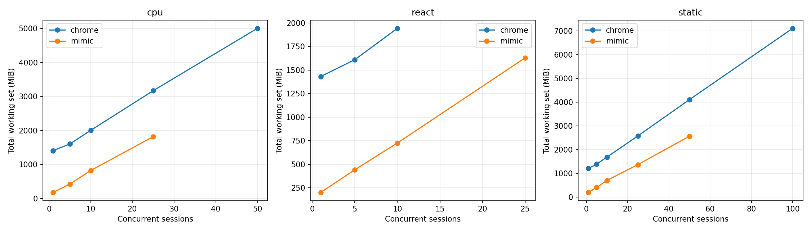
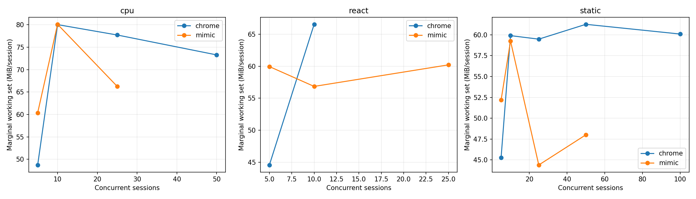
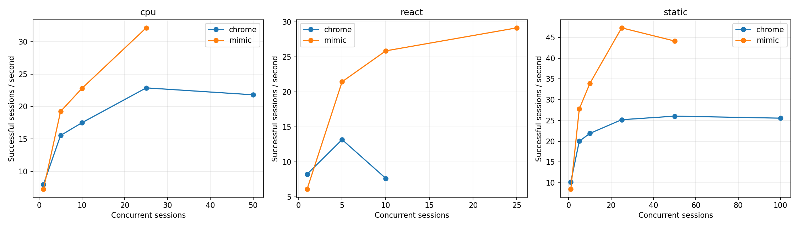
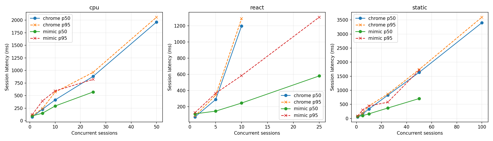
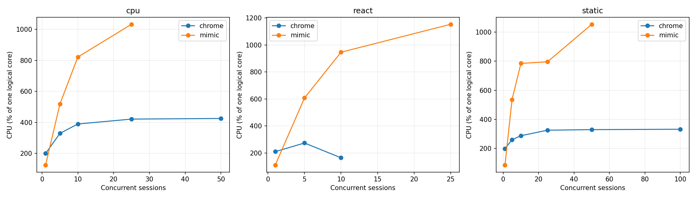

# Mimic V8 и Chrome 152: baseline Windows x64

Это измерение после исправления ошибок семантики, разрешённого пользователем. Оптимизации runtime ради производительности не выполнялись. Проверка исходной версии сохранена отдельно в `pre-fix/raw.json`.

## Окружение

| Параметр | Значение |
|---|---|
| Дата начала / конца | 2026-09-13T00:18:17.053796+04:00 / 2026-09-13T00:28:57.411066+04:00 |
| Chrome | {'protocolVersion': '1.3', 'product': 'Chrome/152.0.7977.82', 'revision': '@d04cdb24d67b081f6cf80200ffc5233f44b61109', 'userAgent': 'Mozilla/5.0 (Windows NT 10.0; Win64; x64) AppleWebKit/537.36 (KHTML, like Gecko) HeadlessChrome/152.0.0.0 Safari/537.36', 'jsVersion': '15.2.124.21'} |
| Chromium | 1669021 / d04cdb24d67b081f6cf80200ffc5233f44b61109 |
| Mimic commit | f6b63244c56518059626d6ce9e43d18ccda2158c |
| Mimic V8 | 15.2.124.1-rusty |
| OS | Windows-11-10.0.26200-SP0 |
| CPU | {"Name":"Intel(R) Core(TM) i7-14700KF","NumberOfCores":20,"NumberOfLogicalProcessors":28} |
| CPU physical / logical | 20 / 28 |
| RAM GiB | 31.83 |
| План питания | GUID схемы питания: 381b4222-f694-41f0-9685-ff5bb260df2e  (Сбалансированная) |
| Power overlay | 0 00000000-0000-0000-0000-000000000000 |
| Антивирус | {"displayName":"Windows Defender","productState":397568} |
| Chrome SHA-256 | ea36dd818a90176f1a70616f0363d9be527229389a6c073a0b1688b9e73f67e9 |
| Mimic SHA-256 | e30cdb3cd593de7879dc0f15329e4e458880fda585399670ad8bd4c6b1ebaafb |

Рабочая станция не была эксклюзивно выделена тесту: фоновые приложения и антивирус включены. Список процессов, версии инструментов, аргументы, SHA-256 фикстур и бинарников находятся в raw.json.

## Методика и корректность

В обеих системах создаётся новая страница и уникальный loopback-origin. HTTP cache отключён, ответы no-store; cookie не используются. Контексты, транспорт и процесс в warm сохраняются, состояние страницы не используется повторно. Это изоляция для данного контролируемого корпуса, а не проверка tenant/security isolation. Cold создаёт новый процесс и профиль. Кэш файлов Windows, DLL и DNS ОС не очищается; «cold» означает новый процесс, а не холодный диск. Вариант warm HTTP cache не измерялся.

Навигация заканчивается только при точном URL, document.readyState === "complete" и наличии __benchRun. Затем одинаковый явный запуск __benchRun; завершение — done и точное совпадение детерминированного результата. Settle = 0. Paint/networkidle не ожидаются. Chrome headless=new; результаты не переносятся автоматически на headful.

Внешние часы perf_counter/QPC; polling 5 ms плюс задержка CDP/планировщика ОС. navigation_ms включает разбор HTML и загрузку скриптов, execution_ms — запуск/выполнение приложения и обнаружение маркера. Они не являются изолированным временем JIT или чистого JavaScript. js_ms страницы диагностический: в Mimic виртуальное время часто равно нулю.

Процесс запускается приостановленным, включается в Windows Job Object, затем возобновляется. process_start_ms — вызов создания процесса; CDP readiness отсчитывается от начала создания до ответа протокола. runtime_initialization_ms — остаток между ними; внутренние фазы V8 отдельно не инструментированы. Cold total включает создание страницы, выполнение, teardown и завершение процесса; удаление временного профиля и обслуживание локального сервера не включены.

CPU — user+kernel всего Job Object, включая завершившихся потомков. Working set/private bytes — сумма всех текущих участников Job Object каждые 50 ms и в контрольных точках. Кратковременные пики памяти могут быть пропущены, общие страницы DLL могут учитываться несколько раз. CPU % задан относительно одного логического ядра; 100% машины = 2800%. Пики CPU чувствительны к дискретности счётчиков Windows.

Одна проверка и по одному первоначальному warmup на серию исключены явно. Основные серии: 10 cold и 20 warm, без удаления медленных наблюдений. p95 публикуется при n≥10, p99 при n≥100; используется линейная интерполяция эмпирических квантилей, хвосты при n=10–20 особенно неустойчивы. SD и CV, min/max всех серий доступны в summary.csv. Ускорение не агрегируется в одно отношение.

| Система / workload | Correctness gate |
|---|---|
| chrome/async | VALID |
| chrome/cpu | VALID |
| chrome/dom | VALID |
| chrome/react | VALID |
| chrome/static | VALID |
| chrome/wasm | VALID |
| mimic/async | VALID |
| mimic/cpu | VALID |
| mimic/dom | VALID |
| mimic/react | VALID |
| mimic/static | VALID |
| mimic/wasm | VALID |

### CDP readiness: отдельная серия с одинаковой пробой

В финальной серии обе системы отвечают на Target.getTargets после WebSocket handshake. По 10 новых процессов, порядок систем чередуется; warmup исключён. Дата: 2026-09-13T00:28:35.854310+04:00. Основная серия использует ту же общую пробу.

| Система | n | CDP p50 ms | p95 | Min | Max | SD | Ready RSS MiB |
|---|---|---|---|---|---|---|---|
| mimic | 10 | 215.52 | 231.80 | 214.03 | 235.31 | 7.65 | 29.88 |
| chrome | 10 | 265.99 | 365.89 | 243.38 | 420.46 | 51.01 | 374.60 |

## Cold startup (медианы, ms)

| Система | Workload | n | Process create | CDP ready | Runtime init | Cold total | Shutdown |
|---|---|---|---|---|---|---|---|
| chrome | static | 10 | 6.65 | 277.82 | 267.97 | 517.80 | 116.06 |
| mimic | static | 10 | 3.94 | 224.56 | 220.44 | 722.50 | 61.80 |
| mimic | cpu | 10 | 4.27 | 223.33 | 213.65 | 767.97 | 61.43 |
| chrome | cpu | 10 | 4.23 | 268.87 | 264.71 | 521.89 | 116.00 |
| chrome | dom | 10 | 4.23 | 290.61 | 286.38 | 556.36 | 124.52 |
| mimic | dom | 10 | 4.40 | 215.77 | 211.67 | 917.73 | 61.66 |
| mimic | async | 10 | 3.99 | 215.70 | 211.46 | 773.66 | 57.98 |
| chrome | async | 10 | 4.57 | 281.00 | 276.46 | 524.44 | 116.08 |
| chrome | react | 10 | 4.58 | 283.95 | 278.05 | 549.55 | 124.28 |
| mimic | react | 10 | 4.01 | 215.29 | 210.59 | 766.85 | 60.15 |
| mimic | wasm | 10 | 5.86 | 225.58 | 219.46 | 710.02 | 57.24 |
| chrome | wasm | 10 | 5.49 | 281.86 | 275.68 | 522.42 | 130.05 |

## Warm session startup / teardown (медианы)

| Система | Workload | n | Create ms | Teardown ms | RSS после teardown MiB |
|---|---|---|---|---|---|
| chrome | static | 20 | 29.81 | 11.73 | 1168.40 |
| mimic | static | 20 | 2.75 | 5.41 | 156.96 |
| mimic | cpu | 20 | 7.20 | 6.22 | 143.74 |
| chrome | cpu | 20 | 28.61 | 10.93 | 1421.05 |
| chrome | dom | 20 | 41.80 | 13.83 | 1419.31 |
| mimic | dom | 20 | 7.70 | 12.84 | 175.14 |
| mimic | async | 20 | 2.69 | 5.82 | 166.41 |
| chrome | async | 20 | 34.68 | 10.90 | 1246.78 |
| chrome | react | 20 | 39.78 | 15.42 | 1450.84 |
| mimic | react | 20 | 13.86 | 8.15 | 168.39 |
| mimic | wasm | 20 | 12.52 | 6.69 | 152.32 |
| chrome | wasm | 20 | 36.06 | 10.83 | 1287.91 |

## Single-session workload latency (ms)

| Система | Workload | Mode | n | Nav p50 | Execution p50 | Completion p50 | p95 | Min | Max | SD | CV |
|---|---|---|---|---|---|---|---|---|---|---|---|
| chrome | static | cold | 10 | 31.69 | 3.05 | 34.59 | 204.82 | 25.82 | 324.09 | 91.50 | 1.40 |
| mimic | static | cold | 10 | 413.94 | 3.47 | 417.42 | 429.91 | 409.96 | 435.12 | 8.04 | 0.02 |
| chrome | static | warm | 20 | 21.74 | 3.91 | 25.82 | 30.45 | 20.73 | 30.62 | 2.74 | 0.11 |
| mimic | static | warm | 20 | 56.23 | 3.27 | 59.50 | 77.14 | 57.94 | 194.31 | 30.07 | 0.45 |
| mimic | cpu | cold | 10 | 423.44 | 37.68 | 462.94 | 539.93 | 451.64 | 556.34 | 34.36 | 0.07 |
| chrome | cpu | cold | 10 | 28.49 | 35.41 | 66.44 | 88.60 | 60.39 | 95.21 | 11.41 | 0.16 |
| mimic | cpu | warm | 20 | 56.24 | 35.41 | 91.44 | 106.52 | 88.35 | 231.86 | 31.45 | 0.32 |
| chrome | cpu | warm | 20 | 19.24 | 29.08 | 48.34 | 56.33 | 45.05 | 56.52 | 3.64 | 0.07 |
| chrome | dom | cold | 10 | 26.68 | 14.76 | 41.74 | — | 34.08 | 100.85 | 23.40 | 0.43 |
| mimic | dom | cold | 10 | 425.54 | 180.88 | 607.28 | 669.96 | 588.27 | 692.01 | 31.20 | 0.05 |
| chrome | dom | warm | 20 | 24.31 | 32.67 | 56.74 | 70.94 | 51.73 | 79.44 | 6.88 | 0.12 |
| mimic | dom | warm | 20 | 55.99 | 173.82 | 231.87 | 309.84 | 206.94 | 350.75 | 33.25 | 0.14 |
| mimic | async | cold | 10 | 414.09 | 62.73 | 477.48 | 528.51 | 467.79 | 549.82 | 24.67 | 0.05 |
| chrome | async | cold | 10 | 27.63 | 33.73 | 62.40 | 67.37 | 55.72 | 68.96 | 3.84 | 0.06 |
| mimic | async | warm | 20 | 57.16 | 62.21 | 117.66 | 135.08 | 105.56 | 253.82 | 30.78 | 0.25 |
| chrome | async | warm | 20 | 19.90 | 28.02 | 48.07 | 52.34 | 42.23 | 53.95 | 2.97 | 0.06 |
| chrome | react | cold | 10 | 29.93 | 22.93 | 56.50 | 62.45 | 40.79 | 64.03 | 8.09 | 0.15 |
| mimic | react | cold | 10 | 425.46 | 44.07 | 469.89 | 539.56 | 453.91 | 584.32 | 37.96 | 0.08 |
| chrome | react | warm | 20 | 27.24 | 26.48 | 53.58 | 62.30 | 40.76 | 64.90 | 5.48 | 0.10 |
| mimic | react | warm | 20 | 73.76 | 47.67 | 119.97 | 149.84 | 104.54 | 284.59 | 37.29 | 0.29 |
| mimic | wasm | cold | 10 | 398.43 | 4.04 | 402.48 | 416.54 | 395.63 | 419.25 | 7.04 | 0.02 |
| chrome | wasm | cold | 10 | 31.19 | 8.54 | 40.13 | 86.28 | 29.89 | 100.20 | 21.33 | 0.45 |
| mimic | wasm | warm | 20 | 67.63 | 4.56 | 72.05 | 95.47 | 54.61 | 182.99 | 26.37 | 0.34 |
| chrome | wasm | warm | 20 | 20.13 | 5.88 | 25.86 | 37.88 | 21.07 | 39.02 | 4.66 | 0.17 |

## Single-session память / CPU (медианы)

| Система | Workload | Mode | До страницы MiB | После create MiB | Peak RSS MiB | Peak private MiB | CPU/session ms | CPU/workload ms |
|---|---|---|---|---|---|---|---|---|
| chrome | static | cold | 378.28 | 437.98 | 518.45 | 274.91 | 320.31 | 132.81 |
| mimic | static | cold | 29.82 | 30.21 | 187.12 | 221.59 | 593.75 | 593.75 |
| chrome | static | warm | 1118.39 | 1153.85 | 1177.43 | 584.57 | 156.25 | 46.88 |
| mimic | static | warm | 155.72 | 155.72 | 198.92 | 228.99 | 78.12 | 62.50 |
| mimic | cpu | cold | 29.83 | 31.34 | 183.55 | 217.19 | 664.06 | 656.25 |
| chrome | cpu | cold | 379.25 | 439.65 | 542.91 | 290.78 | 546.88 | 265.62 |
| mimic | cpu | warm | 143.74 | 143.75 | 186.82 | 216.15 | 125.00 | 109.38 |
| chrome | cpu | warm | 1343.96 | 1370.18 | 1423.32 | 780.89 | 226.56 | 109.38 |
| chrome | dom | cold | 382.09 | 441.32 | 541.42 | 294.78 | 546.88 | 218.75 |
| mimic | dom | cold | 29.79 | 30.43 | 182.94 | 216.79 | 890.62 | 867.19 |
| chrome | dom | warm | 1332.19 | 1380.96 | 1419.31 | 765.69 | 312.50 | 125.00 |
| mimic | dom | warm | 174.85 | 174.85 | 224.08 | 253.60 | 304.69 | 289.06 |
| mimic | async | cold | 29.83 | 30.16 | 182.40 | 214.91 | 593.75 | 593.75 |
| chrome | async | cold | 386.85 | 437.87 | 531.15 | 288.59 | 460.94 | 242.19 |
| mimic | async | warm | 163.88 | 163.88 | 212.70 | 243.15 | 125.00 | 125.00 |
| chrome | async | warm | 1181.77 | 1218.63 | 1246.79 | 629.21 | 218.75 | 78.12 |
| chrome | react | cold | 376.50 | 441.93 | 541.68 | 299.93 | 523.44 | 226.56 |
| mimic | react | cold | 29.85 | 30.20 | 185.41 | 219.52 | 656.25 | 648.44 |
| chrome | react | warm | 1371.43 | 1416.11 | 1451.43 | 816.43 | 289.06 | 132.81 |
| mimic | react | warm | 165.87 | 165.87 | 202.99 | 232.20 | 171.88 | 171.88 |
| mimic | wasm | cold | 29.84 | 30.65 | 180.19 | 213.80 | 546.88 | 546.88 |
| chrome | wasm | cold | 382.26 | 431.49 | 526.04 | 279.79 | 359.38 | 148.44 |
| mimic | wasm | warm | 150.92 | 150.92 | 180.05 | 208.03 | 125.00 | 78.12 |
| chrome | wasm | warm | 1220.73 | 1258.38 | 1287.99 | 636.81 | 195.31 | 78.12 |

## Concurrency / density

Каждый уровень — отдельный процесс; один исключённый warmup и max(5, ceil(20/N)) измеряемых волн. Страницы создаются параллельно; после барьера все начинают навигацию. Завершившиеся страницы удерживаются до окончания волны для одновременного RSS. Throughput = успешные сессии / время create→последний teardown, включая барьер и измерения, но без HTTP-server setup/cleanup. Latency = create→completion, включая ожидание барьера. Это batch throughput, не оптимизированный постоянный поток запросов. Удержание не добавляется в latency, но входит в throughput. CPU на сессию = CPU всей волны / число успехов; пересекающиеся интервалы CPU отдельных страниц не суммируются.

Пределы остановки: любая ошибка, <15% либо <2 GiB доступной RAM, >1024 pages input/s в течение 3 s, timeout 180 s. Это защита рабочей машины; максимум прошедшего уровня — нижняя граница поддержанной здесь ёмкости, не доказательство абсолютного максимума.

Mimic сериализует команды CDP общим mutex. Измерение включает это поведение; профилирование причин затрат не проводилось. В строках с остановкой RSS может быть снят раньше завершения всех страниц, а число волн 0 означает остановку на исключаемом warmup. Такие строки диагностические и не входят в fit/графики стабильных уровней. Между волнами дополнительно выполняются 250 ms recovery, очистка серверов и запись checkpoint вне batch throughput.

| Система | Workload | N | Волн | Успех % | RSS MiB | RSS/N MiB | Peak MiB | CPU/session ms | Сессий/s | p50 ms | p95 ms | p99 ms | Стоп |
|---|---|---|---|---|---|---|---|---|---|---|---|---|---|
| chrome | static | 1 | 20 | 100.00 | 1203.15 | 1203.15 | 1215.03 | 196.09 | 10.19 | 54.71 | 74.03 | — |  |
| mimic | static | 1 | 20 | 100.00 | 193.93 | 193.93 | 245.73 | 102.34 | 8.50 | 67.54 | 87.37 | — |  |
| chrome | static | 5 | 5 | 100.00 | 1384.25 | 276.85 | 1411.64 | 130.00 | 20.02 | 165.73 | 185.24 | — |  |
| mimic | static | 5 | 5 | 100.00 | 402.62 | 80.52 | 553.62 | 193.12 | 27.77 | 100.13 | 302.94 | — |  |
| chrome | static | 10 | 5 | 100.00 | 1683.76 | 168.38 | 1688.56 | 131.56 | 21.89 | 335.83 | 450.07 | — |  |
| mimic | static | 10 | 5 | 100.00 | 698.93 | 69.89 | 936.97 | 231.25 | 33.93 | 164.38 | 444.31 | — |  |
| chrome | static | 25 | 5 | 100.00 | 2575.99 | 103.04 | 2590.31 | 129.38 | 25.19 | 826.97 | 867.26 | 869.50 |  |
| mimic | static | 25 | 5 | 100.00 | 1364.73 | 54.59 | 1770.90 | 168.12 | 47.31 | 369.84 | 577.42 | 592.20 |  |
| chrome | static | 50 | 5 | 100.00 | 4107.51 | 82.15 | 4131.18 | 126.62 | 26.05 | 1636.40 | 1738.60 | 1744.25 |  |
| mimic | static | 50 | 5 | 100.00 | 2564.94 | 51.30 | 2929.86 | 238.56 | 44.14 | 706.24 | 1714.95 | 1783.63 |  |
| chrome | static | 100 | 5 | 100.00 | 7112.28 | 71.12 | 7116.51 | 130.06 | 25.56 | 3399.26 | 3596.25 | 3618.61 |  |
| mimic | static | 100 | 0 | 100.00 | 3453.88 | 34.54 | 4923.84 | 879.38 | 19.17 | 4671.31 | 4903.94 | 5010.25 | memory pressure (<15% or 2 GiB available) |
| chrome | cpu | 1 | 20 | 100.00 | 1408.42 | 1408.42 | 1418.43 | 250.78 | 7.98 | 76.88 | 101.80 | — |  |
| mimic | cpu | 1 | 20 | 100.00 | 181.94 | 181.94 | 261.54 | 172.66 | 7.27 | 97.58 | 123.24 | — |  |
| chrome | cpu | 5 | 5 | 100.00 | 1603.31 | 320.66 | 1608.76 | 211.88 | 15.54 | 229.55 | 243.65 | — |  |
| mimic | cpu | 5 | 5 | 100.00 | 423.43 | 84.69 | 524.92 | 269.38 | 19.24 | 150.17 | 394.55 | — |  |
| chrome | cpu | 10 | 5 | 100.00 | 2003.53 | 200.35 | 2020.50 | 222.81 | 17.51 | 414.89 | 569.52 | — |  |
| mimic | cpu | 10 | 5 | 100.00 | 823.99 | 82.40 | 861.44 | 360.31 | 22.81 | 293.91 | 593.12 | — |  |
| chrome | cpu | 25 | 5 | 100.00 | 3169.45 | 126.78 | 3175.75 | 184.25 | 22.88 | 882.49 | 963.90 | 973.68 |  |
| mimic | cpu | 25 | 5 | 100.00 | 1817.88 | 72.72 | 1852.12 | 321.38 | 32.14 | 572.22 | 823.77 | 844.40 |  |
| chrome | cpu | 50 | 5 | 100.00 | 5001.66 | 100.03 | 5020.97 | 195.12 | 21.82 | 1961.91 | 2058.32 | 2073.80 |  |
| mimic | cpu | 50 | 0 | 100.00 | 2406.57 | 48.13 | 3143.90 | 1048.12 | 16.04 | 2880.05 | 3044.90 | — | memory pressure (<15% or 2 GiB available) |
| chrome | cpu | 100 | 0 | 100.00 | 5993.82 | 59.94 | 7886.24 | 238.28 | 19.56 | 4731.16 | 4817.29 | 4879.02 | sustained paging (>1024 pages/s for 3 seconds) |
| chrome | react | 1 | 20 | 100.00 | 1432.18 | 1432.18 | 1436.96 | 255.47 | 8.24 | 73.77 | 85.50 | — |  |
| mimic | react | 1 | 20 | 100.00 | 202.45 | 202.45 | 236.69 | 182.03 | 6.12 | 111.73 | 126.78 | — |  |
| chrome | react | 5 | 5 | 100.00 | 1610.49 | 322.10 | 1623.88 | 208.12 | 13.18 | 289.26 | 342.61 | — |  |
| mimic | react | 5 | 5 | 100.00 | 442.22 | 88.44 | 571.53 | 283.75 | 21.43 | 145.33 | 366.24 | — |  |
| chrome | react | 10 | 5 | 100.00 | 1943.21 | 194.32 | 1956.31 | 215.62 | 7.64 | 1199.12 | 1289.63 | — |  |
| mimic | react | 10 | 5 | 100.00 | 726.46 | 72.65 | 907.34 | 366.25 | 25.84 | 245.14 | 584.48 | — |  |
| chrome | react | 25 | 4 | 99.00 | 3007.15 | 120.29 | 3099.06 | 276.83 | 2.84 | 884.66 | 1871.21 | 2160.03 | non-zero failure rate |
| mimic | react | 25 | 5 | 100.00 | 1629.62 | 65.18 | 1823.03 | 395.88 | 29.13 | 580.25 | 1306.53 | 1339.50 |  |
| mimic | react | 50 | 0 | 100.00 | 2439.17 | 48.78 | 2882.80 | 1111.25 | 15.73 | 2957.56 | 3060.77 | — | memory pressure (<15% or 2 GiB available) |

## Marginal RAM/session

Измерена конечная разность между соседними протестированными N, делённая на ΔN; это не прямое измерение каждого N→N+1. Линейная модель — описательный OLS fit по медианам только успешных уровней. Пересечение — экстраполяция; реальный startup overhead включает исходную пустую страницу. Общий RSS включает процессы и кэши, оставшиеся от предыдущих волн, а число волн зависит от N. Поэтому fit смешивает стоимость активных страниц с историей процесса. Дополнительно показан прирост RSS относительно начала той же волны: он тоже может включать фоновую активность и GC.

| Система | Workload | N | (Active RSS − before wave RSS)/N MiB |
|---|---|---|---|
| chrome | static | 1 | 59.19 |
| mimic | static | 1 | 26.37 |
| chrome | static | 5 | 58.06 |
| mimic | static | 5 | 35.07 |
| chrome | static | 10 | 55.64 |
| mimic | static | 10 | 36.21 |
| chrome | static | 25 | 57.31 |
| mimic | static | 25 | 29.78 |
| chrome | static | 50 | 58.12 |
| mimic | static | 50 | 28.23 |
| chrome | static | 100 | 58.62 |
| mimic | static | 100 | 34.24 |
| chrome | cpu | 1 | 78.52 |
| mimic | cpu | 1 | 36.73 |
| chrome | cpu | 5 | 68.33 |
| mimic | cpu | 5 | 42.20 |
| chrome | cpu | 10 | 70.53 |
| mimic | cpu | 10 | 44.94 |
| chrome | cpu | 25 | 72.26 |
| mimic | cpu | 25 | 45.85 |
| chrome | cpu | 50 | 72.96 |
| mimic | cpu | 50 | 47.54 |
| chrome | cpu | 100 | 55.29 |
| chrome | react | 1 | 80.96 |
| mimic | react | 1 | 32.95 |
| chrome | react | 5 | 65.95 |
| mimic | react | 5 | 43.67 |
| chrome | react | 10 | 67.43 |
| mimic | react | 10 | 36.44 |
| chrome | react | 25 | 68.80 |
| mimic | react | 25 | 36.92 |
| mimic | react | 50 | 48.18 |

| Система | Workload | N low→high | ΔRSS MiB | ΔRSS/ΔN MiB |
|---|---|---|---|---|
| chrome | cpu | 1→5 | 194.90 | 48.72 |
| chrome | cpu | 5→10 | 400.22 | 80.04 |
| chrome | cpu | 10→25 | 1165.92 | 77.73 |
| chrome | cpu | 25→50 | 1832.21 | 73.29 |
| mimic | cpu | 1→5 | 241.49 | 60.37 |
| mimic | cpu | 5→10 | 400.56 | 80.11 |
| mimic | cpu | 10→25 | 993.88 | 66.26 |
| chrome | react | 1→5 | 178.31 | 44.58 |
| chrome | react | 5→10 | 332.71 | 66.54 |
| mimic | react | 1→5 | 239.78 | 59.94 |
| mimic | react | 5→10 | 284.23 | 56.85 |
| mimic | react | 10→25 | 903.16 | 60.21 |
| chrome | static | 1→5 | 181.09 | 45.27 |
| chrome | static | 5→10 | 299.52 | 59.90 |
| chrome | static | 10→25 | 892.23 | 59.48 |
| chrome | static | 25→50 | 1531.52 | 61.26 |
| chrome | static | 50→100 | 3004.77 | 60.10 |
| mimic | static | 1→5 | 208.69 | 52.17 |
| mimic | static | 5→10 | 296.31 | 59.26 |
| mimic | static | 10→25 | 665.80 | 44.39 |
| mimic | static | 25→50 | 1200.21 | 48.01 |

| Система | Workload | Fixed fit MiB | Marginal fit MiB | R² | Max stable N |
|---|---|---|---|---|---|
| chrome | cpu | 1281.66 | 74.48 | 1.00 | 50 |
| mimic | cpu | 108.28 | 68.64 | 1.00 | 25 |
| chrome | react | 1357.00 | 57.18 | 0.99 | 10 |
| mimic | react | 140.89 | 59.44 | 1.00 | 25 |
| chrome | static | 1098.56 | 60.08 | 1.00 | 100 |
| mimic | static | 172.42 | 47.95 | 1.00 | 50 |

## Teardown / recovery

| Система | Workload | N | Ready RSS MiB | RSS после волн MiB | CPU всей серии s | CPU % |
|---|---|---|---|---|---|---|
| chrome | static | 1 | 377.28 | 1146.10 | 3.92 | 199.74 |
| mimic | static | 1 | 29.78 | 167.57 | 2.05 | 86.95 |
| chrome | static | 5 | 388.58 | 1147.00 | 3.25 | 260.22 |
| mimic | static | 5 | 29.82 | 247.65 | 4.83 | 536.39 |
| chrome | static | 10 | 386.02 | 1133.82 | 6.58 | 288.02 |
| mimic | static | 10 | 29.84 | 429.16 | 11.56 | 784.68 |
| chrome | static | 25 | 370.83 | 1149.75 | 16.17 | 325.89 |
| mimic | static | 25 | 29.70 | 764.13 | 21.02 | 795.39 |
| chrome | static | 50 | 370.76 | 1212.92 | 31.66 | 329.83 |
| mimic | static | 50 | 29.81 | 1255.04 | 59.64 | 1053.07 |
| chrome | static | 100 | 458.36 | 1255.04 | 65.03 | 332.47 |
| mimic | static | 100 | 29.62 | 293.70 | 87.94 | 1685.75 |
| chrome | cpu | 1 | 373.71 | 1332.02 | 5.02 | 200.01 |
| mimic | cpu | 1 | 29.82 | 145.29 | 3.45 | 125.60 |
| chrome | cpu | 5 | 377.03 | 1266.15 | 5.30 | 329.31 |
| mimic | cpu | 5 | 29.72 | 258.86 | 6.73 | 518.35 |
| chrome | cpu | 10 | 377.50 | 1301.87 | 11.14 | 390.10 |
| mimic | cpu | 10 | 29.82 | 446.52 | 18.02 | 821.96 |
| chrome | cpu | 25 | 154.11 | 1369.30 | 23.03 | 421.63 |
| mimic | cpu | 25 | 29.77 | 882.25 | 40.17 | 1033.00 |
| chrome | cpu | 50 | 377.37 | 1363.01 | 48.78 | 425.67 |
| mimic | cpu | 50 | 29.65 | 196.00 | 52.41 | 1680.83 |
| chrome | cpu | 100 | 386.80 | 1395.76 | 23.83 | 465.97 |
| chrome | react | 1 | 395.98 | 1351.69 | 5.11 | 210.46 |
| mimic | react | 1 | 29.80 | 169.56 | 3.64 | 111.37 |
| chrome | react | 5 | 390.56 | 1285.61 | 5.20 | 274.24 |
| mimic | react | 5 | 30.33 | 274.70 | 7.09 | 608.16 |
| chrome | react | 10 | 390.93 | 1268.36 | 10.78 | 164.76 |
| mimic | react | 10 | 29.70 | 406.71 | 18.31 | 946.52 |
| chrome | react | 25 | 385.11 | 1292.04 | 27.41 | 78.63 |
| mimic | react | 25 | 29.86 | 839.35 | 49.48 | 1153.08 |
| mimic | react | 50 | 29.97 | 418.05 | 55.56 | 1747.75 |

## Локальный сервер (измеряется независимо)

Время обработчика HTTP — от получения запроса обработчиком до завершения записи ответа; не включает очередь TCP/планировщика сервера или сетевой roundtrip. До основного workload сервер создаётся вне измеряемого интервала. Запросы и bytes каждого ресурса записаны в raw.json.

| Система | Workload | Mode | Запросов | Server p50 ms | Server p95 ms | Server max ms |
|---|---|---|---|---|---|---|
| chrome | static | cold | 20 | 0.30 | 0.72 | 3.38 |
| mimic | static | cold | 20 | 0.19 | 0.30 | 0.32 |
| chrome | static | warm | 40 | 0.22 | 0.43 | 0.56 |
| mimic | static | warm | 40 | 0.19 | 0.36 | 0.41 |
| mimic | cpu | cold | 20 | 0.26 | 0.52 | 0.54 |
| chrome | cpu | cold | 20 | 0.23 | 0.48 | 0.51 |
| mimic | cpu | warm | 40 | 0.17 | 0.32 | 0.38 |
| chrome | cpu | warm | 40 | 0.23 | 0.45 | 0.49 |
| chrome | dom | cold | 18 | 0.21 | 0.53 | 0.56 |
| mimic | dom | cold | 20 | 0.19 | 0.34 | 0.42 |
| chrome | dom | warm | 40 | 0.24 | 0.43 | 0.60 |
| mimic | dom | warm | 40 | 0.21 | 0.42 | 2.01 |
| mimic | async | cold | 50 | 0.08 | 0.31 | 0.39 |
| chrome | async | cold | 50 | 0.12 | 0.44 | 0.63 |
| mimic | async | warm | 100 | 0.09 | 0.28 | 0.42 |
| chrome | async | warm | 100 | 0.11 | 0.34 | 0.49 |
| chrome | react | cold | 50 | 0.35 | 0.80 | 0.90 |
| mimic | react | cold | 50 | 0.25 | 0.41 | 0.49 |
| chrome | react | warm | 100 | 0.35 | 0.83 | 1.25 |
| mimic | react | warm | 100 | 0.33 | 0.92 | 2.38 |
| mimic | wasm | cold | 20 | 0.33 | 0.75 | 1.02 |
| chrome | wasm | cold | 20 | 0.35 | 0.54 | 0.56 |
| mimic | wasm | warm | 40 | 0.32 | 1.60 | 3.58 |
| chrome | wasm | warm | 40 | 0.23 | 0.41 | 2.51 |

## Валидность измеряемых серий

| Система | Workload | Mode | Успех / попыток | Использование сравнения |
|---|---|---|---|---|
| chrome | static | cold | 10/10 | VALID |
| mimic | static | cold | 10/10 | VALID |
| chrome | static | warm | 20/20 | VALID |
| mimic | static | warm | 20/20 | VALID |
| mimic | cpu | cold | 10/10 | VALID |
| chrome | cpu | cold | 10/10 | VALID |
| mimic | cpu | warm | 20/20 | VALID |
| chrome | cpu | warm | 20/20 | VALID |
| chrome | dom | cold | 9/10 | INVALID — error or semantic mismatch; no speed claim |
| mimic | dom | cold | 10/10 | VALID |
| chrome | dom | warm | 20/20 | VALID |
| mimic | dom | warm | 20/20 | VALID |
| mimic | async | cold | 10/10 | VALID |
| chrome | async | cold | 10/10 | VALID |
| mimic | async | warm | 20/20 | VALID |
| chrome | async | warm | 20/20 | VALID |
| chrome | react | cold | 10/10 | VALID |
| mimic | react | cold | 10/10 | VALID |
| chrome | react | warm | 20/20 | VALID |
| mimic | react | warm | 20/20 | VALID |
| mimic | wasm | cold | 10/10 | VALID |
| chrome | wasm | cold | 10/10 | VALID |
| mimic | wasm | warm | 20/20 | VALID |
| chrome | wasm | warm | 20/20 | VALID |

## Инженерный вывод

1. По медиане warm navigation→completion Mimic быстрее: ни на одной из измеренных нагрузок. CDP readiness (общая проба, отдельные cold): mimic 215.52 ms; chrome 265.99 ms

2. Chrome быстрее по той же метрике: async (117.66 / 48.07 ms Mimic/Chrome); cpu (91.44 / 48.34 ms Mimic/Chrome); dom (231.87 / 56.74 ms Mimic/Chrome); react (119.97 / 53.58 ms Mimic/Chrome); static (59.50 / 25.82 ms Mimic/Chrome); wasm (72.05 / 25.86 ms Mimic/Chrome).

3. Фиксированный overhead процесса (CDP ready, включая исходную страницу): mimic 29.83 MiB; chrome 383.64 MiB. Startup latency и OLS intercept приведены отдельно выше.

4. Оценки marginal RAM/session: chrome/cpu 74.48 MiB; mimic/cpu 68.64 MiB; chrome/react 57.18 MiB; mimic/react 59.44 MiB; chrome/static 60.08 MiB; mimic/static 47.95 MiB.

5. Максимальный стабильный N по нагрузке: mimic/cpu 25; chrome/cpu 50; mimic/react 25; chrome/react 10; mimic/static 50; chrome/static 100.

6. Throughput на максимальном общем стабильном уровне:

cpu, N=25: Mimic 32.14 и Chrome 22.88 успешных сессий/s; RSS 1817.88 и 3169.45 MiB; CPU/session 321.38 и 184.25 ms.

react, N=10: Mimic 25.84 и Chrome 7.64 успешных сессий/s; RSS 726.46 и 1943.21 MiB; CPU/session 366.25 и 215.62 ms.

static, N=50: Mimic 44.14 и Chrome 26.05 успешных сессий/s; RSS 2564.94 и 4107.51 MiB; CPU/session 238.56 и 126.62 ms.

7. Невалидные сравнения после исправлений: нет на correctness gate; ошибки отдельных итераций остаются в raw.json. До исправлений: DOM, async, React, WebAssembly (см. pre-fix).

8. Ограничения: одна занятая рабочая станция; headless Chrome; различные сборки V8; HTTP cache отключён; ограниченные размеры и семантические проверки корпуса; React-фикстура синтетическая, не Next.js/production-приложение. Polling и sampler входят в нагрузку системы. RSS — сумма рабочих наборов, не уникальная физическая RAM; нет финансовой модели стоимости сессии. Paging — общесистемный счётчик, не атрибуция hard faults конкретному процессу. Значения виртуальных часов Mimic не используются для сравнений.

9. Наиболее сильная защищаемая формулировка для README: «На Windows x64 локальные контролируемые нагрузки прошли проверку результатов в Mimic V8 и Chrome 152.0.7977.82; опубликованы воспроизводимый harness, исходные наблюдения и отдельные показатели latency, CPU и памяти. cpu, N=25: Mimic 32.14 и Chrome 22.88 успешных сессий/s; RSS 1817.88 и 3169.45 MiB; CPU/session 321.38 и 184.25 ms.»

10. Данные НЕ подтверждают утверждение «Mimic в X раз быстрее Chrome вообще», полную совместимость с браузером, безопасность изоляции tenants, преимущество чистого V8/JIT, выигрыш на произвольных сайтах или денежную экономию без модели эксплуатации.
