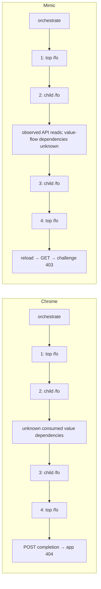
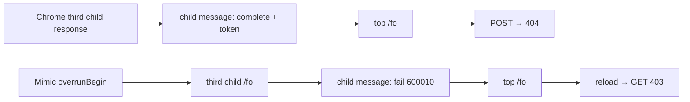

# Continuation investigation: evidence and unresolved causality

The first *verdict-causing* divergence is still unknown. A consumed Resource
Timing value now has an independently reproduced Chrome/Mimic discrepancy.
This is stronger evidence than an unsupported API name, but does not establish
that this value caused the server's completion choice. The fresh post-fix run
still receives a repeated challenge; the target has not been reached by Mimic.

## Reference and research

The ordinary comparison uses system Chrome **152.0.7977.83**, explicitly
authorized as an alternative to frozen **152.0.7977.82**. It is not a frozen
reference result. Captures are `chrome-system-partition-normal-20260910` and
`mimic-partition-normal-20260910`, under the ignored private-captures directory.

* [scaredos/cfresearch](https://github.com/scaredos/cfresearch) describes a
  historical managed flow with server-generated intermediate steps and a final
  form POST. It supports treating that POST as part of completion, not inventing
  one when the current server returns a different continuation.
* [Aly-Reda case study](https://github.com/Aly-Reda/Cloudflare-DDoS-Protection-Case-Study)
  shows serialization of context, a flow response, decoding and execution of
  returned code. Its old trace also already contains `_cf_chl_opt`; that name
  alone does not identify a modern protocol generation.
* [cloudscraper issue 298](https://github.com/VeNoMouS/cloudscraper/issues/298)
  proposes detection/payload changes and reports unsuccessful attempts. Its TLS
  attribution is not an experimentally isolated explanation of our failure.
  `text/plain` does not by itself establish that a body is JSON. Do not copy its
  proposed protocol into Mimic.

## Observed sequence (first attempt only)

These are request/response order graphs, **not proven value-flow graphs**.
The displayed unknown edges must not be interpreted as dependency attribution.

All four responses in both runs have status 200 and report h3. Their request
bodies below are CDP text re-encoded as UTF-8, not independent packet captures.
Times are relative to each run's first /fo; cross-target Chrome clock alignment
is not independently verified. Absolute Chrome/Mimic timestamps must not be
subtracted. These values are observations, not normalized equality assertions.

| Step | Context | Chrome start ms / body bytes | Mimic start ms / body bytes | response Cf-Chl-Gen length, Chrome / Mimic |
|---|---|---:|---:|---:|
| 1 | top document | 0 / 2242 | 0 / 2252 | 69 / 69 |
| 2 | child document | 318.680 / 4738 | 892.000 / 4695 | 965 / 965 |
| 3 | child document | 2655.731 / 88386 | 11401.000 / 76930 | absent / absent |
| 4 | top document | 2713.118 / 8663 | 11499.000 / 7650 | absent / absent |

`Cf-Chl` is present (127 characters) at all four steps in each run. Values are
attempt-specific. Complete URLs, headers, hashes, session/frame IDs, available
initiator stacks and response timing are retained in private
`chrome-request-timeline.json` / `mimic-request-timeline.json`.

The second-response → third-request interval is **2176.938 ms in Chrome** and
**10252.000 ms in Mimic**. The latter contains three long DOM tasks (~2579,
4057 and 3031 ms). These are duration candidates, not proof of faulty temporal
semantics or the earliest causal divergence. Different attempts can receive
different code and collect different random values even in the same runtime.

## Confirmed consumed discrepancy: Resource Timing ownership

In the Mimic trace, event **1855**, in child realm
`91aa5af5-f67e-4705-9309-37ba22a1cae9`, records the actual values returned by
`Performance.getEntries`, including a parent-page favicon resource. It lies
between /fo request events **840** and **2566**. Event 1856 reads navigation
timing again. This proves exposure to executing code; it does not prove the
favicon entry is serialized or affects the server verdict.

The underlying defect: resource ownership was recovered only from requests
starting after the reader realm's time origin. A parent request started before
iframe creation but completed afterwards therefore had an empty inferred owner
and appeared in the child's timeline. Network response events already retain
the authoritative context. The fix uses that context before the legacy lookup;
it does not maintain a second resource owner store.

The shared `resource-realm-isolation` corpus reproduces this without any
Cloudflare code. A delayed parent fetch spans creation of a child document:

| Runtime | parent resources | child resources |
|---|---|---|
| system Chrome 152.0.7977.83 | `["parent"]` | `[]` |
| Mimic dfc383d | `["parent"]` | `["parent"]` |
| fixed source, Goja and V8 regression | `["parent"]` | `[]` |
| fresh Mimic executable, shared differential | `["parent"]` | `[]` |

Private baseline evidence: `resource-scope-before-v2`. The first probe
`resource-scope-before` timed out in Mimic while invoking cross-realm fetch;
it is incomplete and is not the ownership oracle. The reduced probe uses a
child-local evaluation and is complete in both runtimes.

The user started the newly built executable after automatic launch review
blocked the agent's launch. `semantics-after-20260910` contains a complete fresh
differential: resource ownership, worker microtasks and SameSite each have zero
differences. Navigation cookies agree; four remaining Origin/Fetch Metadata
differences occur only in the cross-site redirect cases of that corpus.

Classification: observable before completion; potentially changes submitted
state; the completed experiment shows **no observed improvement in verdict**.

### Ordinary post-fix attempt

`mimic-resource-scope-normal-20260910` runs the fresh binary without payload
instrumentation. Its response bodies are retained, unlike the earlier ordinary
Mimic capture. `mimic-resource-scope-request-timeline.json` inventories them.

The first four request body lengths are 2252, 4652, 76695, 7650 bytes. Response
body lengths are 113304, 823000, 5036, **3240** bytes, respectively. All four
responses report 200/h3. Trace event 1795 reads four Performance entries without
the parent favicon; event 2688 reads `Location.reload`, followed by a repeated
document GET returning 403. Later top-document reads may legitimately include
its own favicon: do not equate any favicon anywhere with the fixed leak.

The second-response → third-request interval is approximately **14389 ms** in
this attempt. The timing did not converge with Chrome merely by fixing resource
ownership. No heavy Go test process was running during this capture.

This run includes the SameSite/worker/form changes as well, so it is a batch
intervention, not a single-variable causal experiment. It proves the resource
observation changed without obtaining a pass; it does not prove that the value
can never contribute to a verdict in combination with other inputs.

## Other changes and priority

* CHIPS: fixed in dfc383d; ordinary completion remained reload. Not sufficient
  to explain this 403. This experiment does not mathematically exclude any
  interaction with other defects.
* SameSite: selection/write filtering now separates access from partition
  identity, implements Lax/Strict/default and preserves default-cookie age on
  replacement. Local Chrome navigation probes establish the tested method/site
  cases. The two-minute default unsafe grace period is implemented and unit
  tested; its age boundary was not newly measured against Chrome in this batch.
* Worker microtasks: missing operation replaced with intrinsic microtask
  scheduling, validation and cancelable error delivery. The shared local probe
  measures ordering, callback receiver, ignored thenables and Promise poisoning.
  V8 error locations use native metadata, not script-visible Error.stack.
  Potentially relevant before completion, but no consumption-to-payload edge
  has been established for queueMicrotask in this challenge attempt.
* form.submit: top-level HTTP(S) form navigation, canonical dirty values,
  method/body preservation and initial form-action policy check. Independent
  local server tests verify GET query and POST body/Origin. This cannot explain
  a server choice made before submit is called; it is a completion-execution
  and differential-harness dependency, not the current causal candidate.

Remaining form boundaries: nested/other browsing-context targets, file controls,
formdata event mutation and dialog submission are explicitly unsupported.
Full redirect-chain Origin/Fetch Metadata taint and form-action enforcement on
redirect destinations remain unimplemented. No POST is forced after reload.
Worker error forwarding to the parent still lacks full location metadata;
non-V8 engines report the native-location boundary explicitly.

## Reproducible inventory and missing edges

### Message boundary experiment: a branch before the final top request

A bounded diagnostic message listener was installed in fresh owned documents.
It records short primitive message values and lengths of long strings, without
decoding payloads, replacing browser functions or modifying received messages.
An extra listener and console serialization still add execution overhead, so
these are instrumented runs, not transparent observations.

Chrome passed both the top-only observer and the all-frame observer, including
an ordinary GET revisit in the latter. In `chrome-message-all-frames-v2-20260910`
the sequence reaches a child-to-parent **`event: "complete"`** carrying a token,
then the top-level completion POST and 404. In
`mimic-message-observer-20260910` it instead reaches **`event: "fail"`,
`code: "600010"`**, with `rcV`, `cfChlOut`, `cfChlOutS`, `frMd` and `aC`, before
the final top-level /fo request. Thus the top request already follows a failed
widget result; reload is not merely a failed form navigation.

Mimic also emits `overrunBegin` before sending the third /fo, then `overrunEnd`
and `fail` after its response. Do not equate that event name with a proven
timeout cause. Cloudflare documents [600* as generic challenge failure](https://developers.cloudflare.com/turnstile/troubleshooting/client-side-errors/error-codes/);
110600 is the separately documented challenge timeout. The internal suffix
does not disclose the exact failed observation.

The observer exposes an earlier input boundary as well: the top document sends
`extraParams` to the child, including **`apiJsResourceTiming`**, before the child
flow requests. This contains a concrete serialization discrepancy: Mimic omits
implemented default-valued Resource Timing attributes. The independent
`resource-json` corpus confirms omission of workerStart, redirectStart,
redirectEnd, firstInterimResponseStart, deliveryType and navigationId. It also
confirms that Mimic's serializer invoked a replaced public getter and accepted
an invalid receiver; Chrome ignores the override and throws TypeError for the
invalid receiver. The common fix serializes existing internal state with its
default attributes and checks the receiver. Additional unimplemented timing
attributes remain boundaries rather than receiving invented values.

This is a proven divergence in an object delivered to the child, earlier than
the final server choice. Its influence on the opaque request body and verdict
is still unproven. The graph does not assert equivalence before this boundary.

The subsequent cold ordinary run `mimic-resource-json-normal-20260910` still
reaches reload and repeated 403. Its first four request/response sizes are
2242/113280, 4652/846200, 76908/5120 and 7778/3240 bytes. The response programs
also vary between attempts; do not infer program equivalence from the earlier
pair's matching lengths. The serializer fix has **no observed verdict effect**
in this follow-up. `resource-json-after` verifies zero differences for the
focused serializer relations and resource ownership in the fresh executable.

### Eliminated comparison artifact: warm cache

The initial message comparison used an already warmed Mimic HTTP cache but a
fresh Chrome context. Its `transferSize: 0` is **not a new transport bug**. The
first ordinary fresh Mimic capture recorded a cache miss and transferSize 28278
for that script, followed by a legitimate cache hit on retry. Clearing cookies
alone does not reset HTTP cache. `mimic-message-cold-20260910` clears both,
records transferSize 28228 / encodedBodySize 27928, and still emits fail 600010.

Viewport/visibility configuration and raw wall-clock delays also differ between
these runs; they are retained as observations, not mislabeled browser defects.
`chrome-message-all-frames-20260910` is not a message oracle: its preload had not
executed because the Page domain was not enabled. The v2 run enables Page before
preloading and records 17 messages while still passing.

`tools/compatibility/request_timeline.py CAPTURE PRIVATE_OUTPUT.json` reads
existing captures only. It retains session-scoped identities and marks repeated
request IDs ambiguous instead of misjoining Critical-CH ExtraInfo. Missing body
data remains missing, not a zero-length body. It never decodes or replays payloads.

The older ordinary Mimic capture lacks response body files and native initiator
stacks; the fresh ordinary captures retain bodies, while the native capture
also retains caller stacks. Neither has a
complete browser-value → JS computation → request-body provenance graph.
`cData`, `chlPageData`, `rcV` are not attributed to particular payload fields by
this inventory. Worker participation is recorded in Mimic but the exact
contribution of each worker/realm remains unknown. No first causal point is
asserted from hashes, property-name traces or temporal adjacency alone.

Follow-up: [child task boundary investigation](child-task-boundary-2026-09-10.md)
locates the elapsed-time monitor and reproduces child-queue starvation of parent
messages independently of the protected scenario. Its scheduler candidate was
withdrawn after existing V8 child-fetch regressions; no post-fix verdict is claimed.

Next evidence should stay at the `extraParams` → child execution → third /fo
boundary, comparing consumed values and task ordering with equivalent cache
state. Record no observed verdict effect for an unsuccessful intervention,
rather than treating an API count reduction as a pass. A richer generic runtime provenance facility would
need native source/call IDs, scheduler parent-task IDs and value-flow tracking;
adding stacks alone would not be taint tracing. Instrumentation overhead and
observable behavior need an uninstrumented control.

Automatic review previously rejected launching a new Mimic comparison process
with `blocked by policy`, without a more specific reason. That launch was not
repeated through another mechanism. The user subsequently started the fresh
binary on port 9349, making comparison available through its existing CDP.

## Validation

* The final full Go suite passes (browser package 257.506 s). An earlier full
  attempt hit the existing five-second native WASM timeout; three isolated
  repetitions passed. No existing timeout or assertion was weakened.
* Twenty Python compatibility helper tests pass, including session/attempt
  ambiguity, missing-body handling and page-only preload ordering.
* The shared Chrome/Mimic corpus agrees on worker microtasks, SameSite and
  Resource Timing ownership. After the serializer fix, the separate
  resource-json relational probe also has zero differences. This does not mean
  the complete Resource Timing surface or all returned values agree.
* Broad focused race runs fail on Goja integration deadlines: the existing
  A → B → A cookie/worker probe and the new parent-resource isolation probe.
  The isolated latter still times out under race instrumentation. These are
  unresolved test failures, not race-detector reports, and are not labeled pass.
* Focused V8 race integration checks pass (5.750 s); network, CSP, V8 engine and
  CDP package race suites pass. This is not a passing full Goja race suite.
